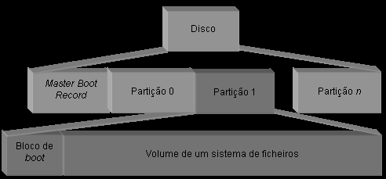
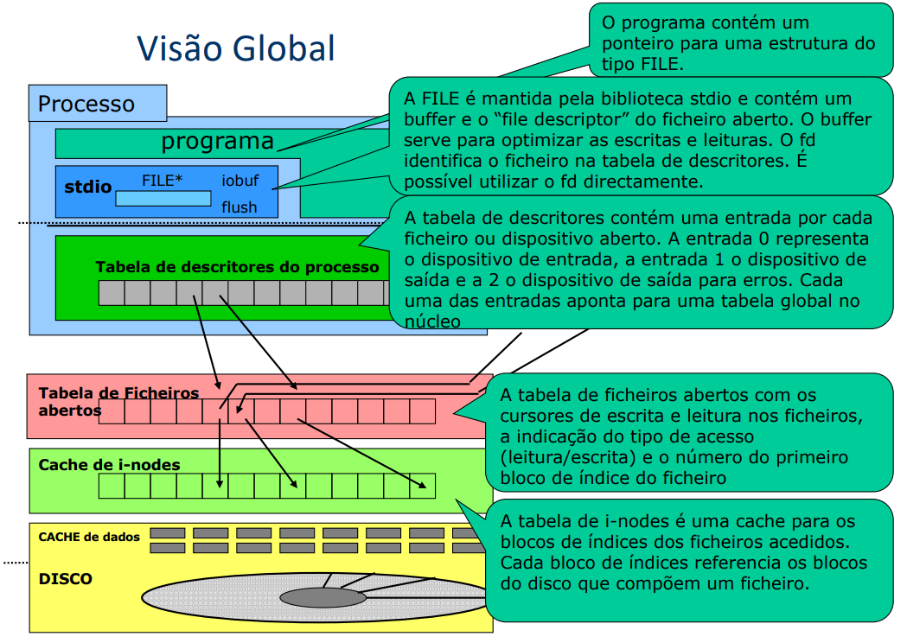
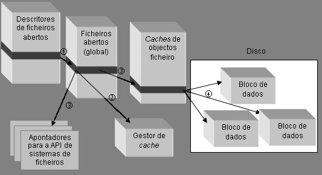

# File System

```toc

```

## Organização lógica de um disco

Como organizar a informação necessária para suportar um sistema de ficheiros?



Para qualquer partição do disco, existe sempre um `boot block`, que contém código (instruções) que vai ser carregado para RAM.

O resto do disco irá conter informação, que pode ser organizada de várias formas.

### Alternativa 1: Organização em Lista


[**Propriedades/Prós:**](color:green)

- Forma mais simples de organizar um sistema de ficheiros
- Cada ficheiro é constituído por um registo de dimensão variável com quatro campos
  - Nome, Dimensão, Seguinte, Dados
- No caso dos sistemas de ficheiros em CD/DVD, que só podem ser escritos uma vez, todos os ficheiros
  ficam compactados uns a seguir aos outros
  - No caso de sistemas onde é possível apagar ficheiros, é
    necessário manter também uma lista de espaços livres

[**Contras:**](color:red)

- Tempo necessário para localizar um ficheiro através do seu nome, pior caso: $O(n)$
- Ficheiros que mudam de tamanho ou são apagados são problemáticos:
  - Espaço ocupado por cada ficheiro é contínuo
  - Fragmentação da memória

### Alternativa 2

Consiste em ter duas Listas, uma delas com os meta-dados (Nome, Dimensão, Ponteiro para os Dados) e outra com os Dados em si.


[**Prós:**](color:green)

- Resolve a primeira desvantagem da alternativa 1:
  - criando um diretório único onde todos os nomes dos ficheiros estão juntos
  - os nomes dos ficheiros ficam perto uns dos outros no disco
  - aumenta a eficiência da procura de um ficheiro dado o seu nome

[**Contras:**](color:red)

- Resolve a segunda desvantagem da alternativa 1, mas a custo de perder funcionalidade:
  dividir os dados de cada ficheiro em blocos de dimensão fixa.

O sistema de ficheiros do CP/M (um dos primeiros para PCs, 1977) utilizava uma estrutura deste tipo.

## Sistema de Ficheiros do CP/M

Estrutura de uma entrada do diretório do sistema de ficheiros do CP/M:


Neste sistema:

- cada bloco possuía 1 KByte (por omissão)
- mapa de blocos com 16 entradas, logo a dimensão máxima de um ficheiro é **16 KBytes**

Mapa de blocos de dados contém os números dos blocos de dados do ficheiro (Disk Block Number)

Para aumentar a dimensão máxima dos ficheiros, temos duas opções:

- Aumentar o mapa de blocos (ineficiente para ficheiros pequenos);
- Aumentar o tamanho dos blocos (maior fragmentação interna).

## Sistema de Ficheiros do MS-DOS

- Evoluiu a partir do sistema CP/M
- Possui uma estrutura de sistema de ficheiros semelhante
- Em vez de um mapa de blocos por ficheiro, no MS-DOS existe:
  - uma tabela de blocos global partilhada por todos os ficheiros
  - esta tabela única é tão representativa da estrutura do sistema de ficheiros que deu origem ao nome do sistema de ficheiros mais popular que a usa: o sistema de ficheiros FAT (Tabela de Alocação de Ficheiros — File Allocation Table).

## File Allocation Table (FAT)


Num sistema de ficheiros FAT, a partição contém três secções distintas:

- A tabela de alocação (File Allocation Table, FAT): um vetor com, no máximo, $2^n$ inteiros de $n$ bits (designado FAT-16 para n=16, FAT-32 para n=32, etc);
- uma diretoria com os nomes dos ficheiros presentes no sistema de ficheiros;
- uma secção com o espaço restante dividido em blocos, de igual
  dimensão, para conter os dados dos ficheiros

A identificação dos blocos de um certo ficheiro é feita da seguinte forma:  
O Diretório contém o nome do ficheiro e um inteiro que corresponde a um índice da tabela de alocação.  
As entradas da FAT:

- com o valor zero indicam que o bloco com o mesmo índice está livre;
- com valores diferentes de zero indicam que o respetivo bloco faz parte de um ficheiro:
  - se o valor for $max$, significa que este é o último bloco relativo ao ficheiro;
  - se o valor não for $x \neq max$, significa que o bloco $x$ é o próximo bloco com dados relativos a este ficheiro.

:::tip[Exemplo]

Por exemplo, na imagem acima:

O FichA tem dados nos blocos:

- 0 (índice no diretório);
- 2 (índice para que o índice 0 na FAT aponta);
- como a entrada 2 na FAT é max, o Bloco 2 é o último com dados do FichA.

O FichB tem dados nos blocos:

- 1 (índice no diretório);
- 5 (índice apontado pela entrada 1 da FAT);
- mais nenhum bloco, pois a entrada 5 da FAT contém max.

O FichC só tem dados no bloco 3, pois o índice na diretoria é 3, e a posição 3 da FAT contém max.

:::

A FAT é dimensionada para:

- Caber em memória RAM (a FAT é carregada do disco para RAM quando o FS é montado)
- Ter tantas entradas quanto o número de blocos de dados na partição em disco

### [Desvantagens do FAT](color:red)

- Elevada dimensão da FAT quando os discos têm dimensões muito grandes:
  - Por exemplo, numa partição 1 Tbyte: usando FAT-32 e blocos de 4 KBytes, a FAT pode ocupar 1 GByte (1TBytes/4KBytes × 4 bytes [sendo que este 4 advém de serem endereços de 32 bits, logo são precisos 32 / 8 bits = 4 bytes para os representar])
- Tabelas desta dimensão não são possíveis de manter em RAM permanentemente:
  - É preciso ler a FAT do disco, o que prejudica muito o acesso à cadeia de blocos de um ficheiro

## Organização com Descritores Individuais de Ficheiros (i-nodes)

- Manter a descrição do ficheiro num descritor próprio de cada ficheiro, chamado _i-node_
  - Exemplos de atributos incluídos no _i-node_: tipo de ficheiro, dono, datas de últimos acessos, permissões, dimensão, localizações dos blocos de dados
  - É a estrutura que está entre as entradas dos diretórios que referenciam o ficheiro e os seus blocos de dados
- Vantagem: podem existir várias entradas de diretório a apontar para o mesmo ficheiro
  - Noção de hard link: podem existir vários nomes (ou caminhos/_paths_) para o mesmo ficheiro.
- Os _i-nodes_ são guardados numa estrutura especial de tamanho fixo antes dos blocos de dados


- No Linux tem o nome de **tabela de `inodes`**
- No Windows tem o nome de **MFT (Master File Table)**
- O número máximo de ficheiros numa partição é dado pelo número máximo de _i-nodes_ nessa tabela

### A Sequência de Passos para Aceder ao Conteúdo de um Ficheiro


- Um ficheiro é univocamente identificado, dentro de cada partição, pelo número de i-node (muitas vezes
  chamado i-number)
- Os diretórios só têm que efetuar a ligação entre um nome do ficheiro e o número do seu descritor
  

### Percorrer a árvore de diretórios

1. Começar pelo diretório raiz
   - _i-number_ da raiz tem valor pré-conhecido (e.g., _i-num_ = 2)
2. Dado o _i-number_, obter o _i-node_ do diretório
   - Na cache de _i-nodes_ (em RAM) ou na tabela de _i-nodes_ (em disco)
3. A partir do _i-node_, descobrir os índices dos blocos de dados com o conteúdo do diretório
4. Ler cada bloco do diretório e pesquisar nele uma entrada com o próximo nome do _pathname_
5. Assim que seja encontrada, a entrada indica o _i-num_ do próximo nome
6. Repetir a partir do passo 2 para este novo nome

### Descritor do Volume

Possui a informação geral de descrição do sistema de ficheiros, como por exemplo, a localização da tabela de descritores e a estrutura da tabela de blocos livres.  
Uma vez que a informação aqui guardada é de importância fundamental, o descritor de volume é geralmente replicado noutros blocos.
Se este se corromper pode ser impossível recuperar a informação do sistema de ficheiros.

Implementação do descritor de volume:

- Unix - bloco especial denominado superbloco
- NTFS - ficheiro especial
- FAT - a informação em causa é descrita diretamente no setor de boot


### Tabela de Blocos Livres (ou Tabela de Alocação)

Mantém um conjunto de estruturas necessárias à localização de blocos livres.
Pode ser um simples bitmap (cada bit indica se o respetivo bloco está livre ou ocupado).
O uso de uma tabela de blocos livres desacoplada dos i-nodes tem vantagens:

- é possível ter estruturas muito mais densas;
- pode-se organizar a tabela de blocos livres em várias tabelas de menor dimensão para blocos adjacentes.

## Sistema de Ficheiros EXT

O EXT é não só o principal sistema de ficheiros do Linux como um sistema de referência para outros sistemas de ficheiros atuais.

O sistema EXT mantém a tabela de i-nodes no Descritor de Ficheiros, atribuindo a cada i-node um i-number que corresponde à sua posição na tabela.
Este i-number identifica então o respetivo i-node univocamente.  
O número de i-nodes (e portanto o número de ficheiros) está então limitado pelo tamanho desta tabela.  
Para além da tabela de inodes existem em cada partição ainda duas outras tabelas:

- o bitmap de _i-nodes_ - posições dos _i-nodes_ livres
- o bitmap de blocos - posições dos blocos livres

Cada i-node contém:

- Meta-dados do ficheiro;
- Localização dos dados do ficheiro (índices do 1º bloco, do 2º bloco, etc).

| Campo           | Descrição                                 |
| --------------- | ----------------------------------------- |
| `i_mode`        | Tipo de ficheiro e direitos de acesso     |
| `i_uid`         | Identificador do utilizador               |
| `i_size`        | Dimensão do ficheiro                      |
| `i_atime`       | Tempo do último acesso                    |
| `i_ctime`       | Tempo da última alteração do _i-node_     |
| `i_mtime`       | Tempo da última alteração do ficheiro     |
| `i_dtime`       | Tempo da remoção do ficheiro              |
| `i_gid`         | Identificador do grupo do utilizador      |
| `i_links_count` | Contador de hard links                    |
| `i_blocks`      | Número de blocos ocupado pelo ficheiro    |
| `i_flags`       | Flags várias do ficheiro                  |
| `i_block[15]`   | Vetor de 15 unidades para blocos de dados |
|                 | Outros campos ainda não utilizados        |

### Referência Indireta

A referência indireta é usada em sistemas como o ext3. Esse sistema de ficheiros referencia os blocos da seguinte forma:

- Índice dos blocos do ficheiro é mantido num vetor `i_block` do _i-node_, com 15 posições
  - As primeiras 12 entradas são diretas (i.e, correspondem diretamente a um bloco com dados do ficheiro);
  - As restantes entradas contêm referências indiretas para outros blocos, com nível de indireção um (para a entrada 13), dois (para a 14) e três (para a 15).
- Só se usam as entradas (e blocos de índices) necessários


A dimensão máxima de um ficheiro é então $B \times \left(12 + \frac{B}R + (\frac{B}R)^2 + (\frac{B}R)^3\right)$

- $B$ é a dimensão em bytes de um bloco de dados;
- $R$ é a dimensão em bytes de uma referência para um bloco;

Com blocos de 1 Kbyte e referências de 4 byte, a dimensão máxima de um ficheiro é $\approx$16 Gbytes

## Visão Global



## Estruturas em RAM de Suporte ao FS

### Estruturas de Suporte à Utilização dos Ficheiros

Todos os sistemas de ficheiros definem um conjunto de estruturas em memória volátil para os ajudar a gerir a informação persistente mantida em disco.

Objetivos:

- Criar e gerir os canais virtuais entre as aplicações e a informação em disco;
- Aumentar o desempenho do sistema mantendo a informação em caches;
- Tolerar eventuais faltas;
- Isolar as aplicações da organização do sistema de ficheiros;
- Possibilitar a gestão de várias organizações de estruturas de ficheiros em simultâneo.



- Quando existe uma operação sobre um ficheiro já aberto, o identificador do ficheiro permite identificar na estrutura de descritores de ficheiros abertos do processo o ponteiro para o objeto que descreve o ficheiro na estrutura de ficheiros abertos global [(passo 1)](color:yellow).
- De seguida é perguntado ao gestor de cache se o pedido pode ser satisfeito pela cache [(passo 2)](color:yellow).
- Se não puder então é invocada a função correspondente à operação desejada do sistema de
  ficheiros, dando-lhe como parâmetro o descritor de ficheiro correspondente [(passo 3)](color:yellow).
- Finalmente, os blocos de dados do ficheiro são lidos ou escritos a partir da informação de
  localização dos blocos residente no descritor de ficheiro [(passo 4)](color:yellow).

### Tabelas de Ficheiros


A _file table_ contém:

- Cursor que indica a posição actual de leitura/escrita
- Modo como o ficheiro foi aberto

Tabela de ficheiros abertos - por processo:

- contém um descritor para cada um dos ficheiros abertos
- mantida no espaço de memória protegida que só pode ser acedida pelo núcleo

Tabela de ficheiros abertos - global:

- contém informação relativa a um ficheiro aberto
- mantida no espaço de memória protegida que só pode ser acedida pelo núcleo

A existência de duas tabelas é fundamental para garantir o isolamento entre processos, permitindo a partilha de ficheiros sempre que necessário (e.g. os cursores de escrita e leitura de um ficheiro entre dois ou mais processos).

Note-se que os identificadores para a tabela global estão na tabela privada que está em memória protegida, pelo que não podem ser alterados.

---

Slides:

- [Slides 2](https://drive.google.com/file/d/1dTCxBOOKYOcabgxErJXzgwMBrbSbPTc9/view?usp=sharing)
