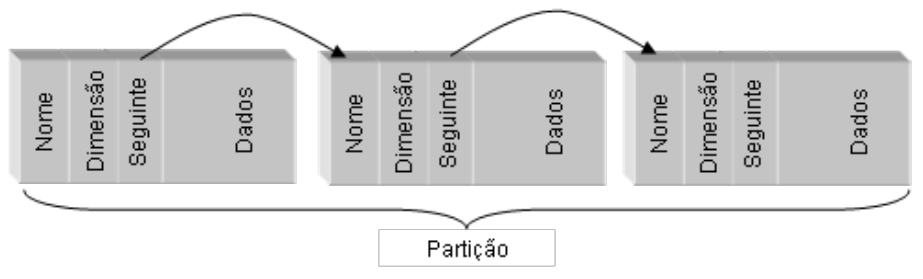
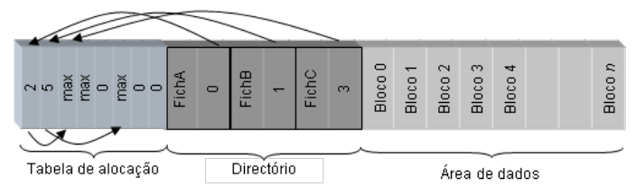

# File System

```toc

```

## Sistema de Ficheiros do Unix


## Organização lógica de um disco

Como organizar a informação necessária para
suportar um sistema de ficheiros?


Para qualquer partição do disco, existe sempre um `boot block`, que contém código (instruções) que vai ser carregado para RAM

O resto do disco irá conter informação, que pode ser organizada de várias formas

### Alternativa 1: Organização em Lista


Organização em Lista

- Forma mais simples de organizar um sistema de
  ficheiros
- Cada ficheiro é constituído por um registo de
  dimensão variável com quatro campos
  - Nome, Dimensão, Seguinte, Dados
- No caso dos sistemas de ficheiros em CD/DVD, que
  só podem ser escritos uma vez, todos os ficheiros
  ficam compactados uns a seguir aos outros

  - No caso de sistemas onde é possível apagar ficheiros, é
    necessário manter também uma lista de espaços livres

#### Desvantagens

- Tempo necessário para localizar um ficheiro através
  do seu nome, pior caso: $O(n)$
- Ficheiros que mudam de tamanho ou são apagados
  são problemáticos:
  - Espaço ocupado por cada ficheiro é contínuo
  - Fragmentação da memória

### Alternativa 2

Consiste em ter 2 Listas, 1 com os meta-dados(Nome, Dimensão, Pointeiro para os Dados) e outra com os Dados em si

- Solução para a primeira desvantagem:
  - criando um directório único onde todos os nomes dos
    ficheiros estão juntos
  - os nomes dos ficheiros ficam perto uns dos outros no
    disco
  - aumenta a eficência da procura de um ficheiro dado o
    seu nome

#### Alternativa 2 - Desvantagens

- Solução para a segunda
  desvantagem: dividir os
  dados de cada ficheiro em
  blocos de dimensão fixa
- O sistema de ficheiros do
  CP/M (um dos primeiros
  para PCs, 1977) utilizava
  uma estrutura deste tipo

## Sistema de Ficheiros do CP/M

- Estrutura de uma entrada do directório do sistema de
  ficheiros do CP/M:


- Neste sistema:

  - cada bloco possuía 1 Kbyte (por omissão)
  - mapa de blocos com 16 entradas, logo dimensão máxima de
    um ficheiro = 16 KBytes

Mapa de blocos de dados contém os números dos blocos de dados do ficheiro (Disk Block Number)

- Para aumentar a dimensão máxima dos ficheiros:

  - Aumentar o mapa de blocos (ineficiente para ficheiros pequenos)
  - Aumentar o tamanho dos blocos (maior fragmentação)

## Sistema de Ficheiros do MS-DOS

- Evoluiu a partir do sistema CP/M
- Possui uma estrutura de sistema de
  ficheiros semelhante
- Em vez de um mapa de blocos por
  ficheiro, no MS-DOS existe:
  - uma tabela de blocos global partilhada por todos os ficheiros
  - esta tabela única é tão representativa da estrutura do sistema
    de ficheiros que deu origem ao nome do sistema de ficheiros
    mais popular que a usa: o sistema de ficheiros FAT (Tabela de
    Alocação de Ficheiros — File Allocation Table).

## File Allocation Table (FAT)



- A partição contém três secções distintas:
  - a tabela de alocação (File Allocation Table, FAT)
  - uma diretoria com os nomes dos ficheiros presentes no sistema de
    ficheiros, e
  - uma secção com o espaço restante dividido em blocos, de igual
    dimensão, para conter os dados dos ficheiros

Muito resumidamente, o Diretório contém o nome do ficheiro e um ponteiro para um indíce da tabela de alocação.\
Já na tabela de alocação, em cada indíce que estamos, o bloco na área de dados com o mesmo indíce contém dados desse ficheiro.\
Ainda na tabela de alocação podemos ter um ponteiro para outro indíce nessa tabela (ainda não lemos o ficheiro todo), ou estamos no max (lemos o ficheiro todo).

- FAT é vetor composto por $2^n$ inteiros de $n$ bits
  - Designado de FAT-16 ($n=16$) ou FAT-32 ($n=32$), etc.
- Dimensionado para:
  - Caber em memória RAM (FAT carregada do disco em
    RAM quando o FS é montado)
  - Ter tantas entradas quanto o número de blocos de dados
    na partição em disco
- As entradas da FAT:
  - com o valor zero indicam que o respectivo bloco está
    livre
  - com valores diferentes de zero indicam que o respectivo
    bloco faz parte de um ficheiro


- Os blocos de um ficheiro são determinados assim:
  - 1º bloco: indicado por um número na respectiva entrada
    no directório.
  - restantes blocos: referenciados em lista ligada pelas
    entradas da FAT

### Desvantagens do FAT

- Elevada dimensão da FAT quando os discos têm
  dimensões muito grandes:
  - Por exemplo, uma partição 1 Tbyte
  - Usando FAT-32 e blocos de 4 Kbytes...
  - ...a FAT pode ocupar 1 GByte (1TBytes/4KBytes × 4 bytes)
- Tabelas desta dimensão não são possíveis de
  manter em RAM permanentemente:
  - Ler à FAT do disco, prejudica muito o acesso à cadeia de
    blocos de um ficheiro

## Organização com Descritores Individuais de Ficheiros (i-nodes)

- Manter a descrição do ficheiro num descritor
  próprio de cada ficheiro, chamado i-node
  - Exemplos de atributos incluídos no i-node: tipo de
    ficheiro, dono, datas de últimos acessos, permissões,
    dimensão, localizações dos blocos de dados
  - É a estrutura que está entre as entradas dos diretórios
    que referenciam o ficheiro e os seus blocos de dados
- Vantagem: podem existir várias entradas de
  diretório a apontar para o mesmo ficheiro

  - Noção de hard link

- Os i-nodes são guardados numa estrutura especial de
  tamanho fixo antes dos blocos de dados


- No Linux tem o nome de tabela de $inodes$
- No Windows tem o nome:
  - MFT (Master File Table).
- O número máximo de ficheiros numa partição é dado
  pelo número máximo de i-nodes nessa tabela

### A Sequência de Passos para Aceder ao Conteúdo de um Ficheiro


- Um ficheiro é univocamente identificado, dentro de
  cada partição, pelo número de i-node (muitas vezes
  chamado i-number)
- Os directórios só têm que efetuar a ligação entre
  um nome do ficheiro e o número do seu descritor
  

### Percorrer a árvore de diretórios

1. Começar pelo diretório raíz

- i-number tem valor pré-conhecido (e.g., i-num=2)

2. Dado o i-number, obter o i-node do diretório

- Na cache de i-nodes (em RAM) ou na tabela de i-nodes
  (em disco)

3. A partir do i-node, descobrir os índices dos blocos
   de dados com o conteúdo do diretório

4. Ler cada bloco do diretório e pesquisar nele uma
   entrada com o próximo nome do pathname

5. Assim que seja encontrada, a entrada indica o i-num do próximo nome

6. Repetir a partir do passo 2 para este novo nome

### Descritor do Volume


- possui a informação geral de descrição do sistema de ficheiros
- por exemplo, a localização da tabela
  de descritores e a estrutura da tabela
  de blocos livres
- é geralmente replicado noutros
  blocos (a informação nele guardada é
  de importância fundamental)
- se se corromper pode ser impossível recuperar a
  informação do sistema de ficheiros

- Implementação do descritor de volume:
  - Unix - bloco especial denominado superbloco
  - NTFS - ficheiro especial
  - FAT - a informação em causa é descrita directamente no setor de
    boot

### Tabela de Blocos Livres (ou Tabela de Alocação)


- Mantém um conjunto de estruturas necessárias à
  localização de blocos livres:
  - i.e. blocos da partição que não estão ocupados por nenhum
    bloco de nenhum ficheiro.
- Pode ser um simples bitmap:
  - um bit por cada bloco na partição,
  - indica se o respetivo bloco está livre ou ocupado
- Tabela de blocos livres desacoplada dos i-nodes tem
  vantagens:
  - é possível ter estruturas muito mais densas (a tabela de blocos
    livres possui, usualmente, apenas um bit por cada bloco)
  - pode-se organizar a tabela de blocos livres em várias tabelas
    de menor dimensão para blocos adjacentes

## Sistema de Ficheiros Ext

- Principal Sistema de ficheiros do Linux
- Sistema referência para outros sistemas
  de ficheiros atuais

### i-node (index node)


- Meta-dados do
  ficheiro
- Localização dos
  dados do ficheiro

  - Índices do 1º bloco,
    do 2º bloco, etc.

#### Exemplo de FS que usa i-nodes: ext3

- Índice dos blocos do ficheiro é mantido num vetor
  i_block do i-node, com 15 posições
  - 12 entradas diretas
  - Caso dimensão > 12 blocos, 3 últimas posições do vector
    contêm referências para blocos com índices para outros
    blocos
- Primeira entrada é indireção de 1 nível
- Segunda é indireção de 2 níveis
- Terceira é indireção de 3 níveis
- Só se usam as entradas (e blocos de índices)
  necessários


dimensão máxima de um ficheiro $= B \times (12 + \frac{B}R + (\frac{B}R)^2 + (\frac{B}R)^3)$

$B$ é a dimensão em bytes de um bloco de dados\
$R$ é a dimensão em bytes de uma referência para um bloco\
Com blocos de 1 Kbyte e referências de 4 byte, a dimensão máxima de um ficheiro é $~$16 Gbytes

### Tabela de i-nodes no Volume


- Mantidos em tabela em zona própria no volume
- Dentro de um volume, cada i-node é identificado
  por um i-number

  - Índice do i-node na tabela de i-nodes no volume

### Tabelas de Inodes e Bitmaps

- Cada partição tem um número máximo de i-nodes:
  - que servem para armazenar os i-nodes de todos os ficheiros
    da partição.
  - logo, existe um número máximo de ficheiros, correspondente
    à dimensão máxima da tabela de i-nodes
- Dentro de uma partição:
  - um i-node é univocamente identificado pelo índice dentro da
    tabela de inodes.
- Para além da tabela de inodes existem em cada partição
  ainda duas outras tabelas:

  - o bitmap de i-nodes - posições dos i-nodes livres
  - o bitmap de blocos, - posições dos blocos livres

## Visão Global


## Estruturas em RAM de Suporte ao FS

### Estruturas de Suporte à Utilização dos Ficheiros

- Todos os sistemas de ficheiros definem um conjunto de
  estruturas em memória volátil para os ajudar a gerir a
  informação persistente mantida em disco.
- Objectivos:
  - Criar e gerir os canais virtuais entre as aplicações e a informação em
    disco
  - Aumentar o desempenho do sistema mantendo a informação em
    caches
  - Tolerar eventuais faltas
  - Isolar as aplicações da organização do sistema de ficheiros
  - Possibilitar a gestão de várias organizações de estruturas de
    ficheiros em simultâneo


Estruturas de Suporte à Utilização dos Ficheiros

- Quando existe uma operação sobre um ficheiro já aberto, o identificador do ficheiro permite
  identificar na estrutura de descritores de ficheiros abertos do processo o ponteiro para o objecto
  que descreve o ficheiro na estrutura de ficheiros abertos global (passo 1).
- De seguida é perguntado ao gestor de cache se o pedido pode ser satisfeito pela cache (passo 2).
- Se não puder então é invocada a função correspondente à operação desejada do sistema de
  ficheiros, dando-lhe como parâmetro o descritor de ficheiro correspondente (passo 3).
- Finalmente, os blocos de dados do ficheiro são lidos ou escritos a partir da informação de
  localização dos blocos residente no descritor de ficheiro (passo 4).

### Tabelas de Ficheiros


- file table contem:

  - Cursor que indica a
    posição actual de
    leitura/escrita
  - modo como o ficheiro
    foi aberto

- Tabela de ficheiros abertos - por processo:
  - contém um descritor para cada um dos ficheiros abertos
  - mantida no espaço de memória protegida que só pode ser acedida pelo
    núcleo
- Tabela de ficheiros abertos - global:
  - contém informação relativa a um ficheiro aberto
  - mantida no espaço de memória protegida que só pode ser acedida pelo
    núcleo
- A existência de duas tabelas é fundamental para:
  - garantir o isolamento entre processos
  - permitindo a partilha de ficheiros sempre que necessário (e.g. os
    cursores de escrita e leitura de um ficheiro entre dois ou mais
    processos)
- Note-se que:
  - os identificadores para a tabela global estão na tabela privada que está
    em memória protegida, pelo que não podem ser alterados

---

Slides:

- [Slides 2](https://drive.google.com/file/d/1dTCxBOOKYOcabgxErJXzgwMBrbSbPTc9/view?usp=sharing)
