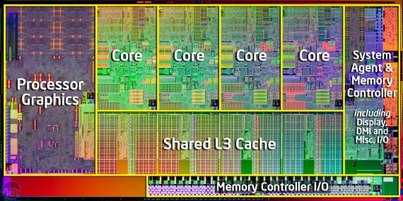

# Programação Paralela

```toc

```


## Motivos

Como podemos ver pelo gráfico mostrado em cima,
o número de transistores aumenta de acordo com a [Lei de Moore](https://en.wikipedia.org/wiki/Moore%27s_law)\
No entanto, a performance de uma thread do processador quase que estagnou no final da década de 2000

Isso mostra que atualmente colocar mais transístores num processador, não o torna mais rápido.
Foi preciso pensar noutra maneira de continuar a aumentar a performance.\
Chegou-se à conclusão de que colocar vários "mini" processadores (cores) dentro do processador, iria permitir que este pudesse fazer várias instruções em paralelo.

Assim aparecem os dual-cores(2), quad-cores(4),[ muitos-cores](https://en.wikichip.org/wiki/amd/ryzen_threadripper/3990x)(64)



- Melhoramos assim a performance de:
  - Interação com periféricos lentos
    - Enquanto periférico demora a responder a um fluxo de execução,
      outro fluxo paralelo pode continuar a fazer progresso
  - Programas interativos
    - Enquanto um fluxo de execução espera por ação do utilizador,
      outros podem progredir em fundo

Com Programação Paralela melhoramos a performance de qualquer CPU, até aqueles quue só têm [1 core](https://pt.wikipedia.org/wiki/Pentium)

## Introdução à Programação com Processos

### Multiprogramação

- Execução, em paralelo, de múltiplos
  programas na mesma máquina
- Cada instância de um programa em execução
  denomina-se um **processo**

#### Pseudoconcorrência


Na realidade só pode estar a correr um processo de cada vez , mas como a troca entre processos é feita tão depressa (milésimos de segundo)
para um humano, os processsos correm em paralelo.

### Processo = Programa?

- Programa = Fich. executável (sem atividade)
- Um processo é um objecto do sistema operativo
  que suporta a execução dos programas
- Um processo pode, durante a sua vida, executar
  diversos programas
- Um programa ou partes de um programa podem
  ser partilhados por diversos processos
  - biblioteca partilhadas [DLL](https://en.wikipedia.org/wiki/Dynamic-link_library) no Windows

### Processo como uma Máquina Virtual


Elementos principais da máquina virtual que o SO disponibiliza aos processos.\
Pelo ponto de vista do processo este encontra-se isolado de tudo resto e com recursos ilimitados[.](https://incels.wiki/images/thumb/b/bb/Bluepill.png/300px-Bluepill.png)

- Tal como uma máquina real, um processo tem:
  - Espaço de endereçamento (virtual):
    - Conjunto de posições de memória acessíveis
    - Código, dados e pilha
    - Dimensão variável
- Reportório de instruções:
  - As instruções do processador executáveis em modo
    utilizador
  - As funções do sistema operativo
- Contexto de execução (estado interno):
  - Toda a informação necessária para retomar a execução do
    processo
  - Memorizado quando o processo é retirado de execução

### Objeto Processo

- Propriedades
  - Identificador
  - Programa
  - Espaço de Endereçamento (codigo, dados, pilha)
  - Prioridade
  - Processo pai
  - Canais de Entrada Saída, Ficheiros,
  - Quotas de utilização de recursos
  - Contexto de Segurança
- Operações - Funções sistema que atuam sobre os processos
  - Criar
  - Eliminar
  - Esperar pela terminação de subprocesso

## Programação com Processos em Unix

- Processos identificados por inteiro (PID)
- Alguns identificadores estão pré atribuídos:
  - Processo 0 é o swapper (gestão de memória)
  - Processo 1 `init` é o de inicialização do sistema

### Hierarquia de Processos

- Processos relacionam-se de forma hierárquica
- Novo processo herda grande parte do contexto do processo pai
- Quando o processo pai termina os subprocessos continuam a executar-se
  - São adoptados pelo processo de inicialização (pid = 1)


Certas propriedades são herdadas

### Criação de um Processo

`id = fork()`

A função `fork` não tem parâmetros.

- Processo filho é uma cópia do pai:
  - O espaço de endereçamento é copiado
  - Contexto de execução é copiado

Ao copiar o contexto de execução, poderíamos pensar que esse processo iria ser pesado (em tempo e espaço)
Mas na verdade, a chamada `fork` é muito rápida.
Iremos estudar mais à frente porquê.

O fork apenas permite lançar processo com o mesmo código

A função retorna o PID do processo.
Este parâmetro assume valores diferentes consoante o processo em que se efetua o retorno:

- ao processo pai é devolvido o pid do filho
- ao processo filho é devolvido 0
- -1 em caso de erro

#### Exemplo de `fork`

```c
main() {
  pid_t pid;
  pid = fork();
  if (pid == -1)
  {
    // ERRO
  }
  if (pid == 0) {
    // Código do filho
  } else {
    // Código do pai
  }
  // ...
}
```

### Terminação do Processo

`void exit (int status)`

- Termina o processo, liberta todos os recursos
  detidos pelo processo, tais como os ficheiros abertos
- Assinala ao processo pai a terminação

`status` é um parâmetro que permite passar ao processo pai o estado em que
o processo terminou.
Normalmente um valor negativo indica um erro.

#### E se a `main` terminar com `return` em vez de `exit`?

- Até agora, nunca chamámos `exit` para terminar programas
  Nem é preciso, o compilador trata disso automaticamente, chamando ele a função
  `exit` depois da execução da `main`.

```c
main_aux(argc, argv) {
  int s = main(argc, argv); // Função main do programador
  exit(s);
}
```

` int wait (int *status)`

Esta função para o processo pai até este se sincronizar com a terminação de um processo filho

`wait` retorna o pid do processo terminado.
O processo pai pode ter vários filhos sendo desbloqueado quando um terminar.

`status` devolve o estado de terminação do processo filho que foi atribuído no parâmetro da função `exit`

:::tip[Macros Importantes]
Usando `man wait`poderão encotrar Macros (WIFEXITED, WEXITSTATUS) que ajudam a saber como e se um processo terminou (com exit)
:::

```c
main () {
    int pid, estado;

    pid = fork ();
    if (pid == 0) {
        // execução de algoritmo pelo filho
        exit(0);
    } else {
    // processo pai bloqueia-se à espera da terminação do processo filho
    pid = wait(&estado);
  }
}
```

- Ao se fazer `exit` são mantidos os atributos necessários para quando o pai chamar `wait`

  - `pid` do processo terminado e do seu processo pai
  - `status` da terminação

Entre `exit` e `wait`, processo diz-se `zombie`\
Só depois de `wait` o processo é totalmente esquecido

#### Exemplos

- Pai e filho a executarem trabalhos diferentes

  - Pai executa `fnPai()`, filho executa `fnFilho()`

```c
main () {
  int r = fork();
  if (r == 0) {
     // execução de algoritmo pelo filho
    fnFilho();
  } else if (r > 0) {
    // execução de algoritmo pelo pai
    fnPai();
  }
  exit(EXIT_SUCCESS);
}
```

- Pai espera pelo resultado do filho

  - Filho: termina devolvendo o retorno de `FnFilho()`
  - Pai: depois de executar `fnPai()`, aguarda até saber o resultado do filho, e imprime soma de ambos

```c
main () {
  int a,r , s;
  r = fork();
  if (r == 0) {
     // execução de algoritmo pelo filho
    a = fnFilho();
    exit(a);
  } else if (r > 0) {
    // execução de algoritmo pelo pai
    a = fnPai();
    wait(&s);
    if (WIFEXITED(s))
      printf("Total: %d\n",a+WIFEXITED(s));
    exit(EXIT_SUCCESS);
  }
}
```

### Como ter filho a executar programa diferente?

`int execl(char* ficheiro, char* arg0, char* argl,…, argn,0)`

`int execv(char* ficheiro, char\* argv [])`

`ficheiro` é o caminho `path` de acesso ao ficheiro executável

Os argumentos podem ser passados de duas maneiras:

- Para execl, passa-se os ponteiros 1 a 1, acabando em 0
- Para execv, passa-se um array de ponteiros

Estes parâmetros são passados para a função `main` do novo programa e acessíveis através do `argv`
Ambas as funções `execl()` e `execv()` são **front-ends** mais simples para `execve()` que é a função principal com mais parâmetros

```c
main (){
  int pid;
  pid = fork ();
  if (pid == 0) {
    execl ("/bin/who", "who", 0);
    // controlo deveria ser transferido para o novo programa
    printf ("Erro no execl\n");
    exit (-1);
  } else {
    // algoritmo do processo pai
  }
}
```

Por convenção o `arg0` é o nome do programa

### Implementação de uma shell

Uma shell pode ser descrita muito facilmente por:

- Ciclo infinito, em que cada iteração:

  - Imprime mensagem
  - Lê comando
  - Cria novo processo filho
  - Processo filho deve executar outro programa
    (indicado no comando lido)
  - Entretanto, o processo da shell bloqueia-se até
    filho terminar
  - Volta à próxima iteração

```c
while (TRUE){
  prompt();
  read_command (command, params);
  pid = fork ();
  if (pid < 0) {
    printf (“Unable to fork”); // Erro no fork
    continue;
  }
  if (pid !=0) {
    wait(&status) // Se o fork gerar um pai
  } else{
    execv (command, params);
  }
}
```

## Introdução à Programação com Tarefas (threads)

### Tarefas


- Mecanismo simples para criar fluxos de execução
  independentes, partilhando um contexto comum

Num mesmo processo, as tarefas partilham entre si:

- O código
- Amontoado (heap)
  - Variáveis globais
  - Variáveis dinamicamente alocadas (malloc)
- Atributos do processo (Visto mais tarde na cadeira)

Mas não partilham:

- Pilha (stack)
  - (atenção) não há isolamento entre pilhas!
  - Bugs podem fazer com que uma tarefa aceda à pilha de outra tarefa
- Estado dos registos do processador
  - Incluindo instruction pointer
- Atributos específicos da tarefa
  - Thread id (tid)
  - Etc (Visto mais tarde na cadeira)

## Paralelismo com Múltiplos Processos vs. Múltiplas Tarefas (no mesmo processo)

- Vantagens de multi-tarefa:
  - Criação e comutação entre tarefas do mesmo processo
    mais leves (vs. entre processos)
  - Tarefas podem comunicar através de memória partilhada
    - Comunicação entre processos mais limitada (Visto mais tarde na cadeira)
- Vantagens de processos:
  - Podemos executar diferentes binários em paralelo
  - Isolamento: confinamento de bugs
  - Outras (Visto mais tarde na cadeira)

### Exemplo de Uso de Processos

- Chrome

- No browser Chrome, criar um novo separador causa a chamada do `fork`
- Processo filho usado para carregar e executar scripts dos sites abertos nesse separador

## Programação de Processos Multi-Tarefa em Unix (Interface POSIX)

### Criar Tarefa

`pthread_create(&tid, attr, function, arg)`

`tid` é o apontador para o identificador da tarefa
`attr ` define atributos da tarefa(prioridade, etc)
`function` é a função a executar
`arg` é o ponteiro para os parâmetros dados à função

`pthread_exit(void *value_ptr)`

- Tarefa chamadora termina
- Retorna ponteiro para resultados

`int pthread_join(pthread_t thread, void *value_ptr)`

- Tarefa chamadora espera até a tarefa indicada ter terminado
- O ponteiro retornado pela tarefa terminada é colocado em `(*value_ptr)`

### Regra de ouro

- O núcleo oferece a ilusão de uma máquina com número infinito de processadores,
  sendo que cada tarefa corre no seu processador
- No entanto, as velocidades de cada processador virtual podem ser diferentes e
  não podem ser previstas

Esta regra também se aplica a programação com processos paralelos

Num programa para somar linhas de matrizes

Solução sequencial

```c
#include <stdlib.h>
#include <stdio.h>
#include <unistd.h>
#include <pthread.h>

#define N 5
#define TAMANHO 10

int buffer[N][TAMANHO];

void *soma_linha (int *linha) {
  int c, soma=0;
  int *b = linha;
  for (c = 0; c < TAMANHO - 1; c++)
    soma += b[c];
  b[c]=soma; /* soma->ult.col. */
  return NULL;
}

int main (void) {
  int i,j;
  inicializaMatriz(buffer(N, TAMANHO);
  for (i=0; i< N; i++)
    soma_linha(buffer[i]);
  imprimeResultados(buffer);
  exit(0);
}
```

Exemplo (paralelo)

```c
int main (void) {
  int i,j;
  pthread_t tid[N];
  inicializaMatriz(buffer, N, TAMANHO);
  for (i=0; i< N; i++){
    if(pthread_create (&tid[i], 0, soma_linha, buffer[i])== 0){
      printf("Criada a tarefa %d\n", tid[i]);
    }
    else {
      printf("Erro na criação da tarefa\n");
      exit(1);
  }
  }
  for (i=0; i<N; i++){
    pthread_join(tid[i], NULL);
  }
  printf ("Terminaram todas as threads\n");

  imprimeResultados(buffer);
  exit(0);
}
```

### Criação de tarefa: Passar/Receber parâmetros?

- Parâmetros podem ser de qualquer tipo, passados por referência opaca `(void*)`
- Parâmetro de entrada para a nova tarefa:
  - Através do argumento de `pthread_create`
  - Nova tarefa recebe parâmetro no argumento único da sua função
- Parâmetro de saída devolvido pela nova tarefa
  - Função da tarefa retorna ponteiro para o parâmetro
  - Tarefa criadora recebe esse ponteiro através de `pthread_join` (por referência)
