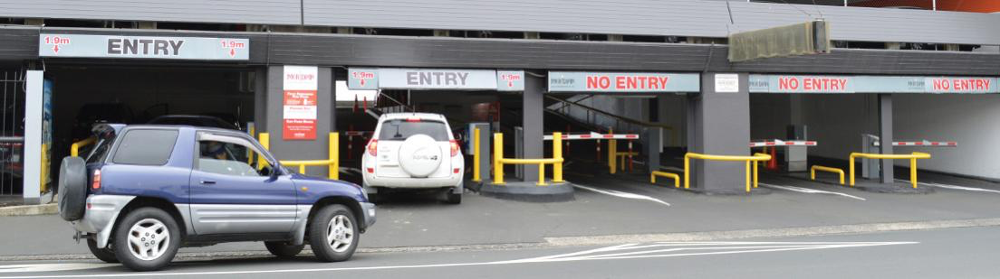

Programação multi-tarefa em
Memória Partilhada
Parte II - Programação avançada
Sistemas Operativos

## Trincos

Programar com objetos
partilhados

Programar com objetos partilhados

- Até agora, aprendemos esta receita
  para programar concorrentemente
  com memória partilhada:

  - Identificar secções críticas
  - Sincronizar cada secção crítica com trinco
    (mutex)

- Um trinco global ou múltiplos trincos finos?
- Preciso mesmo usar trinco?

Como sincronizar esta função?

```c
struct {
  int saldo;
  …
} conta_t;

int levantar_dinheiro (conta_t* conta, int valor) {
  mutex_lock();
  if (conta->saldo >= valor)
    conta->saldo = conta->saldo - valor;
  else
    valor = -1; /* -1 indica erro ocorrido \*/
  mutex_unlock();
  return valor;
}
```

### Trinco global

- Normalmente é a solução mais simples
- Mas limita o paralelismo
  - Quanto mais paralelo for o programa, maior é a limitação
- Exemplo: “big kernel lock” do Linux
  - Criado nas primeiras versões do Linux (versão 2.0)
  - Grande barreira de escalabilidade
  - Finalmente removido na versão 2.6

### Trincos finos: programação com objetos partilhados

- Objeto cujos métodos podem ser chamados em
  concorrência por diferentes tarefas
- Devem ter:
  - Interface dos métodos públicos
  - Código de cada método
  - Variáveis de estado
  - Variáveis de sincronização
- Um trinco para garantir que métodos críticos se executam em
  exclusão mútua
- Opcionalmente: semáforos, variáveis de condição

- Em geral, maior paralelismo
- Mas pode trazer bugs difíceis de resolver…

Exemplo com trincos finos

```c
transferir(conta a, conta b, int montante) {
  fechar(a.trinco);
  debitar(a, montante);
  fechar(b.trinco);
  creditar(b, montante);
  abrir(a.trinco);
  abrir(b.trinco);
}
```

- O que pode correr mal?

## Jantar dos Filósofos

- Cinco Filósofos estão reunidos para filosofar e
  jantar spaghetti:
  - Para comer precisam de dois garfos, mas a mesa
    apenas tem um garfo por pessoa.
- Condições:
  - Os filósofos podem estar em um de três estados :
    Pensar; Decidir comer ; Comer.
  - O lugar de cada filósofo é fixo.
  - Um filósofo apenas pode utilizar os garfos
    imediatamente à sua esquerda e direita.

```c
filosofo(int id){
  while (TRUE) {
    pensar();
    <adquirir os garfos>
    comer();
    <libertar os garfos>
  }
}
```

### Jantar dos Filósofos com Semáforos, versão #1

```c
mutex_t garfo[5] = {…};

filosofo(int id)
{
  while (TRUE) {
    pensar();
    fechar(garfo[id]);
    fechar (garfo[(id+1)%5]);
    comer();
    abrir(garfo[id]);
    abrir(garfo[(id+1)%5]);
  }
}
```

Problema?

Como prevenir interblocagem?

Prevenir de interblocagem: uma solução

```c
mutex_t garfo[5] = {…};
filosofo(int id)
{
while (TRUE) {
  pensar();
  if (id < 4) {
    fechar(garfo[id]);
    fechar (garfo[(id+1)%5]);
  else {
    fechar (garfo[(id+1)%5]);
    fechar(garfo[id]);
  }
  comer();
  abrir(garfo[id]);
  abrir(garfo[(id+1)%5]);
  }
}
```

Princípio base: garantir que os recursos são todos
adquiridos segundo uma ordem total pré-definida
F0
F1
F2
F3
F4
G0
G1
G2
G3
G4


Prevenir de interblocagem: outra solução

```c
mutex_t garfo[5] = {…};

filosofo(int id){
  int garfos;
  while (TRUE) {
    pensar();
    garfos = FALSE;
    while (!garfos){
      if (lock(garfo[id])
        if (try_lock(garfo[(id+1)%5])
          garfos = TRUE;
        else { // adquisição 2º trinco falhou
          unlock(garfo[id]); // abre 1ºtrinco e tenta outra vez
          sleep(random([0, MAX]);
        }
    }
  comer();
  unlock(garfo[id]);
  unlock(garfo[(id+1)%5]);
  }
}
```

Resolvemos o problema
da interblocagem!
...e o da míngua?

Evitar míngua: recuo aleatório!

- Pretende-se evitar que dois filósofos vizinhos
  possam conflituar indefinidamente
- Introduzir uma fase de espera/recuo (back-off) entre
  uma tentativa e outra de cada filósofo.
- Como escolher a duração da fase de espera?
  - Inúmeras politicas propostas na literatura
  - Vamos ilustrar apenas os princípios fundamentais das
    políticas mais genéricas e simples

Evitar míngua:
escolha da duração do recuo

- Duração aleatória entre [0, MAX]
- Porquê aleatória?
- Como escolher o valor MAX?
  - Quanto maior o valor de MAX:
- menor desempenho
- maior probabilidade de evitar contenção
  - Adaptar o valor de MAX consoante o número de
    tentativas
- Por exemplo, MAX = constante \* num_tentativas




Recapitulando: como prevenir
interblocagem?

- Garantir que os recursos são todos adquiridos
  segundo uma ordem total pré-definida
- Quando a aquisição de um recurso não é
  possível, libertando todos os recursos detidos
  e anulando as operações realizadas até esse
  momento
  Vantagens/desvantagens de cada
  abordagem?

Trincos - Limitações

- Só servem para proteger secções críticas
  - Não são suficientemente expressivos para
    resolver outros problemas de sincronização
- Exemplo:
  - Num dado ponto do código, tarefa só quer
    avançar quando uma condição se verificar

Exemplo: acesso a parque de
estacionamento

```c
int vagas = N

void entrar() {
  if (vagas==0)
  esperar até haver vaga
  vagas --;
}

void sair() {
  vagas ++;
}
```

Exemplo: acesso a parque de
estacionamento

```c
int vagas = N;
mutex m;
void entrar() {
  do {
    lock(m);
    if (vagas>0) break;
    else unlock(m);
  } while (1);
  vagas --;
  unlock(m);
}
void sair() {
  lock(m);
  vagas++;
  unlock(m);
}
```

Algum problema?

Variáveis de Condição

Variável de Condição

- Permite a uma tarefa esperar por uma
  condição que depende da ação de outra
  tarefa
  - Condição é boleano determinado em função do
    estado de variáveis partilhadas

Variável de Condição

- Variável de condição sempre associada a um
  trinco
  - O trinco que protege as secções críticas com
    acessos às variáveis partilhadas que definem a
    condição da espera
  - Pode haver mais que uma variável de condição
    associada ao mesmo trinco
- O conjunto trinco + variáveis de condição é
  normalmente chamado um monitor

Variável de Condição: primitivas
(semântica Mesa)

- wait(conditionVar, mutex)
  - Atomicamente, liberta o trinco associado e bloqueia a
    tarefa
- Tarefa é colocada na fila de espera associada à variável de
  condição
  - Quando for desbloqueada, a tarefa re-adquire o trinco e
    só depois é que a função esperar retorna
    Uma tarefa só pode chamar wait quando detenha o
    trinco associado à variável de condição

Variável de Condição: primitivas
(semântica Mesa)

- signal(conditionVar)
  - Se houver tarefas na fila da variável de condição,
    desbloqueia uma
- Tarefa que estava bloqueada passa a executável
  - Se não houver tarefas na fila da variável de condição, não
    tem efeito
- broadcast(conditionVar)
  - Análogo ao signal mas desbloqueia todas as tarefas na fila
    da variável de condição
    Normalmente estas primitivas são chamadas
    quando a tarefa ainda não libertou o trinco
    associado à variável de condição

Exemplo: acesso a parque de
estacionamento

```c
int vagas = N;
void entrar() {
  if (vagas==0)
    esperar até haver vaga
    vagas --;
}
void sair() {
  vagas ++;
}
```

Padrões habituais de programação
com variável de condição

```c
lock(trinco);
/_ ..acesso a variáveis partilhadas.. _/
while (! condiçãoSobreEstadoPartilhado)
  wait(varCondicao, trinco);
/_ ..acesso a variáveis partilhadas.. _/
unlock(trinco);
lock(trinco);
/_ ..acesso a variáveis partilhadas.. _/
/_ se o estado foi modificado de uma forma
que pode permitir progresso a outras tarefas,
chama signal (ou broadcast) _/
signal/broadcast(varCondicao);
unlock(trinco);
```

Código
que espera
por condição
Código
que muda
ativa
condição

Variáveis de Condição - POSIX

- pthread_cond_t
- Criação/destruição de variáveis de condição;
  - pthread_cond_init (condition,attr)
  - pthread_cond_destroy (condition)
- Assinalar e esperar nas variáveis de condição:
  - pthread_cond_wait (condition,mutex)
  - pthread_cond_signal (condition)
  - pthread_cond_broadcast (condition)

Exemplo: acesso a parque de
estacionamento

````c
int vagas = N;
mutex m;
void entrar() {
  lock(m);
  if (vagas == 0)
    //esperar até condição mudar
    vagas --;
  unlock(m);
}

void sair() {
  lock(m);
  vagas ++;
  unlock(m);
}

Tentemos concretizar este programa
usando variáveis de condição:
https://tinyurl.com/SO2020-aula9-3

Exemplo: acesso a parque de
estacionamento

```c
int vagas = N;
mutex m;
cond c;
void entrar() {
  lock(m);
  while (vagas == 0)
    wait(c, m);
  vagas --;
  unlock(m);
}

void sair() {
  lock(m);
  vagas ++;
  signal(c);
  unlock(m);
}
```
````
