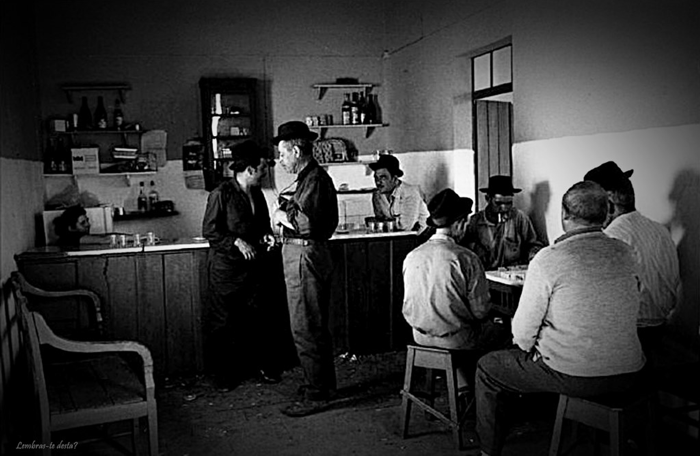

Programação concorrente multi-tarefa
por memória partilhada
Sistemas Operativos

Desafio de hoje:
Como implementar um trinco lógico?

Propriedades desejáveis num trinco

- Propriedade de correção (safety)
  - Exclusão mútua
- no máximo uma tarefa detém o trinco
- Propriedades de progresso (liveness)
  - Ausência de interblocagem (deadlock)
- Se pelo menos uma tarefa tenta obter o trinco, então alguma o
  obterá (dentro de um tempo finito)
  - Ausência de míngua (starvation)
- Se uma dada tarefa tenta obter o trinco, essa tarefa conseguirá obtê-
  lo (dentro de um tempo finito)
- Eficiência

Secção Crítica: Implementações

- Algorítmicas
- Hardware
- Sistema Operativo

Como implementar um mutex?
Primeira tentativa: soluções
algorítmicas

Tentativa de Solução #1
Fechar () {
while (trinco == FECHADO) {/_ instrução vazia _/};
trinco = FECHADO;
}
int trinco = ABERTO;
Abrir () {
trinco = ABERTO;
}

Tentativa de Solução #2
int trinco_t1 = ABERTO;
int trinco_t2 = ABERTO;
Tarefa T1
t1_fechar () {
while (trinco_t2 == FECHADO);
trinco_t1 = FECHADO;
}
t1_abrir() {trinco_t1 = ABERTO;}
Tarefa T2
t2_fechar ( ) {
while (trinco_t1 == FECHADO);
trinco_t2 = FECHADO;
}
t2_abrir() {trinco_t2 = ABERTO;}

Tentativa de Solução #3
(igual à #2 mas com linhas trocadas)
int trinco_t1 = ABERTO;
int trinco_t2 = ABERTO;
Tarefa T1
t1_fechar () {
trinco_t1 = FECHADO;
while (trinco_t2 == FECHADO);
}
t1_abrir() {trinco_t1 = ABERTO;}
Tarefa T2
t2_fechar ( ) {
trinco_t2 = FECHADO;
while (trinco_t1 == FECHADO);
}
t2_abrir() {trinco_t2 = ABERTO;}

Tentativa de Solução #4
int trinco_vez = 1;
Tarefa T1
t1_fechar () {
while (trinco_vez == 2);
}
t1_abrir () {trinco_vez = 2;}
Tarefa T2
t2_fechar () {
while (trinco_vez == 1);
}
t2_abrir () {trinco_vez = 1;}

Ainda não conseguimos cumprir as propriedades
todas...

Algoritmo da Padaria
(contado em versão “taberna”)

Algoritmo da Padaria (_)
Versão intuitiva
●
Cada cliente tem:
●
Senha com inteiro
●
Com número positivo caso esteja à espera da sua vez (ou a ser
atendido)
●
Com zero caso contrário
●
Caneta
●
Sem tampa (caso o cliente esteja a escrever na sua senha)
●
Com tampa (caso o cliente não esteja a escrever na sua senha)
●
Qualquer cliente pode observar os elementos acima dos outros
clientes, mas só observa um de cada vez
(_) Lamport’s Bakery algorithm (proposto por Leslie Lamport)

Algoritmo da Padaria
Versão intuitiva
●
Quando um cliente quer ser atendido:
●
Fase 1 (obtenho número para a minha senha)
●
Tiro tampa da minha caneta
●
Olho para as outras senhas, 1 por 1, para determinar máximo
●
Escrevo na minha senha: máximo+1
●
Coloco tampa na minha caneta
●
Fase 2 (espero até ser sua vez de ser servido)
●
Olho para a senha de cada cliente, 1 por 1
●
Para cada outro cliente com senha positiva, espero enquanto:
●
Outro cliente tem tampa fora da caneta
●
Senha do outro tem número inferior à minha
●
Em caso de empate, caso o id do outro cliente seja inferior ao meu
●
Fase 3 (posso ser atendido em exclusão mútua!)
●
Fase 4: coloca senha a 0 (já fui atendido)

Algoritmo de Lamport (Bakery)
int senha[N]; // Inicializado a 0
int escolha[N]; // Inicializado a FALSE
Fechar (int i) {
int j;
escolha[i] = TRUE;
senha [i] = 1 + maxn(senha);
escolha[i] = FALSE;
for (j=0; j<N; j++) {
if (j==i) continue;
while (escolha[j]) ;
while (senha [j] && (senha [j] < senha [i]) ||
(senha [i] == senha [j] && j < i)));
}
}
Abrir (int i) {senha [i] = 0;}
-Pi verifica se tem a menor senha de todos os Pj
-Se Pj estiver a escolher uma senha, espera que termine
-Pi indica que está a escolher a senha
-Escolhe uma senha maior que todas as outras
-Anuncia que escolheu já a senha
-Se a senha de Pi for menor, Pi entra
-Se as senhas forem iguais, entra o que tiver o menor
identificador

- senha contém o número da senha atribuído à tarefa
- escolha indica se a tarefa está a pretender aceder à
  secção crítica

E se não usássemos escolha
P1
P2
lé senha[2]=0
lé senha[1]=0
senha[2]=1
while (senha [j] && (senha [j] < senha [i]) ||
(senha [i] == senha [j] && j < i)));
senha[1]=1
P2 entra na secção crítica!
� senha[1] tem valor 0 !�
while (senha [j] && (senha [j] < senha [i]) ||
(senha [i] == senha [j] && j < i)));
P1 entra na secção crítica!
�P1 e P2 têm a mesma senha,
e P1 tem id menor! �
inicialmente
senha[1]=senha[2]=0

Mais curiosidades sobre o
algoritmo da padaria

- Publicado em 1974:
  A New Solution of Dijkstra's Concurrent
  Programming Problem.
  Communications of the ACM 17, 8 (August 1974),
  453-455.
- Ver as notas do próprio autor (Leslie
  Lamport):
  https://lamport.azurewebsites.net/pubs/pubs.html

Soluções Algorítmicas

- Conclusão:
  - Complexas => Latência
  - Só são corretas se não houver reordenação de
    acessos memória
- Implica perder otimizações de desempenho que são
  possíveis por compiladores modernos e caches
  - Só contemplam espera ativa

Como implementar um mutex?
Segunda tentativa: soluções com
suporte do hardware

Soluções com Suporte do Hardware

- Abrir( ) e Fechar( ) usam instruções especiais
  oferecidas pelos processadores:
  - Inibição de interrupções:
    -só iremos estudar mais à frente!
  - Exchange (xchg no Intel)
  - Test-and-set (cmpxchg no Intel)

Instruções atómicas em
multiprocessadores
CPU
CPU
CPU
Cache
Cache
Cache
Cache
Memoria
IO
bus
CPU
P1
P2
Instante 1
P1 inicia instrução atómica e tranca o
bus
Instante 2
P1 completa instrução atómica e
tranca a secção crítica
P2 tenta fazer instrução atómica mas
bloqueia-se a tentar obter o bus
Instante 3
P1 entra na secção crítica
P2 verifica que o trinco está trancado
e fica em espera ativa

Aproveitar instruções hw atómicas
Exemplo: Test-and-set
BTS varX

- De forma indivisível (\*):
  - Lê o bit menos significativo de varX
  - Escreve o valor do bit na carry flag
  - Coloca esse bit de varX com valor 1
    (\*) capaz de trancar o bus de memória, logo também funciona em
    multi-processador
    Nota: pseudo-código; na verdade, a instrução BTS recebe mais
    argumentos

Como aproveitar instrução Test-and-set para
implementar mutex?
var trinco = 0; //0: ABERTO, 1: FECHADO
Fechar:
//Caso trinco esteja 0, colocar a 1 (atomicamente)
//Caso contrário, tentar de novo
Abrir:
//Colocar trinco a 0
Tentem primeiro resolver sozinhos: https://tinyurl.com/SO2020-aula9-1

Aproveitar instruções hw atómicas
Exemplo: Test-and-set
ABERTO EQU 0
; ABERTO equivale ao valor 0
FECHADO EQU 1
; FECHADO equivale ao valor 1
Fechar_hard:
L1: BTS trinco
JC L1
RET
Abrir_hard:
MOV
AX, ABERTO  
MOV
trinco, AX
RET
A variável trinco fica FECHADO (1)
A carry flag fica com o valor inicial do
trinco
Se carry flag ficou a 1, trinco estava
FECHADO. Implica voltar a L1 e tentar de
novo.
Se carry flag ficou a 0, trinco estava
ABERTO e ficou FECHADO (por mim!)
Então mas não pode haver outra tarefa que
também viu o trinco a zero?
Nota: isto é pseudo-código, alguns detalhes omitidos.

Soluções com Suporte do Hardware

- Conclusão:
  - Oferecem os mecanismos básicos para a
    implementação da exclusão mútua, mas...
  - Algumas não podem ser usadas directamente por
    programas em modo utilizador
- e.g., inibição de interrupções
  - Outras só contemplam espera activa
- e.g., exchange, test-and-set

Como implementar um mutex?
Terceira tentativa:
Trincos como objetos geridos pelo
núcleo do Sistema Operativo

Mutex com suporte do núcleo

- Fechar e abrir são chamadas sistema
- Núcleo mantém estado de cada trinco
- Caso tarefa tente acesso a trinco fechado, o núcleo
  retira-a de execução, bloqueando-a!
  Trinco t
  Fila de tarefas
  bloqueadas
  Bit “trinco”
  Tarefas bloqueadas
  no Trinco t

Mutex com suporte do núcleo (\*)
trinco_t t;
t.var=ABERTO;
t.tarefasBloqueadas = {};
Fechar (trinco_t t) {
//Se mutex fechado, bloqueia tarefa
//Caso contrário, fecha-o
}
Abrir (trinco_t t) {
//Se alguma outra tarefa bloqueada no mutex, desbloqueia-a
//Se nenhuma, abre o mutex  
}
Tentem primeiro resolver sozinhos:
https://tinyurl.com/SO2020-aula9-2
Assumindo que
funções do núcleo do
SO não se executam
concorrentemente

Mutex com suporte do núcleo (\*)
trinco_t t;
t.var=ABERTO;
t.tarefasBloqueadas = {};
Fechar (trinco_t t) {
if (t.var == FECHADO) {
t.tarefasBloqueadas += estaTarefa;
bloqueia_tarefa(estaTarefa);
}
else
t.var = FECHADO;
}
Abrir (trinco_t t) {
if (t.tarefasBloqueadas.count > 0) {
outraTarefa = t.tarefasBloqueadas.dequeue();
desbloqueia_tarefa(outraTarefa);
}
else
t.var = ABERTO;
}
Assumindo que
funções do núcleo do
SO não se executam
concorrentemente…
… Mas falso em SOs
modernos!

Mutex com suporte do núcleo
trinco_t t; t.var=ABERTO; t.tarefasBloqueadas = {};
t.t_interior;
Fechar (trinco_t t) {
fechar_hw(t.t_interior);
if (t.var == FECHADO) {
t.tarefasBloqueadas += estaTarefa;
abrir_hw(t.t_interior);
bloqueia_tarefa(estaTarefa);
}
else {
t.var = FECHADO;
abrir_hw(t.t_interior);
}
}
Abrir (trinco_t t) {
fechar_hw(t.t_interior);
if (t.tarefasBloqueadas.count > 0) {
outraTarefa = t.tarefasBloqueadas.dequeue();
abrir_hw(t.t_interior);
desbloqueia_tarefa(outraTarefa);
}
else {
t.var = ABERTO;
abrir_hw(t.t_interior);
}
}
Tipicamente usamos
trincos hardware
(e.g., usando Test-
and-Set) pois são
eficientes, e a espera
ativa deixa de ser
grave.

A grande vantagem?

- Núcleo não dá tempo de execução a tarefas
  na fila de espera
- Elimina-se espera ativa!
  ○ Exceptuando durante curtos períodos,
  caso haja chamadas concorrentes a
  fechar()

Em que categoria está o
pthread_mutex?

- É trinco com suporte do núcleo
- No entanto, tem otimizações para que,
  quando o trinco está livre, se evite chamada
  sistema
- Objetivo: minimizar os custos de chamadas
  sistema

Diagrama de Estado dos
Processos / Tarefas
Execução
Em
Executável
Bloqueado
Seleccionado
pelo
Despacho
Retirado pelo
Despacho
Bloqueado
num
Trinco
ou Semáforo
Desbloqueado
