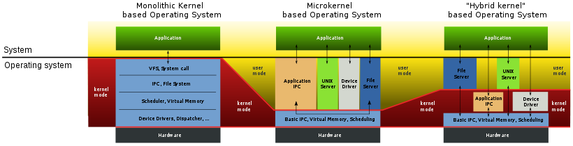

# Organização do Sistema Operativo

```toc

```

## Aplicações executam em modo não priveligiado

- Aplicações
  - Aceder às suas variáveis,
    executar operações
    aritméticas, etc
  - Proibidas de executar
    operações “perigosas”
    sobre os recursos físicos

### Chamadas Sistema para acesso a recursos lógicos

- Quando aplicação
  pretende executar
  operação sobre
  recurso lógico, pede ao
  SO
- É o núcleo do SO que
  manipula diretamente
  os recursos físicos
  - De forma controlada e
    isolada a aplicação

### Funções Oferecidas pelo SO às Aplicações

- Gestão de processos
- Input/output com periféricos
- Gestão de atividades paralelas dentro de um
  processo
- Gestão de memória
- Sistema de ficheiros
- Comunicação pela rede
- Gráficos e gestão de janelas
- Autenticação e segurança
- Etc.

## Organização Típica


- SO divide-se em:
  - Núcleo (kernel) - dividido em módulos
  - Biblioteca das funções sistema (system calls) - usadas pelas aplicações
  - Processos sistema

## Modos de execução do CPU

- Modo utilizador (user)
  - Executa programa da aplicação
  - Apenas sub-conjunto de instruções é permitido, acesso à
    memória restringido por mecanismos de memória virtual
  - Maioria do tempo, máquina está neste modo
- Modo núcleo (kernel)
  - Executa código do núcleo
  - Qualquer instrução permitida, acessos à memória sem
    restrições

### Interação com periférico passo-por-passo

- Processo pede (através de sys.call)
  ação sobre um periférico
- O núcleo envia pedido ao periférico e
  bloqueia o processo (Gestor de Periférico)
- Quando o pedido for servido, o
  periférico lança uma interrupção
- Consequentemente, o núcleo é
  ativado, entrega a resposta ao
  processo e torna-o executável (Gestor de Periférico)

### E caso um processo não largue o processador?

- Interrupções de temporização
  - Permitem ao núcleo interromper um processo que
    esteja execução há muito tempo
  - Oportunidade para o núcleo tirar esse processo de
    execução e executar outro processo

#### Razões para passar de modo utilizador para modo núcleo?

- Chamadas sistema
- Exceções
  - Causadas pela aplicação
  - Acesso a endereço inválido, divisão por zero, etc.
- Interrupções
  - Originadas em periféricos ou outro hardware
  - De temporização

## Estrutura Monolítica


- Um único sistema

- Internamente organizado em módulos

- Estruturas de dados globais

- Problema: como dar suporte à evolução

  - Em particular, novos periféricos

- Solução para este caso particular: gestores de dispositivos (device
  drivers)
- Problemas?

### Sistemas em Camadas


- Cada [camada](https://youtu.be/-FtCTW2rVFM?t=44) usa os serviços da camada precedente

- Fácil modificar código de uma camada

- Mecanismos de protecção $\rightarrow$ maior segurança e robustez

- Influenciou arquitecturas como Intel

## Micro-núcleo

- Propostas de investigação à separação entre:

Um micro-núcleo de reduzidas dimensões e que só continha o
essencial do sistema operativo:

- Gestão de fluxos de execução - threads
- Gestão dos espaços de endereçamento
- Comunicação entre processos
- Gestão das interrupções
- Servidores sistema que executavam em processos independentes a
  restante funcionalidade:
  - Gestão de processos
  - Memória virtual
  - Device drivers
  - Sistema de ficheiro


### Micro-Núcleo vs Monolítico



---

Slides:

- [Slides 6](https://drive.google.com/file/d/1FgdQU7hYV-WhvOQq9uUzElgzeeXp9Shc/view?usp=sharing)
