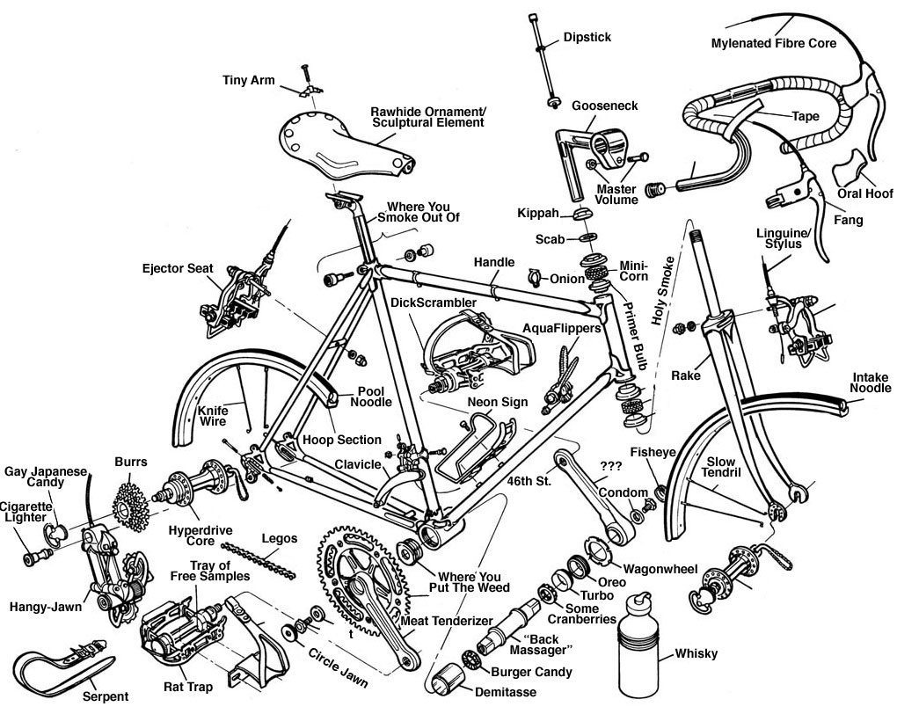
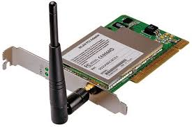
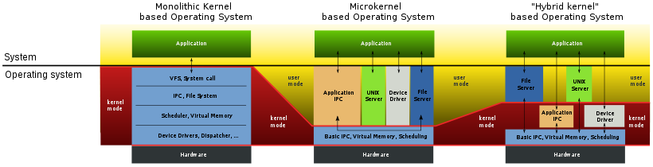

Organização do Sistema Operativo
Sistemas Operativos
2021/ 2022

O programa num slide

UMA PERSPECTIVA DA EVOLUÇÃO
HISTÓRICA
Ver livro & MOOC do Prof. José Alves Marques

ORGANIZAÇÃO DO SISTEMA
OPERATIVO

Imaginem...

- Um projeto de IAC/AC em assembly que:
  - Mantém algumas variáveis em memória, lêem e
    escrevem sobre essas variáveis
  - Faz operações sobre registos gerais do CPU
  - Tem ciclos e saltos condicionais
  - Envia pedidos para portos I/O e recebe respostas
  - Inclui rotinas que tratam algumas interrupções, e
    por vezes inibe interrupções
    Consigo correr sobre simulador...
    ... Mas e no meu PC Win/Linux/MacOS?

Deixar as aplicações usar
diretamente o hardware?

Aplicações executam em modo não
priveligiado

- Aplicações como
  crianças a brincar em
  “caixas de areia”
  - Aceder às suas variáveis,
    executar operações
    aritméticas, etc
  - Proibidas de executar
    operações “perigosas”
    sobre os recursos físicos

“Chamadas Sistema”para acesso a
recursos lógicos

- Quando aplicação
  pretende executar
  operação sobre
  recurso lógico, pede ao
  SO
- É o núcleo do SO que
  manipula diretamente
  os recursos físicos
  - De forma controlada e
    isolada a aplicação

Funções Oferecidas pelo SO às Aplicações

- Gestão de processos
- Input/output com periféricos
- Gestão de atividades paralelas dentro de um
  processo
- Gestão de memória
- Sistema de ficheiros
- Comunicação pela rede
- Gráficos e gestão de janelas
- Autenticação e segurança
- Etc.

Organização Típica

- SO divide-se em:
  - Núcleo (kernel) - dividido em módulos
  - Biblioteca das funções sistema (system calls) - usadas pelas aplicações
  - Processos sistema
    Biblioteca de Funções do Sistema
    Hardware
    Gestão de
    Processos
    Gestão de
    Memoria
    Gestores de
    Periféricos
    Sistema de
    Ficheiros
    Comunicação
    entre Processos

Modos de execução do CPU

- Modo utilizador (user)
  - Executa programa da aplicação
  - Apenas sub-conjunto de instruções é permitido, acesso à
    memória restringido por mecanismos de memória virtual
  - Maioria do tempo, máquina está neste modo
- Modo núcleo (kernel)
  - Executa código do núcleo
  - Qualquer instrução permitida, acessos à memória sem
    restrições
    Veremos mais à frente como se salta de um modo para outro

Gestor de
periférico
Gestor de
periférico
Interação com periférico
passo-por-passo

- Processo pede (através de sys.call)
  ação sobre um periférico
- O núcleo envia pedido ao periférico e
  bloqueia o processo
- Quando o pedido for servido, o
  periférico lança uma interrupção
- Consequentemente, o núcleo é
  ativado, entrega a resposta ao
  processo e torna-o executável

E caso um processo não largue o
processador?

- Interrupções de temporização
  - Permitem ao núcleo interromper um processo que
    esteja execução há muito tempo
  - Oportunidade para o núcleo tirar esse processo de
    execução e executar outro processo

Razões para passar de modo
utilizador para modo núcleo?

- Chamadas sistema
- Exceções
  - Causadas pela aplicação
  - Acesso a endereço inválido, divisão por zero, etc.
- Interrupções
  - Originadas em periféricos ou outro hardware
  - De temporização

## Estrutura MonolíJca

## Um único sistema

## Internamente organizado em módulos

## Estruturas de dados globais

Problema: como dar suporte à evolução

- Em particular, novos periféricos
- Solução para este caso particular: gestores de dispositivos (device
  drivers)
- Problemas?
  Bibliotecas de chamadas sistema
  Aplicações
  Barreira de
  protecção
  Núcleo do sistema operativo
  Aplicações
  Gestores de periféricos
  Bibliotecas de chamadas sistema
  Aplicações
  Barreira de
  protecção
  Núcleo do sistema operativo
  Aplicações
  Gestores de periféricos

## Sistemas em Camadas

## Cada camada usa os serviços da camada precedente

## Fácil modificar código de uma camada

## Mecanismos de protecção à maior segurança e robustez

## Influenciou arquitecturas como Intel

Desvantagem principal?
Gestão de
processos
Gestão de
memória
Comunicação e E/S
Sistema de ficheiros
Chamadas sistema
Aplicações

## Micro-núcleo

## Propostas de investigação à separação entre:

Um micro-núcleo de reduzidas dimensões e que só continha o
essencial do sistema operativo:

- Gestão de fluxos de execução - threads
- Gestão dos espaços de endereçamento
- Comunicação entre processos
- Gestão das interrupções
- Servidores sistema que executavam em processos independentes a
  restante funcionalidade:
  - Gestão de processos
  - Memória virtual
  - Device drivers
  - Sistema de ficheiro

Micro-Núcleo
Sistema de
Barreira de protecção
Micronúcleo
do sistema operativo
Gestores de
Protocolos
Comunicação entre processos
Sistema de ficheiros
Micronúcleo do sistema operativo
Aplicações
Gestores de periféricos
Protocolos de rede
Servidores

Micro-Núcleo vs Monolítico
