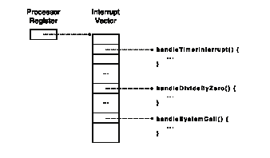

Alínea do 1º teste 2015/16:
Considere a linha:
for (i=0;i<MAX_ITER; i++) sleep(1);
Durante cada iteração deste ciclo, há pelo menos 
dois momentos que implicam execução em modo 
núcleo. 
a) Descreva sucintamente cada um desses momentos.
b)A cada momento citado na alínea anterior, que 
interrupção lhe deu origem? Responda “nenhuma” 
caso não haja nenhuma interrupção envolvida.

Gestor de Processos
Núcleo do Sistema Operativo
Sistemas Operativos
2021 / 2022

Gestor de Processos
- Entidade do núcleo responsável por suportar a 
execução dos processos
  - Gestão das Interrupções 
  - Multiplexagem do Processador
- Despacho   - efectua a transferência de controlo entre 
dois processos
- Escalonamento   -optimiza a gestão dos recursos
  - Sincronização no núcleo
  - Implementação das funções sistema  relacionadas 
com os processos e sincronização

O que acontece desde que ligo a 
máquina (boot) até ao gestor de 
processos estar pronto?
Para investigar em casa e discutimos 
na próxima aula

Boot do núcleo de um sistema 
operativo
- Quando se inicia a máquina, PC aponta para 
um programa na Boot ROM
  - Nos computadores pessoais, o programa na Boot 
ROM chama-se BIOS (basic input/output system)
- O BIOS:
  - Copia bloco de código do disco (ou flash RAM, 
etc.) para RAM 
  - Salta para a primeira instrução desse programa, 
chamado bootloader

Boot do núcleo de um sistema 
operativo (II)
- Bootloader:
  - carrega o programa do núcleo em RAM
  - salta para rotina de inicialização do núcleo

- Inicialização do Núcleo:
  - Inicializa as suas 
estruturas de dados
  - Copia rotinas de 
tratamento de cada 
interrupção para RAM 
  - Preenche tabela de 
interrupções (em RAM)
  - Lança os processos 
iniciais do sistema, 
incluindo o processo de 
login
Boot do núcleo de um sistema 
operativo (III)

Boot do núcleo de um sistema 
operativo (IV)
- Finalmente:
  - O núcleo consiste num conjunto de rotinas de 
tratamento de interrupções
  - Normalmente não estão em execução
  - São ativadas sempre que surjam interrupções

Representação dos Processos 
(e Tarefas)

Contexto: representação de um 
processo no núcleo
- Contexto de hardware
  - Registos do processador (acumulador, uso geral, contador 
de programa, stack pointer, flags de estado do CPU) 
  - Registos da unidade de gestão de memória
- Contexto de software
  - Identificação (processo, utilizador, grupo)
  - Prioridade
  - Estado do processo
  - Outras informações (periféricos em uso, ficheiros abertos, 
directório por omissão, programa em execução, 
contabilização de recursos, signals pendentes, etc.)

Lista dos Processos Executáveis (*)
 
Tabela no 
sistema operativo
Contexto do 
processo i
Contexto do 
processo i+1
Contexto do 
processo i+2
Processo em 
execução
Processos 
executáveis
Lista dos 
processos 
executáveis
Tabela no 
sistema operativo
Contexto do 
processo i
Contexto do 
processo i+1
Contexto do 
processo i+2
Processo em 
execução
Processos 
executáveis
Lista dos 
processos 
executáveis
(*) Veremos mais à frente que normalmente
usamos estruturas mais complexas

Diagrama de Estado dos Processos
 
 
para 
execu ç ão 
Gestor de  processos 
decide  atribuir 
processador a  outro 
processo 
Espera por 
conclusão de um  
acontecimento 
Ocorrência  
acontecimento que 
bloqueava o  processo 
Bloqueado 
Execut á vel 
Em 
execu ç ão 
Seleccionado 
para 
execu ç ão 
Gestor de  processos 
decide  atribuir 
processador a  outro 
processo 
Espera por 
conclusão de um  
acontecimento 
Ocorrência do  
acontecimento que 
bloqueava o  
Bloqueado 
Execut á vel 
Em 
Execu ç ão 

Modo utilizador vs modo núcleo

Estrutura Monolítica
-
O núcleo executa-se num modo de protecção diferente dos processos 
utilizadores
-
A mudança automática entre os dois modos é efectuada pelas 
interrupções (e excepções) e pela instrução de Return from Interrupt
Núcleo do Sistema Operativo
Barreira de protecção
Aplicações
Bibliotecas do sistema
Device drivers

Invocação do Sistema Operativo
- Todas as atividades do núcleo desencadeadas por 
interrupções
- As interrupções podem ser provocadas por:
  - Hardware
- temporizador ou outros periféricos
  - Solicitadas pelo software (traps)
- para chamadas a funções sistema
  - Excepções provocadas pelo programa em execução 
- e.g., divisão por zero ou acesso inválido a memória
Sistema Operativo como o gestor global de todas as interrupções 

Trap: Instrução INT na Intel 80x86
INT - Interrupt Usage: 
INT num 
Modifies flags: TF IF 
Initiates a software interrupt by pushing the flags, 
clearing the Trap and Interrupt Flags, pushing CS 
followed by IP and loading CS:IP with the value found 
in the interrupt vector table. Execution then begins 
at the location addressed by the new CS:IP 
Note on x86 registers:
-
CS: Code Segment
-
IP: Instruction Pointer

Rotina de biblioteca de
chamada à função sistema X
Programa do Utilizador
Executável
Sistema operativo
Agulhagem
Função
sistema A
Função
sistema Z
trap
Modo Utilizador (não privilegiado)
Modo Núcleo(privilegiado)
Chamada a Funções Sistema
RTI

Chamada a Funções Sistema (II)
- Estruturadas em duas entidades funcionais:
  - rotina de interface 
- ligada com o código do utilizador
- usa trap para invocar a função no núcleo.
  - função propriamente dita, faz parte do código do núcleo
- Vantagens:
  - Protecção
- Código das funções sistema está residente no núcleo e não pode ser 
acedido pelos processos utilizador
- A interrupção muda o estado do processador de modo utilizador para 
modo núcleo
  - Partilha das funções sistema por todos os processos
  - O sistema operativo pode ser modificado (novas versões) 
transparentemente desde que não se altere a interface

Invocação do Sistema Operativo
Interrupção
salvaguarda contexto (na pilha actual)
Gestor das Interrupções
identificação da interrupção (vector de int.)
Rotina de Serviço da Interrupção
serve a interrupção possivelmente 
alterando o estado de algum processo
Despacho (veremos daqui a pouco)
Retorno da Interrupção

Rotina de Serviço da Interrupção
- Copia registos da pilha actual para o contexto 
do processo (tabela dos processos)
- Corre o código específico à interrupção, 
possivelmente alterando o estado dos 
processos
- Invoca o despacho para eventualmente 
escolher outro processo para execução

Despacho 
Comutação de Processos/Tarefas

Despacho
Processo X
Processo Y
Interrupção
Despacho
Comuta o processo
RTI
Interrupção
Despacho
Comuta o processo
RTI
Processo X

Despacho
- A função do despacho é comutar o processador 
sempre que lhe seja indicado para o fazer.
- Funcionalidade
  - copia o contexto hardware do processo em execução para 
o respectivo descritor (entrada na tabela de processos)
  - escolhe o processo mais prioritário entre os executáveis
  - carrega o seu contexto hardware no processador
  - transfere o controlo para o novo processo 
- coloca program counter guardado no contexto do novo processo 
na pilha
- return from interrupt (RTI) é “enganado”

Despacho: exemplo
Interrupção
Gestor de Interrupções
Rotina de Tratamento da Interrupção
Despacho
Retorno da Interrupção
Processo A 
chama fechar(t)
Processo A 
bloqueado
Processo B 
executável
Processo B 
Em execução

Duas pilhas: utilizador e núcleo
- A mudança de modo corresponde a:
  - mudança para o modo de protecção mais privilegiado 
do processador
  - mudança do espaço de endereçamento do processo 
utilizador para o espaço de endereçamento do núcleo
  - mudança da pilha utilizador para a pilha núcleo do 
processo
- A pilha núcleo:
  - É usada a partir do instante em que o processo muda 
de modo utilizador para modo núcleo
  - Está vazia quando o processo se executa em modo 
utilizador

Porque não uma pilha única para 
modo utilizador e núcleo?
- Num processo multi-tarefa, uma tarefa fez 
chamada sistema
- Quando a rotina núcleo se executa, coloca 
variáveis locais das funções núcleo na pilha
- Problema: outras tarefas do mesmo processo 
podem estar a correr noutros processadores
  - Logo podem aceder e corromper a pilha da tarefa que 
fez chamada sistema
  - Corrompendo as variáveis locais usadas pelas rotinas 
do núcleo!
- Duas pilhas (utilizador e núcleo) por cada 
processo evitam estes problemas

Escalonamento (Scheduling)
Dado um conjunto de processos 
executáveis, qual a ordem com que 
receberão o CPU (e durante quanto 
tempo)?

Que métricas otimizar?
- Débito (Throughput): o número máximo de jobs por hora
- Turn around time: tempo entre a submissão do job e a
obtenção do resultado
- Utilização do processador: % de tempo em que o processador 
esteve em uso útil
- Tempo de resposta: responder rapidamente aos eventos 
desencadeados pelos utilizadores
- Cumprir metas temporais (deadlines) para tratamento dos 
acontecimentos
- Funcionamento com desempenho previsível (e.g., 
multimedia, máquinas virtuais na cloud)
Dependendo do tipo de sistema, alguns objetivos são mais 
relevantes que outros

Políticas de Escalonamento em Sistemas
de Tempo Partilhado
- Tempo de Execução Partilhado (time-slices)
- Prioridades
- Preempção
- Modificação dinâmica das prioridades

Tempo de Execução Partilhado:
Time Slices
Objectivo: 
Permitir que todos os processos executáveis 
tenham oportunidade de dispor do processador 
ciclicamente

Tempo de Execução Partilhado:
Time Slices
- Como funciona:
  - Processos executáveis mantidos em fila FIFO
  - Quando CPU livre, processo no início da fila é 
colocado em execução até um tempo máximo 
(time slice ou quantum)
  - Processo perde o CPU para o próximo quando:
- Time slice expira (via interrupção do timer)
- Chama sys call que o bloqueia
  - Em ambos os casos, o processo retorna ao fim da 
fila (no caso de bloqueio, só depois de se 
desbloquear)
Desvantagens?

Classes de processos
- Tipicamente, há duas classes de processos:
  - CPU-intensivos
- Uso intensivo do processador, raramente se bloqueiam
  - E/S-intensivos
- Uso intensivo das E/S, quase sempre bloqueados
- Exemplos de cada classe?

Deve a classe do processo 
influenciar o acesso ao CPU?
- Num dado momento, há um processo CPU-
intensivo e outro E/S-intensivo executáveis
- Qual deve ter maior prioridade no acesso ao 
CPU?
  - O processo E/S-intensivo!
- Ok, mas como saber a classe de cada 
processo?
  - Exigir que o programador/utilizador a indique?
  - Mais interessante: inferir a classe estudando o 
comportamento recente do processo

Escalonamento com prioridades
- As prioridades permitem definir a importância de 
um processo no processo de escalonamento
- Um processo mais prioritário tem maior 
probabilidade de dispor do processador
- A prioridade pode ser
  - Fixa, usual em processos de tempo real
  - Dinâmica consoante o comportamento do processo:
- usual nos sistemas de tempo virtual e normalmente 
privilegiando os processo interactivos (I/O intensivos).

Gestão Multilista
utiliza o 
processador
utiliza o 
processador
utiliza o 
processador
lista de maior 
prioridade 
(menos 
processador 
usado)
lista de 
menor 
priorida
de
Em que situações um
processo deve ser
promovido? E relegado?

Gestão Multilista com Quantum
Variável
-
Adaptar o valor do quantum ao comportamento dos processos
-
Diferentes estratégias possíveis
  -
Alguns escalonadores aumentam quantum de processos de menor prioridade
  -
Outros dão maior quantum a processos de maior prioridade
Prioridade Máxima tcpu = 0,02 s
Prioridade Média tcpu = 0,25 s
Prioridade Mínima tcpu = 2 s
Despacho

Preempção em teoria
- O que é? Retirar o processador a um processo 
em execução assim que existe outro processo 
mais prioritário executável
- Objectivo? permite que os processos mais 
prioritários reajam rapidamente a um dado 
acontecimento
  - Por exemplo, mais prioritário estava bloqueado 
mas acontecimento externo desbloqueou-o
  - Assim que processo receber execução, pode reagir 
ao acontecimento

Preempção na prática
- Em teoria, o despacho deve ser chamado na 
sequência de qualquer ação suscetível de 
modificar os estado dos processos
  - Desvantagem: Pode levar a mudanças frequente 
de contexto
- Na prática, “pseudo-preempção”:
  - Assegurar que processo menos prioritário só 
perde processador após tempo mínimo
  - Em algumas situações, processo menos prioritário 
não perde CPU (por exemplo quando está a 
executar rotina do núcleo)

Escalonadores de hoje em dia (I)
- Multi-fila com prioridades variáveis + fixas, 
pseudo-preemptivos, quantum variável
- Escalonador gere tarefas (não processos), cada
uma com a sua prioridade
- Afinidade entre tarefas do mesmo processo é
explorada
  - Comutação para tarefa do mesmo processo é
priorizada

Escalonadores de hoje em dia (II)
- Escalonamento multi-core
  - Tarefas agrupadas por CPU, tentando:
- balancear carga entre CPUs
- colocar tarefas do mesmo processo no mesmo CPU ou 
CPUs próximos
  - Cada CPU tem a sua instância de escalonador (e 
respetiva multi-fila)
  - Ocasionalmente, tarefas migram para outro CPU
- Para rebalancear o Sistema

Gestor de Processos
no Unix/Linux
Sistemas Operativos
2021 / 2022

Linux: estrutura task_struct
struct task_struct {
volatile long state;
unsigned long flags;
int sigpending;
mm_segment_t addr_limit;
struct exec_domain *exec_domain;
volatile long need_resched;
unsigned long ptrace;
int lock_depth;
unsigned int cpu;
int prio, static_prio;
struct list_head run_list;
prio_array_t *array;
unsigned long sleep_avg;
unsigned long last_run;
unsigned long policy;
unsigned long cpus_allowed;
unsigned int time_slice, first_time_slice;
atomic_t usage;
struct list_head tasks;
struct list_head ptrace_children;
struct list_head ptrace_list;
struct mm_struct *mm, *active_mm;
struct linux_binfmt *binfmt;
int exit_code, exit_signal;
int pdeath_signal;
unsigned long personality;
int did_exec:1;
unsigned task_dumpable:1;
pid_t pid;
pid_t pgrp;
pid_t tty_old_pgrp;
pid_t session;
pid_t tgid;
int leader;
struct task_struct *real_parent;
struct task_struct *parent;
struct list_head children;
struct list_head sibling;
struct task_struct *group_leader;
struct pid_link pids[PIDTYPE_MAX];
wait_queue_head_t wait_chldexit;
struct completion *vfork_done;
int *set_child_tid;
int *clear_child_tid;
unsigned long rt_priority;
unsigned long it_real_value, it_prof_value, it_virt_value;
unsigned long it_real_incr, it_prof_incr, it_virt_incr;
struct timer_list real_timer;
struct tms times;
struct tms group_times;
unsigned long start_time;
long per_cpu_utime[NR_CPUS], per_cpu_stime[NR_CPUS];
unsigned long min_flt, maj_flt, nswap, cmin_flt, cmaj_flt,cnswap;
int swappable:1;
uid_t uid,euid,suid,fsuid;
gid_t gid,egid,sgid,fsgid;
int ngroups;
gid_t groups[NGROUPS];
kernel_cap_t cap_effective, cap_inheritable, cap_permitted;
int keep_capabilities:1;
struct user_struct *user;
struct rlimit rlim[RLIM_NLIMITS];
unsigned short used_math;
char comm[16];
int link_count, total_link_count;
struct tty_struct *tty;
unsigned int locks;
struct sem_undo *semundo;
struct sem_queue *semsleeping;
struct thread_struct thread;
struct fs_struct *fs;
struct files_struct *files;
struct namespace *namespace;
struct signal_struct *signal;
struct sighand_struct *sighand;
sigset_t blocked, real_blocked;
struct sigpending pending;
unsigned long sas_ss_sp;
size_t sas_ss_size;
int (*notifier)(void *priv);
void *notifier_data;
sigset_t *notifier_mask;
void *tux_info;
void (*tux_exit)(void);
u32 parent_exec_id;
u32 self_exec_id;
spinlock_t alloc_lock;
spinlock_t switch_lock;
void *journal_info;
unsigned long ptrace_message;
siginfo_t *last_siginfo;
};

Contexto dos Processos
- Em Unix, divido em duas estruturas:
  - A estrutura proc
- Apenas a informação que tem estar disponível (em RAM), mesmo 
quando processo não está em execução
- Atributos necessários ao escalonamento e o funcionamento dos 
signals
  - A estrutura u (user)
- Todo o resto do contexto que só é preciso quando processo está 
em execução
- Podia estar em disco quando processo não estava em execução
Primeiras versões do Unix conseguiam 
correr em máquinas com 50kB de RAM

Unix - Contexto Núcleo de um Processo
- estrutura proc:
  - p_stat   - estado do processo
  - p_pri   - prioridade
  - p_sig   - sinais enviados ao 
processo
  - p_time   - tempo que está em 
memória
  - p_cpu   - tempo de utilização
  - p_pid   - identificador do 
processo
  - p_ppid   - identificador do 
processo pai
- parte do contexto do processo 
necessária para efectuar as 
operações de escalonamento
- estrutura u:
  - registos do processador
  - pilha do núcleo
  - códigos de protecção (UID, GID)
  - referência ao directório 
corrente e por omissão
  - tabela de ficheiros abertos
  - apontador para a estrutura 
proc
  - parâmetros da função sistema 
em execução

Diagrama de Estados do Unix
execução 
em modo 
núcleo
execução 
em modo 
utilizador
executável
criação
executável 
não 
residente
bloqueado 
não 
residente
bloqueado
zombie
exit
fork
interrupção 
de chamada 
sistema

Escalonamento no Unix

Dois tipos de prioridade
- Cada processo (ou tarefa) tem 2 tipos de 
prioridade
  - Consoante esteja a executar-se em modo 
utilizador ou núcleo

Prioridades em modo utilizador
- Prioridade é valor de 0 (maior prioridade) a N 
(menor prioridade)
- Calculadas dinamicamente em função do 
tempo de processador utilizado
- Escalonamento (quase) preemptivo
- Quando o processo muda para execução no 
núcleo é-lhe atribuída uma prioridade em 
modo núcleo

Algoritmo de escalonamento
- Corre processo mais prioritário durante 
quantum (100 ms)
- Round-robin entre os mais prioritários
- Ao fim de 1 segundo (50 “ticks” de 20 ms) , 
recalcula prioridades:
  - Para cada processo:
- TempoProcessador = TempoProcessador / 2
- Prioridade = TempoProcessador/2 + PrioridadeBase
Esquecimento progressivo dos 
usos mais antigos do CPU

Escalonamento: Chamadas Sistema
- nice (int val) 
  - Decrementa a prioridade “val” unidades
  - Apenas superutilizador pode invocar com “val” 
negativo
- int getpriority (int which, int id)
  - Retorna prioridade do processo (ou grupo de 
procs.)
- setpriority (int which, int id, int prio)
  - Altera prioridade do processo (ou grupo de procs.)

Prioridades em modo núcleo
- Definidas com base no acontecimento que o 
processo está a tratar e são fixas
- Sempre superiores às prioridades utilizador
- O processo em modo núcleo não é comutado
- Quando passa de modo núcleo para modo 
utilizador, processo recebe prioridade 
utilizador (recalculada nesse momento)

Unix: Prioridades
Swapper
E/S disco
Espera tampão
da cache
Espera inode
Entrada terminal
Saida terminal
Terminação filho
Nível 0
Nível 1
Nível N
podem 
receber
signals
não podem 
receber
signals
prioridades
em modo
utilizador
prioridades
em modo
núcleo
- Actualizadas 
periodicamente
- Depende do tempo 
de processador já 
usado
- Depende do tipo de 
recursos que o 
processo detém 
quando é bloqueado
- Definida quando o 
processo está 
bloqueado à Usada 
ao desbloquear

Resumindo...
- Prioridades negativas mais altas (valor abs.)
  - Processos que se bloquearam no núcleo ao acederem a 
recurso crítico
- Prioridades negativas mais baixas
  - Idem mas recurso menos crítico
- Prioridades positivas mais baixas
  - Processos em modo utilizador que, no passado recente, 
usaram pouco o CPU
- Prioridades positivas mais altas
  - Processos em modo utilizador que, no passado recente, 
usaram mais o CPU

Como escala com muitos 
processos?
- Todos os segundos é necessário efectuar o 
cálculo das prioridades de todos os processos, 
- Má escalabilidade com o número elevado de 
processos

Escalonamento no Linux

Escalonamento baseado em 
épocas
- Linux: Tempo dividido em épocas
  - Época termina quando todos os processos:
- ou usaram o seu quantum disponível 
- ou estão bloqueados
  - Época dura mais tempo caso haja mais processos
- Consequência?

Quantum variável
- Processos diferentes têm durações do 
quantum diferentes
  - quantum =  quantum_base +                           
quantum_por_utilizar_epoca_anterior / 2
  - Pode ser reduzido com chamadas sistema

Adaptação do quantum (1/2)
Base
Disponível
Usado
10
10
0
10
15
0
10
17,5
0
10
18,75
0
10
19,375
0
10
19,6875
0
10
19,84375
0
10
19,921875
0

Adaptação do quantum (2/2)
Base
Disponível
Usado
10
10
0
10
15
0
10
17,5
17,5
10
10
0
10
15
0
10
17,5
0
10
18,75
0

Linux: Prioridades
- Prioridade de um processo:
  - Linux: prioridade mais alta à mais prioritario
- oposto do que no Unix
  - Prio = prio_base + quantum_por_usar_nesta_época - nice
- Processo mais prioritário é escolhido em primeiro lugar

Completely Fair Scheduler (CFS)
- Usado desde 2007 no Linux (versão 2.6)
- Cada processo tem atributo vruntime
  - Representa o tempo acumulado de execução em modo 
utilizador do processo
  - Quando processo perde CPU, seu vruntime é 
incrementado com o tempo executado nesse quantum
- vruntime de processos I/O bound tende a ser menor!
  - Processo mais prioritário é o com vruntime mínimo
- Novo processo recebe vruntime igual ao vruntime mínimo entre os 
processos ativos è por quê não 0?

Completely Fair Scheduler (CFS)
- Processos executáveis mantidos em red-black 
tree ordenada por vruntime: 
  - encontrar processo mais prioritário: 
complexidade asimptotica de desce de O(n)
(kernel 2.4) para O(log(n)), onde n é o número de 
processos

Linux: Escalonamento “Real-Time”
- Também é possível definir prioridades estáticas 
superiores às dinâmicas (modo utilizador)   - classe 
“real-time”
  - Necessárias permissões para lançar processo real-time
  - Mas não é um sistema de tempo-real puro!

(Outras) Operações asseguradas 
pelo gestor de processos
Revisitar algumas das primitivas de programação 
sistema que aprendemos, agora por outra perspetiva

fork()

Criação de um Processo
- Reservar uma entrada na tabela proc (Unix) e verificar se o 
utilizador não excedeu o número máximo de subprocessos
- Atribuir um valor ao pid
  - normalmente um incremento de um inteiro mantido pelo núcleo
- Copiar a imagem do processo pai
  - Como a região de código é partilhada, apenas é incrementado o 
contador do número de utilizadores que acedem a essa região 
  - As restantes regiões são copiadas
- Algumas incrementalmente, e.g. o heap (veremos mais à frente)
- Retornar o valor do pid do novo processo para o processo 
pai, zero para o processo filho
  - Coloca os valores apropriados nas respectivas pilhas

Criação de um Processo (cont.)
código
dados do
processo pai
pilha do 
processo pai
ficheiros abertos
directório corrente
pilha núcleo
região U
tabela de regiões
código
dados do
processo pai
pilha do 
processo filho
ficheiros abertos
directório corrente
pilha núcleo
região U
tabela de regiões
tabela de 
ficheiros
tabela de 
inodes
código
partilhado

exit(...)
wait(...)

Terminação de um Processo
-
Função exit:
  - fechar todos os ficheiros
  - libertar directório corrente
  - libertar regiões de memória
  - actualizar ficheiro com registo da utilização do processador, memória 
e I/O
  - enviar signal death of child ao processo pai (por omissão é ignorado)
  - registo proc / task mantém-se no estado zombie:
- permite ao processo pai encontrar informação sobre o filho quando executa 
wait
-
Função wait:
  - procura filho zombie 
  - pid do filho e estado do exit são retornados através do wait
  - liberta a estrutura proc do filho
  - se não há filho zombie, pai fica bloqueado

exec*(...)

Execução de um Programa
- A função exec executa um novo programa no âmbito de um 
processo já existente:
  - Verifica se o ficheiro existe e é executável
  - Copia argumentos da chamada a exec da pilha do utilizador para 
o núcleo (pois o contexto utilizador irá ser destruído)
  - Liberta as regiões de dados e pilha ocupadas pelo processo e 
eventualmente a região de texto (se mais nenhum processo a
estiver a usar)
  - Reserva novas regiões de memória
  - Carrega o ficheiro de código executável
  - Copia os argumentos da pilha núcleo para a pilha utilizador
- O processo fica no estado executável
- O contexto software do processo mantém-se inalterado 
(PID, PPID, UID, GID, ficheiros abertos, etc)

signal(...)

Signals (II)
- Se processo tem rotina de tratamento associada ao 
signal, núcleo regista no contexto do processo que o 
signal ocorreu
- Antes do processo receber de novo execução, 
despacho salta para a rotina de tratamento do signal
  - Endereço da rotina de tratamento de cada signal encontra-
se no descritor do processo
  - A pilha de modo utilizador é alterada para 
conseguir voltar ao ponto original após executar a função 
de tratamento do signal

pthread_mutex

Trincos (mutexes) 
suportados pelo núcleo
- Fechar e abrir são chamadas sistema
- Núcleo mantém estado de cada trinco
Trinco t
Fila de tarefas 
bloqueadas
Bit “trinco”
Tarefas bloqueadas 
no Trinco t

Fechar_Mutex e Abrir_Mutex
trinco_t = t;
t.var=ABERTO;
t.numTarefasBloqueadas = 0;
Fechar_mutex (trinco_t t) {
Fechar_hard(t);
if (t.var == FECHADO) {
numTarefasBloqueadas++;
Abrir_hard(t);
bloqueia_tarefa(); 
}
else {
t.var = FECHADO;
Abrir_hard(t);
}}
Abrir_mutex (trinco_t t) {
Fechar_hard(t); 
if (numTarefasBloqueadas>0) {
numTarefasBloqueadas --;
Abrir_hard();
desbloqueia_tarefa();
}
else {
t.var = ABERTO;
abrir_hard()
}}
Fechar_mutex
Se o trinco estiver FECHADO, bloqueia-se. 
Se estiver  ABERTO, tarefa passa ao estado 
FECHADO. 
Abrir_mutex
Passa o trinco para o estado ABERTO ou 
desbloqueia uma tarefa que esteja à sua 
espera de entrar na secção crítica
Existem tarefas bloqueadas?
- Marcar o estado de uma delas como 
“executável”
- Retirar a estrutura de dados que 
descreve a tarefa da fila de espera 
associada ao trinco
- Retirar tarefa de execução
- Salvaguardar o seu contexto
- Marcar o seu estado como bloqueada
- Colocar a estrutura de dados que descreve a 
tarefa na fila de espera associada ao trinco
-Outra tarefa/processo é colocado em execução

Sincronização no Núcleo
- Vimos mecanismos que permitem às actividades a 
nível utilizador partilhar recursos de forma totalmente 
consistente
- Problema é genérico:
  - também se aplica a qualquer situação em que duas 
actividades concorrentes dentro do núcleo partilham 
recursos (aplica-se à maioria das tabelas e variáveis 
internas)
- Coloca-se quando:
  - Multiprocessadores
  - Uniprocessadores - interrupções

