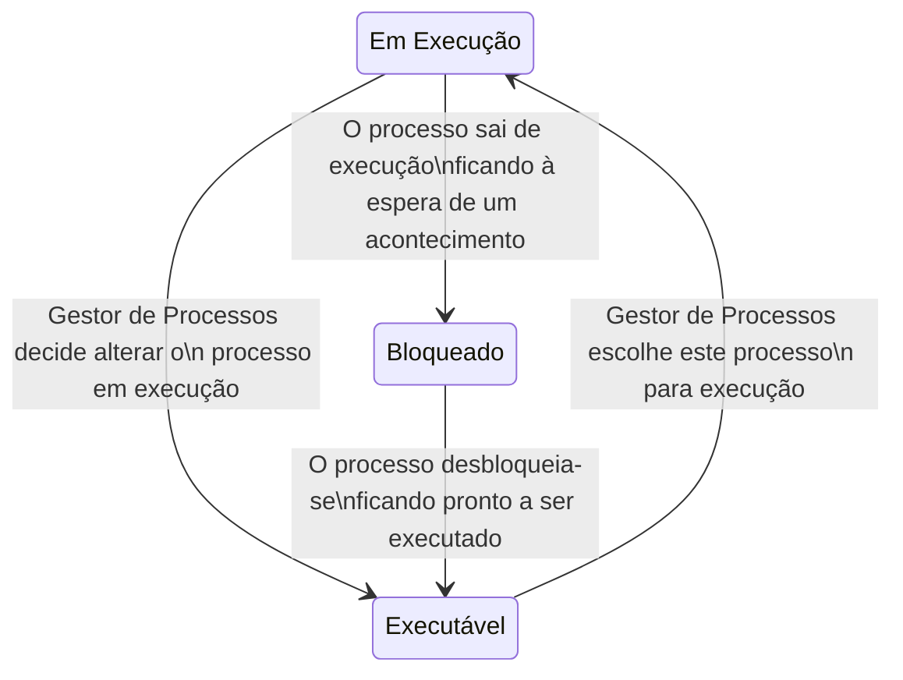
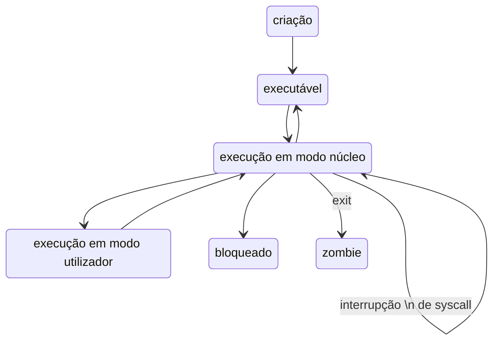

# Gestão de Processos

```toc

```

## Gestor de Processos

Sabemos por experiência própria que podemos ter dois ou mais processos a executar no nosso computador.
Mas como? O nosso processador apenas consegue executar uma instrução de cada vez.
Bem na realidade é isso que acontece: apenas é executada uma instrução de cada vez, mas o
[**Gestor de Processos**](color:green) vai alternando entre os vários processos de forma a dar a ilusão que estão
a ser executados concorrentemente.

O [**Gestor de Processos**](color:green) é uma entidade do núcleo (_kernel_) que, além
de efetuar a transição entre vários processos e tarefas (_threads_), é também responsável
pelo **tratamento de interrupções**, **otimização da gestão de recursos dos processos** (escalonamento, _scheduling_) e
da implementação das chamadas de sistemas relacionadas com processos e sincronização entre os mesmos
(como por exemplo a alteração da prioridade de um processos; veremos mais à frente o que isto significa).

## Processos e Tarefas

Para percebermos como é que o sistema operativo vai transitar entre vários processos,
temos de aprender como é que estes são representados no núcleo (_kernel_).

Quando trocamos o processo em execução, temos de guardar o contexto do processo
que estava em execução e substituí-lo pelo contexto do novo processo.
Um processo tem contexto tanto no [_hardware_](color:yellow) como no [_software_](color:pink).

No [_hardware_](color:yellow), tal como já vimos em IAC, existem **registos do processador**.
Os valores desses registos (acumulador, genéricos, _program counter_, _stack pointer_, _flags_ de estado, etc)
fazem parte do contexto do processo,
e têm de ser guardados/restaurados quando se troca o processo em execução.
Além disso, é preciso também guardar/restaurar os **registos da unidade de gestão de memória** (UGM).

Por outro lado, no [_software_](color:pink), são guardados _metadados_ sobre o processo em execução.
Informações como a **identificação do processo** (PID, utilizador, grupo, etc), a sua **prioridade**,
o seu **estado**, e muitas outras informações, como periféricos em uso, ficheiros abertos,
diretório por omissão, programa em execução, contabilização de recursos, _signals_ pendentes, etc).

Abaixo encontra-se um diagrama que mostra uma simplificação do ciclo de vida de um processo.



## Gestão de Interrupções

No capítulo anterior vimos que os processos em modo núcleo são sempre desencadeados por uma [interrupção](color:orange).
Ora, então, como é que estas são tratadas?


- **Interrupção**: É desencadeada uma interrupção. O contexto do processo em execução é guardado na pilha.
- **Gestor de Interrupções**: Identifica a interrupção (agulhagem).
- **Rotina de Serviço da Interrupção**: É feito o tratamento da interrupção.
  - copia registos da pilha atual para o contexto do processo (na tabela de processos);
  - corre o código específico à interrupção, possivelmente alterando o estado dos processos;
  - invoca o despacho para que este escolha outro processo para executar.
- **Despacho**: Volta-se a colocar um processo em execução, e o seu contexto é carregado.
  - copia o contexto hardware do processo que estava em execução quando a interrupção foi registada para o respetivo descritor (entrada na tabela de processos);
  - escolhe um processo para executar (vamos ver como a seguir);
  - carrega o contexto hardware do processo escolhido no processador;
  - transfere o controlo para o novo processo, colocando o seu PC na pilha. Desta forma, o RTI é enganado a "voltar" (_return_) para o processo "errado".
- **Retorno da Interrupção (RTI)**: Saída do modo núcleo, para o processo determinado pelo despacho.

### Chamadas de Sistema

As chamadas a sistema estão estruturadas em duas entidades funcionais:

- **Rotina de Interface**: faz parte do código do utilizador e é executada por este. Usa _trap_ para invocar a função do núcleo;
- **Função do Núcleo**: faz parte do código do núcleo e é esta que executa a operação solicitada pelo utilizador.

Este sistema garante:

- **Proteção**: o código das funções sistema está residente no núcleo e não pode ser acedido pelos processo em modo utilizador;
- **Uniformidade**: as funções sistema são partilhadas por todos os processos;
- **Flexibilidade**: o SO pode ser modificado transparentemente desde que não altere a interface.

### Duas Pilhas para Utilizador e Núcleo

Quando o CPU comuta de um processo em modo utilizador tem de:

- mudar o espaço de endereçamento do processo utilizador para o espaço de endereçamento do núcleo;
- mudar da pilha do utilizador para a pilha núcleo do processo. Esta pilha é utilizada a partir do momento em que o processo muda de modo utilizador para modo núcleo e está sempre vazia antes disso.

O uso de pilhas distintas para execução em modo núcleo e em modo utilizador é uma medida de segurança que impede que processos tenham acesso a informação priveligiada do núcleo.  
Considere-se a seguinte situação (assumindo que há uma pilha por processo):  
Num processo multi-tarefa, uma tarefa faz uma chamada sistema.
Quando a rotina núcleo se executa, coloca variáveis locais das funções núcleo na pilha do processo.
Enquanto isto acontece, outras tarefas deste processo podem estar a correr noutros processadores.
Então, pode acontecer que outras tarefas acedam e corrompam a pilha da tarefa que fez chamada sistema, corrompendo variáveis locais usadas pelas rotinas do núcleo.  
Usar uma pilha quando o processo está em modo utilizador e outra pilha quando está em modo núcleo protege os recursos essenciais deste tipo de situações.

## Scheduling (Escalonamento)

Damos o nome de [**escalonamento**](color:pink) (ou em inglês, [**_scheduling_**](color:pink)) ao conceito de definir que processo é que tem acesso a que CPU em cada momento.
Para o nosso escalonamento ser o melhor possível, é necessário definir métricas para um bom escalonamento.
Estas podem ser:

- **Débito (_throughput_)**: maximizar número de _jobs_ por hora;
- **Turn around time**: minimizar tempo entre a submissão do _job_ e a obtenção do resultado;
- **Utilização de CPU**: maximizar percentagem de tempo de uso do processador;
- **Responsividade**: responder o mais rapidamente possível aos eventos desencadeados por utilizadores;
- **_Deadlines_**: garantir que um certo _job_ acaba antes de um certo _deadline_;
- **Previsibilidade**: garantir que os conteúdos são carregados pelo menos a uma dada velocidade. Importante, por exemplo, para conteúdos de multimédia.

Vamos então analisar várias políticas de escalonamento, e ver quais as suas vantagens e desvantagens.

[**_Round-Robin_**](color:orange)  
 Pretende que todos os processos executáveis tenham acesso ao CPU ciclicamente.
Faz-se isso dispondo os processos executáveis numa FIFO. Sempre que o CPU está disponível, o elemento na frente da FIFO recebe o CPU durante um **_quantum_** ou **_time-slice_**.  
 Isto é, nenhum processo será executado (de seguida) mais do que um dado período de tempo consecutivo.
O processo perde o CPU quando:

- o seu _quantum_ acaba - o processo é reinserido no fim da fila;
- chama uma _syscall_ que o bloqueia - o processo é reinserido no fim da fila quando é desbloqueado;
- termina.

Esta política tem a desvantagem de poder causar elevados tempos de resposta, principalmente em situações de congestionamento.
Nomeadamente, se houver processos que exijam muito CPU, e outros que sejam mais I/O intensivos, devemos dar mais prioridade aos do segundo tipo (pois são pouco exigentes do CPU e necessitam de resposta rápida).

[**Multi-lista**](color:yellow)  
 É guardada uma multi-lista, em que cada lista tem processos com uma dada [**prioridade**](color:purple).
Processos mais prioritários recebem CPU primeiro. A prioridade de um processo pode ser fixa ou dinâmica.  
 Note-se que um sistema que tenha apenas prioridades fixas sujeita-se a que os processos menos prioritários nunca recebam CPU,
enquanto que prioridades dinâmicas permitem ir tornando os processos que não recebem CPU há mais tempo mais prioritárias.
Esta política permite ainda atribuir _quantum_ diferentes a prioridades diferentes.

[**Preempção**](color:green)  
O conceito de preempção consiste em retirar o CPU ao processo em execução logo que haja um mais prioritário.
Isto permite melhorar o tempo de reação a processos mais prioritários. No entanto, se houver um influxo frequente de processos mais prioritários,
esta política pode dar lugar a mudanças frequentes de contexto, que "desperdiçam" tempo de CPU (que pode e deve ser usado a responder aos processos).  
 É então aplicada **pseudo-preempção**: o processo perde o CPU para o mais prioritário, apenas se já tiver utilizado o CPU durante um tempo mínimo.

Os [**escalonadores hoje em dia**](color:blue):

- usam multi-filas com prioridades dinâmicas e fixas;
- são pseudo-preemptivos com _quantum_ variável;
- atuam sobre tarefas e não processos (sendo um processo um conjunto de uma ou mais tarefas).

:::details[Escalonamento Multicore]
Tudo o que foi falado até aqui só diz respeito a escalonamento para um só processador.

Em processadores _multi-core_, o gestor de processos deve ter mais preocupações, como por exemplo,
manter tarefas respetivas ao mesmo processo no mesmo CPU, mas também manter uma carga balanceada pelos vários _cores_.

Políticas respetivas a esta gestão não são abordadas nesta cadeira.
:::

### Gestor de Processos no Unix

**Contexto dos processos em Unix**

Em Unix, o contexto dos processos é dividido em duas estruturas:

- A estrutura [proc](color:orange), que contém a informação do processo que tem de estar disponível (em RAM),
  mesmo quando o processo não está em execução, nomeadamente, informação necessária para o escalonamento e funcionamento de signals.

  - `p_stat` - estado do processo;
  - `p_pri` - prioridade do processo;
  - `p_sig` - sinais enviados ao processo;
  - `p_time` - tempo que está em memória;
  - `p_cpu` - tempo de utilização;
  - `p_pid` - identificador do processo;
  - `p_ppid` - identificador do pai do processo.

- A estrutura [u (user)](color:yellow), que contém a restante informação que só é necessária quando o processo está em execução,
  podendo estar em disco quando o processo não está em execução.

  - registos do processador;
  - pilha do núcleo;
  - códigos de proteção (`uid`, `gid`);
  - referência ao diretório corrente e por omissão;
  - tabela de ficheiros abertos;
  - apontador para a estrutura proc;
  - parâmetros da função sistema em execução.

A existência destas duas estruturas era principalmente relevante nas primeiras versões do Unix, que corriam em máquinas com 50KB de RAM.

**Diagrama de Estados do Unix** (ligeiramente simplificado)



**Escalonamento em Unix**

Em Unix há dois tipos de prioridades:

- Prioridades para processos em **modo utilizador**:
  - vão de 0 (mais prioritário) a N (menos prioritário);
  - são calculadas dinamicamente em função do tempo de processador utilizado;
  - escalonamento (quase) preemptivo.
- Prioridades para processos em **modo núcleo**:
  - têm valores negativos (quanto mais negativo, mais prioritário);
  - são fixas, consoante o acontecimento que o processo está a tratar;
  - são sempre mais prioritárias que os processos em modo utilizador.


As prioridades do utilizador seguem o seguinte algoritmo:

- o CPU é sempre atribuido ao processo mais prioritário durante um _quantum_ de 100ms (5 "ticks" do relógio);
- _Round-Robin_ entre os processos mais prioritários;
- A cada segundo (50 "ticks") as prioridades são recalculadas de acordo com a seguinte fórmula:

$$
\begin{darray}{l}
\text{Prioridade} = \text{PrioridadeBase} + \frac{\text{TempoProcessador}}{2}\\
\text{TempoProcessador} = \frac{\text{TempoProcessador}}{2}
\end{darray}
$$

Isto permite ir "esquecendo" progressivamente os usos mais antigos do CPU.

O Unix suporta ainda as seguintes chamadas de sistema:

- `nice(int val)`: Muda o valor `nice` de um processo.
  - Adiciona o valor `val` ao `nice` atual do processo. Assim sendo este processo irá tornar-se menos prioritário, no caso de `val` ser positivo.
  - Apenas superutilizador pode invocar com `val` negativo. Tornando o processo mais prioritário;
- `getpriority(int which, int id)`: retorna prioridade de um processo ou grupo de processos;
- `setpriority(int which, int id, int prio)`: altera prioridade do processo ou grupo de processos.

O Gestor de Processos em Unix recalcula a prioridade de todos os processos a cada segundo, pelo que é pouco eficiente quando há muitos processos.

### Gestor de Processos no Linux

O Gestor de Processos em Linux tenta resolver o problema encontrado no Gestor de Processos do Unix.  
Para isso, divide o tempo em épocas.
Uma época acaba quando todos os processos usaram o seu _quantum_ disponível ou estão bloqueados. No início de cada época, é atribuido a cada processo um _quantum_ e uma prioridade da seguinte forma:

$$
\begin{darray}{l}
\text{quantum\_esta\_epoca} = \text{quantum\_base} + \frac{\text{quantum\_por\_usar\_epoca\_anterior}}{2}\\
\text{prio\_esta\_epoca} = \text{prio\_base} + \text{quantum\_por\_usar\_epoca\_anterior} - \text{nice}
\end{darray}
$$

Sendo que o valor do _quantum_ pode ser mudado com chamadas de sistema.

Ao contrário do Unix, as prioridades mais importantes são as com valor mais elevado. No entanto, tal como no Unix, o processo mais prioritário é sempre escolhido primeiro.

### Completely Fair Scheduler (CFS)

O CFS é o _scheduler_ usado desde 2007 pelo Linux (o que vimos agora foi entretanto abandonado).
Cada processo tem um atributo **_vruntime_** que representa o tempo acumulado de execução em modo utilizador do processo.  
Quando o processo perde CPU, o seu _vruntime_ é incrementado com o tempo executado nesse _quantum_.
Temos que o processo mais prioritário é o com _vruntime_ mínimo. Um novo processo entra com _vruntime_ igual ao mínimo entre o _vruntime_ dos processos ativos.  
Os processos são guardados numa _red-black tree_ ordenada por _vruntime_, que permite encontrar o processo mais prioritário em O(log n) em vez de O(n).

É ainda possível definir prioridades estáticas superiores às dinâmicas (modo utilizador) em contexto _real-time_ ("_soft_", no sentido que não é 100% _real-time_). Para isto, são necessários privilégios de núcleo.

## Operações Asseguradas pelo Gestor de Processos em POSIX

A cadeira acha mais importante falar destas operações, para os mais [curiosos, podem consultar a spec do POSIX.](https://pubs.opengroup.org/onlinepubs/9699919799.2018edition/nframe.html)

**fork()**  
A operação fork() reserva uma entrada na tabela `proc` (Unix), verifica se o utilizador não excedeu o número máximo de subprocessos e atribui um valor ao `pid` (normalmente um incremento de um inteiro mantido pelo núcleo).  
De seguida, copia o contexto do processo pai: como a região de código é partilhada, apenas é incrementado o contador do número de utilizadores que acedem a essa região, as restantes regiões são copiadas.  
Finalmente, é retornado o `pid` do novo processo ao processo pai, e zero ao filho (esses valores são colocados nas pilhas respetivas).


:::details[Curiosidades]
Matéria não avaliada.

Porque o `fork` não é uma boa ideia e porque deve ser evitado usar. [(link)](https://www.microsoft.com/en-us/research/publication/a-fork-in-the-road/)

Em Linux, há um processo que junta páginas iguais de processos diferentes para poupar memória a posteriori chamado [KSM - Kernel Samepage Merging](https://www.kernel.org/doc/html/latest/admin-guide/mm/ksm.html)

Basicamente o núcleo varre ocasionalmente as páginas no sistema, se vir que existem 2 páginas iguais, ativa o bit CoW e mete o outro processso a usar esta página, apagando a outra, ganhando espaço em memória.
:::

**exit()**  
A operação `exit()` termina um processo, executando as funções registadas pelo `atexit` (esta não precisa de ajuda do núcleo para ser executada), libertando todos os recursos (ficheiro, diretoria corrente, regiões de memória).  
De seguida actualiza o ficheiro que regista a utilização do processador, memória e I/O.  
Finalmente, envia signal death of child (SIGCHILD) ao processo pai (que por omissão é ignorado) e mantem o filho no estado zombie, até que o pai o encontre (obtendo informação sobre a terminação do filho).

**wait()**  
O operação `wait()` procura por filhos _zombie_:

- se não há filho _zombie_, o pai fica bloqueado;
- se não há filhos, a função retorna imediatamente.
  O pid do filho e estado do _exit_ são retornados através do _wait_ e a estrutura `proc` do filho é finalmente libertada.

**exec()**  
A funçao `exec()` executa um novo programa no âmbito de um processo já existente:

- primeiro, verifica se o ficheiro existe e é executável;
- copia os argumentos da chamada _exec_ da pilha do utilizador para o núcleo (pois o contexto utilizador irá ser destruído);
- liberta as regiões de dados e pilha ocupadas pelo processo;
- reserva novas regiões de memória;
- carrega o ficheiro de código executável;
- copia os argumentos da pilha do núcleo para a pilha do utilizador.

O processo fica no estado executável e o contexto software do mesmo mantém-se inalterado.

**signal()**  
Se o processo tem rotina de tratamento associada ao signal, o núcleo regista no contexto do processo que o signal ocorreu.
Antes do processo receber de novo execução, o despacho salta para a rotina de tratamento do signal.

**pthread_mutex**  
Fechar e abrir mutex's são chamadas de sistema. A espera bloqueante é conseguida com ajuda do núcleo. Isto já foi abordado nos [resumos de Implementação de um Mutex](./implementation#trincos-como-objetos-geridos-pelo-núcleo-do-sistema-operativo)
