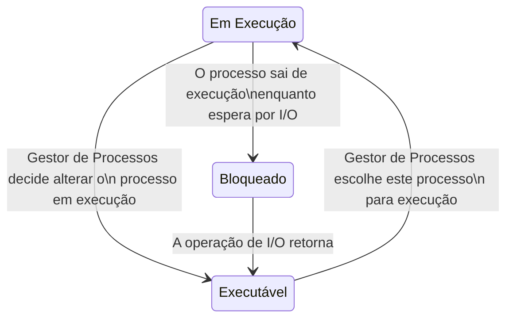
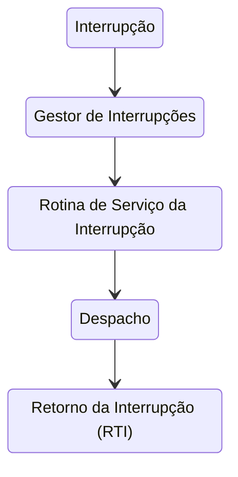

# Gestão de Processos

```toc

```

## Gestor de Processos

Sabemos por experiência própria que podemos ter dois ou mais processos a executar no nosso computador.
Mas como? O nosso processador apenas consegue executar uma instrução de cada vez.
Bem na realidade é isso que acontece: apenas é executada uma instrução de cada vez, mas o
[**Gestor de Processos**](color:green) vai alternando entre os vários processos de forma a dar a ilusão que estão
a ser executados concorrentemente.

O [**Gestor de Processos**](color:green) é uma entidade do núcleo (_kernel_) que, além
de efetuar a transição entre vários processos e tarefas (_threads_), é também responsável
pelo **tratamento de interrupções**, **otimização da gestão de recursos dos processos** (escalonamento, _scheduling_) e
da implementação das chamadas de sistemas relacionadas com processos e sincronização entre os mesmos
(como por exemplo a alteração da prioridade de um processos; veremos mais à frente o que isto significa).

## Processos e Tarefas

Para percebermos como é que o sistema operativo vai transitar entre vários processos,
temos de aprender como é que estes são representados no núcleo (_kernel_).

Quando trocamos o processo em execução, temos de guardar o contexto do processo
que estava em execução e substituí-lo pelo contexto do novo processo.
Um processo tem contexto tanto no [_hardware_](color:yellow) como no [_software_](color:pink).

No [_hardware_](color:yellow), tal como já vimos em IAC, existem **registos do processador**.
Os valores desses registos (acumulador, genéricos, _program counter_, _stack pointer_, _flags_ de estado, etc)
fazem parte do contexto do processo,
e têm de ser guardados/restaurados quando se troca o processo em execução.
Além disso, é preciso também guardar/restaurar os **registos da unidade de gestão de memória**.

Por outro lado, no [_software_](color:pink), é guardado _metadata_ sobre o processo em execução.
Informações como a **identificação do processo** (PID, utilizador, grupo, etc), a sua **prioridade**,
o seu **estado**, e muitas outras informações, como periféricos em uso, ficheiros abertos,
diretório por omissão, programa em execução, contabilização de recursos, _signals_ pendentes, etc).

### Ciclo de Vida Simplificado

Abaixo encontra-se um diagrama que mostra uma simplificação do ciclo de vida de um processo.



## Userland vs Kernelland

Quando estamos a executar um programa no nosso computador, este normalmente corre
no chamado [modo user (_userland_)](color:green), que não tem privilégios acrescidos.
Este não consegue aceder diretamente a periféricos, ficheiros, etc (depende da estrutura do sistema operativo).

No entanto, processos também podem ser executados no [modo núcleo (_kernelland_)](color:red), onde
têm todas as permissões. Apenas o código do sistema operativo pode ser executado neste modo.

Para transitar entre estes dois modos, é usada uma _system call_ (chamada de sistema, _syscall_), que
lança uma interrupção.

## Interrupções

O núcleo _kernel_ é responsável por tratar de interrupções, que podem ocorrer por várias razões, tais como

- Hardware: relógio e periféricos (teclado, rato, etc)
- Interrupções de Software (_traps_): utilizadas pelos programas na _userland_ (chamadas de sistema)
- Exceções: por exemplo exceções de aritmética (divisão por zero), acesso a memória indevido, etc

Mas como é que são tratadas as interrupções?



- **Interrupção**: É desencadeada uma interrupção. O contexto do processo em execução é guardado.
- **Gestor de Interrupções**: Identifica a interrupção (agulhagem).
- **Rotina de Serviço da Interrupção**: É feito o tratamento da interrupção.
- **Despacho**: Volta-se a colocar um processo em execução, e o seu contexto é carregado.
- **Retorno da Interrupção (RTI)**: Saída do modo núcleo (_kernelland_).
