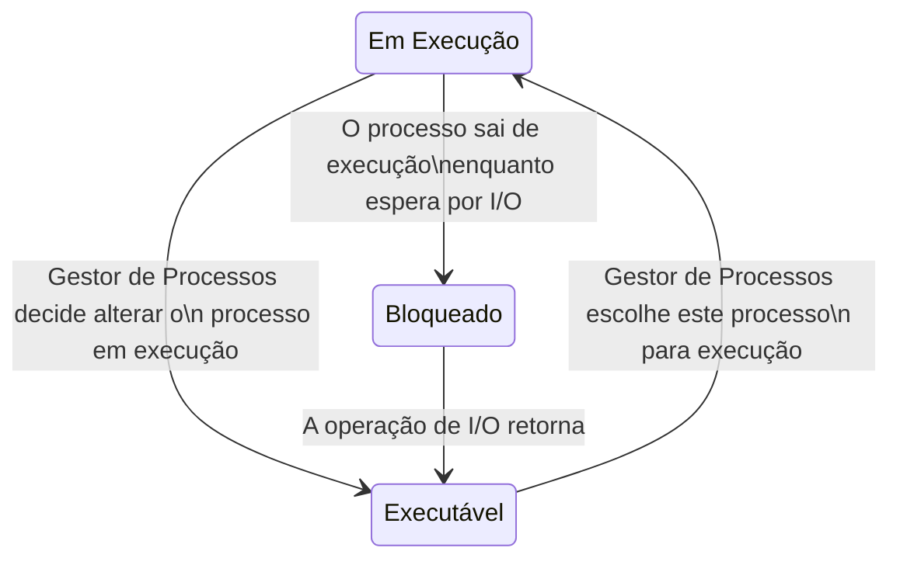
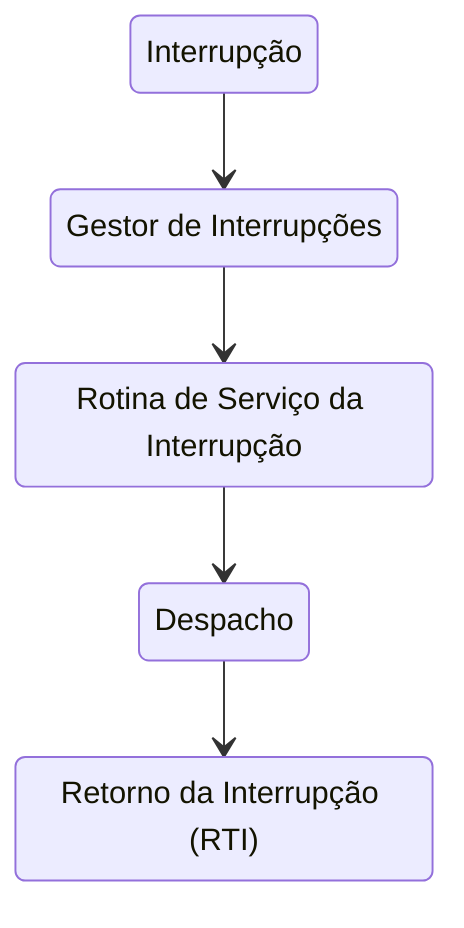
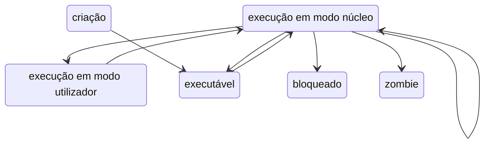

# Gestão de Processos

```toc

```

## Gestor de Processos

Sabemos por experiência própria que podemos ter dois ou mais processos a executar no nosso computador.
Mas como? O nosso processador apenas consegue executar uma instrução de cada vez.
Bem na realidade é isso que acontece: apenas é executada uma instrução de cada vez, mas o
[**Gestor de Processos**](color:green) vai alternando entre os vários processos de forma a dar a ilusão que estão
a ser executados concorrentemente.

O [**Gestor de Processos**](color:green) é uma entidade do núcleo (_kernel_) que, além
de efetuar a transição entre vários processos e tarefas (_threads_), é também responsável
pelo **tratamento de interrupções**, **otimização da gestão de recursos dos processos** (escalonamento, _scheduling_) e
da implementação das chamadas de sistemas relacionadas com processos e sincronização entre os mesmos
(como por exemplo a alteração da prioridade de um processos; veremos mais à frente o que isto significa).

## Processos e Tarefas

Para percebermos como é que o sistema operativo vai transitar entre vários processos,
temos de aprender como é que estes são representados no núcleo (_kernel_).

Quando trocamos o processo em execução, temos de guardar o contexto do processo
que estava em execução e substituí-lo pelo contexto do novo processo.
Um processo tem contexto tanto no [_hardware_](color:yellow) como no [_software_](color:pink).

No [_hardware_](color:yellow), tal como já vimos em IAC, existem **registos do processador**.
Os valores desses registos (acumulador, genéricos, _program counter_, _stack pointer_, _flags_ de estado, etc)
fazem parte do contexto do processo,
e têm de ser guardados/restaurados quando se troca o processo em execução.
Além disso, é preciso também guardar/restaurar os **registos da unidade de gestão de memória**.

Por outro lado, no [_software_](color:pink), é guardado _metadata_ sobre o processo em execução.
Informações como a **identificação do processo** (PID, utilizador, grupo, etc), a sua **prioridade**,
o seu **estado**, e muitas outras informações, como periféricos em uso, ficheiros abertos,
diretório por omissão, programa em execução, contabilização de recursos, _signals_ pendentes, etc).

### Ciclo de Vida Simplificado

Abaixo encontra-se um diagrama que mostra uma simplificação do ciclo de vida de um processo.



## Userland vs Kernelland

Quando estamos a executar um programa no nosso computador, este normalmente corre
no chamado [modo user (_userland_)](color:green), que não tem privilégios acrescidos.
Este não consegue aceder diretamente a periféricos, ficheiros, etc (depende da estrutura do sistema operativo).

No entanto, processos também podem ser executados no [modo núcleo (_kernelland_)](color:red), onde
têm todas as permissões. Apenas o código do sistema operativo pode ser executado neste modo.
Todas as atividades do modo núcleo são desencadeadas por interrupções.

Como vamos ver a baixo, a única forma que um utilizador pedir algo ao modo núcleo é com uma chamada de sistema (ou _syscall_), pois é a única interrupção que um utilizador pode causar.

## Interrupções

O núcleo _kernel_ é responsável por tratar de interrupções, que podem ocorrer por várias razões, tais como

- Hardware: relógio e periféricos (teclado, rato, etc)
- Software (_traps_): utilizadas pelos programas na _userland_ para pedir a algo cujo acesso requira privilégios (chamadas de sistema)
- Exceções: por exemplo exceções de aritmética (divisão por zero), acesso a memória indevido, etc

Mas como é que são tratadas as interrupções?



- **Interrupção**: É desencadeada uma interrupção. O contexto do processo em execução é guardado.
- **Gestor de Interrupções**: Identifica a interrupção (agulhagem).
- **Rotina de Serviço da Interrupção**: É feito o tratamento da interrupção.
- **Despacho**: Volta-se a colocar um processo em execução, e o seu contexto é carregado.
- **Retorno da Interrupção (RTI)**: Saída do modo núcleo (_kernelland_).

## Despacho

:::warning[Página em Construção]
A página encontra-se em construção, sendo que os conteúdos ainda não estão disponíveis.
:::

## Scheduling (Escalonamento)

Damos o nome de escalonamento (ou em inglês, _scheduling_) ao conceito de definir que processo é que tem acesso a que CPU em cada momento.
Para o nosso escalonamento ser o melhor possível, é necessário definir métricas para um bom escalonamento.
Estas podem ser:
- **Débito (throughput)**: maximizar número de _jobs_ por hora;
- **Turn around time**: minimizar tempo entre a submissão do _job_ e a obtenção do resultado;
- **Utilização de CPU**: maximizar percentagem de tempo de uso do processador;
- **Responsividade**: responder o mais rapidamente possível aos eventos desencadeados por utilizadores;
- **_Deadlines_**: Garantir que um certo _job_ acaba antes de um certo _deadline_;
- **Previsibilidade**: Importante, por exemplo, para conteúdos de multimédia.
// como é que se define exatamente o que é previsibilidade?

Vamos então analisar várias políticas de escalonamento, e ver quais as suas vantagens e desvantagens.
- _Round-Robin_: Pretende que todos os processos executáveis tenham acesso ao CPU ciclicamente.
Faz isso dispondo os processos executáveis numa FIFO. Sempre que o CPU está disponível, o elemento na frente da FIFO recebe o CPU durante um **quantum** ou **_time-slice_**. 
Isto é, nenhum processo será executado (de seguida) mais do que um dado período de tempo consecutivo. 
O processo perde o CPU quando o seu quantum acaba, quando chama uma _syscall_ que o bloqueia ou quando termina.
Se ainda não tiver terminado, o processo é reinserido no fim da FIFO (se o processo ficar bloqueado depois de perder o CPU, só é inserido depois de se voltar a tornar executável).
Esta política tem a desvantagem de poder causar elevados tempos de resposta, principalmente em situações de congestionamento.
Nomeadamente, se houver processos que exijam muito CPU, e outros que sejam mais I/O intensivos, devemos dar mais prioridade aos do segundo tipo (pois são pouco exigentes do CPU e necessitam de resposta rápida).
- Multi-lista: É guardada uma multi-lista, em que cada lista tem processos com uma dada __prioridade__. 
Processos mais prioritários recebem CPU primeiro. A prioridade de um processo pode ser fixa ou dinâmica
Note-se que um sistema que apenas prioridades fixas sujeita-se a que os processos menos prioritários nunca recebam CPU, 
enquanto que prioridades dinâmicas permitem ir tornando os processos que não recebem CPU à mais tempo mais prioritárias.
Esta política permite ainda atribuir quantum diferentes a prioridades diferentes.
- **Preempção**: O conceito de preempção consiste em retirar o CPU ao processo em execução logo que haja um mais prioritário. 
Isto permite melhorar o tempo de reação a processos mais prioritários. No entanto, havendo um influxo frequente de processos mais prioritários, 
pode dar lugar a mudanças frequentes de contexto, que "desperdiçam" tempo de CPU que podia ser usado nos processos.
É então aplicada **pseudo-preempção**: o processo perde o CPU para o mais prioritário, apenas se já tiver utilizado o CPU durante um tempo mínimo.

Os escalonadores hoje em dia:
- usam multi-filas com prioridades dinâmicas e fixas;
- são pseudo-preemptivos com quantum variável;
- atuam sobre tarefas e não processos (sendo um processo um conjunto de uma ou mais tarefas).

Note-se que tudo o que foi falado até aqui só diz respeito a escalonamento para um só processador.
Em processadores _multi-core_, o gestor de processos deve ter mais preocupações, como por exemplo, 
manter tarefas respetivas ao mesmo processo no mesmo CPU, mas também manter uma carga balanceada pelos vários _cores_.
Políticas respetivas a esta gestão não são abordadas nesta cadeira.

### Gestor de Processos no Unix

**Contexto dos processos em Unix**

Em Unix, o contexto dos processos é dividido em duas estruturas:

- A estrutura [proc](color:orange), que contêm a informação do processo que tem de estar disponível (em RAM),
mesmo quando o processo não está em execução, nomeadamente, informação necessária para o escalonamente e funcionamento de signals.
-- `p_stat` - estado do processo;
-- `p_pri` - prioridade do processo;
-- `p_sig` - sinais enviados ao processo;
-- `p_time` - tempo que está em memória;
-- `p_cpu` - tempo de utilização;
-- `p_pid` - identificador do processo;
-- `p_ppid` - identificador do pai do processo.

- A estrutura [u (user)](color:yellow), que contêm a restante informação que só é necessária quando o processo está em execução, 
podendo estar em disco quando o processo não está em execução.
-- registos do processador;
-- pilha do núcleo;
-- códigos de proteção (uid, gid)
-- referência ao directório corrente e por omissão;
-- tabela de ficheiros abertos;
-- apontador para a estrutura proc;
-- parâmetros da função sistema em execução.

A existência destas duas estruturas era principalmente relevante nas primeiras versões do Unix, que corriam em máquinas com 50KB de RAM.

**Diagrama de Estados do Unix** (ligeiramente simplificado)


**Escalonamento em Unix**

Em Unix há dois tipos de prioridades:

- Prioridades para processos em modo utilizador: 
-- vão de 0 (mais prioritário) a N (menos prioritário);
-- calculadas dinamicamente em função do tempo de processador utilizado;
-- escalonamento (quase) preemptivo.
- Prioridades para processos em modo núcleo:
-- têm valores negativos (quanto mais negativo, mais prioritário);
-- são fixas, consoante o acontecimento que o processo está a tratar;
-- são sempre mais prioritárias que os processos em modo utilizador.

As prioridades do utilizador seguem o seguinte algoritmo:
- o CPU é sempre atribuido ao processo mais prioritário durante um quantum de 100ms (5 "ticks" do relógio);
- _Round-Robin_ entre os processos mais prioritários;
- A cada segundo (50 "ticks) as prioridades são recalculadas de acordo com a seguinte fórmula:

Prioridade = PrioridadeBase + TempoProcessador/2
TempoProcessador = TempoProcessador/2

Isto permite ir "esqucendo" progressivamente os usos mais antigos do CPU.

O Unix suporta ainda as seguintes chamadas de sistema:
- `nice(int val)`: decrementa a prioridade val unidades. Apenas superutilizador pode invocar com val negativo (isto é, tornar o processo mais prioritário);
- `getpriority(int which, int id)`: retorna prioridade de um processo ou grupo de processos;
- `setpriority(int which, int id, int prio)`: altera prioridade do processo ou grupo de processos.

O Gestor de Processos em Unix recalcula a prioridade de todos os processos a cada segundo, pelo que é pouco eficiente quando há muitos processos.

### Gestor de Processos no Linux

O Gestor de Processos em Linux divide o tempo em épocas. Uma época acaba quando todos os processos usaram o seu quantum disponível ou estão bloqueados. No início de cada época, é atribuido a cada processo um quantum e uma prioridade da seguinte forma:

quantum\_esta\_epoca = quantum\_base + quantum\_por\_usar\_epoca\_anterior / 2
prio\_esta\_epoca = prio\_base + quantum\_por\_usar\_epoca\_anterior - nice

Sendo que o valor do quantum pode ser mudado com chamadas de sistema.

Ao contrário do Unix, as prioridades mais importantes são as com valor mais elevado. No entanto, tal como no Unix, o processo mais prioritário é sempre escolhido primeiro.

### Completely Fair Scheduler (CFS)

O CFS é o _scheduler_ usado desde 2007 pelo Linux. Cada processo tem um atributo **_vruntime_** que representa o tempo cumulado de execução em modo utilizador do processo. 
Quando o processo perde CPU, o seu _vruntime_ é incrementado com o tempo executado nesse quantum. 
Temos que o processo mais prioritário é o com _vruntime_ mínimo. Um novo processo entra com _vruntime_ igual ao mínimo entre o _vruntime_ dos processos ativos. 
Os processos são guardados numa _red-black tree_ ordenada por _vruntime_, que permite encontrar o processo mais prioritário em O(log n) em vez de O(n).
É ainda possível definir prioridades estáticas superiores às dinâmicas (modo utilizador) em contexto _real-time_ ("_soft_", no sentido que não é 100% _real-time_). Para isto, são necessários privilégios de núcleo.

## Operações asseguradas pelo Gestor de Processos

### fork()

A operação fork() reserva uma entrada na tabela `proc` (Unix), verifica se o utilizador não excedeu o número máximo de subprocessos e atribui um valor ao `pid` (normalmente um incremento de um inteiro mantido pelo núcleo). 
De seguida, copia o contexto do processo pai: como a região de código é partilhada, apenas é incrementado o contador do número de utilizadores que acedem a essa região, as restantes regiões são copiadas.
Finalmente, é retornado o `pid` do novo processo ao processo pai, e zero ao filho (esses valores são colocados nas pilhas respetivas).

// inserir imagem no slide 67

### exit()

- fechar todos os ficheiros;
- libertar directório corrente;
- libertar regiões de memória;
- actualizar ficheiro com registo da utilização do processador, memória e I/O;
- enviar signal death of child ao processo pai (por omissão é ignorado);
- manter filho no estado zombie, até ser encontrado pelo pai (permite que o pai encontre informação sobre a terminação do filho).

### wait()

- procura filho zombie:
-- se não há filho zombie, pai fica bloqueado;
-- se não há filhos, a funçao retorna imediatamente;
- pid do filho e estado do exit são returonados através do wait;
- liberta a estrutura `proc` do filho.

### exec()

A funçao exec executa um novo programa no âmbito de um processo já existente:
- verifica se o ficheiro existe e é executável;
- copia argumentos da chamada exec da pilha do utilizador para o núcleo (pois o contexto utilizador irá ser destruído);
- liberta as regiões de dados e pilha ocupadas pelo processo e eventualmente a região de texto (se mais nenhum processo a estiver a usar);
- reserva novas regiões de memória;
- carrego o ficheiro de código executável;
- copia os argumentos da pilha do núcleo para a pilha do utilizador.

O processo fica no estado executável e o contexto software do mesmo mantém-se inalterado.

### signal()

Se o processo tem rotina de tratamento associada ao signal, o núcleo regista no contexto do processo que o signal ocorreu.
Antes do processo receber de novo execução, o despacho salta para a rotina de tratamento do signal.

### pthread\_mutex

Fechar e abrir mutex's são chamadas de sistema. O núcleo mantém o estado de cada trinco, bem como uma lista de tarefas bloqueadas por esse trinco.

//TODO
