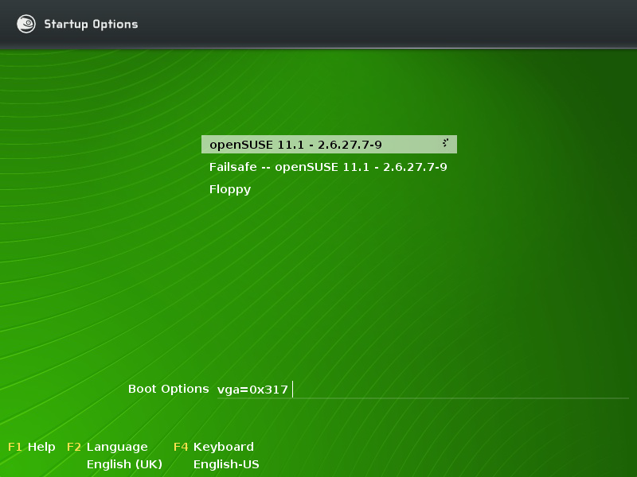

Gestão de Memória
Parte I - mecanismos
Sistemas Opera+vos
2021 / 2022

Espaço de Endereçamento
- Conjunto de posições de memória que um 
processo pode referenciar
- E se referenciar outras posições de memória?
  - HW de gestão de memória desencadeia excepção
  - Tratada pelo SO (tipicamente termina processo)

Hierarquia de Memória
- Memória principal (física ou primária):
  - tempo de acesso reduzido
  - bom desempenho com acessos aleatórios
  - custo elevado à reduzida dimensão
  - informação volátil
  - RAM + caches [ + registos ]
- Memórias secundárias (ou de disco):
  - tempo de acesso elevado
  - pior desempenho com acessos aleatórios (entre blocos
diferentes)
  - custo reduzido à mais abundante
  - informação persistente

Gestão de Memória   - Obje:vos
- Gerir o espaço de endereçamento dos 
processos
  - assegurar que cada processo dispõe da memória 
que precisa
  - garantir que cada processo só acede à memória a 
que tem  direito (protecção)
  - optimizar desempenho dos acessos

Espaço de Endereçamento Virtual
Memória auxiliar
Espaço 
Virtual do 
processo A
Espaço 
Virtual do 
processo B
Espaço 
Virtual do 
Processo C
Memória física

Endereços Reais vs. Virtuais
b) Memória Virtual
a) Memória Real
Espaço  de  
endereçamento 
virtual
Memória Física
Unidade de  
gestão da 
memória
Espaço  de 
endereçamento 
visto  pelo  
programa
Memória Física

Endereçamento Virtual
- Espaço de endereçamento dos processos não 
linearmente relacionado com a memória física
- Endereços virtuais são sempre convertidos (pela UGM) 
para endereços reais
- Para minimizar a informação necessária à conversão, a 
memória virtual é logicamente dividida em blocos 
contíguos:
  - Endereço virtual = (bloco, deslocamento)
- Dois tipos de blocos:
  - Segmentos - dimensão variável.
  - Páginas - dimensão constante.
- Alguns blocos podem não residir em memória principal

Princípio da Localidade de Referência
- Em que consiste?
- Porque mo:vo torna a gestão em blocos 
eficiente?

Fragmentação
- Interna
  - Memória desperdiçada dentro de um bloco em 
memória
- Externa
  - Memória desperdiçada entre blocos em memória

Segmentação
- Divisão dos programas em segmentos lógicos que 
reflectem a sua estrutura funcional:
  - roInas, módulos, código, dados, pilha, etc.
  - conversão de endereços virtuais linear em cada segmento
  - o programador pode ter que se preocupar com a gestão de 
memória quando escreve um programa
- Segmento é a unidade de:
  - carregamento em memória (eficiência)
  - proteção
- Dimensão dos segmentos: limitada pela arquitetura e 
não pode exceder a dimensão da memória principal

P
Prot
Limite
Base
+
BTS
Segmento
Deslocamento
+
Deslocamento
Limite
Endereço virtual
Memória principal
Tabela de segmentos
BTS
LTS
Base
Tradução de Endereços Virtuais em 
Memória Segmentada
BTS e LTS:
-
Registos da 
UGM
-
Atualizados 
pelo OS… 
quando?

Memória Virtual Segmentada
- Proteção:
  - verificação de limites de endereçamento intra-
segmentos
  - verificação e limitação dos Kpos de acesso ao 
segmento: leitura, escrita e execução
  - processos diferentes têm tabelas de segmentos 
diferentes: espaços de endereçamento disjuntos e 
inacessíveis a terceiros
- Pode sofrer de fragmentação? De que :po?

Paginação
- Blocos de tamanho fixo, chamados páginas
- https://www.youtube.com/watch?v=-
3Rt2_9d7Jg

R
Prot
Base
+
BTP
Página
Deslocamento
Endereço virtual
Tabela de Páginas
P
M
Base
Deslocamento
Endereço real
Memória principal
Base
BTP
LTP
Tradução de Endereços Virtuais em 
Memória Paginada

Paginação: consequências
- Espaço de endereçamento virtual linear, i.e., 
conRguo:
  - o programador não “vê” a gestão de memória
- Segmentos lógicos do espaço de endereçamento
passam a ser compostos por múlKplas páginas
  - Passa a ser possível um segmento lógico estar
parcialmente presente
  - Se uma instrução do processador aceder a endereços em 
mais que uma página, a instrução pode encontrar uma 
falta de página a meio da execução
- As instruções do processador têm de ser recomeçáveis

Qual a dimensão certa para as 
páginas?
- A dimensão das páginas (constante) é 
normalmente muito menor que a da memória 
principal e influencia:
  - A fragmentação
- Externa ou interna?
  - O número de faltas de páginas
  - Tempo da sua resolução (transferência)
  - A dimensão das tabelas de páginas e listas de 
páginas mantidas pelo sistema operativo
- Valor típico hoje em dia: 4 Kbytes

Memória Virtual Paginada (cont.)
- Protecção:
  - Verificação dos tipos de acesso: leitura, escrita e 
execução.
  - Processos diferentes têm tabelas de páginas
diferentes: espaços de endereçamento disjuntos e 
inacessíveis a terceiros

Equipa UGM/núcleo do SO
- A maioria dos acessos a memória são 
traduzidos e servidos pela UGM
  - Se processo está em modo uKlizador, mantém-se 
nesse modo
- Núcleo só se envolve na tradução nestes 
momentos:
  - Quando comuta para outro processo
  - Quando página acedida não está presente
  - Quando acesso é ilegal (endereço fora dos limites 
ou sem permissões)

Como o:mizar a tradução de 
endereços?

Tabela de Tradução de Endereços 
(Translation Lookaside Buffer, TLB)
R
Prot
Base
+
BTP
Página
Deslocamento
Endereço virtual
Tabela de Páginas
P
M
Base
Deslocamento
Endereço real
Memória principal
Base
BTP
LTP
TLB

Sistemas Opera4vos   - DEI - IST
TLB
 
Bits da página 
são  enviados 
para o TLB 
S 
N 
S 
N 
Comparação 
Acesso à  
tabela de  
páginas 
Página  
presente? 
Actualizar  
TLB 
Concatenar  
base e 
deslocamento 
Trazer 
página
de memória 
secundária

Sistemas Opera4vos   - DEI - IST
TLB (1/2)
- O ideal seria guardar na TLB não as últimas, mas as 
próximas páginas a que o programa irá aceder. 
- Como isso é impossível de prever:
  - toma-se o funcionamento recente do programa como uma 
boa previsão para o que ele fará no futuro próximo. 
  - se um programa acedeu a uma página, é expectável que os 
próximos acessos sejam dentro da mesma página. 

Sistemas Opera4vos   - DEI - IST
TLB (2/2)
- A dimensão destas tabelas é pequena, em geral (64, 
128 entradas), pois o seu custo é elevado:
  - a sua dimensão é cuidadosamente testada de forma a
obter percentagens de sucesso muito elevadas (90-95%)
  - um factor que também influencia a dimensão da TLB é o 
quantum dos processos. 
  - a TLB é limpa em cada comutação de processos
  - quanto maior for o quantum, maior é o número de 
páginas acedidas, o que leva à necessidade de ter mais 
entradas na TLB.

Sistemas Opera4vos   - DEI - IST
Quanto ocupa a tabela de páginas?
- Assumindo endereços de 64 bits e páginas de 4 Kbytes, 
quantas páginas pode ter o espaço de endereçamento 
de um processo?
  - 264/212=252 páginas
- Assumindo que cada entrada na tabela de páginas 
(PTE) ocupa 4bytes, qual a dimensão da tabela de 
páginas?
  - 22*252=254 bytes=16 Petabytes
- Irrealista assumir que tabela de páginas caberá sempre 
em memória primária!
 
Tabela de páginas  
de nível 1 
Pilha vai  
crescendo 
(4 Mbytes)  
Dados vão  sendo alocados e libertados 
dinamicamente (8b Mbytes) 
Espaço de endereçamento virtual do processo (blocos cinzentos estão ocupados; blocos 
brancos estão livres) 
Tabela de páginas de nível 2 
que traduz os endereços 
ocupados pelo código 
Tabela de páginas de nível 2 
que traduz os endereços 
ocupados pelos dados 
Tabela de páginas de nível 2 
que traduz os endereços 
ocupados pela pilha 

Sistemas Opera4vos   - DEI - IST
Uma solução: 
Tabelas de Páginas Mul:-Nível
 
pt1  
pt2  deslocamento  
Tabela de páginas  
de nível 1 
1023 
0 
Página 
Endereço virtual 
0 
1023 
0 
1023 
Tabelas de páginas  
de nível 2 
-
Vantagem: apenas estão 
em memória as tabelas de 
páginas correspondentes 
às páginas que estão de 
facto a ser utilizadas pelo 
processo correspondente

Sistemas Opera4vos   - DEI - IST
Uma solução: 
Tabelas de Páginas Multi-Nível
 
Tabela de páginas  
de nível 1 
Pilha vai  
crescendo 
(4 Mbytes)  
Dados vão  sendo alocados e libertados 
dinamicamente (8b Mbytes) 
Espaço de endereçamento virtual do processo (blocos cinzentos estão ocupados; blocos 
brancos estão livres) 
Tabela de páginas de nível 2 
que traduz os endereços 
ocupados pelo código 
Tabela de páginas de nível 2 
que traduz os endereços 
ocupados pelos dados 
Tabela de páginas de nível 2 
que traduz os endereços 
ocupados pela pilha 

Sistemas Opera4vos   - DEI - IST
Aproveitar a memória virtual 
para outros fins desejáveis

Sistemas Opera4vos   - DEI - IST
Partilhar memória entre processos
- Basta ter, nas tabelas de páginas dos 
processos em causa, PTEs com a mesma base
- Os segmentos/páginas (virtuais) partilhados 
não precisam ser mapeados nos mesmos 
endereços virtuais em ambos os processos
- Consequências?

Sistemas Opera4vos   - DEI - IST
O:mizar a cópia de memória na 
criação de processo
 
Tabela de páginas  
do processo filho 
R 
Prot Base 
P 
M 
Memória principal 
R 
Prot Base 
P 
M 
Página   
partilhada 
Página   
partilhada 
Tabela de páginas  
do processo pai 

Sistemas Opera4vos   - DEI - IST
Criação de um Processo
- fork: duplica os segmentos de código, dados e 
pilha do pai
- Mas não é feita nenhuma cópia  física de 
memória no momento do fork!
- As páginas só são copiadas se e quando tal for 
necessário
  - Copy on write

Sistemas Opera4vos   - DEI - IST
Copy on write (I)
- Quando ocorre o fork:
  - Aloca nova tabela de páginas para o processo filho
e copia o conteúdo da tabela do pai
  - Nas PTEs com permissão de escrita (dados e 
pilha), retira permissão de escrita e ativa bit CoW
- Na tabela do pai e do filho
Isto chega para suportar acessos às páginas
imutáveis (como as páginas de código)…
…E então as páginas modificáveis?

Sistemas Opera4vos   - DEI - IST
Copy on write (II)
- Quando pai ou filho tentam escrever numa página 
partilhada por CoW, ocorre excepção
  - Pois não há permissão de escrita na PTE
- Núcleo acorda e:
  - Aloca nova página e copia para lá o conteúdo da página 
partilhada
  - Atualiza a  PTE do processo onde ocorreu a excepção com:
- A base (endereço físico) da nova página
- Permissão de escrita ativada, CoW desativado
  - Caso a página original já só seja referenciada por um 
processo, atualiza a sua PTE também:
- Permissão de escrita ativada, CoW desativado

Sistemas Opera4vos   - DEI - IST
Tratamento do Copy on Write
Page 828 Valid, Copy on Write
Page Table Entry   - Proc A
(a) Before Proc B Incurs Protection Fault
Page 828 Valid, Copy on Write
Page Table Entry   - Proc B
Page 828 Valid, Copy on Write
Page Table Entry   - Proc C
Page 828 Valid, Copy on Write
Page Table Entry   - Proc A
Page 786 Valid
Page Table Entry   - Proc B
Page 828 Valid, Copy on Write
Page Table Entry   - Proc C
Page Frame 828
Ref Count 3
Page Frame 828
Ref Count 2
Page Frame 786
Ref Count 1

Sistemas Opera4vos   - DEI - IST
TPC:
Ver no livro como os mecanismos 
de paginação e segmentação são 
usados no Unix/Linux

Sistemas Opera4vos   - DEI - IST
Unix e Linux

Sistemas Opera4vos   - DEI - IST
Unix: primeiras versões
- Primeiras implementações (até versão 7) executavam-
se no PDP-11:
  - arquitectura segmentada com 16 bits
  - espaço de endereçamento de 64 Kbytes, dividido em oito 
segmentos de 8 Kbytes cada 
- Gestão de memória muito simples:
  - Processos carregados na sua totalidade em memória
  - caso não houvesse espaço disponível em memória, o 
sistema operativo transferia para memória secundária os 
processos que estivessem bloqueados ou com menor 
prioridade
  - A transferência de processos era feita por um processo 
denominado swapper

Sistemas Opera4vos   - DEI - IST
Unix: versões atuais
- Principalmente sobre arquitecturas paginadas
  - A versão Unix 3 BSD foi a primeira a suportar 
memória virtual paginada tal como a conhecemos 
hoje
- Na evolução introduzida pelo Unix V:
  - espaço de endereçamento dividido em três 
regiões: código, dados e pilha. 
  - novas regiões podem ser criadas dinamicamente 
durante a execução dos programas
  - Cada região contém tabela de páginas própria

Sistemas Opera4vos   - DEI - IST
- Tabelas de páginas 
mulKnível com três 
níveis 
- Tabela de mais alto 
nível é designada por 
Page Global Directory 
(PGD)
- Tabelas de nível 
intermédio são 
designadas por Page 
Middle Directory (PMD) 
Linux
Deslocamento 
na PDG
Deslocamento na
tabela de páginas
Deslocamento 
na página
Início PGD
+
+
+
+
PGD
PMD
Tabela  de 
páginas
Página
Endereço 
virtual
Endereço  
real
PAGE_SHIFT
PMD_SHIFT
PGDIR_SHIFT
Deslocamento  
na PMD

