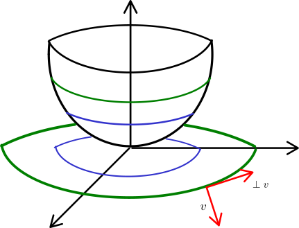
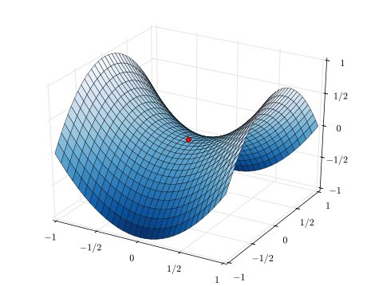

# Conjunto de Nível

[[toc]]

## Curvas de Nível

Tomando uma função escalar, $f: D \subseteq \R^n \to \R$ e $a \in D, h \in \R^n$.
Suponha que $f$ é diferenciável em $a$.
Então,

$$
\frac{\partial f}{\partial v} (a)=J^{f}_{a} v=\nabla f( a) \cdot v=||\nabla f( a) ||\cdot ||v||\cdot \cos\overset{\land }{( \nabla f( a) ,v)}
$$

pois podemos chamar à Jacobiana de uma função escalar, o [gradiente](0004-diferenciabilidade.md#gradiente-de-uma-funcao), $\nabla f(a)$, da função.

Se $||v|| = 1$, então $\frac{\partial f}{\partial v} (a) = ||\nabla f( a) ||\cdot \cos\overset{\land }{( \nabla f( a) ,v)}$, ou ainda
$v=\frac{\nabla f(a)}{|| \nabla f(a)||}$.

Podemos concluir duas coisas:

- Quando nos afastamos de $a$ no sentido de $\nabla f (a)$, a função tem variação máxima.
- Quando $\cos\overset{\land }{( \nabla f( a) ,v)}= 0$ (ou seja $v \perp \nabla f(a)$), a função "não varia localmente", dando origem a **curvas de nível**.

O gradiente dá a direção e sentido segundo os quais se dá a variação máxima da função.

::: tip
Para funções diferenciáveis vetoriais $f: D \subseteq \R^n \to \R^m$
(portanto existem $f_i: D \subseteq \R^n \to \R$ diferenciáveis para $i = 1, 2, \dots, m$),
estas considerações são válidas para cada uma das $f_i$'s.
:::

::: details Exemplo

Seja $f(x,y) = x^2+xy$.
Obtendo o gradiente da função, podemos descobrir qual a direção a seguir para maximixar a variação da mesma.

$$
\begin{darray}{c}
\nabla f (x,y) = \left(\frac{\partial f}{\partial x} (x,y) \frac{\partial f}{\partial y} (x,y)\right) = (2x+y, x)\\\\
\nabla f(1,1) = (2\cdot 1 + 1, 1) = (3,1)
\end{darray}
$$

Em $(1,1)$ devo afastar-me no sentido $(3,1)$ para sentir a variação máxima da função junto a $(1,1)$.

Por outro lado para não sentir variação de $f$ junto a $(1,1)$, calcula-se o vetor perpendicular,
$(3,1) \cdot (v_1,v_2) = 3v_1 + v_2 \implies v=(1, -3)$.  
Assim, ao me afastar de $(1,1)$ no sentido $(1,-3)$, a função não varia localmente.

:::

## Conjunto de Nível (Generalização)

Os conjuntos de nível são a generalização das curvas de nível a $dim > 2$.

::: tip DEFINIÇÃO

Seja $f: D \subseteq \R^n \to \R$ e $k \in \R$,  
define-se o conjunto de nível de $f$ de valor $k$ como

$$
N(k) = \{x\in D: f(x) = k\}
$$

Podemos dar nomes concretos ao conjunto de nível, caso estejamos numa das dimensões:

- Se $n = 2$: curvas de nível
- Se $n = 3$: superfíceis de nível

:::

Se tomarmos como exemplo $f(x,y)=x^2-y^2$, podemos calcular as suas curvas de nível (conjuntos de nível),
de forma a obtermos um esboço do gráfico da função.

$$
\begin{darray}{l}
N(0) = \{(x,y) \in D: x^2-y^2= 0\} = \{(x,y) \in D: x^2=y^2\} =\\
= \{(x,y) \in D: y=x \lor y=-x\}\\
\\
N(1) = \{(x,y) \in D: x^2-y^2 = 1\} \implies y= \pm \sqrt{x^2-1}\\
\\
N(-1) = \{(x,y) \in D: x^2-y^2=-1\} \implies y= \pm \sqrt{x^2+1}
\end{darray}
$$

Podemos visualizar as curvas de nível que acabámos de calcular no plano:

Podemos continuar a calcular as curvas de nível $N(k)$ e $N(-k)$, com $k > 0$, de forma a obtermos uma melhor ideia da função.

### Ponto de Sela

A este fenómeno, em que a derivada é nula mas não é nem um máximo nem um mínimo da função, chamamos **ponto de sela**[^saddle-point]:

[^saddle-point]: [Saddle Point na Wikipedia](https://en.wikipedia.org/wiki/Saddle_point)

Também podemos pensar que ao longo de uma direção a função cresce, e ao longo de outra decresce.

---

Slides:

- [Aula 11](https://drive.google.com/file/d/1gmfl3glC8lIOvPEvZdrrv5RH_yTMhpTW/view?usp=sharing)
