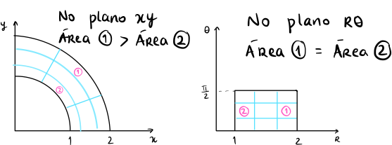
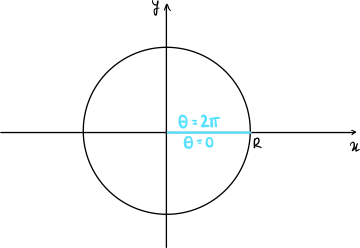

# Mudança de Variáveis de Integração

[[toc]]

## Transformação de Coordenadas

Se quisermos efetuar uma mudança de variável num integral em $\R^n$,
precisamos de compensar a nossa alteração,
[tal como fazíamos em $\R$](https://www.notion.so/diogocorreia/Primitiva-o-por-substitui-o-540b2c1b4ebb48f293a9b8dc3856f71f).

::: tip DEFINIÇÃO

Sendo:

- $g: U \subset \R^n \to V \subset \R^n$, com $U,V$ abertos
- $g$ é injetiva
- $g$ é de classe $C^1$
- $det D_g \ne 0$
- $(x_1, \dots, x_n) = g(y_1, \dots, y_n)$

Temos que:

$$
\int_V f(x_1,\dots,x_n) \d x_1 \dots \d x_n = \int_U f(g(y_1,\dots,y_n))|\det Dg| \d y_1 \dots \d y_n
$$

:::

Para isso, multiplicamos o nosso integral pelo {orange}(**determinante da derivada da função**) que representa a nossa mudança de variável.

$$
\d x \d y = |\det D\varphi (x', y')| \d x' \d y'
$$

Por exemplo, considerando {purple}($\varphi(r,\theta) = (r\cos \theta, r \sin \theta)$), temos que

$$
D\varphi (r,\theta)=
\begin{bmatrix}
\cos \theta & -r \sin \theta\\
\sin \theta & r \cos \theta
\end{bmatrix}
$$

$$
|\det D\varphi (x', y')| = | r\cos^2 \theta + r \sin^2 \theta | = r
$$

$$
\d x \d y = |\det D\varphi (r, \theta)| \d r \d \theta = r \d r \d \theta
$$

## Coordenadas Polares

{green}(**Coordenadas polares**) (em $\R^2$) são representadas através de um raio e um ângulo, em vez de $x$ e $y$.  
Isto permite-nos facilmente trabalhar com áreas curvas.

Tomando como exemplo:

$$
A = \{ (x,y) \in \R^2: 1\leq x^2+y^2 \leq 4 \quad,\quad x > 0, y> 0\}
$$

Podemos converter esta figura para {green}(**coordenadas polares**), o que nos dá um quadrado.

$$
\begin{cases}
x = r \cos \theta\\
y = r \sin \theta
\end{cases}
$$

$$
A=\{ 1 \leq r \leq 2, 0 < \theta < \frac{\pi}{2}\}
$$

Nas variáveis $(r, \theta)$,
$A = [1,2] \times ]0, \frac{\pi}{2}[$

No entanto, temos de ter atenção para não nos esquecermos de compensar esta mudança com o determinante da derivada,
que já foi calculado acima.

$$
|\det D \varphi (r, \theta)| = r
$$

E finalmente, calculamos a área da figura.

$$
\begin{aligned}
\int_A 1 \d x \d y &= \int^{\frac{\pi}{2}}_0 \int^2_1 1 \cdot r \d r \d \theta\\
&= \int^{\frac{\pi}{2}}_0 \left[\frac{r^2}{2} \right]^2_1 \d \theta\\
&= \int^{\frac{\pi}{2}}_0 \left(2- \frac{1}{2} \right) \d \theta\\
&= \frac{3}{2} \cdot \frac{\pi}{2}\\
&= \frac{3\pi}{4}
\end{aligned}
$$

::: details Exemplo - Calcular Área de um Círculo

Podemos usar as coordenadas polares para calcular a área de um círculo de raio $R$.

$$
\begin{cases}
x = r \cos \theta\\
y = r \sin \theta
\end{cases}
$$

$$|\det Dg| = r$$

Temos de verificar as várias condições para efetuar a mudança de variável.

- Inicialmente temos $0 \leq r \leq R$, $0 \leq \theta \leq 2\pi$
- $r = 0 \implies \det Dg = 0$, então tomamos $0 < r \leq R$
- Tomamos $0 < \theta < 2\pi$ para não ter problemas com a injetividade

$$
\begin{aligned}
\text{Área} &= \int_{\text{circulo}} 1 \d x \d y\\
&= \int_{]0,R] \times ]0, 2 \pi[} 1 \times r \d r \d \theta\\
&= \int^R_0\left(\int^{2\pi}_0 r \d \theta \right) \d r\\
&= \int^R_0 2\pi r \d r\\
&= \left[2 \pi \frac{r^2}{2} \right]^R_0\\
&= \pi R^2
\end{aligned}
$$

:::

## Coordenadas Cilíndricas

Em $\R^3$, podemos querer representar regiões de revolução por {yellow}(**coordenadas cilíndricas**),
em vez de $x$, $y$ e $z$.

A esta mudança de variável, estão associadas:

$$
(x,y,z) \to (r, \theta, z)
$$

$$
\begin{cases}
x = r \cos \theta\\
y = r \sin \theta\\
z = z
\end{cases}
\begin{array}{l l}
0 < \theta < 2\pi\\
r > 0
\end{array}
$$

$$
\begin{aligned}

\det Dg & = \det \begin{bmatrix}
\cos \theta & -r \sin \theta & 0\\
\sin \theta & r \cos \theta & 0\\
0 & 0 & 1
\end{bmatrix}\\
&= 1 \times \begin{vmatrix}
\cos \theta & -r \sin \theta\\
\sin \theta & r \cos \theta
\end{vmatrix}\\
&=r\cos^2 \theta + r \sin^2 \theta\\
&=r
\end{aligned}
$$

::: details Exemplo - Determinar Volume de um Cone

Tomando o cone definido por

$$
C = \left\{(x,y,z) \in \R^3: \sqrt{x^2+y^2} < z < h \right\}
$$

Vamos determinar o seu volume:

$$
\text{Volume} = \int_C 1 \d x \d y \d z
$$

Convertendo para {yellow}(**coordenadas cilíndricas**):

$$
\begin{cases}
x = r \cos \theta\\
y = r \sin \theta\\
z = z
\end{cases}
\quad
\begin{array}{l l}
x^2 + y^2 = r^2\\
r < z < h
\end{array}
$$

$$
\begin{array}{l l l l l}
0 < z < h & , & 0 < \theta < 2\pi & , & 0 < r < z
\end{array}
$$

Então temos:

$$
\begin{aligned}
\text{Volume} &= \int^h_0\left(\int^{2\pi}_0\left(\int^z_0 1\cdot r \d r\right) \d \theta\right) \d z\\
&=\int^h_0 \left(\int^{2\pi}_0 \left[\frac{\pi^2}{2}\right]^z_0 \d \theta\right) \d z\\
&=\int^h_0 \left( \int^{2\pi}_0 \frac{z^2}{2} \d \theta\right) \d z\\
&=\int^h_0 2\pi \times \frac{z^2}{2} \d z\\
&=\int^h_0 \pi z^2 \d z\\
&=\left[\pi \frac{z^3}{3} \right]^h_0\\
&=\frac{\pi h^3}{3}
\end{aligned}
$$

:::

## Coordenadas Esféricas

Em $\R^3$, podemos querer representar esferas por {pink}(**coordenadas esféricas**),
em vez de $x$, $y$ e $z$.

- $r$ é a distância à origem
- $\varphi$ é o ângulo que o vetor faz com o eixo dos $zz$
- $\theta$ éo ângulo entre o semi-eixo positivo dos $xx$ e a projeção do vertor no plano $Oxy$

Podemos então definir a transformação:

$$
\begin{cases}
x = r \sin \varphi \cos \theta\\
y = r \sin \varphi \sin \theta\\
z = r \cos \varphi
\end{cases}
$$

$$
\begin{array}{l l l l l l l}
r > 0 & , & 0 < \varphi < \pi & , & 0 < \theta < 2\pi & , & g=g(r,\pi,\varphi)
\end{array}
$$

$$
|\det Dg| = r^2 \sin \varphi
$$

::: details Demonstração

$$
\begin{aligned}
\det Dg &= \det \begin{bmatrix}
\sin \varphi \cos \theta & -r \sin \varphi \sin \theta & r \cos \varphi \cos \theta\\
\sin \varphi \sin \theta & r \sin \varphi \cos \theta & r \cos \varphi \sin \theta\\
\cos \varphi & 0 & -r \sin \varphi
\end{bmatrix}\\
&= \cos \varphi \begin{vmatrix}
-r \sin \varphi \sin \theta & r \cos \varphi \cos \theta\\
r \sin \varphi \cos \theta & r \cos \varphi \sin \theta
\end{vmatrix}\\
&\quad + (-r\sin \varphi) \begin{vmatrix}
\sin \varphi \cos \theta & -r \sin \varphi \sin \theta\\
\sin \varphi \sin \theta & r \sin \varphi \cos \theta
\end{vmatrix}\\
&= \cos \varphi ( -r^2 \sin \varphi \cos \varphi \sin^2 \theta - r^2 \sin \varphi \cos\varphi \cos^2 \theta)\\
&\quad + (-r\sin \varphi)(r \sin^2 \varphi \cos^2 \theta + r \sin^2 \varphi \sin^2 \theta)\\
&= -r^2 \sin \varphi \cos^2 \varphi - r^2 \sin \varphi \sin^2 \varphi\\
&= -r^2 \sin \varphi \ne 0
\end{aligned}
$$

:::

::: details Exemplo - Volume de uma Bola

Seja $C$ uma bola em $\R^3$ de raio $R$:

$$
C = \{ (x,y,z) \in \R^3: x^2+y^2+z^2 < R^2\}
$$

Vamos então calcular o seu volume:

$\text{Volume} = \int_C 1 \d x \d y \d z$

Convertendo para {pink}(**coordenadas esféricas**), com $r^2 < R^2$:

$$
\begin{array}{l l l l l}
0 < \theta < 2\pi & , & 0 < \varphi < \pi & , & 0 < r < R
\end{array}
$$

E, finalmente, calculando o volume:

$$
\begin{aligned}
\text{Volume} &= \int^{2\pi}_0 \left( \int^\pi_0 \left(\int^R_0 1 \cdot r^2\sin \varphi \d r\right) \d \varphi\right) \d \theta\\
&= \int^{2\pi}_0 \left(\int^\pi_0 \left[\frac{r^3}{3} \sin \varphi \right]^{r=R}_{r=0} \d \varphi\right) \d \theta\\
&= \int^{2\pi}_0 \left(\int^\pi_0 \frac{R^3}{3} \sin \varphi \d \varphi\right) \d \theta\\
&= \int^{2\pi}_0 \left[- \frac{R^3}{3} \cos \varphi \right]^{\varphi = \pi}_{\varphi = 0} \d \theta\\
&= \int^{2\pi}_0 \frac{R^3}{3} - \left(-\frac{R^3}{3}\right) \d \theta\\
&= \int^{2\pi}_0 \frac{2R^3}{3} \d \theta\\
&= \frac{2R^3}{3} \times 2\pi\\
&= \frac{4\pi R^3}{3}
\end{aligned}
$$

:::

---

Slides:

- [Aula 22](https://drive.google.com/file/d/123sB1ctUsyl4rnA_0A8Yipk42RCJUlny/view?usp=sharing)
- [Aula 23](https://drive.google.com/file/d/1rROFDkvETJcWO_ZsGOzhS9SxLfIJjmUL/view?usp=sharing)
