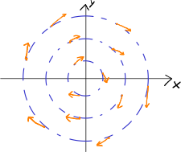

# Campos Vetoriais

[[toc]]

## Integral de Linha de Campo Vetorial

::: tip DEFINIÇÃO

Seja $C \subset \R^n$ uma curva parametrizada por $g: ]a, b[ \to \R^n$ e $F: C \to \R^n$

Definimos o seguinte:

$$
\int_C F \cdot \d g = \int^b_a F(g(t)) \cdot g'(t) \d t
$$

:::

Podemos alterar ligeiramente a expressão acima para obtermos outro resultado:

$$
\begin{aligned}
\int_C F \cdot \d g &= \int^b_a \underbrace{F(g(t)) \cdot \frac{g'(t)}{||g'(t)||}}_{\begin{subarray}{c}F \cdot \text{vetor tangente a}\\ C\ \text{com norma} = 1\end{subarray}} \cdot ||g'(t)|| \d t\\
&= \int_C F \cdot \vec{\text{t}}\text{angente} \d \gamma
\end{aligned}
$$

::: details Exemplos

Considerando a parametrização $g$ e o campo vetorial $F$,

$$
\begin{array}{lll}
g(t)=(t,t) & t \in [0, 1] & F(x,y) = (1,x)
\end{array}
$$

Então podemos calcular o integral:

$$
\begin{aligned}
\int_C F \cdot \d g &= \int^1_0 F(g(t)) \cdot g'(t) \d t\\
&= \int^1_0 (1,t) \cdot (1,1)\d t\\
&= \int^1_0 (1 + t) \d t\\
&= \left[t + \frac{t^2}{2} \right]^1_0\\
&= \frac{3}{2}
\end{aligned}
$$

---

Considerando a parametrização $h$ e o campo vetorial $F$,

$$
\begin{array}{lll}
h(t)=(t,t^2) & t \in [0, 1] & F(x,y) = (1,x)
\end{array}
$$

Então podemos calcular o integral:

$$
\begin{aligned}
\int_{C_2} F \cdot \d h &= \int^1_0 F(h(t)) \cdot h'(t) \d t\\
&= \int^1_0 (1,t) \cdot (1,2t) \d t\\
&= \int^1_0 (1 + 2t^2) \d t\\
&= \left[t + \frac{2t^3}{3} \right]^1_0\\
&= \frac{5}{3}
\end{aligned}
$$

:::

{green}(**Propriedades:**)

1. Se $g_1$ e $g_2$ são duas parametrizações da curva $C$ que percorrem a curva no mesmo sentido, o integral $\int_C F \cdot \d g_1 = \int_C F \cdot \d g_2$
2. Se $g_1$ e $g_2$ são duas parametrizações da curva $C$ que percorrem a curva em sentido contrário, o integral $\int_C F \cdot \d g_1 = - \int_C F \cdot \d g_2$
3. O valor do integral pode não depender só dos pontos inicial e final, mas também da curva

### Interpretação física

Seja $F$ um campo de forças e uma partícula a percorrer um caminho $C$.

Então, temos que $\int_C F \cdot \d g$ é o trabalho realizado por $F$.

### Segmento que une dois pontos

Por vezes, precisamos de considerar um caminho que une dois pontos.
Para isso, podemos considerar a seguinte parameterização.

Sejam, por exemplo, $(1,2,3)$ e $(4,5,6)$ os pontos que queremos considerar, a parameterização
será:

$$
\begin{aligned}
g(t) &= (1,2,3) + t((4,5,6) - (1,2,3))\\
&= (1,2,3) + t(3, 3, 3)\\
&= (1+3t, 2+3t, 3+3t), \quad t \in ]0, 1[
\end{aligned}
$$

## Campo Vetorial Conservativo

::: tip DEFINIÇÃO

Um campo vetorial cujo integral sobre qualquer curva depende só dos
extremos da curva diz-se **conservativo**.

:::

Um campo é conservativo se e só se o integral ao longo de qualquer curva fechada for 0.

::: details Exemplo

Seja $F$ constante, isto é, $F = (F_1, \dots F_n)$ fixo

$$
\begin{aligned}
\int_C F \cdot \d \gamma &= \int^b_a F \cdot g'(t) \d t\\
&= \int^b_a (F_1 g_1'(t) + \dots F_n g_n'(t)) \d t\\
&= F_1 \int^b_a g'(t) \d t + \dots + F_n \int^b_a g_n'(t) \d t\\
&= F_1 [g_1(b) - g_1(a)] + \dots + F_n [g_n(b) - g_n(a)]\\
&= F \cdot (g(b) - g(a))\\
&= F\cdot (B-A)
\end{aligned}
$$

O valor do integral só depende dos extremos da curva, pelo que $F$ é {green}(**conservativo**).

:::

Se $C$ for uma curva fechada, escreve-se $\int_C F \d g$ como $\oint_C F \d g$.

Assim temos que, para qualquer curva fechada, ser um campo conservativo é
equivalente a $\oint_C F \d g = 0$.

**Um campo conservativo é sempre um [campo gradiente](#campo-gradiente) e vice-versa.**

## Teorema Fundamental do Cálculo para Integrais de Linha

::: tip TEOREMA

Seja $\phi : \R^n \to \R, C^1$ e uma curva $C$ com extremos $A$ e $B$, parametrizada
por $g: [a,b] \to \R^n$, então

$$
\int_C \nabla \phi \d g = \phi(B) - \phi(A)
$$

:::

::: details Demonstração

$$
\begin{aligned}
\int_C \nabla \phi \d g &= \int^b_a \nabla \phi (g(t)) \cdot g'(t) \d t\\
&= \int^b_a \frac{\d}{\d t}(\phi \circ g)(t) \d t\\
&= (\phi \circ g)(b) - (\phi \circ g)(a)\\
&= \phi(g(b)) - \phi(g(a))\\
&= \phi(B) - \phi(A)
\end{aligned}
$$

:::

{purple}(**Corolário 1:**) Se $\phi: \R^n \to \R$, $C^1$, então $\nabla \phi$ é conservativo e $\nabla \phi: \R^n \to \R^n$

{pink}(**Corolário 2:**) Se $\phi: \R^n \to \R$, $C^1$, e $C$ for uma curva fechada ($B = A$, ou seja, o ponto inicial é o mesmo que o ponto final)
então $\int_C \nabla \phi \d \gamma = 0$

## Campo Gradiente

::: tip DEFINIÇÃO

Dado um campo vetorial $F: \R^n \to \R^n$, **se existir** $\phi: \R^n \to \R$, $C^1$ tal que $\nabla \phi = F$,
isto é, $\phi$ é um potencial de $F$, dizemos que que $F$ é um **campo gradiente**.

:::

**Um campo gradiente é sempre um [campo conservativo](#campo-vetorial-conservativo) e vice-versa.**

Segundo o [Teorema Fundamental do Cálculo](#teorema-fundamental-do-calculo-para-integrais-de-linha),
concluímos também que para qualquer **campo gradiente**,

$$
\int_C \nabla \phi \d g = \phi(B) - \phi(A)
$$

## Campo Fechado

::: tip DEFINIÇÃO

$F: \R^n \to \R^n$ é fechado se

$$
\frac{\partial F_j}{\partial x_i} = \frac{\partial F_i}{\partial x_j}, \quad \forall i,j = 1, \dots, n
$$

:::

::: details Exemplo

Seja $F(x,y,z) = (y,x,1)$

$$
\begin{array}{lll}
\frac{\partial F_1}{\partial y} = 1 &
\frac{\partial F_2}{\partial x} = 1 &
\frac{\partial F_1}{\partial z} = 0\\
\frac{\partial F_3}{\partial x} = 0 &
\frac{\partial F_2}{\partial z} = 0 &
\frac{\partial F_2}{\partial y} = 0
\end{array}
$$

Logo, $F$ é fechado.

:::

Também se sabe que se $F$ for campo gradiente $F = \nabla \phi, \phi \in C^2$ então $F$ é fechado.

Assim, um campo vetorial gradiente é sempre fechado (e também conservativo, como foi dito acima).

## Vórtice

Também conhecido por _ralo de banheira_, o vórtice é um campo vetorial com o seguinte aspeto:

$$
F(x,y) = (\frac{y}{x^2+y^2}, -\frac{x}{x^2+y^2})
$$

Visualmente, isto ficaria:

$$
||F(x,y)|| = \sqrt{\frac{y^2}{(x^2+y^2)^2} + \frac{x^2}{(x^2+y^2)^2}} = \frac{1}{\sqrt{x^2+y^2}}
$$

Podemos reparar que a norma do campo é maior quanto menor for a distância à origem.

::: details Exemplo

**Seja o campo vetorial $F$:**

$$
F(x,y) = (\frac{y}{x^2+y^2}, -\frac{x}{x^2+y^2})
$$

**Será que $F$ é fechado? E é gradiente?**

Vamos então ver se $F$ é fechado:

$$
\frac{\partial }{\partial y}\left(\frac{y}{x^2+y^2}\right) = \frac{\partial}{\partial x} \left(-\frac{x}{x^2+y^2} \right)
$$

$$
\frac{\partial }{\partial y}\left(\frac{y}{x^2+y^2}\right) = \frac{(x^2+y^2)-y\cdot 2y}{(x^2+y^2)^2} = \frac{x^2-y^2}{(x^2+y^2)^2}
$$

$$
\frac{\partial}{\partial x} \left(-\frac{x}{x^2+y^2} \right) = \frac{-(x^2+y^2) + x\cdot 2x}{(x^2+y^2)^2} = \frac{x^2-y^2}{(x^2+y^2)^2}
$$

Logo, $F$ é fechado.

Vejamos agora se $F$ é gradiente.  
Se pegarmos num círculo, ou seja, numa curva fechada, sabemos que se $F$ é gradiente então o trabalho terá de ser nulo.

$$
\begin{array}{lll}
C=\{x^2+y^2 = 1\} & g(t) = (\cos t, \sin t) & t \in [0, 2\pi]
\end{array}
$$

$$
\int_C F \d g = \int^{2\pi}_0 F(g(t)) \cdot g'(t) \d t
$$

$$
\begin{array}{ll}
F(g(t)) = (\sin t, - \cos t) & g'(t) = (-\sin t, \cos t)\\
F(g(t)) \cdot g'(t) = -1 &
\end{array}
$$

$$
\int_C F \d g = \int^{2\pi}_0 -1 \d t = -2\pi
$$

Logo, como o trabalho é diferente de zero, $F$ não é gradiente.

:::

---

::: details Exemplos globais

Considera-se $F(x,y) = \left(x^2 y, \frac{x^3}{3}\right)$.

**a) $F$ é gradiente?**

1. Começamos por verificar se $F$ é fechado:

   $$
   \begin{darray}{ll}
   \frac{\partial(x^2y)}{\partial y} = x^2 &
   \frac{\partial(\frac{x^3}{3})}{\partial x} = x^2
   \end{darray}
   $$

   Então $F$ é fechado, pelo que ainda pode ser gradiente.

2. De seguida verificamos se $F$ é gradiente, isto é, se existe $\phi$ tal que $F = \nabla \phi$:

$$
\begin{cases}
\frac{\partial \phi}{\partial x} = x^2 y\\
\frac{\partial \phi}{\partial y} = \frac{x^3}{3}
\end{cases}
\Leftrightarrow
\begin{cases}
\phi(x,y) = \frac{x^3y}{3} + C(y)\\
\phi(x,y) = \frac{x^3}{3} \cdot y + D(x)
\end{cases}
$$

Por exemplo, considerando $C,D \equiv 0$, $\phi(x,y) = \frac{x^3y}{3}$, pelo que $\phi$ é um potencial de $F$.

Então, $F$ é gradiente.

**b) Calcule $\int_C F \d g$, tal que $g:[0,1] \to \R^2$ é uma curva fechada**

Como $g$ é uma curva fechada:

$$
\int_C F \d g = \phi(B) - \phi (A) = 0
$$

---

**Considerando o campo vetorial $F$ abaixo:**

$$
\begin{array}{ll}
F(x,y,z) = (y+z, x+z, y+x) & F: \R^3 \to \R^3
\end{array}
$$

1. **$F$ é fechado?**

$$
\begin{darray}{l}
\frac{\partial}{\partial y}(y+z) = \frac{\partial}{\partial x}(x+z) \Leftrightarrow 1 = 1\\\\
\frac{\partial}{\partial z}(y+z) = \frac{\partial}{\partial x}(x+z) \Leftrightarrow 1 = 1\\\\
\frac{\partial}{\partial z}(x+z) = \frac{\partial}{\partial y}(y+x) \Leftrightarrow 1 = 1
\end{darray}
$$

Logo, $F$ é fechado.

2. **$F$ é gradiente?**

Por outras palavras, será que existe algum $\phi$ tal que $F$ = $\nabla \phi$?

$$
\begin{cases}
\frac{\partial \phi}{\partial x} = F_1 = y+z\\
\frac{\partial \phi}{\partial y} = F_2 = x+z\\
\frac{\partial \phi}{\partial z} = F_3 = x+y
\end{cases}
\Leftrightarrow
\begin{cases}
\phi(x,y,z) = (y+z) x + C_1(y,z)\\
\phi(x,y,z) = (x+z) y + C_2(x,z)\\
\phi(x,y,z) = (x+y) z + C_3(x,y)
\end{cases}
$$

$$
\begin{aligned}
\phi(x,y,z) &= xy+yz+zx\\
&=xy+zx+\overbrace{yz}^{C_1}\\
&=xy+zy+\overbrace{xz}^{C_2}\\
&=xz+yz+\overbrace{xy}^{C_3}
\end{aligned}
$$

3. **Calcule o trabalho, ou seja, $\int_C F \d \vec g$, ao longo da curva $C = \{z=0, x=\frac{1+y^4}{2}, y \in [0,1]\}$.2**

Como $F$ é [conservativo](#campo-vetorial-conservativo),
podemos usar o [Teorema Fundamental do Cálculo](#teorema-fundamental-do-calculo-para-integrais-de-linha)
para facilmente calcular o trabalho:

- Ponto inicial $(\frac{1}{2}, 0, 0)$
- Ponto final $(1,1,0)$

$$
\int_C F \d \vec g = \phi(1,1,0) - \phi\left(\frac{1}{2}, 0, 0\right) = (1+0+0) - (0+0+0) = 1
$$

:::

---

Slides:

- [Aula 39](https://drive.google.com/file/d/1PzDLYtf0bPQYBpZ46SVC0tqU4seezncI/view?usp=sharing)
- [Aula 40](https://drive.google.com/file/d/1HQiE5zqzJmQ6uxsoJC8_8eh_txwbbXAL/view?usp=sharing)
- [Aula 41](https://drive.google.com/file/d/1L5TiWODTbkmgYTPtOOolRdE1d5Rm50I5/view?usp=sharing)
