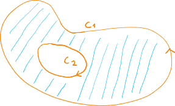

# Teorema de Green. Fluxos. Teorema da Divergência.

[[toc]]

## Bordo de um Domínio

Seja $D \subset \R^2$ um conjunto aberto e limitado.

Então, **$\partial D$ é o bordo de $D$** (pode-se ver como sendo equivalente à fronteira).

Podemos também definir a {orange}(orientação canónica de $\partial D$): é a orientação que deixa o conjunto do lado esquerdo da curva.

## Teorema de Green

::: tip TEOREMA

Se $F = (P, Q)$, $F: \R^2 \to \R^2$ e é de classe $C^1$.

Então, considerando $\partial D$ com a orientação canónica,

$$
\oint_{\partial D} F \d g = \oint_{\partial D} P \d x + Q \d y = \iint_{D} \left(\frac{\partial Q}{\partial x}- \frac{\partial P}{\partial y} \right) \d x \d y
$$

:::

Se $F: D \subset \R^2 \to \R^2$, $F=(P,Q)$, $C^1$ for fechado, isto é, $\frac{\partial P}{\partial y} = \frac{\partial Q}{\partial x}$,
então sabemos que:

$$
\oint_{\partial D} F = \iint_D \left( \frac{\partial P}{\partial y} = \frac{\partial Q}{\partial x} \right) \d x \d y = 0
$$

Assim, {green}(**um campo fechado é conservativo nas curvas que delimitam regiões onde $F$ esteja definido.**)

::: details Exemplo

**Sejam $F$ e a circunferência $C$, $x^2+y^2=10$, orientada no sentido horário.**

$$
F(x,y) = \left(-\frac{1}{3} y^3, \frac{1}{3}x^3 \right)
$$

**Determine $\oint_C F$.**

Como $C = \partial D$ mas com a orientação contrária à canónica, temos que
$\oint_C F \d g = - \oint_{\partial D} F \d g$

$$
\begin{aligned}
\oint_{\partial D} F \d g &= \iint_D \left(x^2-\left(-y^2 \right) \right) \d x \d y\\
&= \int^{2\pi}_0 \int^{\sqrt{10}}_0 r^2 \cdot r \d r \d \theta\\
&= \int^{2\pi}_0 \left[\frac{r^4}{4} \right]^{\sqrt{10}}_0 \d \theta\\
&= 50 \pi
\end{aligned}
$$

Então,

$$
\oint_C F \d g = -50 \pi
$$

:::

## Domínio Simplesmente Conexo

::: tip DEFINIÇÃO

Um domínio D é simplesmente conexo se qualquer curva em $D$ for [homotópica](#homotopia) a um ponto.

:::

### Homotopia

Dadas duas curvas $C_1$ e $C_2$ num domínio $D$ dizemos que $C_1$ e $C_2$ são homotópicas
se for possível deformar $C_1$ e chegar a $C_2$ sem sair de $D$.

---

Slides:

- [Aula 42](https://drive.google.com/file/d/1Rh4CgKjNlN0dsOW1Tj7hx2Vsi_tE3iX5/view?usp=sharing)
