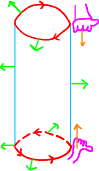
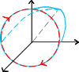

# Rotacional. Teorema de Stokes

[[toc]]

## Rotacional

::: tip DEFINIÇÃO

Seja $F: \R^3 \to \R^3$ um campo vetorial de classe $C^1$.

Definimos o rotacional de $F$, $\rot F$ ( ou $\nabla \times F$), como

$$
\begin{aligned}
\rot F = \nabla \times F &= \begin{vmatrix}
e_1 & e_2 & e_3\\
\frac{\partial}{\partial x} & \frac{\partial}{\partial y} & \frac{\partial}{\partial z}\\
F_1 & F_2 & F_3
\end{vmatrix}\\
&=\left(\frac{\partial F_3}{\partial y}- \frac{\partial F_2}{\partial z}, -\frac{\partial F_3}{\partial x} + \frac{\partial F_1}{\partial z}, \frac{\partial F_2}{\partial x} - \frac{\partial F_1}{\partial y} \right)
\end{aligned}
$$

:::

Como simples exemplos, podemos tomar os campos vetoriais $F_1$ e $F_2$,

$$
\begin{array}{ll}
F_1(x,y,z) = (-y,x,z) & F_2(x,y,z)=(x^2, 3x^2, y+z)
\end{array}
$$

e de seguida calcular os seus rotacionais:

$$
\begin{aligned}
\rot F_1 &= \begin{vmatrix}
e_1 & e_2 & e_3\\
\frac{\partial}{\partial x} & \frac{\partial}{\partial y} & \frac{\partial}{\partial z}\\
-y & x & z
\end{vmatrix}
= (0,0, 1+1) = (0,0,2)\\
\rot F_2 &= \begin{vmatrix}
e_1 & e_2 & e_3\\
\frac{\partial}{\partial x} & \frac{\partial}{\partial y} & \frac{\partial}{\partial z}\\
x^2 & 3x^2 & y+z
\end{vmatrix}
=(1,0,6x)
\end{aligned}
$$

### Propriedades do Rotacional

1. Seja um campo vetorial $F \in C^2$, $F: \R^3 \to \R^3$ e o seu rotacional $\rot F: \R^3 \to \R^3$, então

   $$
   \ondiv(\rot F) = 0
   $$

   ::: details Demonstração

   $$
   \rot F =\left(\frac{\partial F_3}{\partial y}- \frac{\partial F_2}{\partial z}, -\frac{\partial F_3}{\partial x} + \frac{\partial F_1}{\partial z}, \frac{\partial F_2}{\partial x} - \frac{\partial F_1}{\partial y} \right)
   $$

   $$
   \begin{aligned}
   \ondiv(\rot F) &= \frac{\partial}{\partial x} \left(\frac{\partial F_3}{\partial y} - \frac{\partial F_2}{\partial z}\right)\\
   &+ \frac{\partial}{\partial y} \left(-\frac{\partial F_3}{\partial x} + \frac{\partial F_1}{\partial z}\right)\\
   &+ \frac{\partial}{\partial z} \left(\frac{\partial F_2}{\partial x} - \frac{\partial F_1}{\partial y}\right)\\
   &= 0
   \end{aligned}
   $$

   :::

   Se $\div G \ne 0$, então $G$ não pode ser um rotacional.

2. Se $\rot F = (0,0,0)$, então $F$ é [fechado](./0016-campos-vetoriais.md#campo-fechado), pois

   $$
   \begin{array}{lll}
   \frac{\partial F_3}{\partial y} = \frac{\partial F_2}{\partial z} &
   \frac{\partial F_3}{\partial x} = \frac{\partial F_1}{\partial z} &
   \frac{\partial F_2}{\partial x} = \frac{\partial F_1}{\partial y}
   \end{array}
   $$

3. Se $\rot F = 0$ e domínio de $F$ for simplesmente conexo então $\vec F$ é [gradiente](./0016-campos-vetoriais.md#campo-gradiente) (e [conservativo](./0016-campos-vetoriais.md#campo-vetorial-conservativo)).

## Orientação do Bordo de uma Superfície

Considerando uma superfície orientada $S$ em $\R^3$, em que $\partial S$ é bordo da superfície (uma linha).

Podemos definir uma orientação para o bordo através da {green}(**Regra da Mão Direita**).

Colocando a mão direita com a palma voltada para a superfície e com o polegar a apontar no sentido da normal,
ficamos com os dados a apontar na orientação do bordo da superfície.

Podemos tomar como exemplos as superfícies $S$ e $T$:

$$
S = \{x^2 + y^2 + z^2 = 1, z > 0 \}, \quad \vec n_z > 0
$$

$$
T = \{x^2 + y^2 = 1 , 0 \leq z \leq 1 \}, \quad \text{normal exterior}
$$

## Teorema de Stokes

::: tip DEFINIÇÃO

Seja $S \subset \R^3$ uma superfície orientada e $F$ um campo vetorial $C^1$, então

$$
\int_S \rot F \cdot \vec n = \int_{\partial S} \vec F \d g
$$

em que $\partial S$ tem a orientação dada pela [regra da mão direita](#orientacao-do-bordo-de-uma-superficie).

:::

::: details Exemplos

**Considere a superfície $S$ com normal $\vec n$ com a primeira componente negativa e o campo vetorial $S$,**

$$
\begin{array}{ll}
S = \{ x = -1 + y^2 + z^2, x \leq 0 \} & F = (xy, ze^x, -y)
\end{array}
$$

**Qual o valor de $\int_S \rot F \cdot \vec n$?**

A normal está apontada para fora da taça.

$\partial S = \{ x = 0, y^2 + z^2 = 1 \}$ com orientação no sentido horário

$$
\int_S \rot F \cdot \vec n = \int_{\partial S} \vec F \d g = \int_{\partial S} (0, z , -y) \d g
$$

Parametrizar:

$$
\begin{cases}
x = 0\\
y = \cos t\\
z = \sin t
\end{cases}
$$

$$
\begin{array}{ll}
g(t) = (0, \cos t, \sin t) & g'(t) = (0, -\sin t, \cos t)\\
\vec F (g(t)) = (0, \sin t, -\cos t) & \vec F(g(t)) \cdot g'(t) = -\sin^2 t - \cos^2 t = -1
\end{array}
$$

Como a orientação da parametrização é a errada,

$$
\int_{\partial S} \vec F \d g = - \int_0^{2\pi} -1 \d t = 2\pi
$$

:::

Podemos fazer a seguinte observação:

Se $F = \rot A$ e $S$ for uma superfície sem bordo, então, pelo **Teorema de Stokes**, temos que

$$
\int_S F \cdot \vec n = \int_S \rot A \cdot \vec n = \int_{\partial S} A \cdot \d \vec g = 0
$$

## Conjunto Aberto Estrelado

::: tip DEFINIÇÃO

Seja $A \subset \R^n$ um conjunto aberto. O conjunto $A$ diz-se em estrela (ou estrelado) se existir $x_0 \in A$ (e.g. centro da estrela) tal que o segmento que une $x_0$ a qualquer ponto de A está contido em $A$.

Qualquer conjunto aberto estrelado é um conjunto aberto [simplesmente conexo](./0017-green-fluxo-divergencia.md#dominio-simplesmente-conexo) (mas o contrário não é sempre verdade).

:::

Exemplos:

[imagem]

::: tip TEOREMA

Se $G: D \subset \R^3 \to \R^3$ com $\div G = 0$ e o domínio de $G$ é um aberto em estrela, então existe $F: \R^3 \to \R^3$ tal que

$$
\rot F = G
$$

:::

### Obter o Campo Vetorial de um Rotacional

Tomando $G: \R^3 \to \R^3$ com $\ondiv G = 0$, então, como $\R^3$ é um aberto em estrela, $G = \rot F$.

Como podemos calcular o potencial vetor de $F$?  
Seguimos os seguintes passos:

1. Fazer um sistema com as componentes da definição de rotacional, igualadas ao valor conhecido do rotacional, isto é, $G$.

   $$
   rot F = \nabla \times F = \begin{vmatrix}
   e_1 & e_2 & e_3\\
   \frac{\partial}{\partial x} & \frac{\partial}{\partial y} & \frac{\partial}{\partial z}\\
   F_1 & F_2 & F_3
   \end{vmatrix}
   = (\frac{\partial F_3}{\partial y} - \frac{\partial F_2}{\partial z}, - \frac{\partial F_3}{\partial x} + \frac{\partial F_1}{\partial z}, \frac{\partial F_2}{\partial x} - \frac{\partial F_1}{\partial y})
   $$

   $$
   \begin{cases}
   \frac{\partial F_3}{\partial y} - \frac{\partial F_2}{\partial z} = G_1\\
   \frac{\partial F_1}{\partial z} - \frac{\partial F_3}{\partial x} = G_2\\
   \frac{\partial F_2}{\partial x} - \frac{\partial F_1}{\partial y} = G_3
   \end{cases}
   $$

2. Se $G = \rot F$ e $\phi: \R^3 \to \R$

   $$
   \rot (F + \nabla \phi) = \rot F + \rot (\nabla \phi) = \rot F + 0 = G
   $$

3. Seja $\phi = - \int F_1 (x,y,z) \d x$ (isto é, $\phi$ é o simétrico da primitiva de $F_1$ em ordem a $x$)

   - $\rot(F + \nabla \phi) = G$
   - A primeira coordenada de $F + \nabla \phi$ é $F_1 + \frac{\partial \phi}{\partial x} = F_1 - F_1 = 0$

   Logo, existe um potencial vetor com a primeira componente nula.  
   O mesmo é válido com qualquer componente, pelo que sabemos que existe sempre pelo menos uma componente nula.

É mais fácil perceber através de um exemplo:

::: details Exemplo

**Seja o campo vetorial $F(x,y,z) = (x e^y, -2e^y, ze^y)$.**

1. **Será que $F$ é um rotacional?**

   - $\div F = e^y - 2e^y + e^y = 0$
   - Domínio de $F = \R^3$ é aberto em estrela

   Logo, $F$ é um rotacional.

2. **Qual o valor de $A$ tal que $F = \rot A$?**

   Tomando, por exemplo, $A_2$ = 0,

   $$
   \begin{aligned}
   &\begin{cases}
   \frac{\partial A_3}{\partial y} - \frac{\partial A_2}{\partial z} = x e^y\\
   \frac{\partial A_1}{\partial z} - \frac{\partial A_3}{\partial x} = -2e^y\\
   \frac{\partial A_2}{\partial x} - \frac{\partial A_1}{\partial y} = z e^y
   \end{cases}\\
   \Leftrightarrow &
   \begin{cases}
   \frac{\partial A_3}{\partial y} = x e^y\\
   \huge -\\
   \frac{\partial A_1}{\partial y} = - z e^y
   \end{cases}\\
   \Leftrightarrow &
   \begin{cases}
   A_3 = \int x e^y \d y = x e^y + C_1(x,z)\\
   (-e^y + \frac{\partial C_2}{\partial z}) - (e^y + \frac{\partial C_1}{\partial x}) = -2 e^y\\
   A_1 = -z e^y + C_2(x,z)
   \end{cases}\\
   \Leftrightarrow &
   \begin{cases}
   \huge -\\
   -2e^y + \frac{\partial C_2}{\partial z} - \frac{\partial C_1}{\partial x}= -2 e^y\\
   \huge -
   \end{cases}\\
   \Leftrightarrow &
   \begin{cases}
   -\\
   \frac{\partial C_2}{\partial z} = \frac{\partial C_1}{\partial x}\\
   \huge -
   \end{cases}
   \end{aligned}
   $$

   Escolhendo $C_1 = C_2 = 0$, temos $A = (-z e^y, 0, xe^y)$

3. **Considerando $S = \{x^2 + z^2 = y^2: 1 < y < 2\}$ e $\vec n_y < 0$, qual o valor de $\int_S F \cdot \vec n$?**

[imagem]

Pelo [Teorema de Stokes](#teorema-de-stokes), sabemos que

$$
\int_S F \cdot \vec n = \int_S \rot A \cdot \vec n = \int_{\partial S} A \d g = \int_{C_1} A \d g + \int_{C_2} A \d g
$$

$C_1: x^2+z^2 = 1, y = 1$

$$
\begin{array}{ll}
g(t) = (\cos t, 1, \sin t) & g'(t) = (-\sin t, 0, \cos t)\\
A(g(t)) = (-e \sin t, 0, e\cos t) &
\end{array}
$$

$$
\int_{C_1} A \d g = - \int_0^{2 \pi} A(g(t)) \cdot g'(t) \d t = - 2\pi e
$$

$C_2: x^2+z^2 = 4, y = 2$

$$
\begin{array}{ll}
g(t) = (2\cos t, 2, 2\sin t) & g'(t) = (-2\sin t, 0, 2\cos t)\\
A(g(t)) = (-2e^2 \sin t, 0, 2e^2\cos t) &
\end{array}
$$

$$
\int_{C_2} A \d g = \int_0^{2 \pi} A(g(t)) \cdot g'(t) \d t = \int_0^{2 \pi} 4 e^2 \d t = 8\pi e^2
$$

Logo,

$$
\int_S F \cdot \vec n = 8\pi e^2 - 2\pi e
$$

:::

## Significado Geométrico de Rotacional

Sejam o campo vetorial $F$ e $x_0$,

$$
\begin{array}{lll}
F: \R^3 \to \R^3 & F \in C^1 & x_0 \in \R^3
\end{array}
$$

$$
\int_{S_{\epsilon}} \rot F \cdot \vec n = \int_{\partial S_{\epsilon}} F \d g
$$

$$
\int_{S_{\epsilon}} \rot F \cdot \vec n \approx \rot F(x_0) \cdot \vec n \int_{S_{\epsilon}} 1 \d S = \rot F(x_0) \cdot \vec n\ \text{ área}(S_{\epsilon})
$$

$$
\rot F(x_0) \cdot \vec n = \lim_{\epsilon \to 0} \frac{1}{\text{área}(S_{\epsilon})} \int_{\partial S_{\epsilon}} F \d g
$$

$\rot F(x_0) \cdot \vec n$ (o trabalho de $F$) é máximo quando $\vec n$ tem a mesma direção e sentido de $\rot F(x_0)$

A intensidade do trabalho de $F$ vai ser

$$
\rot F(x_0) \cdot \frac{\rot F(x_0)}{|| \rot F(x_0)||} = \frac{||\rot F(x_0)||^2}{|| \rot F(x_0)||} = ||\rot F(x_0)||
$$

---

Slides:

- [Aula 47](https://drive.google.com/file/d/1x5QZEP0iS2id-kief-QHd_KH4o6qxN8w/view?usp=sharing)
- [Aula 48](https://drive.google.com/file/d/1qbxkvtPUH3D1w51vtw2WfrvsruYEujPd/view?usp=sharing)
- [Aula 49](https://drive.google.com/file/d/18oL0P6Zg0otWYsi3OUl-iZ0XL4sdo7aF/view?usp=sharing)
- [Aula 50](https://drive.google.com/file/d/1Hh_FA3NrvMRyXeRy_X9t1VSZojHRzj7N/view?usp=sharing)
