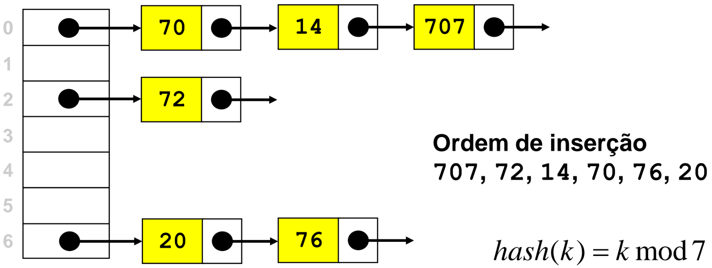
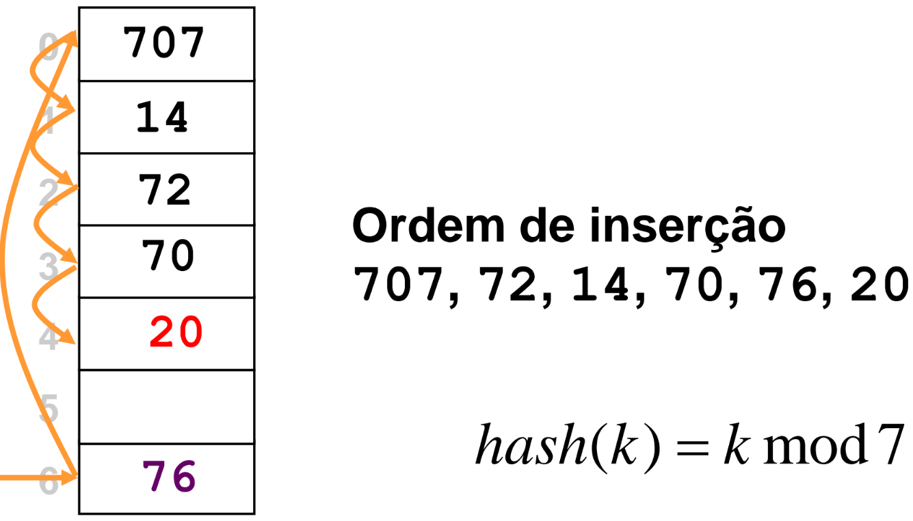

# Tabelas de Dispersão (Hash Tables)

[[toc]]

## Tabelas de Dispersão


### Motivação

Numa tabela de dispersão, tanto para guardar como procurar um elemento,
a função de dispersão dá-nos um indíce.

### Função de Dispersão (Hashing)

- Transforma a chave num índice da tabela, ou seja num
  inteiro $[0, M-1]$, para uma tabela de dimensão $M$
- Colisão: ocorre quando a função de dispersão devolve
  o mesmo valor para chaves distintas
- Função de dispersão ideal: a probabilidade de ocorrer
  uma colisão para duas chaves distintas é $\frac{1}{M}$

  - Distribui os elementos de forma uniforme

- Deve distribuir as chaves de forma uniforme e quase
  aleatória
- Deve ser rápida de calcular
- Deve envolver todos os bits da chave
- Diferentes funções devem ser usadas para diferentes
  tipos de dados

  - Cadeias de caracteres
  - Inteiros
  - Reais

- Para números
  $M$ deve ser primo e diferente de 2

  Para 85, 21 e 53 o mod por 2 é sempre 1, logo não deve ser usado!

$hash(k) = k * mod M$

```c
int hash(int value, int M)
{
    return (value % M);
}
```

- Para strings

Calcula uma soma ponderada dos caracteres

Soma é feita com módulo
$M$ deve ser um primo, para minimizar colisões

```c
int hash(char *v, int M)
{
int h = 0, a = 127;

for (; *v != '\0'; v++)
    h = (a*h + *v) % M;
return h;
}
```

- Também é possível

Recalcular a base em cada iteração
Evita anomalias com chaves altamente regulares

```c
int hashU(char *v, int M)
{
int h, a = 31415, b = 27183;

for (h = 0; *v != '\0'; v++, a = a*b % (M-1))
    h = (a*h + *v) % M;
return h;
}
```

Encontram-se nos slides alguns exemplos de funções de dispersão

### Colisões


Por vezes diferentes chaves apontam para o mesmo local na tabela.

### Resolução por Encadeamento Externo



- Cada posição da tabela tem um ponteiro para uma lista
- Colisões resolvidas juntando o elemento ao início da lista
- Remoções resolvidas removendo o elemento da lista

Exemplo do código nos slides do final da página

- Comprimento médio das listas é $\alpha = \frac{N}{M}$
- A probabilidade de o número de chaves numa lista ser
  maior ou igual a $t\alpha$ é de onde $(\frac{\alpha e}{t})^te^{-\alpha}$
- Se $\alpha = 20$, a probabilidade de uma lista ter mais de 40
  items é 0.0000016.

### Resolução por Procura Linear



- Cada posição da tabela guarda um elemento
- Necessário conhecer número de elementos à priori
- Se a posição estiver ocupada, guarda o item na posição
  seguinte livre (linear probing).

Exemplo do código nos slides do final da página

- Resolução de conflitos: se a posição correspondente ao
  índice devolvido pela função de dispersão estiver
  ocupada, incrementar o índice até encontrar primeira
  posição livre.

- Após achar o item, coloca-se a posição a NULL
- Reinserem-se todos os items que se seguem, até à próxima
  posição vazia

$\alpha = \frac{N}{M}$ tem de ser menor que 1

Número de operações necessárias para achar um item é:

- Hits: $\frac{1}{2}(1+\frac{1}{1- \alpha})$

- Misses: $\frac{1}{2}(1+\frac{1}{(1- \alpha)^2})$

- Número de operações cresce rapidamente quando $\alpha \rightarrow 1.0$

$$
\begin{array}{ c c c c c }
\alpha  & 0.5 & 0.667 & 0.75 & 0.9\\
hit & 1.5 & 2.0 & 3.0 & 5.5\\
miss & 2.5 & 5.0 & 8.5 & 55.5
\end{array}
$$

### Resolução por Double Hashing

- Guarda elementos na tabela, como na procura linear
- Usa outra técnica para resolver conflitos
  - Em vez de procurar em sequência, usa uma segunda função de
    hashing para determinar o incremento
  - Incremento deve ser maior que 0 e primo relativamente ao
    tamanho da tabela
  - Diminui o número de operações relativamente à procura linear
  - Operações só se tornam demasiado lentas quando o factor de
    carga atinge o valor 90% - 95%

Exemplo do código nos slides do final da página

$\alpha = \frac{N}{M}$ tem de ser menor que 1

Número de operações necessárias para achar um item é:

- Hits: $\frac{1}{\alpha}\ln(\frac{1}{1- \alpha})$

- Misses: $\frac{1}{1- \alpha}$

$$
\begin{array}{ c c c c c }
\alpha  & 0.5 & 0.667 & 0.75 & 0.9\\
hit & 1.4 & 1.6 & 2.8 & 2.5\\
miss & 1.5 & 2.0 & 3.0 & 5.5
\end{array}
$$

### Tabelas de Dispersão Dinâmicas

- Carga da tabela aumenta - custo de inserção e procura
  aumenta
  - tabela esparsa (ou encadeamento externo) - aumento é gradual
  - tabela não esparsa - aumento incomportável
  - procura linear e dispersão dupla - carga máxima 1
- Solução: duplicar tamanho da tabela quando esta fica
  meio cheia
  - No entanto, duplicação tem custo alto
  - mas, é pouco frequente

### Vantagens e Desvantagens

- Vantagens
  - Concretizam operações de inserção e procura em tempo
    constante (caso médio)
    - procura linear - a mais rápida (tabela esparsa)
    - dispersão dupla - melhor compromisso tempo/memória
    - encadeamento externo - mais fácil de concretizar, maior carga mas
      pior uso de memória
- Inconvenientes
  - Não há garantia de desempenho
  - Custo de função de dispersão alto se chaves longas
  - Ocupam mais memória do que necessário
  - Não suportam eficientemente as operações de ordenação e
    selecção

Recomendo a verem os exercícios que estão nos slides.

Slides:

- [Aula 18](https://drive.google.com/file/d/1YBSPqEe4hLfTO3Th1F0TeISqUb_N0JAs/view?usp=sharing)
