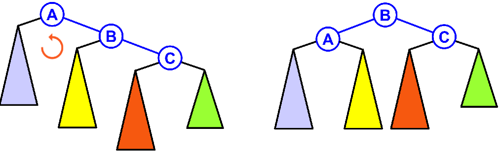
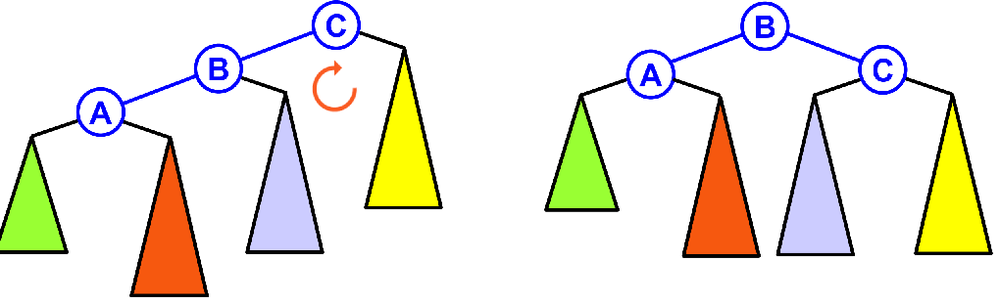
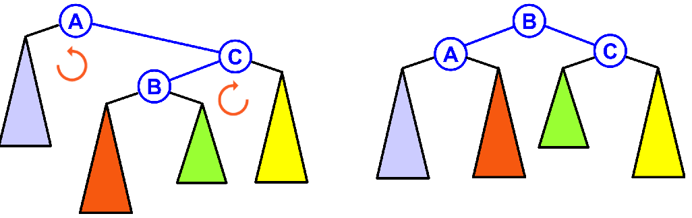
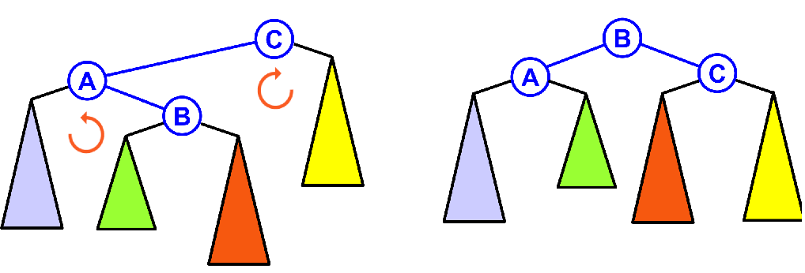

# Árvores Binárias

[[toc]]

## Árvores de Procura Binárias (BST)

- Nó na sub-árvore esquerda tem chaves menores que a raíz

- Nós na sub-árvore direita tem chaves maiores ou iguais que a raíz


### Pesquisa de um item v: função search

- A pesquisa começa na raiz = head

- Verifico se é igual ao item da raiz. Se for retorno o "link" onde estou.

- Caso contário chamo a função search para o filho da esquerda ou para o filho da direita\
  dependendo se `v` é menor ou maior que `h`$\rightarrow$ `item`

### Inserção de um Novo Elemento

- Comeco na raiz

- Vou percorrendo a árvore de cima para baixo até encontrar o lugar onde introduzir o novo elemento

- Quando encontrar o lugar vazio (NULL) para o novo
  elemento \
  (respeitando as regras da binary search tree)
  crio um novo elemento.

### Máximo e Minímo

- Para achar o elemento maior, vamos ver o elemento mais á direita

```c
link max(link h) {
  if (h == NULL || h->r == NULL)
      return h;
  else
      return max(h->r);
}
```

- Para achar o elemento menor, vamos ver o elemento mais á esquerda

```c
link min(link h) {
  if (h == NULL || h->l == NULL)
    return h;
  else
    return min(h->l);
}
```

### Remoção de 1 elemento

1. Se o nó não tiver filhos, basta apagar

2. Se o nó tiver apenas um filho, redirecianamos o nó anterior para o o filho e apagamos o nó.

3. Se o nó tiver 2 filhos, substituímos o elemento a remover pelo maior dos elementos
   à\
    esquerda do elemento a ser removido e removemos esse elemento de acordo com os passos 1 ou 2.

### Ver elementos


### Travessia em Pre-Order

Visita a raíz antes dos filhos

Output: 20, 12, 8, 2, 9, 18, 32, 23, 45

### Travessia em In-Order (Sorted)

Visita a raíz depois do filho esquerdo e antes do direito

Output: 2, 8, 9, 12, 18, 20, 23, 32, 45

### Travessia em Post-Order

Visita a raíz depois dos filhos

Output: 2, 9, 8, 18, 12, 23, 45, 32, 20

### Pesquisas em BST

- Geralmente eficiente: $O(\log N)$
- No pior caso, $O(N)$ para uma árvore desequilibrada
  - Ordem de inserção: 1,2,3,4,5,6,7,8
- No caso de chaves aleatórias,
- Comparação com pesquisa binária em tabelas: $O(\log N)$
  - Tempo de pesquisa comparável
  - Tempo de inserção muito mais rápido
- Tempo de pesquisa e inserção são $O(N)$ no pior caso (árvore degenerada)

## Árvores Binárias Equilibradas

- Evitam o pior caso de $O(N)$

- Algum overhead na construção

- Alternativa:
  - Reequilibrar uma árvore, depois de construída
  - Usar aleartoriade
  - Usar técnicas especiais de construção (AVL, Red-Black)

## Árvores AVL (Adelson-Velsky and Landis)


Qualquer operação na árvore tem $O(\log N)$

- BST em que, para cada nó interno,\
  a profundiade(height) de ambos os filhos difere, no máximo, em 1

Exemplo

A árvore fica desequilibrada quando se retira ou insere um elemento.

Para equilibrar uma árvore, aplicamos uma rotação no pai e nos filhos que estão desequilibrados.

Imagem

### Inserção

- Inserir novo elemento, numa folha, como numa BST normal

Balance Factor = height(left) - height(right)

- Inserir novo elemento, numa folha, como numa BST
  normal
- Percorrer o caminho desde a nova folha até à raíz
  - Para cada nó encontrado, verificar se as alturas dos dois filhos
    (esquerdo e direito) não diferem em mais do que 1
  - Se diferirem, equilibrar a sub-árvore com raíz nesse nó,
    efectuando uma rotação (simples ou dupla)
- Após equilibrar a sub-árvore com raíz num determinado
  nó x, não será necessário equilibrar as sub-árvores com
  raíz nos antepassados de x
  - Terminar após uma equilibragem, ou quando atingirmos a raíz

### Equilibragem

- Rotação Simples I (left)



```c
link rotL(link h) {
  link x = h->r;
  h->r = x->l;
  x->l = h;
  return x;
}
```

imagem

- Rotação Simples II (right)



```c
link rotR(link h) {
  link x = h->l;
  h->l = x->r;
  x->r = h;
  return x;
}
```

- Rotação Dupla I (right-left)



- Rotação Dupla II (left-right)



### Resumo

- Caso 1:\
  Se o novo nó é inserido na sub-árvore da esquerda,\
  da subárvore da esquerda do elemento desequilibrado,\
  basta-nos aplicar uma rotação simples para a direita aplicada a esse elemento.

- Caso 2:\
  Se o novo nó é inserido na sub-árvore da direita,\
  da sub-árvore da direita do elemento desequilibrado,\
  basta-nos aplicar uma rotação simples para a esquerda aplicada a esse elemento.

- Caso 3:\
  Se o novo nó é inserido na sub-árvore da direita,\
  da sub-árvore da esquerda do elemento desequilibrado,\
  fazemos uma rotação dupla Esquerda-Direita.

- Caso 4:\
  Se o novo nó é inserido na sub-árvore da esquerda,\
  da subárvore da direita do elemento desequilibrado,\
  fazemos uma rotação dupla Direita-Esquerda.

### Remoção

- Remover um nó como numa BST normal
- Percorrer o caminho desde o nó removido até à raíz
  - Para cada nó encontrado, verificar se as alturas dos dois filhos
    (esquerdo e direito) não diferem em mais do que 1
  - Se diferirem, equilibrar a sub-árvore com raíz nesse nó,
    efectuando uma rotação simples ou uma rotação dupla
- Após equilibrar a sub-árvore com raíz num determinado
  nó x, poderá ser necessário equilibrar as sub-árvores
  com raízes nos antepassados de x
  - Terminar apenas quando atingirmos a raíz

### Desempmenho

- Uma equilibragem (rotação dupla ou simples): $O(1)$
- Pesquisa: $O(\log N)$
  - Profundidade é $O(\log N)$, não é necessário equilibrar
- Inserção: $O(\log N)$
  - Procurar a posição para inserir é $O(\log N)$
  - Manter equilibrada é $O(\log N)$ : subir na árvore e equilibrar 1 vez
- Remoção: $O(\log N)$
  - Procurar o elemento a remover é $O(\log N)$
  - Manter equilibrada é $O(\log N)$ : subir na árvore e equilibrar no
    máximo $O(\log N)$ vezes

Aconselho vivamente a verem os exemplos nos slides\
acerca da manipulação desta estutura de dados.

Slides:

- [Aula 19](https://drive.google.com/file/d/11Tf3aYzFhXfP0BlC5t5I1astq27Op8zR/view?usp=sharing)
