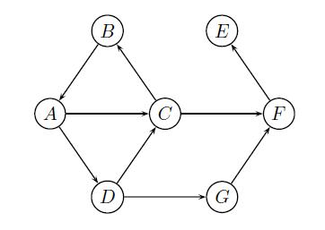
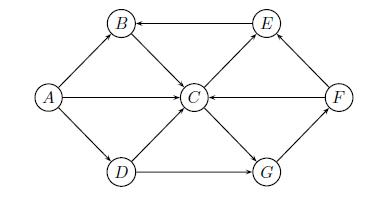
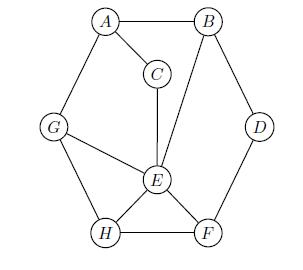
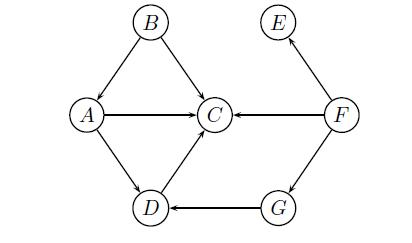
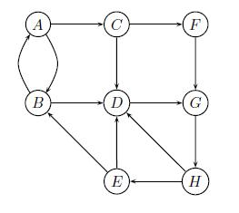

# Lab 12

[[toc]]

## Exercício 1

Qual a sequência de vértices visitados numa travessia em profundidade primeiro (DFS) sobre o grafo abaixo. Considere que os vértices são visitados por ordem alfabética e que os vértices adjacentes de um vértice também são visitados por ordem alfabética.

::: details Resolução (soon)

:::

## Exercício 2

Considere uma travessia em profundidade primeiro (DFS) do grafo abaixo, e na qual os vértices são visitados por ordem alfabética e os vértices adjacentes de um vértice também são visitados por ordem alfabética. Indique os arcos de árvore DF.

::: details Resolução (soon)

:::

## Exercício 3

Considere uma travessia em profundidade primeiro (DFS) sobre o grafo abaixo. Considere ainda que os vértices são visitados por ordem alfabética e que os vértices adjacentes de um vértice são também visitados por ordem alfabética. Qual o número de arcos para trás e de cruzamento que resultam da execução desta travessia? Os arcos para trás (back edges) ligam um nó com o seu predecessor na árvore DF, os arcos de cruzamento (cross edges) ligam nós n1 e n2 se n1 não é predecessor do n2 e nem n2 é predecessor do n1.

::: details Resolução (soon)

:::

## Exercício 4

Qual a sequência de vértices visitados numa travessia em largura primeiro (BFS) sobre o grafo abaixo, com origem no vértice A?\
 Considere que os vértices adjacentes de um vértice são visitados por ordem alfabética.

::: details Resolução (soon)

:::

## Exercício 5

Qual das sequências de vértices corresponde a uma ordenação topológica do grafo abaixo?\
Lembra-se do algoritmo para calculá-la?

`1. A,B,C,D,E,F,G`\
`2. B,A,D,C,G,F,E`\
`3. B,A,D,F,E,G,C`\
`4. B,F,A,E,D,C,G`\
`5. C,G,E,B,A,D,F`\
`6. F,E,G,D,C,B,A`\
`7. F,G,E,B,A,D,C`

::: details Resolução (soon)

:::

## Exercício 6

Qual o número de componentes fortemente ligados do grafo dirigido da figura abaixo.\
 Lembra-se do algoritmo para calculá-los?

::: details Resolução (soon)

:::
