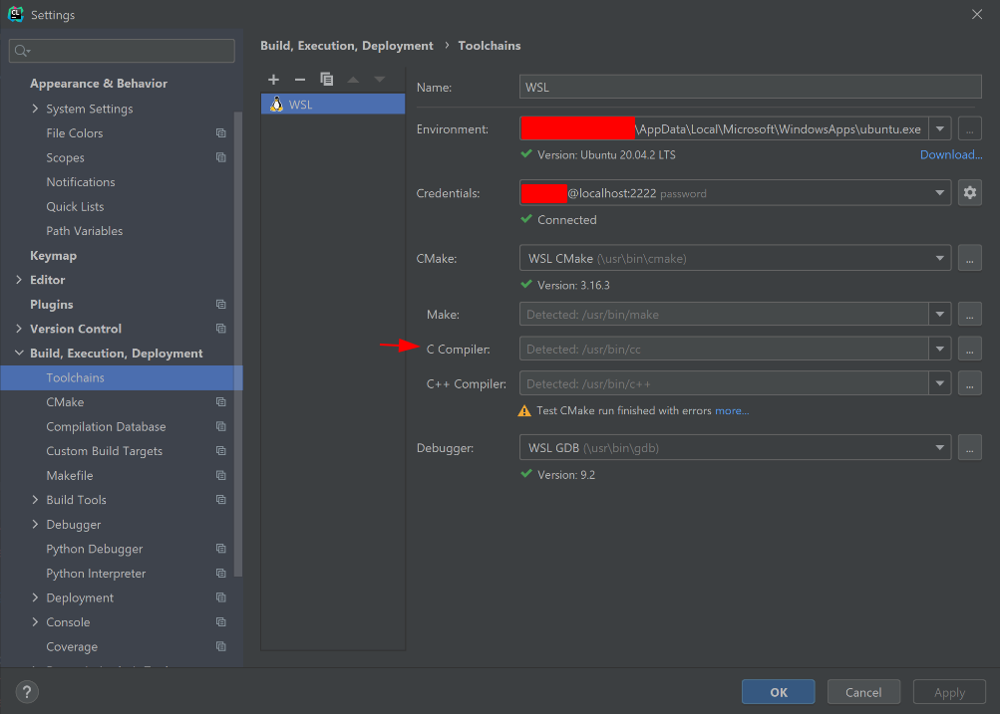

# Instalação de Linux

[[toc]]

Para a UC de IAED, irão necessitar de acesso a um sistema Linux com `gcc`.  
Existem várias opções de obter esta ferramenta. Abaixo está uma comparação entre as várias opções.

::: tip
Este guia considera que utilizas o sistema operativo Windows 10.  
Se tens Linux ou um Mac, já tens acesso ao `gcc`.
:::

|                               | Vantagens                                                                                  | Desvantagens                                                                                                                                                 |
| ----------------------------- | ------------------------------------------------------------------------------------------ | ------------------------------------------------------------------------------------------------------------------------------------------------------------ |
| WSL / WSL2                    | Fácil de instalar. Não necessita criar uma partição no disco (para dualboot).              | Não é uma experiência total Linux, e embora seja suficiente para IAED, pode não ser para UCs futuras.                                                        |
| Virtual Machine               | Fácil de instalar. Não necessita criar uma partição no disco (para dualboot).              | Lento. Necessita de um computador com alguma RAM livre.                                                                                                      |
| Dual Boot / Single Boot Linux | Experiência total Linux com o máximo de compatibilidade. Funciona para qualquer UC futura. | Se estavam a usar Windows anteriormente, pode ser inconveniente trocar entre sistemas operativos (se for dual boot) ou trocar totalmente o sistema anterior. |

Não existe nenhuma "regra" que decida o que usar, depende de utilizador para utilizador.  
O WSL (Windows Subsystem for Linux) é o mais fácil de instalar e usar, e suficiente para a UC de IAED.  
No entanto, para quem se queira aventurar, recomendo vivamente experimentar uma instalação de Linux.  
Não aconselho o uso de VMs, pois são muito mais lentas que o WSL.

## WSL/WSL2

O Windows Subsystem for Linux permite a instalação de um sistema Linux no Windows 10.  
A instalação é extremamente fácil, basta seguir o [tutorial na página da Microsoft](https://docs.microsoft.com/en-us/windows/wsl/install-win10#manual-installation-steps).
Na escolha do sistema operativo, podem escolher o que quiserem.
Se não tiverem preferência, instalem o Ubuntu 20.04 LTS (a versão Long Term Support mais recente à data).

Recomendo a instalação do WSL2, se tiverem o Windows suficientemente atualizado.

Além do WSL, devem instalar o [Windows Terminal pela Microsoft Store](https://docs.microsoft.com/en-us/windows/terminal/get-started),
para terem um terminal com mais funcionalidades do que o _default_ do WSL, como copy paste, mais cores, unicode support, etc.  
Quando abrem o Windows Terminal, podem ter de clicar na seta ao lado da tab do PowerShell para mudar para o WSL.
É possível alterar o _default_ para o WSL nas [definições do Windows Terminal](https://docs.microsoft.com/en-us/windows/terminal/customize-settings/startup#default-profile).

### Escolha do editor de texto

Agora que instalaram o WSL, já têm um sistema Linux funcional no vosso computador.  
No entanto, para utilizarem o `gcc` do WSL no vosso editor de texto, é necessário alguma configuração.

#### Manualmente

Se não quiserem utilizar nenhum dos editores abaixo, podem procurar instruções online, ou podem compilar e executar o ficheiro manualmente.
É possível aceder os ficheiros do Windows pelo WSL, na pasta `/mnt/c/` (ou outro disco, e.g. `/mnt/d/`).

Instalar o GCC (assumindo que estão a usar Debian/Ubuntu):

```bash
sudo apt install gcc
```

Compilar o ficheiro `.c`:

```bash
gcc /mnt/c/path/to/file.c
```

Executar o ficheiro compilado (por default o nome do ficheiro é `a.out`):

```bash
/mnt/c/path/path/to/a.out
```

::: tip
Podem mudar o nome (e o local onde é guardado) do ficheiro compilado através da opção `-o`:

```bash
gcc /mnt/c/path/to/file.c -o ~/ficheiro_compilado
```

:::

#### CLion

O [CLion](https://www.jetbrains.com/clion/) é um IDE **pago** de C e C++ da JetBrains. No entanto, é **grátis para estudantes**.
Podes conseguir a tua licença através do [site oficial da JetBrains](https://www.jetbrains.com/shop/eform/students) ou através do [GitHub Student Developer Pack](https://education.github.com/pack).

Existe um [tutorial](https://www.jetbrains.com/help/clion/how-to-use-wsl-development-environment-in-product.html#wsl-tooclhain) oficial do CLion sobre a utilização com WSL.

Pode acontecer o compilador de C não ser detetado automaticamente. Caso isso aconteca, coloquem `/usr/bin/gcc` na definições do CLion, como na imagem abaixo. O Make e o C++ compiler não são importantes para a programação em C.



#### VSCode

O [Visual Studio Code](https://code.visualstudio.com/) é um editor de texto **open source** com várias funcionalidades.
É possível instalar uma [extensão de C](https://marketplace.visualstudio.com/items?itemName=ms-vscode.cpptools)
e uma [extensão do WSL](https://marketplace.visualstudio.com/items?itemName=ms-vscode-remote.remote-wsl).

Existe também um [tutorial oficial](https://code.visualstudio.com/docs/cpp/config-wsl) de como configurar C++ com WSL, mas é muito semelhante a C.

## Virtual Machine

Existem vários programas de permitem a utilização de Virtual Machines no Windows.  
Recomendo os seguintes:

- [VirtualBox](https://www.virtualbox.org/)
- [Hyper-V](https://docs.microsoft.com/en-us/virtualization/hyper-v-on-windows/) (só para Windows 10 Pro/Enterprise/Education)

A instalação é muito semelhante em ambos.

1. Escolher a distribuição de Linux a instalar. Para uma VM, [Ubuntu 20.04 LTS](https://ubuntu.com/download/desktop) é suficiente.
2. Fazer download da ISO da distribuição escolhida.
3. Criar uma VM com essa ISO.
4. Ligar a VM e seguir os passos do instalador.
5. Reiniciar a VM.
6. Done :smile:

Deixo abaixo tutoriais com passos mais detalhados para cada programa:

- [Instalar Ubuntu 20.04 no VirtualBox](https://fossbytes.com/how-to-install-ubuntu-20-04-lts-virtualbox-windows-mac-linux/)
- [Instalar Ubuntu 20.04 no Hyper-V](https://francescotonini.medium.com/how-to-install-ubuntu-20-04-on-hyper-v-with-enhanced-session-b20a269a5fa7)

## Dual Boot / Single Boot Linux

Outra alternativa (e a mais interessante) é fazer dual boot de Linux, ou mesmo trocar o computador exclusivamente para Linux.

O primeiro passo é escolher a distribuição Linux a instalar.
Algumas das distribuições são, por ordem de dificuldade/recomendação:

- [Pop!\_OS](https://pop.system76.com/) - Baseado no Ubuntu, é muito fácil de instalar, mas com algumas definições que fazem "mais sentido" do que no Ubuntu.
- [Ubuntu](https://ubuntu.com/download/desktop) - A distribuição mais "famosa". Muito fácil de instalar.
- [Fedora](https://getfedora.org/)
- [Arch](https://wiki.archlinux.org/) - Extremamente difícil de instalar. Não recomendada para quem nunca usou Linux. Direcionada a quem se quer aventurar.

Existem muitas mais distribuições (ou _distros_), mas estas são as principais.  
Tanto o Pop!\_OS como o Ubuntu têm uma opção no instalador para automaticamente configurar dual boot com o Windows,
dando para escolher quando espaço no disco fica para cada sistema operativo.  
Não é necessário mudar o tamanho das partições no Windows, o Pop!\_OS e o Ubuntu fazem isso automaticamente.

Os passos da instalação são muito semelhantes aos da Virtual Machine.

### Passo 1 - Fazer download da ISO e fazer colocar numa pen

É necessário uma pen de 4GB para instalar o Linux.

O Ubuntu tem um [tutorial de como fazer uma pen botável através da ISO](https://ubuntu.com/tutorials/create-a-usb-stick-on-ubuntu#1-overview).

### Passo 2 - Fazer boot da pen

Este passo depende de computador para computador, mas normalmente consiste em clicar numa tecla quando o computador
está a ligar, de forma a escolher o disco de boot. Basta escolher a pen, e o instalador do sistema operativo deve aparecer.

### Passo 3 - Instalar o sistema operativo

Novamente, este passo depende da distribuição escolhida. No Pop!\_OS, Ubuntu e Fedora consiste apenas em seguir os passos no ecrã.

No Arch, well... good luck :wink:
