# Lógica Proposicional - Introdução

[[toc]]

Apresenta uma linguagem muito simples, sendo que o nível mais elementar é o **símbolo de proposição** - uma proposição pode ser representada por uma letra do alfabeto latino.

## Símbolos Lógicos

- Símbolos de pontuação: ( )

- Símbolos lógicos:

  - $\neg$, que corresponde à **negação**;
  - $\wedge$, que corresponde à **conjunção**;
  - $\vee$, que corresponde à **disjunção inclusiva**, vulgo OR;
  - $\to$, que corresponde à **implicação**.

- Símbolos de proposição: $P_{i}$, $i \geq 1$.  
  O conjunto de todas as proposições da lógica proposicional é dado por $\mathcal{P}$.

## Componentes de uma Lógica

- **Fórmula bem formada (_fbf_)** - qualquer lógica tem uma linguagem, linguagem esta composta por um conjunto de frases válidas. A essas frases dá-se o nome de _fórmulas bem formadas_, ou _fbfs_. Em relação a estas, temos que: os símbolos de proposição são chamados _fbfs atómicas_, que se $\alpha$ é uma _fbf_ então $\neg\alpha$ é uma _fbf_ e que qualquer combinação de _fbfs_ atómicas utilizando os símbolos lógicos acima mencionados também é uma _fbf_.

::: details Exemplo - Fórmula bem formada
$\neg$P  
P $\wedge$ Q  
(P $\wedge$ Q) $\to$ R

:::

A linguagem da lógica proposicional, $\mathcal{L}_{LP}$, é composta por todas as _fbfs_ construídas a partir do conjunto dos símbolos lógicos acima referidos.

- **Argumento** - par ($\Delta, \alpha$), no qual $\Delta$ é um conjunto de frases da linguagem e $\alpha$ é uma frase da linguagem.

## Sistema Dedutivo

Especifica as **regras de inferência**, regras que permitem a manipulação de _fbfs_ e a introdução de novas _fbfs_ a partir de _fbfs_ existentes.

- **Deducão Natural:**  
  Nos sistemas abordados por dedução natural existem por norma duas regras de inferência por cada símbolo lógico - a **regra de introdução**, que diz como introduzir uma _fbf_ que utiliza um dado símbolo lógico, e a **regra de eliminação**, que diz como usar uma _fbf_ que contém o símbolo lógico.

  Aqui, não existem _axiomas_ - _fbfs_ - que se aceitam como verdadeiras.

### Prova

Sequência finita de linhas numeradas, cada uma das quais contendo uma premissa ou uma _fbf_ que é adicionada à prova recorrendo a uma das regras de inferência e utilizando as _fbfs_ das linhas anteriores.
Em cada linha da prova existe uma justificação da introdução da mesma.
Uma **prova de $\alpha$ a partir de $\Delta$** é uma prova cuja última linha contém $\alpha$ e cujas restantes linhas contêm ou uma _fbf_ em $\Delta$ ou uma _fbf_ obtida a partir das linhas anteriores recorrendo a uma regra de inferência.
Caso exista uma prova de $\alpha$ a partir de $\Delta$, dizemos que $\alpha$ é **derivável** a partir de $\Delta$, ou, de outra maneira, $\Delta \vdash \alpha$.

Durante a realização da prova, utilizamos uma série de regras de inferência.

- **Regra da premissa:**

  Podemos, no decorrer da prova (e em qualquer altura desta) introduzir _fbfs_ correspondentes a premissas. Identificada por _prem_.
  ::: tip REGRA DA PREMISSA

  A introdução de uma premissa tem sempre um aspeto deste género:

  

  :::

  ::: details Exemplo - Regra da premissa

  Ao tentar provar que {P, Q} $\vdash$ P $\wedge$ Q, começamos a prova escrevendo as premissas, tal que:

  

  :::

- **Regra da repetição:**

  Regra que afirma que qualquer _fbf_ pode ser repetida dentro de uma prova - ou seja, se já existe uma _fbf_ numa linha anterior, podemos reescrevê-la na linha atual, justificando com a regra da repetição. Identificada por _Rep_, $n$, onde $n$ representa a linha onde a _fbf_ foi introduzida.

  ::: tip REGRA DA REPETIÇÃO

  A regra da repetição tem sempre um aspeto deste género:

  

  :::

  ::: details Exemplo - Regra da repetição

  Em relação a um exemplo mais concreto:

  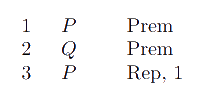

  :::

- **Regras associadas à conjunção:**

  - **Introdução da Conjunção:**
    Diz-nos como introduzir (ou como construir) uma _fbf_ cujo símbolo lógico principal é uma conjunção - uma conjunção de _fbfs_. Abreviada por I$\wedge$, ($n$, $m$), onde $n$ e $m$ representam, respetivamente, as linhas onde as primeira e segunda _fbfs_ foram introduzidas.
    Um ponto importante a reter é que as _fbfs_ têm de ter sido introduzidas **por ordem**, caso contrário não podemos aplicar diretamente a regra, tendo de usar a regra da repetição.

    ::: tip INTRODUÇÃO DA CONJUNÇÃO

    A introdução da conjunção tem sempre um aspeto deste género:

    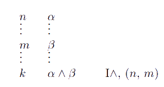

    :::

    ::: details Exemplo - Introdução da Conjunção

    Em relação a um exemplo mais concreto:

    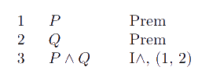

    :::

  - **Eliminação da Conjunção:**
    Diz-nos que, de uma _fbf_ cujo símbolo principal é uma conjunção, podemos derivar tanto a _fbf_ da "esquerda" como a da "direita". Abreviada por E$\wedge$, ($n$), onde $n$ representa a linha onde a _fbf_ em causa foi introduzida.

    ::: tip ELIMINAÇÃO DA CONJUNÇÃO

    A eliminação da conjunção tem sempre um aspeto deste género:

    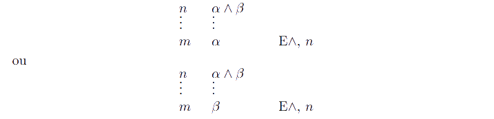

    :::

    ::: details Exemplo - Eliminação da Conjunção

    Em relação a um exemplo mais concreto:

    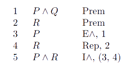

    De notar que começamos agora a ver várias aplicações de regras durante a prova.

    :::

- **Regras para provas hipotéticas:**

  Os sistemas de dedução natural usam o conceito de _prova hipotética_ - uma prova iniciada com a introdução de uma hipótese. Essa prova hipotética consiste num "ambiente local" em que, para além das outras _fbfs_ da prova, consideramos a hipótese que iniciou a prova, iniciada pela **regra da hipótese**, regra que afirma que em qualquer ponto de uma prova podemos introduzir qualquer _fbf_ como uma hipótese, começando uma nova prova hipotética. Abreviada por Hip.
  Uma vez iniciada uma prova hipotética, todas as linhas adicionadas pertencem à mesma até que a prova seja terminada.

  ::: tip REGRA DA HIPÓTESE

  A regra da hipótese tem sempre um aspeto deste género:

  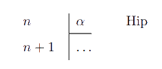

  :::

  ::: details Exemplo - Regra da Hipótese

  Em relação a um exemplo mais concreto:

  

  :::

  - **Regra da reiteração:**

  Regra de inferência especial, específica às provas hipotéticas. Diz-nos que qualquer _fbf_ introduzida num ponto da prova exterior à prova hipotética pode ser utilizado dentro da mesma. **O contrário não se aplica.** Abreviada por Rei, $n$, onde $n$ é a linha onde a _fbf_ foi inicialmente introduzida.

  ::: tip REGRA DA REITERAÇÃO

  A regra da reiteração tem sempre um aspeto deste género:

  

  :::

  ::: details Exemplo - Regra da Reiteração

  Em relação a um exemplo mais concreto:

  

  :::

  Resta notar duas coisas:

  - que as provas iniciadas por hipóteses são, claro está, **hipotéticas**, e as exteriores chamadas **categóricas**;
  - que as _fbfs_ de uma prova hipotética são chamadas **contingentes** e as restantes **categóricas**, partilhando portanto o nome com as provas respetivas.

- **Regras para a implicação:**

  - **Introdução da Implicação:**
    Afirma que se numa prova iniciada por uma hipótese $\alpha$ formos capazes de derivar $\beta$, então podemos terminar a prova hipotética, podendo derivar $\alpha\to\beta$ na prova que contém a prova hipotética. Abreviada por I$\to$, ($n$, $m$), onde $n$ e $m$ são, respetivamente, a linha onde a hipótese foi introduzida e a _fbf_ associada derivada.

  ::: tip INTRODUÇÃO DA IMPLICAÇÃO

  A introdução da implicação tem sempre um aspeto deste género:

  

  :::

  ::: details Exemplo - Introdução da implicação

  Em relação a um exemplo mais concreto:

  

  :::

  - **Eliminação da Implicação:**
    Regra que nos diz que de uma prova que contém tanto uma _fbf_ $\alpha$ como uma outra $\alpha\to\beta$ podemos derivar $\beta$. Abreviada por E$\to$, ($n$, $m$), onde $n$ e $m$ são, respetivamente, as linhas onde $\alpha$ e $\alpha\to\beta$ foram introduzidas.

  ::: tip ELIMINAÇÃO DA IMPLICAÇÃO

  A eliminação da implicação tem um aspeto deste género, sendo que a ordem de $\alpha$ e $\alpha\to\beta$ não é relevante:

  

  :::

  ::: details Exemplo - Eliminação da implicação

  Em relação a um exemplo mais concreto:

  

  :::

- **Regras para a negação:**

  - **Introdução da negação:**
    Utiliza o conceito de _prova por absurdo_ - se a partir de uma dada hipótese podemos derivar uma contradição, então rejeitamos essa mesma hipótese, **aceitando a sua negação**, visto que caso contrário chegaríamos a uma conclusão absurda. Abreviada por I$\neg$, ($n$, ($m$, $k$)), onde $n$, $m$ e $k$ representam, respetivamente, a linha da introdução da hipótese, e as linhas correspondentes à contradição.

  ::: tip INTRODUÇÃO DA NEGAÇÃO

  A introdução da negação tem sempre um aspeto deste género:

  

  :::

  ::: details Exemplo - Introdução da Negação

  Em relação a um exemplo mais concreto:

  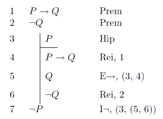

  :::

  - **Eliminação da negação:**
    Afirma que negar uma proposição duas vezes é o mesmo que a afirmar. Abreviada por E$\neg$, $n$, onde $n$ é a linha onde apareceu a _fbf_ duplamente negada.

  ::: tip ELIMINAÇÃO DA NEGAÇÃO

  A eliminação da negação tem sempre um aspeto deste género:

  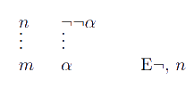

  :::

  ::: details Exemplo - Eliminação da Negação

  Em relação a um exemplo mais concreto:

  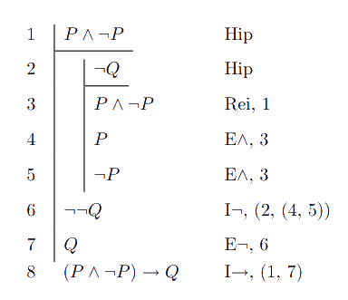

  :::

- **Regras para a disjunção:**

  - **Introdução da disjunção:**
    Tem em conta o significado intuitivo de uma disjunção - esta apenas precisa requer que um dos elementos se verifique para ser verdadeira. Assim sendo, partindo de uma _fbf_ $\alpha$, podemos derivar tanto $\alpha\vee\beta$ como $\beta\vee\alpha$, sendo $\beta$ qualquer _fbf_. Abreviada por I$\vee$, $n$, com $n$ sendo a linha onde a _fbf_ $\alpha$ foi introduzida.

  ::: tip INTRODUÇÃO DA DISJUNÇÃO

  A introdução da disjunção tem sempre um aspeto deste género:

  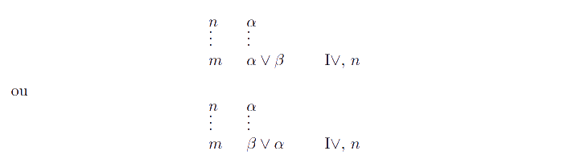

  :::

  ::: details Exemplo - Introdução da Disjunção

  Em relação a um exemplo mais concreto:

  

  :::

  - **Eliminação da disjunção:**
    "A regra mais complicada", segundo o prof. Pavão. A partir dela, podemos retirar que, tendo por base uma _fbf_ do tipo $\alpha\vee\beta$, caso sejamos capazes de derivar uma terceira _fbf_ $\gamma$ a partir de provas hipotéticas iniciadas por tanto $\alpha$ como por $\beta$, então certamente que $\gamma$ se verifica - voltando à tal intuição associada à disjunção, pelo menos um elemento é verdadeiro, se podemos derivar uma _fbf_ tanto de um como de outro, então ela verifica-se obrigatoriamente. Abreviada por E$\vee$, ($n$, ($o$, $p$), ($r$, $s$)), onde $n$ representa a _fbf_ disjunta inicial, $o$ e $r$ o início de cada hipótese e $p$ e $s$ a derivação da _fbf_ pretendida, dentro da respetiva hipótese.

  ::: tip ELIMINAÇÃO DA DISJUNÇÃO

  A Eliminação da disjunção tem sempre um aspeto deste género:

  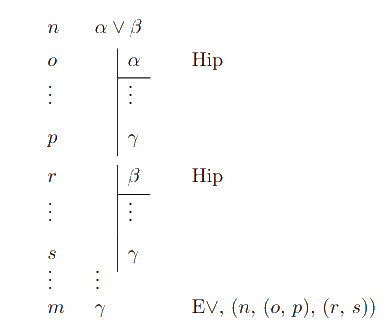

  :::

  ::: details Exemplo - Eliminação da Disjunção

  Em relação a um exemplo mais concreto:

  

  :::

- **Regras para a equivalência:**

  ::: warning

  Não foi abordado pelo prof. Pavão, não sei se é relevante/se pode sair em avaliação, mas achei por bem colocar.

  :::

  - **Introdução da equivalência:**
    Desta regra podemos retirar que, caso tenhamos duas _fbfs_ distintas tais que $\alpha\to\beta$ e $\beta\to\alpha$, então podemos derivar que $\alpha$ e $\beta$ são equivalentes. Abreviada por I$\leftrightarrow$, ($n$, $m$), com $n$ e $m$ sendo as linhas onde as _fbfs_ necessárias foram introduzidas.

  - **Eliminação da equivalência:**
    Dada uma _fbf_ $\alpha\leftrightarrow\beta$, podemos derivar tanto $\alpha\to\beta$ como $\beta\to\alpha$. Abreviada por E$\leftrightarrow$, $n$, onde $n$ é a linha onde a _fbf_ a utilizar o símbolo da equivalência foi introduzida.

  ::: tip INTRODUÇÃO/ELIMINAÇÃO DA EQUIVALÊNCIA

  A introdução da equivalência tem sempre um aspeto deste género:

  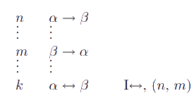

  A eliminação da equivalência tem sempre um aspeto deste género:

  

  :::

Não obstante não haver uma relação direta entre a sua definição e as regras de inferência em si, definimos agora _teorema_.

- **Teorema** - _fbf_ que pode ser obtida a partir de uma prova que não contém qualquer premissa, pode ser obtida "do nada". Seja $\alpha$ um teorema, podemos escrever $\varnothing\vdash\alpha$ ou, até, de um modo mais simples, $\vdash\alpha$

::: details Exemplo - Teorema

A seguinte prova mostra que P $\to$ (Q $\to$ P) é um teorema, visto que pode ser obtido sem premissas:

:::

### Como construir provas?

- Ao tentar provar uma _fbf_ da forma $\alpha\to\beta$, a alternativa mais comum é iniciar uma prova hipotética com a introdução da hipótese $\alpha$ e dentro dessa prova tentar provar $\beta$;
- Ao tentar provar uma _fbf_ da forma $\alpha\vee\beta$, devemos tentar provar uma das _fbfs_, $\alpha$ ou $\beta$;
- Ao tentar provar uma _fbf_ da forma $\alpha\wedge\beta$, devemos tentar provar separadamente tanto $\alpha$ como $\beta$;

Caso não resulte, podemos procurar **aplicações de regras de inferência** que levem à introdução da _fbf_ em questão, procurar uma **contradição de uma prova hipotética** por absurdo que nos leve à _fbf_, ou até mesmo tentar o **raciocínio por casos**, caso se trate de disjunções.
