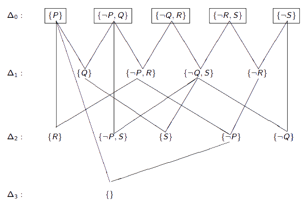
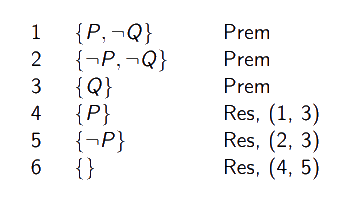

# Lógica Proposicional aplicada a sistemas computacionais

[[toc]]

::: danger AVISO

Esta matéria não sai na avaliação da semana 8-12 de março.

:::

Voltamos a considerar a lógica proposicional, mas desta feita sob a perspetiva da sua utilização por sistemas computacionais, não por humanos.
A geração automática de provas utilizando sistemas de dedução natural não é fácil, pelo que foram desenvolvidos métodos para a automatização da geração de provas. Um deles é a **resolução**.

## Resolução

Abordagem ao sistema dedutivo baseada numa única regra de inferência (ao contrário das provas abordadas anteriormente) - o **princípio da resolução**. A utilização deste obriga à transformação das _fbfs_ numa forma especial, a _forma clausal_ que corresponde a uma **conjunção de cláusulas**.

### Forma clausal

- **Literal** - uma _fbf_ atómica ou (a sua negação) é chamada uma literal. Um literal positivo é uma _fbf_ atómica não negada, sendo que um negativo é uma _fbf_ negada. Importante relembrar que uma _fbf_ atómica corresponde a uma _fbf_ composta por um símbolo de proposição, não contendo quaisquer conectores lógicos.

- **Cláusula** - um literal/disjunção de laterais. Caso consista em apenas um literal, podemos chamá-la cláusula _unitária_. Pode ainda ser representada como um conjunto (através do uso de chavetas) de literais.

::: details Exemplo - Literais + cláusulas

Sendo P e Q símbolos de proposição, P e $\neg$Q são literais (positivo e negativo, respetivamente); P, P$\vee$Q, $\neg$P$\vee$Q e $\neg$Q são cláusulas, sendo que a primeira e a última são cláusulas unitárias.

A cláusula unitária P pode ser representada como um conjunto tal que {P}.
A cláusula P$\vee$Q pode ser representada como um conjunto tal que {P, Q}.

:::

Uma _fbf_ diz-se na **forma conjuntiva normal** caso seja da forma $\alpha\wedge\beta\wedge\dots\wedge\gamma$, onde $\alpha, \beta,\dots,\gamma$ são obrigatoriamente cláusulas, unitárias ou não.

:::details Exemplo - Forma conjuntiva normal

A _fbf_ (P$\vee\neg$Q$\vee$R)$\wedge$($\neg$P$\vee$S) está na forma conjuntiva normal.
A mesma _fbf_ pode ser representada como um conjunto tal que {{P, $\neg$Q, R}, {$\neg$P, S}}.

:::

### Transformação de uma _fbf_ em forma clausal

As _fbfs_ podem, contudo, não nos ser apresentadas inicialmente nesta forma de disjunção de literais. É, portanto, importante ter e usar algoritmos e estratégias que nos permitam transformar _fbfs_ em forma clausal.

- **Passos para a transformação de uma _fbf_ em forma clausal**

  ::: tip Eliminar o símbolo →

  Passo baseado na equivalência ($\alpha\to\beta$) $\leftrightarrow$ ($\neg\alpha\vee\beta$).

  :::

  ::: details Exemplo - Eliminar o símbolo →

  Partindo de P $\to \neg$(Q $\vee$ ((R $\wedge$ S) $\to$ P)):

  $\neg$P $\vee$ $\neg$(Q $\vee$ ((R $\wedge$ S) $\to$ P));

  $\neg$P $\vee$ $\neg$(Q $\vee$ ($\neg$(R $\wedge$ S) $\vee$ P)).

  :::

  ::: tip Reduzir o domínio do símbolo ¬

  Em forma clausal, nunca queremos que a forma final $\neg$ envolva a cláusula toda; por outro lado, não há qualquer problema em negar literais, pelo que aproveitamo-nos disso através de:

  :::

    - **Lei da Dupla Negação**

    $\neg\neg\alpha \leftrightarrow \alpha$

    - **Primeiras Leis de De Morgan**

    $\neg(\alpha\vee\beta) \leftrightarrow (\neg\alpha\wedge\neg\beta)$  
    $\neg(\alpha\wedge\beta) \leftrightarrow (\neg\alpha\vee\neg\beta)$

  ::: details Exemplo - Reduzir o domínio de ¬

  Partindo de $\neg$P $\vee$ $\neg$(Q $\wedge$ $\neg$($\neg$(R $\wedge$ S) $\vee$ P)):

  Aplicar as primeiras leis de De morgan:

  $\neg$P $\vee$ $\neg$(Q $\wedge$ ($\neg\neg$(R $\wedge$ S) $\wedge$ $\neg$P));

  Aplicar a Lei da dupla negação

  $\neg$P $\vee$ $\neg$(Q $\wedge$ ((R $\wedge$ S) $\wedge$ $\neg$P));

  :::

  ::: tip Obtenção da forma conjuntiva normal

  Baseia-se na equivalência $\alpha\vee(\beta\wedge\gamma)\leftrightarrow(\alpha\vee\beta)\wedge(\alpha\vee\gamma)$ para tornar disjunções em conjunções de disjunções, que estão na forma conjuntiva normal.

  :::

  ::: details Exemplo - Obter a forma conjuntiva normal

  Partindo de ($\neg$P $\vee$ $\neg$Q) $\wedge$ ($\neg$P $\vee$ ((R $\wedge$ S) $\vee$ P)):

  ($\neg$P $\vee$ $\neg$Q) $\wedge$ ($\neg$P $\vee$ (R $\wedge$ S)) $\wedge$ ($\neg$P $\vee$ $\neg$P);

  ($\neg$P $\vee$ $\neg$Q) $\wedge$ ($\neg$P $\vee$ R) $\wedge$ ($\neg$P $\vee$ S) $\wedge$ ($\neg$P $\vee$ $\neg$P).

  :::

  ::: tip Eliminar o símbolo ∧

  Transformar a _fbf_ já na forma conjuntiva normal num conjunto de cláusulas.

  :::

  ::: details Exemplo - Eliminar o símbolo ∧

  Partindo de ($\neg$P $\vee$ $\neg$Q) $\wedge$ ($\neg$P $\vee$ R) $\wedge$ ($\neg$P $\vee$ S) $\wedge$ ($\neg$P $\vee$ $\neg$P):

  {$\neg$P $\vee$ $\neg$Q, $\neg$P $\vee$ R, $\neg$P $\vee$ S, $\neg$P $\vee$ $\neg$P}.

  :::

  ::: tip Eliminar o símbolo ∨

  Transformar cada cláusula num conjunto de literais.

  :::

  ::: details Exemplo - Eliminar o símbolo ∨

  Partindo de {$\neg$P $\vee$ $\neg$Q, $\neg$P $\vee$ R, $\neg$P $\vee$ S, $\neg$P $\vee$ $\neg$P}:

  {{$\neg$P, $\neg$Q}, {$\neg$P, R}, {$\neg$P, S}, {$\neg$P}}

  :::

  O princípio da resolução é, portanto, uma **regra de inferência derivada** que é aplicável a cláusulas, gerando novas cláusulas.

  - **Princípio da Resolução** - sejam Ψ e Φ duas cláusulas e $\alpha$ uma _fbf_ atómica, tal que $\alpha \in$ Ψ e $\neg\alpha \in$ Φ. Nesse caso, é possível inferir a cláusula (Ψ - {$\alpha$}) $\cup$ (Φ - {$\neg\alpha$}). A cláusula obtida é chamada o _resolvente_ das cláusulas Ψ e Φ, representado por **Res(Ψ, Φ)**, as quais são designadas **cláusulas-mãe**. Os literais $\alpha$ e $\neg\alpha$ designam-se **literais em conflito**.

  :::details Exemplos - Princípio da resolução

  Considerando as cláusulas {$\neg$P, Q, S} e {P, $\neg$Q}:

  O seu resolvente-P é {Q, S, $\neg$Q}; (removemos os literais P e $\neg$P em conflito)  
  O seu resolvente-Q é {$\neg$P, S, P}; (removemos os literais Q e $\neg$Q em conflito)

  Usando resolução, provar que {P, P $\to$ Q} $\vdash$ Q:

  - Passar à forma clausal: {P}, {$\neg$P, Q} e {Q};
  - Aplicar a resolução:

    

  Podemos ainda realizar resoluções mais extensas:

    

    **A cláusula vazia corresponde a uma contradição.**

  :::

  Normalmente a resolução aplica-se a provas por absurdo, as quais, utilizando a resolução, se chamam *provas por refutação*.

  - **Provas por refutação** - uma prova por refutação a partir de um conjunto de cláusulas $\Delta$ é uma prova por resolução de { } a partir de $\Delta$. O último exemplo do princípio da resolução corresponde a uma _prova por refutação_.

### Estratégias em Resolução

Numa prova por resolução, a decisão sobre quais as cláusulas a utilizar em cada passo da prova é tomada recorrendo a uma _estratégia de resolução_.

- **Geração por saturação de níveis**

  Consiste em separar as cláusulas geradas em vários níveis, cada um dos quais utiliza pelo menos uma das cláusulas existentes no nível anterior e gerar todas as cláusulas de um nível antes de começar a gerar as do próximo nível. _Em suma_, partindo de um conjunto de cláusulas inicial $\Delta$, criar um conjunto seguinte de todos os resolventes possíveis $\Delta_{1}$, repetindo até gerar ou o objetivo ou a cláusula vazia.

  ::: tip VANTAGENS VS DESVANTAGENS

  **Vantagem** - fornece um algoritmo que **garante** encontrar uma solução, se esta existir, que corresponde ao menor número de aplicações do princípio da resolução.  
  **Desvantagem** - gera muitas cláusulas que acabam por ser inúteis para a prova, incluindo algumas repetidas.

  :::

  ::: details Exemplo - Geração por saturação de níveis

  

  :::

Para aumentar a eficiência da geração de provas por resolução, foram desenvolvidas estratégias que se dividem em _estratégias de eliminação/seleção de cláusulas_.

- **Estratégias de Eliminação de Cláusulas**

  Passam por eliminar _teoremas, cláusulas não mínimas (ou subordinadas) e literais puros_.

  ::: tip Eliminação de Teoremas

    Corresponde à eliminação das cláusulas que contenham tanto $\alpha$ como $\neg\alpha$, sendo $\alpha$ um símbolo de proposição.
    Porquê? Porque para quaisquer _fbfs_ $\alpha$ e $\beta$, ($\alpha \vee \neg\alpha) \vee \beta$ é um teorema. Ora, um teorema não afetará o resultado final, visto que se $\Delta \cup {τ} \vdash \gamma$, então $\Delta \vdash \gamma$.

  :::

  Antes de abordar a eliminação de cláusulas não mínimas, interessa olhar para a definição de _subordinação_. Uma cláusula Ψ subordina Φ caso Ψ $\subseteq$ Φ.

  ::: tip Eliminação de cláusulas não mínimas

  Dado um conjunto de cláusulas, podemos eliminar todas as cláusulas subordinadas/não mínimas por uma outra cláusula existente no conjunto.

  :::

  ::: details Exemplo - Eliminar teoremas/cláusulas não mínimas  

  Um exemplo possível é:

  

  :::

  Para olhar para a eliminação de _literais puros_, temos primeiro de definir **literal puro** - um literal diz-se puro quando apenas o próprio literal (ou apenas a sua negação) aparece num dado conjunto de cláusulas.

  ::: details Exemplo - Literais puros

  Dado o conjunto de cláusulas {{P, Q, $\neg$R}, {P, $\neg$Q, $\neg$R}}, P e R são literais puros.

  :::

  Ora, se um literal é puro, não nos será útil durante provas por refutação, visto que não o poderemos eliminar por resolução. Assim sendo, podemos remover as cláusulas que o contêm.

  ::: tip Eliminação de Literais Puros

    Podemos remover todas as cláusulas que contenham literais puros. Esta estratégia é, ao contrário das últimas duas, realizada apenas uma vez, no início da prova por refutação.

- **Estratégias de Seleção de cláusulas**

  Corresponde a um processo de controlar as cláusulas geradas numa prova por resolução, impondo restrições às cláusulas que podem ser candidatas às cláusulas que podem ser candidatas à aplicação do princípio da resolução. Aqui, consideramos as resoluções _unitária_ e _linear_.

  ::: tip RESOLUÇÃO UNITÁRIA

  Baseia-se no facto de ao utilizarmos a resolução tentarmos por norma diminuir o número de literais existentes nas cláusulas produzidas (mais evidente em provas por refutação). Se uma das cláusulas envolvidas numa aplicação do princípio da resolução apenas contiver um literal, uma _cláusula unitária_, é então garantido que o resolvente tem menos literais do que a cláusula mãe com maior número de literais. Esta estratégia consiste, portanto, em aplicar o princípio da resolução utilizando sempre pelo menos uma cláusula unitária. **Nem todas as proposições válidas podem ser provadas desta maneira**, visto que nem sempre estamos na presença de cláusulas unitárias. Não é, portanto, um processo de inferência **completo**.

  :::

  ::: details Exemplo - Resolução unitária

  

  

  :::

  ::: tip RESOLUÇÃO LINEAR

  Começamos por selecionar uma cláusula entre as premissas, a _cláusula inicial_, obtendo um resolvente entre a cláusula inciial e outra qualquer pertencente às premissas. A partir daí, sempre que se aplica o princípio da resolução utiliza-se o último sucessor da cláusula inicial. Qualquer sucessor da cláusula inicial chama-se _cláusula central_. Geralmente como cláusula inicial escolhemos a que corresponde à negação da cláusula que pretendemos provar, usando portanto a prova por refutação. Nesta prova por refutação, adicionaríamos a negação da conclusão ao conjunto de premissas, e tentaríamos derivar { }.

  :::

  ::: details Exemplo - Resolução Linear

  Para provar que {{$\neg$P, Q}, {$\neg$Q, R}, {$\neg$R, S}, {P}} $\vdash$ {S}, começamos por transformar a prova em {{$\neg$P, Q}, {$\neg$Q, R}, {$\neg$R, S}, {P}, {$\neg$S}} $\vdash$ { }.  
  Uma vez que estamos a tentar provar S, utilizamos {$\neg$S} como cláusula inicial.

  

  :::

- **Correção e completude da resolução**

  A resolução é correta mas não completa quanto à resolução. Não é possível demonstrar todos os argumentos válidos. Contudo, a resolução é completa no que à **refutação** diz respeito, visto que podemos sempre derivar a cláusula vazia caso o conjunto inicial de cláusulas seja insatisfazível.
