# Lógica de Primeira Ordem - Introdução

[[toc]]

Lógica cuja linguagem nos permite considerar o "interior" (ao qual não podemos aceder) das proposições, isto é, as proposições elementares deixam de ser um todo e passam a ter uma estrutura, na qual podem existir constantes, variáveis e funções.
Contém dois símbolos adicionais em relação à lógica proposicional, os **quantificadores existencial e universal**.

## Componentes da linguagem

### Variáveis

Símbolos que desempenham o papel de designações (sem ser propriamente designações). A noção de variável está associada ao conceito de função à frente apresentado, mais concretamente ao seu domínio - uma variável pode tomar todos os valores do domínio de uma dada função, no contexto dessa função. Só por si não correspondem a entidades.

### Funções

No contexto estudado, corresponde a um conjunto de pares ordenados, potencialmente infinito, que não contém dois pares distintos com o mesmo primeiro elemento (um pouco com a noção de dicionários e chaves em Python). Tal como na matemática, as funções têm um domínio (conjunto de todos os primeiros elementos dos pares) e um contradomínio (segundos elementos dos pares). Recebem um elemento do domínio, o *argumento* da função, e calculam o elemento correspondente do contradomínio, o *valor* da função.
Sendo que correspondem a transformações, podemos utilizar funções para descrever entidades.

A **aridade** de uma função é a quantidade de argumentos que esta recebe. Uma função de aridade 0 é considerada uma **constante**.

::: details Exemplo - Função

A expressão designatória de uma função pode ser, por exemplo:

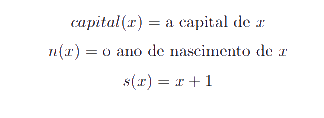

Sendo que os conjuntos de pares ordenados têm, por norma, este aspeto:

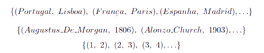

:::

### Relações

Palavra utilizada para representar qualquer relação entre elementos de conjuntos. Não são funções, visto que um primeiro elemento pode estar associado a mais que um segundo elemento. É usualmente definida através da especificação dos conjuntos aos quais os primeiro e segundo elementos pertencem, juntamente com uma expressão proposicional que faz uma afirmação sobre a sua relação.
Relações com apenas um argumento também se chamam **classes** ou **propriedades**.

::: details Exemplo - Relação

Relação correspondendo ao conjunto dos países que partilham fronteira terrestre:

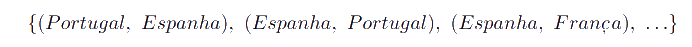

_Como podemos observar, Espanha é primeiro elemento duas vezes, pelo que não pode ser uma função._

A relação pode ser definida tal que:

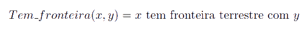

onde _tem fronteira terrestre com_ é a tal **expressão designatória**.

:::

### Alfabeto básico da linguagem

- Símbolos de pontuação: , ( ) [ ]

- Símbolos lógicos:

  - $\neg$, que corresponde à **negação**;
  - $\wedge$, que corresponde à **conjunção**;
  - $\vee$, que corresponde à **disjunção inclusiva**, vulgo OR;
  - $\to$, que corresponde à **implicação**.
  - $\exists$, que corresponde ao **quantificador existencial**.
  - $\forall$ que corresponde ao **quantificador universal**.

- $f^{n}_{i}$, para $n \geq 0, i \geq 1$ - funções de aridade $n$. Funções com aridade 0 ($n = 0$) são constantes. A i-gésima função diz-se com *n argumentos*. Começam com letra minúscula.

- $P^{n}_{i}$, para $n \geq 0, i \geq 1$ - letras de predicado com aridade $n$. Uma letra de predicado com $n$ argumentos representa uma relação *n_ária* (por exemplo, a relação de fronteira entre 2 países é uma relação binária). Começam com letra maiúscula.

- Variáveis individuais, $x_{i}$, como as usuais $x, y, z$.

### Termos

Correspondem às entidades sobre as quais queremos falar, o menor conjunto definido recursivamente através das seguintes regras de formação:

  - cada letra de constante é um termo;

  - cada variável é um termo;

  - se $t_{1}, \dots, t_{n}$ são termos, então a função que aceita esses argumentos também é um termo.

Um **termo fechado/chão** é um termo que não contém variáveis.

:::details Exemplo - Termos

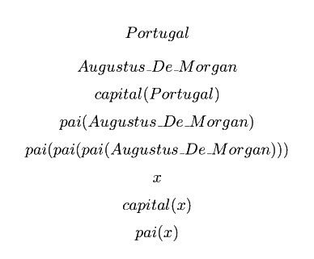

_Os cinco primeiros termos são fechados. Os seguintes não são._

:::

### Fórmulas bem formadas

O conceito de fórmula bem formada, _fbf_, é redefinido para a lógica de primeira ordem.
Corresponde ao menor conjunto definido através das seguintes regras de formação:

  - se $t_{1}, \dots, t_{n}$ são termos, então o predicado que aceita esses argumentos é uma _fbf_, sendo que esta _fbf_ é **atómica**;

  - Se $\alpha$ é uma _fbf_, $\neg\alpha$ é também uma _fbf_; a conjunção, disjunção e implicação de _fbfs_ é também uma _fbf_;

  - Se $\alpha$ é uma _fbf_, então $\forall x[\alpha]$ e $\exists x[\alpha]$ são também _fbfs_.

Uma _fbf_ sem variáveis é uma _formula chã_.

Resta notar que, sempre que possível, tentamos abreviar uma sequência de quantificadores do mesmo tipo numa só ocorrência do mesmo - por exemplo, $\forall x[\forall y[\dots]]$ é igual a $\forall x, y[\dots]$.

::: details Exemplo - Fórmulas bem formadas

Em relação ao seguinte exemplo, é relevante relembrar que o que começar por **letras minúsculas** corresponde a funções e por **maiúsculas** a relações.

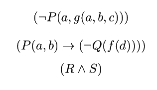

No próximo exemplo, a primeira _fbf_ é uma formula chã, visto que não tem variáveis, mas sim termos concretos.

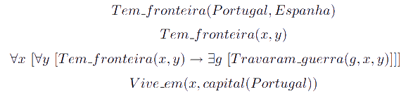

:::

Nas _fbfs_ $\forall x[\alpha]$ e $\exists x[\alpha]$, $\alpha$ é o **domínio do quantificador**. Diz-se que o quantificador **liga** a variável $x$.  
Uma ocorrência da variável $x$ diz-se _ligada_ numa _fbf_ caso esta ocorrência apareça dentro do domínio do quantificador que a introduz. Caso contrário, a variável diz-se _livre_. Uma _fbf_ sem variáveis livres diz-se _fechada_ - basta uma livre para não o ser. Caso não ocorram quantificadores no âmbito da variável em questão (caso falemos de uma relação, por exemplo), a variável é livre.

:::details Exemplo - Variáveis livres/fechadas

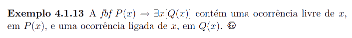

:::

## Sistema dedutivo

O sistema dedutivo da Lógica de Primeira Ordem difere do da Lógica Proposicional no que às regras de inferência diz respeito. Todas as regras de inferência introduzidas anteriormente (conjunção, disjunção, negação, implicação) são aqui aplicáveis, contudo iremos adicionar mais algumas.

### Regras para o quantificador universal

::: tip Introdução do quantificador universal

  Abreviada por $I\forall$, pode ser utilizada quando uma propriedade arbitrária, $\alpha(t)$, for provada para $t$. Utilizamos, para tal, uma técnica semelhante à regra da introdução da implicação, criando um novo "contexto" no qual aparece um novo termo, que nunca apareceu na prova, e tentamos provar que esse termo tem essa propriedade. A regra afirma, portanto, que se numa prova iniciada pela introdução da variável $x_{0}$ pudermos derivar a _fbf_ $\alpha (x_{0})$, então podemos escrever $\forall x[\alpha(x)]$.  

    

  Resta notar que aqui não estamos a trabalhar diretamente com as usuais provas hipotéticas, mas com um contexto iniciado por um qualquer termo (podemos, contudo, iniciar provas hipotéticas dentro desse contexto sem qualquer problema). A sua apresentação é também diferente, tal como pode ser observado acima.

:::

::: tip Eliminação do quantificador Universal

  Abreviada por $E\forall$, indica que a partir de $\forall x[\alpha(x)]$ podemos inferir $\alpha(t)$, onde $t$ é qualquer termo.

  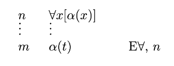

:::

::: details Exemplo - Introdução/Eliminação do quantificador universal

Prova do argumento $({\forall x[P(x) \to Q(x)], \forall x[Q(x) \to R(x)]}, \forall x[P(x) \to R(x)])$ (de notar que há mais que uma maneira de fazer esta prova):

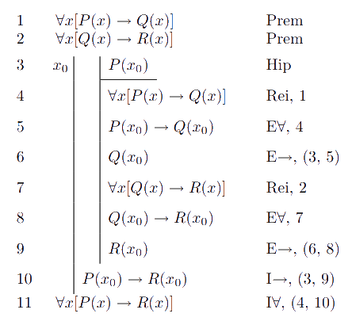

:::

### Regras para o quantificador existencial

::: tip Introdução do quantificador existencial

  Abreviada por $I\exists$, afirma que a partir de uma propriedade arbitrária $\alpha(t)$, podemos inferir $\exists x[\alpha(x)]$.

  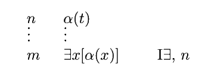  

:::

::: tip Eliminação do quantificador existencial

  Abreviada por $E\exists$, é, porventura, a mais complicada das quatro regras introduzidas. Temos, a partir de $\exists x[\alpha(t)]$ que existe pelo menos uma entidade que satisfaz a propriedade $\alpha$ - só não sabemos qual. Como não sabemos nada sobre essa entidade, nada podemos afirmar sobre ela, para além de $\alpha(t)$. Na prova, o objetivo será criar um "contexto" em que surge uma entidade nunca mencionada anteriormente; se dentro desse contexto formos capazes de derivar uma _fbf_ $\beta$, que não menciona $t$, então $\beta$ verificar-se-á independentemente de $t$.

  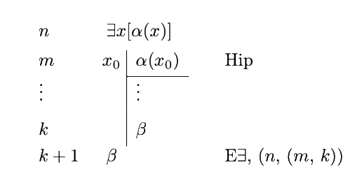

:::

::: details Exemplo - Introdução/Eliminação do quantificador existencial

Prova de $\exists x[P(x)] \to \neg\forall x[\neg P(x)]$:

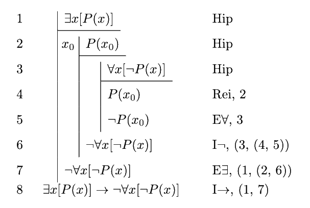

:::
