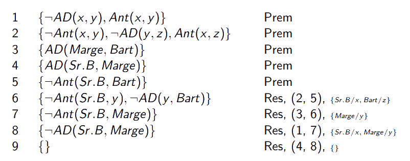

# Lógica de Primeira Ordem II

[[toc]]

Tal como para a Lógica Proposicional, é possível automatizar alguns aspetos relacionados com a Lógica de Primeira Ordem. Em relação ao sistema dedutivo, vamos voltar a olhar para a resolução. Além disso, olhamos agora para a Lógica de Primeira Ordem como forma de representar conhecimento sobre um dado contexto - um _mundo_.

## Representação do Conhecimento

Tem como objetivo principal fornecer a um computador declarações sobre um domínio, com vista a permitir que o próprio computador realize operações inteligentes sobre esse mesmo domínio. Ligada à área da Inteligência Artificial.

::: warning

Se estiverem apenas a estudar para a avaliação das práticas, as secções dos agentes cognitivos e das hipóteses subjacentes não são particularmente relevantes. A partir de _Representar Conhecimento em Lógica_ volta a ser relevante para esse propósito.

:::

::: tip Agentes cognitivos

A inteligência artificial constrói programas que agem tendo por base uma representação do conhecimento, os _agentes cognitivos_. São sensores que permitem que o computador se aperceba e possa agir em relação ao mundo que o rodeia; os procedimentos têm apenas por base aquilo que o computador sabe sobre o mundo.

Os agentes cognitivos têm como componentes principais a _base de conhecimento_, que contém uma representação do mundo, e o _motor de inferência_, conjunto de procedimentos independentes do conhecimento representado que manipulam a base do conhecimento.

:::

Duas hipóteses (hipóteses porque ainda não foi provado que são falsas) importantes em relação a este tipo de sistemas - _hipótese do sistema de símbolos físicos_ e _hipótese de representação do conhecimento_.

A primeira consiste em ter um sistema de símbolos físicos compostos por um conjunto de entidades, os tais símbolos, que correspondem a "padrões físicos", que podem ser agrupados em estruturas, e por um procedimentos que operam sobre eles. Haverá uma máquina a produzir sucessões de estruturas de símbolos, que contém memória para guardar informação sobre eles, entre outras propriedades.

- **Qualquer sistema que apresente comportamento inteligente pode ser visto como um sistema de símbolos físicos** - aplica-se a humanos por exemplo, onde os símbolos físicos aplicam-se na nossa memória. O nosso cérebro reage conforme identifica (ou não) um dado padrão, e tem capacidade de o memorizar.
- **Qualquer sistema de símbolos físicos de tamanho adequado (não qualquer programa) pode ser organizado de modo a exibir comportamento inteligente**.

Esta hipótese afirma, portanto, que é possível escrever um programa, um sistema de símbolos físicos, que exibe comportamento inteligente (aqui, inteligente no sentido de entidades inteligentes que surjam no mundo que nos rodeia, não no sentido de uma calculadora).

A segunda, a hipótese de representação do conhecimento, complementa a hipótese anterior. Diz-nos que qualquer processo mecânico que exibe comportamento inteligente é composto por estruturas, atribuídas por um observador externo, a uma representação proposicional do conhecimento usado por esse mesmo processo. Desempenham um papel formal, causal e essencial no comportamento que esse conhecimento manifesta. As tais estruturas proposicionais abrange qualquer estrutura de dados, dos grafos às matrizes, estruturas essas armazenadas na base de conhecimento. Afirma, ainda, que é o conhecimento representado, independentemente de como o representamos, que gera o comportamento do sistema.

### Representar Conhecimento em Lógica

O primeiro passo a tomar é inventar um modelo daquilo que pretendemos representar.

- **Modelo** - abstração do mundo que apenas captura os seus aspetos que são relevantes para um certo problema ou tarefa. Neste modelo, devemos definir as entidades do mundo sobre as quais queremos falar - o _universo do discurso_ - e as funções e relações que vamos utilizar. Estamos, assim a definir o **vocabulário** utilizado pelas _fbfs_ da representação escolhida. Depois de tomadas essas decisões, escrevemos as _fbfs_ que relacionam constantes, funções e/ou relações (**axiomas próprios**, proposições aceites sem prova em relação ao domínio atual)- tarefa da **representação**.

O conjunto de todas as constantes, funções, relações e axiomas próprios é a **ontologia** do domínio.

_Durante esta secção, o exemplo demonstrado será o d'Os Simpsons, tal como no livro_.

- **Definição do vocabulário**

  ::: tip Constantes

  $Bart, Lisa, Maggie, Marge, Homer, Selma, Abe \dots$

  :::

  ::: tip Relações

  _Unárias_

  $Homem(x) = x$ é um homem  
  $Mulher(x) = x$ é uma mulher

  _Binárias_

  $AD(x, y) = x$ é um ascendente direto de $y$  
  $Pai(x, y) = x$ é o pai de $y$  
  $Mãe(x, y) = x$ é a mãe de $y$  
  $Ant(x, y) = x$ é antepassado de $y$  
  $A2Linha(x, y) = x$ é um ascendente de 2ª linha de $y$  
  $\dots$

  :::

  Com as informações apresentadas até agora, podemos escrever algumas fórmulas chãs.

  ::: details Exemplo - (Algumas) Frases possíveis

  $Homem(Homer)$  
  $Homem(Abe)$  
  $AD(Abe, Homer)$

  :::

  Podemos ainda escrever algumas _fbfs_ (aqui já com variáveis individuais).

  ::: details Exemplo - Mais frases possíveis

  $\forall x, y[AD(x, y) \to Ant(x, y)]$

  $\forall x, y, z[AD(x, y) \wedge AD(y, z) \to AD(x, z)]$

  :::

Podemos realizar **provas** utilizando estas representações.

::: tip Prova

<!--- fiz só esta imagem em vez de usar latex porque estava com problemas em relação ao espaçamento (por causa da indicação das regras de inferência no fim da linha) -->

:::

## Forma Clausal

Obtida de forma semelhante à da Lógica Proposicional, apesar de algumas diferenças.

- **Eliminação do símbolo** $\to$ - igual à lógica proposicional.

- **Redução do domínio de** $\neg$ - igual à lógica proposicional, tendo ainda a adição de:

  ::: tip Segundas Leis de De Morgan

  $\neg\forall x[\alpha (x)] \leftrightarrow \exists x[\neg\alpha (x)]$

  _Dizer que nem todo o x tem uma certa propriedade é o mesmo que dizer que há pelo menos um x que não a tem_.

  $\neg\exists x[\alpha (x)] \leftrightarrow \forall x[\neg\alpha (x)]$

  _Dizer que não há nenhum x que tenha uma certa propriedade é o mesmo que dizer que todo o x não tem a falta dessa propriedade_.

  :::

- **Normalização de variáveis** - As ocorrências ligadas (dentro do domínio do quantificador) correspondem a variáveis mudas (irrelevantes para o valor da operação - por exemplo, em $\sum_{k = 1}^{5} 1$, $k$ é uma variável muda). A normalização de variáveis consiste em mudar o nome de algumas das variáveis, de modo a que o quantificador esteja associado a um único nome de variável - o objetivo é _não haver quantificadores associados às mesmas variáveis dentro do domínio de um quantificador_.

  ::: tip Normalização de variáveis

  $\forall x[\neg P(x) \vee (\forall y[\neg P(y) \vee P(f(x, y))]) \wedge \exists y[Q(x, y) \wedge \neg P(y)]]$

  _passa a_

  $\forall x[\neg P(x) \vee (\forall y[\neg P(y) \vee P(f(x, y))]) \wedge \exists z[Q(x, z) \wedge \neg P(z)]]$

  Contudo, se os quantificadores interiores estivessem fora do domínio do quantificador $\forall x$, a normalização de variáveis não ocorreria.

  :::

- **Eliminação dos quantificadores existenciais**

:::warning Aviso

Esta secção não é particularmente fácil de perceber só a ler, e mesmo com exemplos pode ser díficil perceber. Recomendo que, caso não percebam, revejam a aula do prof. Pavão, ele explica esta parte muito bem.

:::

- Eliminar quantificadores **isolados** - substituir a _fbf_ $\exists x[\alpha (x)]$ por $\alpha (c)$, onde $c$ é uma nova constante - a _constante de Skolem_. **A constante de Skolem é considerada a entidade que verifica a propriedade $\alpha$**, apesar de nada sabermos em concreto sobre ela. Só pode ser aplicada a **quantificadores isolados**, fora do domínio de outros quantificadores.

- Dependências entre quantificadores existenciais e universais - se um quantificador existencial aparecer dentro do domínio de um quantificador universal, existe a possibilidade do valor da variável quantificada _existencialmente_ depender do valor da variável quantificada _universalmente_. Caso dependa, substituímos a variável por um novo símbolo de função - função de Skolem, $f_{sk}(x)$. Aqui, "a variável de dentro depende/é função da de fora/o $y$(interior) depende/é função de $x$(exterior)". A existência do $y$ está diretamente dependente de qual é o $x$ em questão, e é daí que vem a noção de função.

::: details Exemplos

Podemos passar

$\forall x[Num\_Nat(x) \to \exists y[Num\_Nat(y) \wedge y > x]]$

para

$\forall x[Num\_Nat(x) \to Num\_Nat(f_{sk}(x)) \wedge f_{sk}(x) > x]$

_se repararem, a parte de baixo está diferente da dos slides; foi erro do professor, e ele próprio corrigiu em aula._

Aqui, o valor de $y$ depende do de $x$, pelo que para eliminar o quantificador existencial é necessário substituir a variável associada por um termo formado por um novo símbolo de função. $f$ é uma função de Skolem. Ao tentar substituir por uma constante de Skolem, obteríamos uma afirmação falsa (algo do género "Há um natural maior que todos os outros").

:::

Temos então, portanto, que se nenhum quantificador universal aparecer "por fora" de um dado quantificador existencial, substituímos todas as ocorrências da variável a ele ligada pela constante de Skolem e removemos o quantificador; caso contrário, rmeovemos também o quantificador, mas em vez de substituir a variável pela constante, substituímos pela função de Skolem.

- **Conversão para a forma Prenex normal** - todas as ocorrências de quantificadores universais são passadas para a esquerda.

::: details Conversão para a forma Prenex normal

$\forall x [\neg P(x)\vee(\forall y[\neg P(y) \vee P(f(x, y))] \wedge (Q(x, g_{sk}(x)) \wedge \neg P(g_{sk}(x))))]$

passa para

$\forall x\forall y[\neg P(x) \vee ((\neg P(y) \vee P(f(x, y))) \wedge (Q(x, g_{sk}(x)) \wedge \neg P(g_{sk}(x))))]$

:::

- **Eliminação da Quantificação Universal** - sendo que não há variáveis livres, e que todas elas estão quantificadas universalmente, a presença do quantificador acaba por ser irrelevante, visto que, lá está, as propriedades são _universais_. Podemos, então, remover os quantificadores.

::: details Eliminação da Quantificação Universal

$\forall x\forall y[\neg P(x) \vee ((\neg P(y) \vee P(f(x, y))) \wedge (Q(x, g_{sk}(x)) \wedge \neg P(g_{sk}(x))))]$

passa para

$\neg P(x) \vee ((\neg P(y) \vee P(f(x, y))) \wedge (Q(x, g_{sk}(x)) \wedge \neg P(g_{sk}(x))))$

:::

- **Obtenção da forma conjuntiva normal/eliminar os símbolos $\wedge$ e $\vee$** - processos idênticos aos da Lógica Proposicional.

## Unificação

**Processo ligado à [substituição](https://ist.diogotc.com/lp/0004-logica-primeiraordem-int.html#substituicao).**

Processo que permite determinar se duas _fbfs_ atómicas podem ser tornadas iguais através de substituições apropriadas para as suas variáveis livres. Antes de considerar o problema da unificação temos de introduzir a _composição de substituições_.

- **Composição de substituições** - sendo $s_{1}$ e $s_{2}$ duas substituições, a composição destas, $s_{1} \circ s_{2}$, é igual a $s$ tal que:

  - $a \cdot s = a \cdot (s_{1} \circ s_{2}) = (a \cdot s_{1}) \cdot s_{2}$

Gozam da propriedade associativa, **mas não da comutativa**.

Temos ainda que, e recuperando a noção de substituição vazia ($\epsilon$), a composição com a substituição vazia é tal que $s \leftrightarrow s \circ \epsilon  \leftrightarrow \epsilon \circ s$.

Em termos práticos, a composição realiza-se aplicando $s_{2} = \{u_{1}/y_{1}, \dots, u_{n}/y_{n}\}$ aos termos de $s_{1} = \{t_{1}/x_{1}, \dots, t_{n}/x_{n}\}$, adicionado a este resultado todos os elementos $u_{j}/y_{j}$ tais que $y_{j} \notin \{x_{1}, \dots, x_{n}\}$ e removendo todos os elementos $(t_{i} \cdot s_{2}/x_{i})$ tais que $t_{i} \cdot s_{2} = x_{i}$. Ou seja:

::: tip Composição

$s_{1} \circ s_{2} = (\{(t_{1} \cdot s_{2})/x_{1}, \dots, (t_{n} \cdot s_{2})/x_{n}\} \cup \{u_{j}/y_{j} \in s_{2}: y_{j} \notin {x_{1}, \dots, x_{n}}\}) - \{(t_{i}/s_{2})/x_{i}: (t_{i} \cdot s_{2}) = x_{i}\}.$

_Exemplo_

Seja $s_{1} = \{f(y)/x, z/y, a/w\}$ e $s_{2} = \{a/x, b/y, y/z, a/w\}.$

$s_{1} \circ s_{2} = (\{(f(y) \cdot \{a/x, b/y, y/z, a/w\})/x, (z \cdot \{a/x, b/y, y/z, a/w\})/y, (a \cdot \{a/x, b/y, y/z, a/w\})/w\} \cup \{y/z\}) - \{(z \cdot \{a/x, b/y, y/z, a/w\})/y\} = \{f(b)/x, y/y, a/w, y/z\} - \{y/y\} = \{f(b)/x, a/w, y/z\}$.

:::

- **Conjunto Unificador** - Dado um conjunto de _fbfs_ atómicas, este conjunto diz-se unificável caso exista uma substituição que torne idênticas todas as _fbfs_ do conjunto, dizendo-se que essa substituição é um **unificador do conjunto**. Pode haver mais que um unificador para um dado conjunto.

::: details Unificador

A substituição $\{a/x, b/y, c/z\}$ é unificador do conjunto $\{P(a, y, z), P(x, b, z)\}$, dando origem a $\{P(a, b, c)\}$.

:::

- **Unificador mais geral** - Dado um conjunto de _fbfs_ atómicas, o unificador mais geral do conjunto, **_mgu_**, é um unificador $s$ com a seguinte propriedade:

  - se $s_{1}$ for um unificador da _fbf_ da qual $s$ é o _mgu_, então existe uma substituição $s_{2}$ tal que $s_{1} = s \circ s_{2}$.

**O _mgu_ é único**, exceto para variantes alfabéticas de variáveis.

### Algoritmo de Unificação

Recebe um conjunto de _fbfs_ atómicas e decide se podem ser unificadas, devolvendo o seu _mgu_. O algoritmo apresentado a seguir percorre, em paralelo, os constituintes das _fbfs_ a unificar, da esquerda para a direita, começando pelo mais à esquerda. À medida que vai encontrando constituintes diferentes, **em desacordo**, tenta determinar uma substituição que os torne iguais. Em caso de sucesso, o algoritmo continua a percorrer as _fbfs_ que resultam da aplicação dessa substituição a todas as _fbfs_ a unificar; caso contrário, termina, indicando que o conjunto não é unificável. Percorridas todas as _fbfs_, o algoritmo termina com sucesso e a composição de substituições encontrada corresponde ao _mgu_.

Neste algoritmo, _card_ é a função que calcula o número de elementos do conjunto, _var_ é a função que tem valor verdadeiro se o argumento for uma variável, falso caso contrário, e _termo_ é a função que tem valor verdadeiro caso o argumento seja um termo, falso caso contrário. O algoritmo usa ainda outro algoritmo, _desacordo_ para determinar o conjunto de desacordo de um conjunto de _fbfs_. Obtém-se localizando o primeiro constituinte, a partir da esquerda, que não é igual a todas as _fbfs_ do conjunto e extraindo das _fbfs_ todos os componentes nessa posição.

::: details Desacordo

Em $\Delta = {P(x, f(x, y)), P(x, a), P(x, g(x))}$, o conjunto de desacordo é ${f(x, y), a, g(x)}$ - conjunto de _fbfs_ em desacordo, que não são iguais em todas as _fbfs_ de $\Delta$.

:::

::: tip Exemplo de aplicação do Algoritmo de Unificação

Seja $\Delta$ o conjunto $\{P(x, x), P(y, f(y))\}$. Se quisermos tentar determinar o seu _mgu_:

---

|         $\Delta$          |    $s$    |     $D$      | $\{t/x\}$ |
| :-----------------------: | :-------: | :----------: | :-------: |
| $\{P(x, x), P(y, f(y))\}$ |  $\{\}$   |  $\{x, y\}$  |  ${y/x}$  |
| $\{P(y, y), P(y, f(y))\}$ | $\{y/x\}$ | $\{y/f(y)\}$ |  $falha$  |

De cima para baixo, da esquerda para a direita:  
Começamos por olhar para $\Delta$ da esquerda para a direita; como podemos constatar, $x$ e $y$ estão em desacordo, se considerarmos os primeiros argumentos de cada _fbf_. Assim sendo, o conjunto atual de desacordo, $D$, passa a ser $\{x, y\}$. Sabemos que _deixa de ficar em desacordo_ se substituirmos $x$ por $y$ (a decisão é feita, mais uma vez, ao ler da esquerda para a direita), e adicionamos, portanto essa mesma substituição ao conjunto $s = s \circ \{y/x\} = \{y/x\}$. Voltamos a verificar o conjunto de desacordo, desta vez para o segundo argumento de cada _fbf_. Como é possível constatar, $y$ e $f(y)$ estão em desacordo. Contudo, $y$ ocorre em $f(y)$, pelo que a substituição não é possível, não podendo, portanto, unificar o conjunto. O conjunto **não é unificável**, e o algoritmo para aqui.

:::

## Resolução

Podemos agora enunciar o princípio da resolução para o caso em que as cláusulas contêm variáveis.

- **Princípio da Resolução, caso geral** - sejam Ψ e Φ duas cláusulas **sem variáveis em comum**, $\alpha$ e $\beta$, duas _fbfs_ atómicas tais que $\alpha \in Ψ$ e $\beta \in Φ$, e $\alpha$ e $\beta$ são unificáveis, com $s$ o _mgu_ destas. Segundo o princípio da resolução, podemos inferir a cláusula $((Ψ - \{\alpha \}) \cup (Φ - \{\neg \beta \})) \cdot  s$. Os literais $\alpha \cdot s$ e $\beta \cdot s$ serão literais em conflito, e a cláusula obtida é o resolvente das cláusulas.

Em termos correntes, removemos os literais em conflito e aplicamos o _mgu_ às que restam.

É, tal como a resolução da lógica proposicional, correta mas não completa. É, contudo, completa quanto à refutação.

::: tip Resolução

$Ψ = \{P(f(a), x)\}$ e $Φ = \{\neg P(y, h(z)), Q(f(y), z)\}$. O _mgu_ de $P(f(a), x)$ e $P(y, h(z))$ é $\{f(a)/y, h(z)/x\}$, e portanto o resolvente será a aplicação desse mesmo _mgu_ à cláusula restante, obtendo $\{Q(f(f(a)), z)\}$.

Graficamente:

:::

De notar que o resolvente pode não necessitar de uma substituição, isto é, pode existir resolvente entre duas cláusulas em que o conteúdo é "ele próprio" numa cláusula e a sua negação noutra, e aí podemos aplicar o resolvente tal como na lógica proposicional.

### Renomeação de variáveis

Se repararmos, na definição é referida a necessidade de não haver variáveis em comum entre as _fbfs_. Esta necessidade pode ser satisfeita renomeando todas as variáveis das cláusulas relevantes anets da aplicação do princípio da resolução, por exemplo passar $x$ para $x'$. Esta renomeação apenas ocorre numa das cláusulas, a outra instância mantém-se intacta (podemos fazer isto porque, na verdade, estamos na presença de variáveis quantificadas universalmente, portanto mudas).

::: details Renomeação de variáveis

Sejam $Ψ = \{P(x), Q(y)\}$ e $Φ = \{\neg P(x), R(y)\}$ duas cláusulas. Para aplicar o princípio da resolução, temos antes de renomear as variáveis, renomeação essa que origina a cláusula $Φ = \{\neg P(x'), R(y')\}$. Sendo $x$ e $x'$ duas variáveis diferentes, podemos agora unificá-las.

:::

::: tip Porquê renomear as variáveis?

Consideremos a seguinte afirmação: $\{\forall x, y[P(x, y) \to R(y, x)], \forall x, y[R(x, y) \to Q(y, x)]\} \vdash \forall x, y[P(x, y) \to Q(x, y)].$

Na forma clausal, será $\{\{\neg P(x, y), R(y, x)\}, \{\neg R(x, y), Q(y, x)\}\} \vdash \{\neg P(x, y), Q(x, y)\}.$

Se não renomearmos as variáveis, o _mgu_ de $R(y, x)$ e $R(x, y)$ será $\{x/y\}$, e a partir daí só podemos obter a cláusula $\{P(x, x), Q(x,x)\}$. Por outro lado, se renomearmos as variáveis obtemos um _mgu_ diferente e é possível chegar à expressão pretendida.

:::

### Provas por Resolução

**As noções de prova por resolução e refutação, bem como as estratégias de eliminação e seleção de cláusulas, migram da lógica proposicional para a de primeira ordem.**

Ao utilizar, em lógica de primeira ordem, cláusulas com variáveis, é-nos agora possível responder a dois tipos de questões - verdadeiro/falso e quem/qual.

::: details Prova por Resolução - Verdadeiro/Falso

Tenhamos como premissas:

- $\forall x, y[AD(x, y) \to Ant(x, y)]$
- $\forall x, y, z[Ant(x, y) \wedge AD(y, z) \to Ant(x, z)]$
- $AD(Marge, Bart)$
- $AD(Sr. B, Marge)$

A partir das quais queremos derivar $Ant(Sr.B, Bart).$

Primeiro, temos de passar as premissas à forma clausal. Negamos a conclusão (refutação), passando-a para as premissas, e a resolução dar-se-á assim:

Na linha 6, o que se faz é reparar que com substituir $x$ por $Sr.B$ e $z$ por $Bart$ leva a um resolvente em ordem $Ant(Sr.B, Bart)$. Assim sendo, aplicamos essa substituição (a todos os membros, incluindo os que não desaparecem) e utilizamos o resolvente. Um processo semelhante pode ser aplicado a todos os passos seguintes.

:::

::: details Prova por Resolução - Quem

Tenhamos como premissas as premissas do exemplo anterior (retirando a negação da conclusão, essa não interessará). A pergunta que faremos agora é **quem são os antepassados do Bart?**. O que fazemos para responder a perguntas deste tipo é adicionar uma _fbf_ às premissas tal que:

$\forall x[Ant(x, Bart) \to R(x)]$, onde $R(x) = "x$ é uma resposta". A resolução passará a ser tal que:

Se repararmos, chegamos 2 vezes a $R(resposta)$, onde $resposta$ corresponde a um dos antepassados do Bart.

Podíamos ainda realizar este processo de outra maneira: não adicionar aquela _fbf_ especiais ao conjunto de premissas e resolver a prova normalmente. Aí, podemos verificar que em todas as substituições durante a prova do tipo $\{Resposta/x\}$, essa tal resposta acaba por ser uma das possíveis. É outra maneira possível de resolver, e até indicação em contrário acho que podem escolher a que preferirem.

:::

::: details Prova por Resolução - Quais

De um modo semelhante ao último exemplo, podemos responder à questão **quais**. O processo será semelhante, adicionar uma _fbf_ especial e chegar a todas as respostas que a verificam.

Tentemos fazê-lo com este conjunto de premissas:

- $\forall x[Pessoa(x) \to \exists y[Mãe(x, y)]]$
- $\forall x, y[Mãe(x, y) \to Mulher(x)]$
- $Pessoa(Bart)$

Suponhamos que queremos descobrir **quem são as mulheres envolvidas nestas proposições**. Bem, introduzimos a tal _fbf_ especial às premissas, $\forall x[Mulher(x) \to R(x)$, e vamos trabalhar.

Chegamos, portanto, a que a única mulher conhecida é a mãe do Bart, apesar de o seu nome não estar explícito nas premissas.

De realçar que, tal como no exemplo anterior, não era necessário recorrer a esta _fbf_ extra - é só uma maneira diferente de se resolver.

:::
