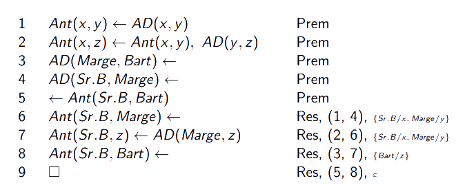
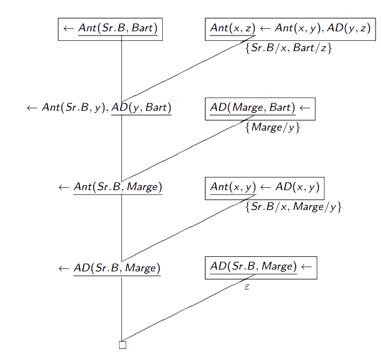

# Fundamentos da Programação em Lógica

[[toc]]

A programação lógica é um **paradigma de programação** no qual um programa corresponde à especificação de um problema de forma declarativa, o que contrasta com outros paradigmas de programação em que são os detalhes correspondentes ao algoritmo que definem a solução do problema.

Por uma questão meramente ligada à eficiência, utilizamos variações especiais de cláusulas e de resolução - as _cláusulas de Horn_ e a _resolução SLD_.

## Cláusulas de Horn

Cláusulas que contêm, no máximo, um literal positivo (isto é, não negado). Se existir, esse literal positivo será a **cabeça da cláusula**. Quaisquer literais negativos que possam existir farão parte do **corpo da cláusula**. São exemplos $\{C, \neg P_{1}, \neg P_{2}\}, \{C\}, \{\neg P_{1}, \neg P_{2}\}, \{\}.$

Dada a equivalência entre $\alpha \to \beta$ e a cláusula de Horn $\{\neg \alpha, \beta\}$, é vulgar escrever cláusulas de Horn sem ser na forma usual de cláusula (com as chavetas). Podemos representar cláusulas com o símbolo $\leftarrow$, com o corpo da cláusula à direita e a cabeça à esquerda. **A cláusula vazia é representada por $\square$**(sim é um quadrado $\text{Rafa}^2$ 😎).  
Desta feita, os exemplos apresentados anteriormente podem ser apresentados tais que $C \leftarrow P_{1}, P_{2}; C \leftarrow; \leftarrow P_{1}, P_{2}; \square.$

As cláusulas de Horn são divididas em quatro tipos:

- Regras/implicações, onde tanto a cabeça como o corpo contêm literais;
- Afirmações/factos, cláusulas onde o corpo não tem literais mas a cabeça sim (pode pensar-se da mesma maneira que olhamos para um teorema);
- Objetivos, cláusulas cuja cabeça é vazia mas o corpo contém pelo menos um literal;
- Cláusula vazia.

Se repararmos, os exemplos dados anteriormente são, respetivamente, exemplos de cada um destes tipos.

Tanto as regras como as afirmações chamam-se também **cláusulas determinadas** (do inglês _definite clauses_, referindo-se à sua natureza por serem as únicas onde a cabeça contém literais).

Em resolução com cláusulas de Horn, pelo menos um dos resolventes tem de ser uma cláusula determinada, visto que só estas contêm literais positivos (caso contrário nem sequer seria possível aplicar a resolução).

::: details Resolução com Cláusulas de Horn

O exemplo abaixo é o mesmo que o da [prova por resolução - verdadeiro/falso](./0005-logica-primeiraordem-sc.md#resolucao) da matéria anterior, só que utilizando resolução com cláusulas de Horn.

:::

## Programas

Em programação em lógica, um **programa** é qualquer conjunto finito de cláusulas determinadas; um objetivo, aqui, corresponde a uma cláusula cujas instâncias se pretendam derivar a partir desse programa. Um programa pode ser, por exemplo:

$Ant(x, y) \leftarrow AD(x, y)$  
$Ant(x, z) \leftarrow Ant(x, y), AD(y, z)$  
$AD(Marge, Bart) \leftarrow$  
$AD(Sr.B, Marge) \leftarrow$

Um objetivo pode ser, por exemplo:  
$\leftarrow Ant(Sr.B, Bart).$

- **Definição de um predicado** - num programa, o conjunto de todas as cláusulas cuja cabeça corresponde a um literal contendo a letra de predicado $P$ diz-se a _definição_ de $P$.

::: details Predicado

Em relação ao exemplo acima, a definição de $Ant$ seria dada por:

$\{Ant(x, y) \leftarrow AD(x, y),      Ant(x, z) \leftarrow Ant(x, y), AD(y, z)\}.$

:::

Uma definição de predicado que contenha apenas cláusulas fechadas, isto é, sem variáveis, chama-se uma **base de dados para esse predicado**.

::: details Base de Dados

Ainda em relação ao exemplo anterior, a base de dados de $AD$ pode ser dada por:

$\{AD(Marge, Bart) \leftarrow,       AD(Sr.B, Marge) \leftarrow \}$

visto que a definição de predicado de $AD$ não contém cláusulas não fechadas.

:::

::: tip Definições a reter

- **Resposta de um programa a um objetivo** - Sendo $\Delta$ um programa e $\alpha$ um objetivo, uma resposta de $\Delta$ ao objetivo $\alpha$ é uma substituição $s$ para as variáveis de $\alpha$.

- **Restrição de uma substituição a variáveis** - Sendo $s$ uma substituição e $\{x_{1}, \dots, x_{m}\}$ um conjunto de variáveis, a _restrição de $s$_ ao conjunto de variáveis $\{x_{1}, \dots, x_{m}\}$, escrita $s |_{\{x_{1}, \dots, x_{m}\}} = \{t_{i}/x_{i} \in s : x_{i} \in \{x_{1}, \dots, x_{m}\}\}.$

- **Resposta correta de um programa** - Uma resposta $s$ de $\Delta$ ao objetivo $\alpha$ diz-se _correta_ se $\Delta \models (\alpha \cdot s)$ ($\models$ lê-se "consequência semântica"); é correta caso $\Delta \cup \{\neg\alpha\cdot s\}$ for contraditório.

:::

Falemos em exemplos concretos. Tenhamos o programa:

$Ant(x, y) \leftarrow AD(x, y)$  
$Ant(x, z) \leftarrow Ant(x, y), AD(y, z)$  
$AD(Marge, Bart) \leftarrow$  
$AD(Sr.B, Marge) \leftarrow$

E o objetivo $\leftarrow Ant(x, Bart)$.

Tanto $s_{1} = \{Marge/x\}$ como $s_{2} = \{Sr.B/x\}$ são respostas do programa ao objetivo, no entanto só a última é uma resposta _correta_.

Agora, porque é que são estas as respostas?

Bem, no fundo estas substituições são as tais respostas a que chegamos no [exemplo de prova por resolução que respondia à pergunta "quem"](./0005-logica-primeiraordem-sc.md#provas-por-resolucao). Contudo, apenas $s_{2}$ é correta, visto que se tentarmos realizar a resolução sem recorrer à refutação, chegamos à cláusula $Ant(Sr.B, Bart)$, onde lá está, há a substituição $\{Sr.B/x\}$.

## Resolução SLD

Do inglês **_Linear Resolution with Selection Function and Definite clauses_**. É uma estratégia de resolução linear aplicável a _cláusulas determinadas_ (isto é, com cabeça), em conjunto com uma _função de seleção_, a qual dentro dos possiveis literais aplicáveis de acordo com a resolução escolhe um literal de modo determinístico.

Esta estratégia é utilizada devido ao normal princípio da resolução não ser determinístico - não há um caminho específico por onde ir. Para além da resolução "normal", o algoritmo de unificação também não é determinístico.

::: tip DEFINIÇÃO

**Função de seleção**, ou $S$, é uma regra para escolher um literal numa cláusula-objetivo como candidato à aplicação do princípio da resolução. É tal que $S(\leftarrow \alpha = (\alpha_{1}, \dots, \alpha_{n})) \in (\alpha_{1}, \dots, \alpha_{n}).$

:::

Escolhido o literal, é escolhida também uma cláusula do programa cuja cabeça unifique com o literal escolhido - **regra de procura**. Este passo é muito importante, porque caso não a apliquemos corretamente podemos correr o risco da prova ser infinita (ou pelo menos muito mais longa do que precisa de ser).

De um modo não rigoroso, a resolução SLD encontra a resposta de um programa a um objetivo, substituindo sucessivamente cada literal no objetivo pelo corpo de uma cláusula cuja cabeça seja unificável com o objetivo escolhido. O processo é sucessivamente repetido até que ou não existam mais sub-objetivos ou quando nenhum dos restantes sub-objetivos for unificável com a cabeça de nenhuma das cláusulas do programa.

- **Refutação SLD** - uma prova SLD diz-se _refutação_ SLD caso o seu último elemento seja a cláusula vazia, $\square$.

- **Resposta Calculada** - sendo $\Delta$ um programa, $\alpha$ um objetivo e $S$ uma função de seleção. Se a prova SLD para $\alpha$ usando $\Delta$ for finita, $[\gamma_{0}, \dots, \gamma_{n}]$ (sequência de objetivos), a composição das substituições $s_{0},\dots,s_{n-1}$ restringida às variáveis que ocorrem em $\alpha~(s_{0} \circ \dots \circ s_{n-1})|_{vars(\alpha)}$, diz-se uma resposta calculada de $\Delta$ a $\alpha$ via $S$. Diz-se também que $n$ é o comprimento da prova SLD.

::: details Resolução SLD

No exemplo seguinte, temos uma resolução SLD. Temos que o objetivo é $\leftarrow Ant(Sr.B, Bart)$, não tendo sub-objetivos. Assim sendo, procuramos a sua resolução com uma **cabeça** de uma cláusula do programa. Escolhemo-la, aplicamos o unificador e temos agora o resultado dessa resolução - um objetivo com dois sub-objetivos. Assim vamos prosseguindo até uma altura em que temos $AD(Sr.B, Marge)$ tanto no corpo como na cabeça das cláusulas que restam como objetivo e programa. Assim sendo, chegamos à cláusula vazia, concluindo que estamos na verdade na presença de uma **refutação SLD**.

Nesta prova, temos:

$\gamma_{0} = \leftarrow Ant(Sr.B, Bart)$  
$\gamma_{1} = \leftarrow Ant(Sr.B, y), AD(y, Bart)$  
$\gamma_{2} = \leftarrow Ant(Sr.B, Marge)$  
$\gamma_{3} = \leftarrow AD(Sr.B, Marge)$  
$\gamma_{4} = \square$

A **resposta calculada** é:  
$(\{Sr.B/x, Bart/z\} \circ \{Marge/y\} \circ \{Sr.B/x, Marge/y\} \circ \epsilon)|_{\{\}} = \epsilon$

:::

## Árvores SLD

A mesma função de seleção oferece várias alternativas para a construção de uma refutação SLD, consoante a cláusula escolhida. As árvores SLD são úteis para mostrar todas as alternativas em simultâneo.

- **Árvore SLD** - sendo $\Delta$ um programa, $\alpha$ um objetivo e $S$ uma função de seleção, a árvore SLD de $\Delta$ via $S$ é uma árvore rotulada, construída do seguinte modo:

  - o rótulo de cada nó é um objetivo;
  - o rótulo da raiz é $\alpha$;
  - cada nó com rótulo $\leftarrow \beta_{1},\dots,\beta_{n}$, tem um ramo por cada cláusula $\delta \leftarrow \gamma_{1},\dots,\gamma_{p} \in \Delta$ cuja cabeça é unificável com $S(\leftarrow \beta_{1},\dots,\beta_{n})$. O rótulo da raiz deste ramo corresponde ao resolvente entre as duas cláusulas.

Numa árvore SLD, os ramos que terminam em $\square$ dizem-se **bem sucedidos**, sendo que os que terminam em objetivos dizem-se **falhados** e os restantes **ramos infinitos**.

::: details Árvore SLD

Tenhamos o programa:

$P(x, z) \leftarrow Q(x, y), P(y, z)$  
$P(x, x) \leftarrow$  
$Q(a, b) \leftarrow$

e o objetivo:  
$\leftarrow P(x, b).$

(Dentro dos retângulos estão, respetivamente, a cláusula do programa com que foi feita a unificação e a substituição utilizadas). Como podemos observar, existem dois nós _bem sucedidos_ e um _falhado_, sem qualquer ramo infinito.

:::

- **Independência da função de seleção** - seja $\Delta$ um programa e $\alpha$ um objetivo. Independentemente da função de seleção, todas as árvores SLD de $\Delta$ e $\alpha$ têm o mesmo número (finito ou infinito) de ramos **bem sucedidos**.

[Slides](https://drive.google.com/file/d/1HHsikJwQmq6BHM1l2JdgZLIyZf95iMPd/view?usp=sharing)
