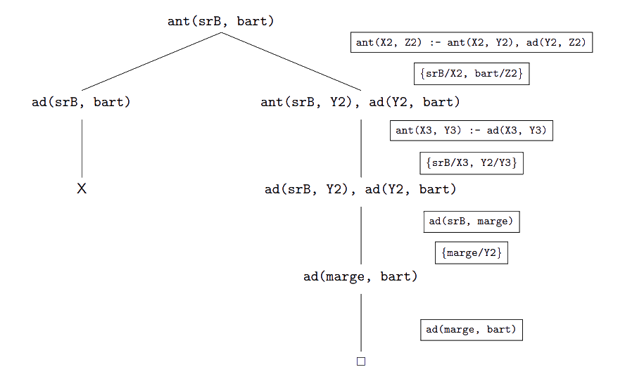
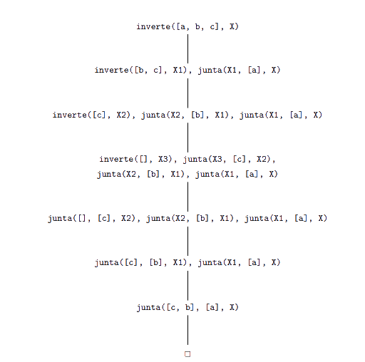
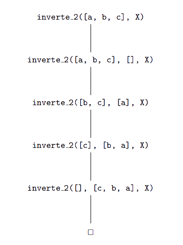

# Introdução ao Prolog

Prolog é uma linguagem de programação que utiliza o paradigma de programação em lógica - especifica **_o quê_** e **_o que lhe deve ser feito_**. Concebida com o objetivo inicial de resolver problemas associados à inteligência artificial/tradução de linguagem natural, hoje em dia as suas aplicações vão desde a LN/AI à lógica e à computação numérica e simbólica.

[[toc]]

## Conceitos Básicos

Importante - todo o input escrito na _prompt_ (`?-`) tem de terminar com um ponto final.\
Perguntamos _algo_ à prompt, e com a informação de que dispõe, o programa responde - se souber, dá-nos uma resposta;\
caso contrário (errado/falta de informação), responde que não sabe.

### Termos

Um dos conceitos importantes em Prolog é _termo_ - tal como na LPO, consiste numa variável, constante, ou função que as aceita como argumentos (um termo composto).

- **Constantes** - podem ser átomos ou números.

  - **Átomos**

    - podem ser como "nomes" numa LP normal (i.e `postMalone, ciDADE, zero`), começando sempre por minúscula;
    - cadeias de carateres, utilizando plicas, e aqui a primeira letra pode ser maiúscula ou até `_` (i.e `'cidade', 'Lebron', '_poster'`);
    - um átomo especial (`! , [ , ] , ; , { , } , + , - , * , / , **`), sendo estes últimos pouco utilizados.

    Se introduzirmos `atom(<argumento>)` na prompt, o Prolog devolve "true." ou "false.", caso o argumento seja um átomo ou não.

  - **Números** - consideramos apenas números inteiros. Se introduzirmos `number(<argumento>)` na prompt, o Prolog devolve "true." ou "false.", caso o argumento seja um número ou não.

  Podemos ainda fazer `atomic(<argumento>)` para verificar se o argumento é um átomo ou número.

- **Variáveis** - começam _sempre_ por maiúscula ou `_` (sendo que `_` por si só é a **variável anónima**, utilizada quando o valor da variável não tem interesse numa expressão). \
  Várias ocorrências de variáveis anónimas numa mesma expressão são **ocorrências distintas**, e devem ser tratadas como tal - não é necessariamente a mesma variável em cada sítio. \
  Podemos escrever `var(<argumento>)` e `nonvar(<argumento>)` para verificar se o argumento é uma variável segundo as convenções referidas acima.

- **Termos Compostos** - aplicação de um _functor_ a um dado número de argumentos. Um functor é necessariamente um átomo. Existem funções pré-embutidas em Prolog, tais como `+, *, /`.

  ::: details Exemplo

  `vencedor(X), 'vencedor'(_X), +(5, X), 5 + X`

  De realçar que escrever `+(5, X)` e `5 + X` é exatamente a mesma coisa.

  :::

- **Literais** - corresponde à aplicação de um predicado ao número apropriado de termos (devolve verdadeiro ou falso). Um literal de aridade (nº de argumentos) zero é um átomo. Sintaticamente, não existe diferença entre termos compostos e literais - decidir se é uma coisa ou outra depende do contexto.

  ::: details Exemplo

  `mae(Marge, Bart), filho(Bart, Marge)`

  :::

### Programas

Constituídos por uma sequência de cláusulas determinadas (cláusulas com cabeça). As cláusulas aceitam literais, funcionando tal como na LPO. Aqui, a implicação $\leftarrow$ é representada por `:-`.

::: details Cláusulas Determinadas

**Afirmações** - informações "concretas" dadas aos programa:

`pai(Homer, Bart),`
`comprarCigarros(pai, filhoRandom)`

**Regras** - informações "formais"/_regras_ dadas ao programa:
`ant(X,Y) :- ad(X, Y)`

:::

Podemos ainda ter cláusulas iterativas, cláusulas cujo corpo apenas contém um literal, sendo este igual ao utilizado na cabeça da cláusula.

::: details Cláusula Iterativa

`liga(X, Y) :- liga(Y, X)`

:::

- **Objetivos** - como na LPO, uma cláusula com corpo e sem cabeça.

- **Domínio de uma variável** - regras/objetivos nos quais a variável aparece.

## Unificação de termos

Na prompt, escrever `<expressão> = <expressão>` para verificar se é unificável, \
`<expressão> \= <expressão>` para verificar o contrário.

Devolve `false.` caso não seja unificável (1).\
 Se for unificável, pode devolver tanto a unificação concreta que torna a expressão verdadeira (2).\
 Caso a unificação não tenha uma resposta concreta devolve `true.` (3).

::: details Unificação

(1)

```prolog
?- a = b.
false.
?- f(X, a) = f(b, X).
false.
```

(2)

```prolog
?- f(X, a) = f(b, Y).
X = b, Y = a.
```

(3)

```prolog
?- X = X.
true.
?- f(_, _) = f(a, b).
true.
```

(aqui não há uma resposta concreta). Além disso, como podemos observar neste segundo exemplo, as variáveis anónimas são consideradas variáveis distintas (se não fossem, retornaria `false.`).
:::

### Comparação de termos

Na prompt, escrever `<expressão> == <expressão>` para verificar se são iguais,\
 `<expressão> \== <expressão>` para verificar o contrário.

::: details Comparação de Termos

```prolog
?- b == a.
false.
?- 'a' == a.
true.
?- X == a.
false.`
?- X = a, X == a.
X = a.
```

Neste último exemplo, o programa vai primeiro tentar unificar `X` com `a` e só depois é que ocorre a comparação, comparação que ocorre agora entre `a` e `a` (e que dá, portanto, `true.`).
:::

### Semântica

Para provar um objetivo, o Prolog recorre a uma Resolução SLD com função de seleção, função esta que escolhe o primeiro literal na cláusula objetivo, e com uma regra de procura que escolhe a primeira cláusula que se pode unificar com o literal selecionado da cláusula objetivo na sequência de cláusulas que corresponde ao programa.

- **Semântica declarativa** - preocupa-se com o que o programa afirma.

::: tip

A regra `ant(X, Z) :- ant(X, Y), ad(Y, Z)` pode ser lida como:\
 "Se `ant(X, Y)` e `ad(Y, Z)` se verificarem para uma dada substituição de `X, Y, Z`,\
 então `ant(X, Z)` verificar-se-á para a mesma substituição de `X` e `Z`".

:::

- **Semântica procedimental** - preocupa-se com o modo como provar um objetivo.

::: tip

A mesma regra descrita acima seria aqui lida como:\
 "Para poder provar uma dada instância de `ant(X, Z)`, devemos primeiro provar `ant(X, Y)` e, com as substituições adequadas para `X, Y, Z`, provar uma instância de `ad(Y, Z)`".

:::

### Exemplos de resoluções

Consideraremos, nesta secção, o programa

```prolog
% os comentários começam com percentagens.
ad(marge, bart).
ad(srB, marge).

ant(X, Y) :- ad(X, Y).
ant(X, Z) :- ant(X, Y), ad(Y, Z).
```

**Este programa tem erros, e à frente aprofundaremos quais são/o seu porquê**.

Podem testar os exemplos seguintes no SWI-Prolog ao criar um ficheiro `.pl` com o código acima, e dentro do SWI-Prolog ir a `Consult` e escolher esse ficheiro. De seguida, na `prompt`, escrever os objetivos indicados e verificar a resposta.\
Outra maneira possível é, na `prompt`, escrever `working_directory(_, '<path>').` ou `working_directory(CWD, '<path>').`para poderem aceder a todos os ficheiros `.pl` dessa diretoria e carregá-los com `[nome].` para `nome.pl` (portanto, sem a extensão). Além disso, podem verificar a diretoria atual com `pwd.`.

::: tip Resolução com um ramo bem sucedido

Tentar, através do programa anterior, provar `ant(srB, Bart)`. O Prolog cria uma árvore SLD para resolver o problema:



Aqui, é devolvido `true.`, visto que há um ramo bem sucedido para o programa e a cláusula objetivo não tem variáveis (equivalente à resposta calculada ser a substituição vazia na matéria anterior).

:::

::: tip Resolução com um ramo infinito

Considerando o programa acima referido,\
 e tentando agora chegar ao objetivo `ant(eva, bart)`, podemos verificar que o Prolog não só não encontra ramos bem sucedidos como chega a um ramo infinito.

Assim sendo, devolve um erro - `ERROR: Out of local stack.`.

Porquê? Porque a cláusula com que o objetivo tenta unificar apresentará comportamento recursivo, devido ao predicado da cabeça ser o mesmo (`ant`) do primeiro elemento do corpo, e o Prolog, com uma função de seleção $\alpha_{1}$ vai apresentar comportamento recursivo infinito.
Se a quarta cláusula do programa tivesse `ad(Y, Z)` e `ant(X, Y)` trocados, o programa iria devolver `false.`, com dois ramos falhados.


:::

Podíamos ainda ter o caso de só haver ramos falhados - nesse caso, o Prolog responderia `false.`, equivalente a "não sei". Esta equivalência tem por base a **hipótese do mundo fechado** - o Prolog assume que tudo o que não consegue derivar é falso.

Devemos ainda ter em consideração 2 pontos:

- Ao definir um predicado, devemos definir as afirmações (cláusulas só com cabeça) antes das regras; esta regra vem devido às afirmações não terem corpo, e a unificação leva ao desaparecimento do literal (queremos isto o mais "cedo" no programa possível).

- Devemos evitar recursão à esquerda, ou seja, em vez de escrever:\
  `pred1(A, C) :- pred1(A, B), pred2(B, C).`\
  devemos trocar a ordem de `pred1(A, B)` e `pred2(B, C)`.\
   Caso contrário, poderemos entrar em ciclos infinitos, visto que a função de seleção do Prolog é $\alpha_{1}$, e ao escolher o ramo mais à esquerda estaremos a entrar em recursões infinitas.

Caso haja **mais que uma resposta** a um dado objetivo dado um programa, podemos continuar a premir `;` até o Prolog esgotar os ramos bem sucedidos.

## Listas

Em Prolog, listas são tipos estruturados de informação pré-definidos. Tal como em python, os seus elementos são separados por vírgulas, estando delimitados por `[ ]`. Os elementos podem ser termos (variáveis, constantes ou termos compostos) ou outras listas, podendo, claro está, existir a lista vazia (`[]`).

::: details Exemplos de Listas

```prolog
[]
[a,b,c]
[[], [a, b], c, d]
[X, r(a, b, c), 6]
```

:::

Uma lista **não vazia** pode ser vista como sendo constituída por 2 entidades, o primeiro elemento e o resto. Havendo pelo menos um elemento, existe sempre um primeiro elemento; nesta "representação", não tem necessariamente de haver resto. Se houver, o Prolog retorná-lo-á em forma de lista. Utilizamos o padrão `[P | R]`, com o operador `|`, para separar o Primeiro elemento do Resto. A unificação de `[P|R]` com uma lista resultará numa interação deste género:

```prolog
?- [a, b] = [P | R].
P = a,
% podemos observar abaixo que b vem no "formato de lista"
R = [b].
% se ainda não tivesse ficado explícito, as vírgulas indicam que a solução "ainda não acabou",
% enquanto que o ponto e vírgula indica que são soluções distintas

?- [a] = [P | R].
P = a,
R = [].

?- [] = [P | R].
false.
% não há unificação possível, visto que não há primeiro elemento
```

### Exemplos de programas envolvendo listas

(recomendo que testem os trechos de código seguintes vocês próprios, incluindo inputs não testados aqui, para se irem habituando e aprendendo coisas sobre a linguagem).

::: tip Exemplo 1 - programa que testa se um dado elemento pertence a uma lista.

```prolog
% membro(E, L) - E é membro da lista L.
membro(E, [E|_]).
membro(E, [_|R]) :- membro(E, R).
```

O programa acima é constituído por uma afirmação e por uma regra. A afirmação diz que um elemento X é membro de uma lista cujo primeiro elemento é ele mesmo; a regra afirma que um elemento é membro de uma lista cujo primeiro elemento é diferente dele mesmo caso seja membro do resto da lista.

Exemplos de interações:

```prolog
?- membro(a, [a, b, c]).
true.
?- membro(c, [f, g, h]).
false.
?- membro(a, []).
false.
?- membro([a, b], [a, [a, b], c]).
true.
?- membro(X, [a, b, c]).
X = a;
X = b;
X = c;
false.
```

Mas e se o objetivo fosse `membro(a, X)`? O programa procuraria as listas das quais `a` é membro. Contudo, não temos informação concreta sobre o `a`, nem sobre as listas a que pertence, pelo que as respostas são infinitas. Assim sendo, o Prolog apresentará um output deste género:

```prolog
% lista da qual a é o primeiro elemento, e a variável _G268 é o resto
X = [a|_G268];
% lista da qual a é o segundo elemento, e por aí em diante
X = [_G8, a|_G12];
X = [_G8, _G11, a|_G15];
X = [_G8, _G11, _G14, a|_G18];
X = [_G8, _G11, _G14, _G17, a|_G21.
% porque é que o Prolog dá estes nomes às variáveis? Não faço a menor ideia
% segundo a Prof, "começam por um _ e
% seguem-se uma série de caracteres que não nos interessam"
% take that as you will
```

O operador `|` tem outras utilidades interessantes - separar elementos (que não necessariamente o primeiro) de uma lista e aceder a um elemento de uma lista.

```prolog
% utilização do | em conjunto com a variável anónima, _, para separar elementos
?- [a, b, c] = [_, Y | Z].
Y = b,
Z = [c].
?- [a, b, c] = [_, _, Y | Z].
Y = c,
Z = [].
```

```prolog
% utilização do operador | para aceder a elementos de uma lista
?- [1, 2, 3, 4] = [Prim, Seg, Terc | R].
Prim = 1,
Seg = 2,
Terc = 3,
R = [4].
?- [1, 2, 3] = [Prim, Seg, Terc | R].
Prim = 1,
Seg = 2,
Terc = 3,
R = [].
?- [1, 2] = [Prim, Seg, Terc | R].
false.
% relembrar que Prim, Seg e Terc continuam a ser variáveis
% não havendo uma unificação que envolva as 3, o Prolog devolve false
```

:::

::: details Exemplo 2 - programa que junta duas listas

```prolog
% junta(X, Y, Z) - Z é o resultado de juntar X a Y
junta([], L, L).
% a junção da lista vazia a uma lista qualquer é a própria lista
junta([P | R], L1, [P | L2]) :- junta(R, L1, L2).
% sendo L2 a junção de R a L1,
% a junção de uma lista iniciada por P com resto R a L1 dá uma lista P | L2
```

Uma interação básica pode ser:

```prolog
?- junta([], [a, b], L).
L = [a, b].
?- junta([c, b], [a], L).
L = [c, b, a].
?- junta([a, b], X, [a, b, c, d]).
X = [c, d].

% temos ainda uma interação mais interessante,
% para descobrir vários "pedaços" que levam a uma lista
?- junta(X, Y, [1, 2]).
X = [],
Y = [1, 2];
X = [1],
Y = [2];
X = [1, 2],
Y = [];
false.
% tivemos 3 soluções diferentes
```

:::

::: details Exemplo 3 - programa que inverte uma lista

**Processo Recursivo**

```prolog
% inverte(L, LI) - LI é L invertida
inverte([], []).
% a inversão da lista vazia é ela própria
inverte([P | R], LI) :- inverte(R, RI), junta(RI, [P], LI).
% sendo RI a inversão de R, e LI a junção de RI a P,
% a inversão de P|R resultará em LI
```

Uma interação básica pode ser:

```prolog
?- inverte([a, b, c], [c, b, a]).
true.
% [c, b, a] é [a, b, c] invertida - true
?- inverte([a, b, c], X).
X = [c, b, a].
% encontra a invertida de [a, b, c]
?- inverte(X, [a, b, c]).
X = [c, b, a].
% encontra a lista da qual [a, b, c] é a invertida
```

Sequência de objetivos neste processo:



**Processo Iterativo**

Como é fácil retirar e adicionar primeiros elementos de uma lista, podemos usar um acumulador tal que:

                Lista                                 Acumulador
                [a, b, c]                             []
                [b, c]                                [a]
                [c]                                   [b, a]
                []                                    [c, b, a]

Podemos, assim, definir um predicado diferente, iterativo, para a inversão de uma lista:

```prolog
inverte([], I, I).
% a invertida da lista vazia corresponde ao acumulador atual
inverte([P | R], Ac, I) :- inverte(R, [P | Ac], I).
% sendo R uma lista com acumulador atual P|Ac,
% então a sua invertida I é igual à lista [P|R] com acumulador atual Ac
inverte(L, I) :- inverte(L, [], I).
```

Sequência de objetivos neste processo:



:::

Há ainda mais exemplos nos slides e no livro.

[Slides (até às listas, não inclusive)](https://drive.google.com/file/d/1SFMZOOwxJFUZESPVZkRkDygGzmgsLad1/view?usp=sharing)
[Slides (listas)](https://drive.google.com/file/d/1g8IvdcEWB4nkGthrSACSWA6HYFlwmBRp/view?usp=sharing)
