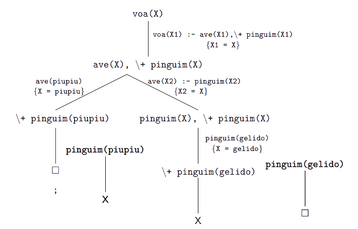

# Operador de Corte, Negação, Paragem/Execução Forçada

[[toc]]

## Operador de Corte

O **operador de corte**, `!`, é utilizado para indicar que, num programa onde certos ramos não produzirão soluções, certos ramos não devem ser utilizados (algo do género "se já sabes que o que fizeste está bem, vais à procura de mais porquê?"). Tal como o `break` de outras linguagens, só deve ser utilizado quando estritamente necessário (e, quando utilizado, devidamente comentado), visto que pode alterar inadvertidamente a semântica declarativa do programa. Cria, portanto, uma "barreira" no ramo da árvore SLD durante o retrocesso. **Tem sempre sucesso**, quando chamado.

Exemplo de um programa a utilizar o operador de corte:

```prolog
% remove_repetidos(L1, L2)

remove_repetidos([], []).

remove_repetidos([P|R], L) :-
  membro(P, R), !, % caso seja membro, nem precisa de ir à cláusula seguinte
  remove_repetidos(R, L).

remove_repetidos([P|R], [P|L]) :- remove_repetidos(R, L).

% a interação resultante é correta:

?- remove_repetidos([a,c,c,a,b,c], L).
L = [a,b,c].
```

De notar que não é por não avançar para a próxima cláusula que a atual é "ignorada" - a atual é levada até ao fim, com ou sem sucesso.

Abaixo podemos observar duas versões diferentes de um programa que faz exatamente o mesmo, com diferentes colocações do operador de corte:

```prolog
% parte(L, N, L1, L2)
% L1 contém os elementos de L menores que N, L2 os maiores ou iguais

% versão 1

parte([], _, [], []) :- !. % quando L é vazia, podemos começar o "retrocesso"

parte([P|R], N, [P|R1], L2) :-
  P < N, !, % caso P < N, não será necessário verificar a próx. cláusula
  parte(R, N, R1, L2).

parte([P|R], N, L1, [P|R2]) :-
  P >= N, % utilizar o corte aqui seria desnecessário, não há mais cláusulas
  parte(R, N, L1, R2).


% versão 2

parte([], _, [], []). % note-se a ausência do !

parte([P|R], N, [P|R1], L2) :-
  P < N, !, % aqui mantém-se igual
  parte(R, N, R1, L2).

parte([P|R], N, L1, [P|R2]) :-
  P >= N, !, % usado visto que a cláusula "caso-base" não tem !
  parte(R, N, L1, R2).
```

Note-se o posicionamento do operador de corte na versão 2 deste programa, que talvez possa fazer menos sentido à primeira vista. Visto que no retrocesso o terceiro argumento começa por ser a lista vazia, e a lista vazia não é do tipo `[P|R1]` (não tem primeiro elemento), não iria haver unificação com a cabeça da primeira regra, mesmo que fosse o que fizesse sentido. Assim sendo, temos de adicionar um corte à 2ª regra.

Podem testar esta diferença (presença/ausência do corte na 2ª regra) com o input `parte([4,8,1,10], 7, [], [4,8,1,10])`. Na versão correta, a resposta é `false`, visto que L1 devia ser `[4,1]` e L2 `[8,10]`; na versão errada, esta interação devolveria `true`.

::: details Quick Sort

Fazendo a ponte com IAED, podemos ainda utilizar o programa definido acima, em conjunto com o `append`, para implementar um Quick Sort.
A implementação passará por considerar um pivô, por ordenar, e dividir os restantes elementos em 2 grupos, menores e maiores ou iguais que ele (usando o `parte`); chamar o programa de novo até ordenar os dois grupos e colocar, por fim, o pivô entre os grupos, utilizando o `append`.

```prolog
% quicksort(L1, L2) - L1 desordenada, L2 ordenada

quicksort([], []).

quicksort([P|R], L) :-
  parte(R, P, Menores, Maiores),
  quicksort(Menores, MenoresOrd),
  quicksort(Maiores, MaioresOrd),
  append(MenoresOrd, [P|MaioresOrd], L).

% interação possível:
?- quicksort([6,2,3,1,8,4,7,5],L).
L = [1, 2, 3, 4, 5, 6, 7, 8].
```

:::

::: details Junção de Listas Ordenadas

É possível realizar a junção de duas listas ordenadas sem o operador de corte. Contudo, por uma questão de eficiência, é usual aparecer o operador de corte nalguma posição da cláusula. Por exemplo:

```prolog
% junta_ord(L1, L2, Res)

% quando uma das listas chega ao fim, realizamos a recursão
% da lista que ainda não acabou para trás
junta_ord(L, [], L) :- !. % não é preciso verificar mais
junta_ord([], L, L) :- !. % não é preciso verificar mais

junta_ord([P1|R1], [P2|R2], [P1|R]) :-
  P1 < P2, !, % se P1 < P2, não precisa de verificar mais
  junta_ord(R1, [P2, R2], R).

junta_ord([P1|R1], [P2|R2], [P1|R]) :-
  P1 = P2, !, % se P1 = P2, não precisa de verificar mais
  junta_ord(R1, R2, R).

junta_ord([P1|R1], [P2|R2], [P2|R]) :-
  P1 > P2, !, % não seria necessário, é colocado por consistência
  junta_ord([P1|R1], R2, R).
```

:::

Ora, dadas as suas semelhanças com o **break** de outras linguagens, devemos também ser relembrados dos **perigos inerentes ao operador de corte** (ou melhor, não ao operador em si, [tem direito à vida como os outros](https://math.tecnico.ulisboa.pt/photos/s_jpnunes.jpg), mas pelo uso indevido que lhe podemos dar).

Peguemos num programa, `menor`, que nos dá o menor de dois números. Podemos defini-lo, sem recorrer ao corte, através de:

```prolog
% menor(X, Y, Z) - Z é o menor entre X e Y

menor(X, Y, X) :- X =< Y.
menor(X, Y, Y) :- X > Y.
```

Podemos (e bem) tentar aplicar o operador de corte, tal que:

```prolog
menor(X, Y, X) :- X =< Y, !.
menor(X, Y, Y) :- X > Y.
```

Podíamos, contudo, tentar (mal) sintetizar ainda mais este programa, tal que:

```prolog
menor(X, Y, X) :- X =< Y, !. %
menor(_, Y, Y).
```

Este programa apresenta, no entanto, comportamentos errados. Na interação `menor(5, 10, 10)`, por exemplo, devolveria `true`, quando claramente deveria devolver `false`. Isto acontece porque a unificação de `menor(5, 10, 10)` com `menor(X, Y, X)` falha, vendo-nos, portanto, forçados a alterar o nosso programa se quisermos manter esta estrutura que utiliza a variável anónima:

```prolog
menor(X, Y, Z) :-
  X =< Y, !,
  Z = X.

menor(_, Y, Y).
```

## Falhanço Forçado

O predicado `fail/0` tem duas utilidades principais, sendo que apenas uma delas é vulgarmente utilizada. O seu propósito é **criar um nó falhado propositadamente**.

O primeiro propósito, menos usual, é para obter todas as respostas a um objetivo de uma vez, em vez de ter de utilizar o `;` para verificar todas as respostas. Podemos observar uma interação deste género abaixo:

```prolog
?- membro(X,[1,2,3]), writeln(membro(X,[1,2,3])), fail.
membro(1,[1,2,3])
membro(2,[1,2,3])
membro(3,[1,2,3])
false.
% esta interação é realizada sem a necessidade de ;
% o próprio ; também não aparece
```

O segundo propósito, mais utilizado e bastante poderoso, é **utilizar o** `fail` **em conjunto com o operador de corte**.
Um exemplo bastante simples para ilustrar a sua utilidade é o de verificar se duas listas são disjuntas - duas listas são disjuntas quando não têm nenhum membro em comum, pelo que basta haver um para o objetivo retornar `false`. Assim sendo, é interessante combinar um operador de corte com um `fail`, tal que:

```prolog
% disjuntas(L1, L2)

disjuntas([], _) :- !.
disjuntas(_, []) :- !.

% caso seja membro, nem precisa de verificar mais, é falso de certeza
disjuntas([P1|_], L2) :-
  member(P1, L2),
  !, fail.

disjuntas([_|R1], L2) :- disjuntas(R1, L2).
```

## Negação

A combinação mencionada acima, combinar o `fail` com o corte, permite definir a **negação por falhanço**, diferente da negação lógica. Esta negação é baseada na hipótese do mundo fechado, mencionada na introdução ao Prolog. Se o Prolog não consegue derivar algo, assume que é falso.

Em Prolog, este tipo de negação é utilizado através de um meta-predicado, `\+`, aplicado a literais.

Observemos o exemplo:

```prolog
\+(P) :-
  P,
  !, fail.

\+(P).
```

Este programa pode ser lido tal que "para responder ao objetivo `\+(P)`, tente-se provar P. Caso não seja possível, o objetivo é satisfeito; caso contrário, retorne-se `false`".

Em relação a um exemplo concreto:

```prolog
voa(P) :- ave(P), \+ pinguim(P).
% P voa caso seja uma ave que não um pinguim

ave(gelido).
ave(piupiu).
pinguim(gelido).

% interações possíveis

?- voa(gelido).
false.
?- voa(piupiu).
true.
?- voa(X).
X = piupiu ;
false.
```

A interação acima pode ser ilustrada por:



A negação por falhanço não funciona, contudo, corretamente para objetivos não chãos (ou seja para objetivos com variáveis).

## Execução Forçada

Apesar de teoricamente uma regra ter o formato `<literal> :- <literais>`,
podemos supor a hipótese de `literal` ser "nada". A regra ficaria, então, com um aspeto do género `:- <literais>`, algo do género "para provar "nada", prove os literais a seguir a `:-`". Pode ser bastante útil em casos de tentar fazer debug (i.e `:- writeln('Este é o passo <n> do programa')`), ou até mesmo para definir certos acontecimentos que acontecem _sempre_ ao carregar um certo ficheiro no Prolog.

Por exemplo, se utilizarem o SWI-Prolog, podem ir às definições e ao `user init file` e escrever alguns comandos que serão forçosamente executados, como por exemplo:

```prolog
% dark mode
:- use_module(library(theme/dark)).

% mensagem ao entrar
:- writeln('JKJK!').

% se estiverem na vossa diretoria default e quiserem abrir x ficheiros
% pode ser útil no projeto para não andarem sempre a abrir o ficheiro
:- [<nome do ficheiro>].
...
```

[Slides](https://drive.google.com/file/d/1afbQkFCtj6NenwOpm2eJc-mIyTV-0vrm/view?usp=sharing)
