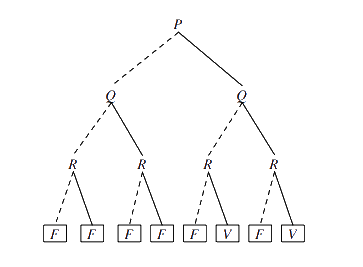
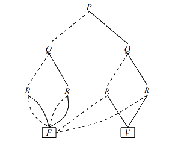
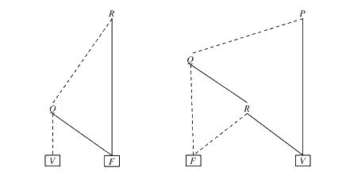

# Lógica Proposicional II - Diagramas de Decisão Binários

[[toc]]

O grande problema do algoritmo baseado em tabelas de verdade é o seu **crescimento exponencial**. Assim sendo, foram desenvolvidos outros algoritmos que permitem aferir de modo mais eficiente os valores lógicos de uma _fbf_. Nesta secção serão abordados os Diagramas de Decisão Binários, desordenados e ordenados, e na secção seguinte os Algoritmos de SAT.

## Diagramas de Decisão Binários - (O)BDDs

[Este pdf](https://www.dcc.fc.up.pt/~nam/web/resources/vfs20/vfs-mc-10.pdf) pode ser-vos útil caso queiram aprofundar mais conhecimento sobre esta secção/complementar alguma coisa que falte aqui (o documento está em inglês).

Precisamos, para falar de BDDs, de definir primeiro **árvore de decisão**.

::: tip DEFINIÇÃO

Uma **árvore de decisão** para uma _fbf_ é uma árvore onde os **nós** contêm símbolos de proposição e as **folhas** contêm valores lógicos. A cada nível de profundidade da árvore os nós correspondem _sempre_ ao mesmo símbolo de proposição, ou seja, no nível $n$ o símbolo de proposição é necessariamente o mesmo em todos os nós.  
Cada nó _domina_ duas árvores de decisão abaixo dele:

- uma à esquerda, ligada por uma linha a tracejado, indicando que segue o caminho onde o valor do nó é falso;
- uma à direita, ligada por uma linha "cheia", indicando que segue o caminho onde o valor do nó é verdadeiro;  
  O valor da folha atingida é o mesmo valor atingido na última coluna da tabela de verdade correspondente.

Abaixo podemos observar um exemplo para a árvore de decisão de $P \wedge ((Q \wedge R) \vee (R \wedge \neg Q))$:

:::

As árvores de decisão e as tabelas de verdade são, contudo, bastante semelhantes em relação ao seu tamanho e quantidade de pontos de decisão. Podemos, contudo, **transformá-las** em grafos acíclicos dirigidos e rotulados para representar, de modo mais condensado, a mesma informação. Abordemos primeiro estas duas propriedades dos grafos.

- **Grafo Dirigido** - estrutura $(N, A)$ em que $N$ é um conjunto finito e $A$ uma relação binária definida sobre $N$. Aqui, $N$ corresponderá aos **nós** do grafo e $A$ aos seus **arcos**. Dado um grafo dirigido, um nó para o qual não existe um arco que nele termina diz-se a **raiz**, enquanto que um nó que não tem um arco que dele parte diz-se uma **folha**. Um nó "intermédio" diz-se **não terminal**.

- **Grafo Acíclico** - grafo onde não é possível construir um caminho que comece e termine no mesmo nó.

- **Grafo Dirigido e Rotulado** - corresponde a uma estrutura $(N, A)$ em que cada relação em $A$ é um conjunto de arcos com um dado rótulo.

Um **BDD** é, portanto, um grafo acílico, dirigido e rotulado em que os rótulos dos nós podem tanto ser proposições (em nós iniciais/não terminais) como valores lógicos (folhas). Continuamos a ter os arcos a "cheio" e tracejado.

::: warning

O livro aborda vários pormenores interessantes sobre os grafos que não serão abordados nesta secção por não terem sido referidos em aula; de qualquer maneira é uma secção interessante, se quiserem ir ler mais está por volta da página 115 do PDF do Livro do Prof. Pavão.

:::

Um **diagrama de decisão binário ordenado**, OBDD, é um BDD que satisfaz alguma relação de ordem total para os símbolos de proposição que contém. Num OBDD não podem existir caminhos que contenham mais que uma vez o mesmo símbolo de proposição.

- O **nível**, $i$, de um OBDD é o conjunto de todos os seus nós de profundidade $i$.
- Dois OBDDs são compatíveis caso exista uma ordem aplicada aos seus símbolos de proposição tal que ambos os OBDDs a satisfaçam - se $P$ vem antes de $Q$ em $OBBD_{1}$, $P$ não pode vir depois de Q em $OBBD_{2}$.

::: details Exemplos de OBDDs (in)compatíveis

Os exemplos abaixo não são compatíveis, visto que não há uma ordem clara - no primeiro, $R$ vem antes de $Q$; no segundo $R$ vem depois de $Q$, não havendo, portanto, uma ordem clara.

::: danger

Work in progress

:::
