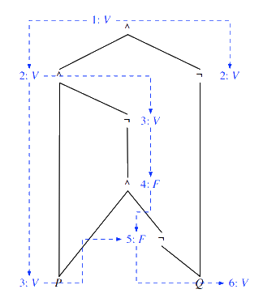
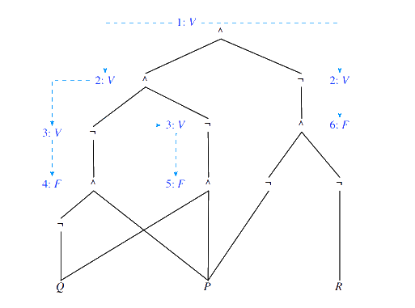

# Algoritmos de SAT

[[toc]]

Os algoritmos de SAT (do inglês _satisfiability_) têm como propósito determinar se uma _fbf_ é satisfazível e, em caso afirmativo, devolver uma interpretação que a satisfaça - um modelo dessa _fbf_. Os algoritmos de SAT são mais eficientes que OBDDs, visto que estes últimos dão-nos **todos** os modelos da _fbf_, o que pode ser bastante ineficiente (e neste caso não precisamos de todos os modelos). De recordar, ainda, que o facto de saber se uma _fbf_ é satisfazível ou não é uma das questões fundamentais na Lógica, isto é, saber se uma _fbf_ é consequência semântica de um conjunto de _fbfs_.

Vamos abordar 2 algoritmos de SAT:

- um primeiro, _baseado em propagação de marcas_, muito eficiente mas incompleto, podendo terminar sem resposta;

- um outro, _algoritmo DP_ (nomeado em honra de [Davis e Putman](https://dbpedia.org/page/Davis%E2%80%93Putnam_algorithm)), que apesar de menos eficiente é completo.

## Algoritmo baseado em propagação de marcas

A ideia por detrás deste algoritmo é, dada uma _fbf_, determinar as restrições que têm de ser satisfeitas pelas suas "sub-fórmulas" de modo a que a _fbf_ seja verdadeira. Aqui, o conceito de subfórmula é, de um modo abstrato, como o de símbolo de proposição - "que valor é que cada um destes símbolos de proposição tem de ter para a _fbf_ ser verdadeira". Por exemplo, para a _fbf_ $P \wedge Q$ ser satisfazivel, tanto P como Q, as subfórmulas de $P \wedge Q$, têm de ter valor lógico verdadeiro (ou seja a interpretação pretendida tem de ser tal que $I(P) = V$ e $I(Q) = V$).

Ora, a noção de **marca** vem precisamente desta noção: sempre que descobrimos que, para a _fbf_ fazer sentido, uma dada subfórmula tem de ter um valor lógico concreto, _marcamos_ essa subfórmula com esse valor lógico.

::: tip CHEGAR AOS DAG'S

Aqui, trabalhamos com grafos **dirigidos e acíclicos**, vulgo DAGs, grafos estes que vão corresponder às _fbfs_ cuja satisfazibilidade vamos procurar provar.
Chegamos a este grafo através de:

- transformar a _fbf_ original numa _fbf_ que só contém **conjunções e negações**, recorrendo a:

  - $P \vee Q \leftrightarrow \neg(\neg P \wedge \neg Q)$

  - $P \to Q \leftrightarrow \neg(P \wedge \neg Q)$

  - $\neg \neg P \leftrightarrow P$ (não obrigatório, contudo sempre realizada no decorrer destes algoritmos)

  Por exemplo, simplificar $\neg \neg (P \wedge \neg \neg (\neg P \vee Q))$ resultaria sucessivamente em $P \wedge (\neg P \vee Q)$, via eliminação da dupla negação, e $P \wedge \neg (P \wedge \neg Q)$, via a primeira equivalência referida acima.~

- já com a _fbf_ tranformada nesta versão mais simplificada, podemos construir o nosso DAG:

  - uma _fbf_ atómica, ou seja um símbolo de proposição, é uma árvore que é constituída apenas pela raiz, cujo rótulo é esse mesmo símbolo de proposição;

  - a negação, $\neg P$, é uma árvore cuja raiz é um nó de rótulo $\neg$, do qual sai um caminho/arco que leva à raiz de uma árvore, raiz essa rotulada com $P$.

  - a conjunção, $P \wedge Q$, é uma árvore de rótulo $\wedge$ da qual saem dois caminhos/arcos, um para cada árvore cuja raiz é o respetivo símbolo de proposição.

:::

Ora, este processo é sucessivamente aplicado até termos a árvore da _fbf_, cujas folhas são precisamente os símbolos de proposição que ocorrem na _fbf_. Para obter o DAG basta, agora, juntar as folhas com rótulos repetidos. Para ser ainda mais eficientes, podemos ainda partilhar nós repetidos (mas no livro não o fazem, nem nas aulas).

Bem, para isto não ser só uma parede infindável de texto, vamos introduzir uma imagem-exemplo, com a _fbf_ $(P \wedge \neg (P \wedge \neg Q))$:

À esquerda temos a primeira fase do processo, onde temos a raiz "principal" com rótulo $\wedge$, com arcos para P e para o "lado" de $\neg (P \wedge \neg Q)$. Ora, neste último, temos que a árvore tem raiz com rótulo $\neg$, que terá caminho para $P \wedge \neg Q$. Aqui voltamos a pegar no operador, $\wedge$, fazendo dele a raiz e criando um caminho para $P$ e para $\neg Q$. Resta ainda terminar o caminho de $\neg Q$, criando uma árvore com raiz de rótulo $\neg$ com arco para $Q$. Temos, portanto, a árvore terminada.

Por fim, juntamos as folhas com rótulos repetidos - neste caso, folhas com rótulo $P$, tendo como resultado final o DAG à direita.

### Propagação de marcas pelo grafo

Chegámos agora à próxima fase do algoritmo, a propagação de marcas (V ou F) pelo grafo. O primeiro passo é **sempre** marcar a raiz com V. As seguintes marcas são dadas por um conjunto de regras:

- Tendo um nó de rótulo $\neg$ marcado, o algoritmo propaga a marca "contrária" para os seus arcos; podemos ainda analisar o processo ao contrário - se temos um nó com rótulo marcado com arco "para cima" que leva a uma raiz com rótulo $\neg$, então, a raiz com $\neg$ tem a marca oposta.

- Tendo um nó de raiz $\wedge$ marcada com V, a marca V é também propagada pelos respetivos arcos; podemos também fazer o processo inverso - se dois nós com marca V tiverem arcos para o mesmo nó com rótulo $\wedge$, esse nó tem marca V. Por outro lado, basta um dos nós ter F para a conjunção ser falsa. Além disso, se um dos nós tiver marca V mas a raiz tiver marca F, podemos admitir que o outro nó tem marca F.

Se repararem, acima mencionei algumas vezes o "processo inverso/ascendente" - isto porque, caso apenas ocorra a propagação de marcas no sentido descendente, temos de verificar, começando nas folhas, se a propagação inversa também faz sentido (e é igual à descendente). Se for, encontrámos uma interpretação que satisfaz a _fbf_; caso contrário, a _fbf_ não é satisfazível.

::: details Exemplos - Propagação de Marcas

A propagação de marcas relativas à _fbf_ $P \wedge \neg (P \wedge \neg Q)$ tem um aspeto deste género:

Se tentarmos realizar a propagação de marcas no sentido ascendente obtemos as mesmas marcas que no sentido descendente, pelo que a _fbf_ é provada satisfazível, e encontrámos uma _testemunha_, interpretação que satisfaz a _fbf_. Contudo, talvez a explicação deste exemplo não seja suficiente para que esta verificação faça sentido - porque é que a propagação havia de ser diferente em sentidos diferentes? Bem, vejamos o exemplo abaixo, da _fbf_ $(P \wedge \neg (P \wedge \neg Q))\wedge \neg Q$:

Aqui, a propagação no sentido ascendente leva a marcas diferentes das propagadas no sentido descendente, pelo que a _fbf_ não é satisfazível. Podemos ver isso tendo que, olhando para a raiz, é uma conjunção, pelo que ambas as raizes com arcos ligados pela conjunção terão marca V, ficando com Q assim propagado como F, por via da negação ser verdadeira. Contudo, e olhando para o outro lado do DAG, temos que a nova conjunção também tem marca V, pelo que tanto P como a negação vão ser V. A conjunção que segue a negação é falsa, portanto, mas tendo que P é verdadeira a negação à direita tem de ser falsa (para a conjunção ser falsa) - sendo a negação falsa, Q teria de ser verdadeira. Temos aqui um problema - logo no início marcámos Q como falsa, e agora marcámo-la como verdadeira? Não pode ser, é uma contradição! Assim sendo, a _fbf_ é obrigatoriamente contraditória, e portanto não satisfazível.

Foi referido acima que o algoritmo de propagação de marcas não é completo, isto é, podemos não conseguir atribuir marcas a todos os nós do grafo. Ora vejamos o exemplo de $(P \to Q) \wedge (P \to \neg Q) \wedge (P \vee R)$:

Como podemos observar, ocorre (mais que uma vez até) chegarmos a situações em que a conjunção é falsa, mas não temos informação concreta sobre os "filhos", impossibilitando-nos portanto de aferir a marca de alguns símbolos de proposição. O resultado é, portanto, inconclusivo.

:::

Para nos ajudar (até um certo ponto) a marcar mais algumas marcas que restem temos o **algoritmo de testes de nós**.

Este algoritmo recebe um nó e um grafo. Marca temporariamente esse nó com V e verifica se a propagação de marcas origina agora outras marcas consistentes (não contraditórias). Caso aconteça, fantástico, encontrámos uma testemunha da _fbf_ com marcas corretas. Caso ocorra uma contradição, marcamos o nó que estávamos a testar com F (permanentemente), removemos as marcas temporárias que criámos a testar este nó e testamos com outro nó. Caso não ocorra uma contradição mas ainda fiquem nós por marcar, apagamos as marcas temporárias e voltamos a testar o mesmo nó, desta vez com a marca F. Caso nenhum dos testes seja conclusivo, não havendo contradição mas restando ainda marcas por propagar, fazemos a interseção das marcas temporárias em comum entre os dois testes e marcamo-las permanentemente, procurando agora testar um nó diferente.

Ora, peguemos na _fbf_ do último exemplo, $(P \to Q) \wedge (P \to \neg Q) \wedge (P \vee R)$:

Aqui, testamos marcar $P$ com V. Ora, do exemplo anterior, tínhamos que ambas as conjunções a que estava ligado eram falsas, o que levaria a que, simultaneamente, $Q$ e $\neg Q$ fossem falsas, o que é claramente contraditório. Marcamos, portanto, P permanentemente com F. Ora, com esta marca permanente podemos aferir alguns resultados, via propagação de marcas:

Falta apenas marcar Q, mas aqui qualquer rotulação gera uma _fbf_ satisfazível.

Resta, por fim, notar que este algoritmo continua a não ser completo - continua a haver casos em que, mesmo suportados pelo algoritmo do teste de nós, não conseguimos resolver todos os casos.

A grande vantagem destes algoritmos em relação aos algoritmos de DP é em relação à sua **eficiência**. O algoritmo de propagação de marcas tem crescimento linear, o de teste de nós cúbico, ambos substancialmente melhores que algoritmos baseados em DP que têm crescimento exponencial. É, portanto, uma questão de "pick your poison" - privilegiamos a eficiência ou a completude dos resultados?

## Algoritmos baseados em DP

Utilizam regras que transformam conjuntos de cláusulas em conjuntos de cláusulas. Têm como principal vantagem em relação ao algoritmo estudado acima o facto de ser **completo**, terminando sempre com uma resposta. São, contudo, menos eficientes, apresentando crescimento exponencial.

::: tip DEFINIÇÃO

(talvez reler na diagonal a secção sobre a [resolução](./0005-logica-primeiraordem-sc.md#resolucao) possa ajudar a relembrar conceitos esquecidos)

Sendo $\Delta$ um conjunto de cláusulas e $P_{i}$ um símbolo de proposição, o **conjunto de cláusulas obtido de $\Delta$ por eliminação de $P_{i}$**, $\exists P_{i} (\Delta)$, é obtido tal que:

- Todos os resolventes-$P_{i}$, gerados a partir de cláusulas de $\Delta$, são adicionados;

- Todas as cláusulas de $\Delta$ que mencionam $P_{i}$ são retiradas.

Tendo que nos resolventes obrigatoriamente não aparece $P_{i}$ e que já não temos em consideração as cláusulas de $\Delta$ que mencionam $P_{i}$, nenhuma cláusula do conjunto $\exists P_{i} (\Delta)$ mencionará $P_{i}$.

Como exemplo, podemos olhar para $\Delta = \{\{P, Q\}, \{\neg P, Q\}, \{\neg P, S\}, \{\neg Q, R\}\}$. Os resolventes-P são $\{Q\}$ e $\{Q, S\}$. Ignorando as cláusulas de $\Delta$ que mencionam P, podemos então construir $\exists P(\Delta) = \{\{Q\}, \{Q, S\}, \{\neg Q, R\}\}$.

:::

O algoritmo DP baseia-se no facto de $\Delta$ ser satisfazível se e só se $\exists P_{i}(\Delta)$ é satisfazível (a demonstração, que ainda é comprida, está no livro, pág 162 do PDF/pág 149 do livro).

Assim sendo, e pegando no exemplo utilizado na definição acima, podemos afirmar que $\Delta = \{\{P, Q\}, \{\neg P, Q\}, \{\neg P, S\}, \{\neg Q, R\}\}$ só é satisfazível caso $\exists P(\Delta) = \{\{Q\}, \{Q, S\}, \{\neg Q, R\}\}$ for satisfazível.

O algoritmo consiste em, partindo de uma _fbf_ $\Delta$ já na forma clausal, ir eliminado sucessivamente os símbolos de proposição de $\Delta$; desta forma, os conjuntos de cláusulas vão contendo cada vez menos símbolos de proposição, até que:

- chegamos à cláusula vazia, $\{\{\}\}$, o que nos indica que a _fbf_ inicial não é satisfazível;

- obtemos um _conjunto vazio de cláusulas_, $\{\}$, que corresponde a uma tautologia, pelo que podemos admitir que a _fbf_ inicial é satisfazível.

Chegamos **sempre** a um destes dois resultados, sendo esta a principal vantagem do algoritmo - chegamos sempre a um resultado concreto.

::: details Exemplos

$\Delta = \{\{P, Q\}, \{\neg P, Q\}, \{\neg Q, R\}, \{\neg R\}\}$

Realizando eliminações sucessivas de P, Q e R, chegamos à cláusula vazia (não confundir com conjunto vazio de cláusulas), pelo que podemos concluir que a _fbf_ não é satisfazível:

$\exists P(\Delta) = \{\{Q\}, \{\neg Q, R\}, \{\neg R\}\}$  
$\exists Q(\exists P(\Delta)) = \{\{R\}, \{\neg R\}\}$  
$\exists R(\exists Q(\exists P(\Delta))) = \{\{\}\}$

---

$\Delta = \{\{P, Q\}, \{\neg P, Q\}, \{\neg Q, R\}\}$

Realizando eliminações sucessivas de P, Q e R, chegamos a um conjunto vazio de cláusulas, podendo concluir que a _fbf_ é satisfazível:

$\exists P(\Delta) = \{\{Q\}, \{\neg Q, R\}\}$  
$\exists Q(\exists P(\Delta)) = \{\{R\}\}$  
$\exists R(\exists Q(\exists P(\Delta))) = \{\}$

Pode notar-se que na penúltima linha não são gerados resolventes-R, mas qualquer clausula que contenha R é removida, pelo que ficamos apenas com um conjunto vazio de cláusulas.

:::

Uma maneira de implementar o algoritmo DP consiste em utilizar o conceito de **balde** (não confundir com [balde](https://cdn.discordapp.com/attachments/832358053264621588/834539505565958204/2021-04-21_222139_162507283.png)), um conjunto de cláusulas. O algoritmo consiste em:

- **Criar e preencher baldes**

  - Primeiro, estabelecer uma relação de ordem total entre os símbolos de proposição na _fbf_;

  - Criar um balde sem elementos por cada símbolo de proposição que ocorra na _fbf_, cada um deles designado por $b_{P_{i}}$, ordenados de acordo com a relação de ordem total previamente estabelecida;

  - Cada cláusula é colocada no primeiro balde que houver tal que a cláusula menciona $P_{i}$.

- **Processar baldes**

  Para processar o balde $b_{P_{i}}$, geram-se todos os resolventes-$P_{i}$ a partir exclusivamente de cláusulas do balde respetivo; cada um destes resolventes é colocado no primeiro balde seguinte $b_{P_{j}}$ tal que a cláusula mencione $P_{j}$ e assim sucessivamente. Se durante o processamento de um balde for gerada a cláusula vazia, o algoritmo termina, indicando que a _fbf_ não é satisfazível. Se chegarmos ao fim e a cláusula vazia nunca for gerada, podemos afirmar que a _fbf_ é satisfazível.

::: details Exemplo - Aplicação do método dos baldes

Ora, peguemos na _fbf_ tal que $\Delta = \{\{P, Q, \neg R\}, \{\neg P, S, T, R\}, \{\neg P, Q, S\}, \{\neg Q, \neg R\}, \{S\}\}$. Podemos ainda estabelecer uma relação de ordem total arbitrária - seja ela $P \prec Q \prec R \prec S \prec T$. A primeira fase, criar e preencher os baldes, dá-se tal que:

$b_{P}: \{P, Q, \neg R\}, \{\neg P, S, T, R\}, \{\neg P, Q, S\}$  
$b_{Q}: \{\neg Q, \neg R\}$  
$b_{R}:$  
$b_{S}: \{S\}$  
$b_{T}:$

Processar o balde $b_{P}$ origina 2 novas cláusulas, nenhuma delas vazia, pelo que o algoritmo ainda não acabou (aqui uma das cláusulas está "contida" noutra, pelo que só queremos a menor):

$b_{P}: \{P, Q, \neg R\}, \{\neg P, S, T, R\}, \{\neg P, Q, S\}$  
$b_{Q}: \{\neg Q, \neg R\}, \qquad \qquad \qquad \qquad \qquad \qquad  \{Q, \neg R, S\}$  
$b_{R}:$  
$b_{S}: \{S\}$  
$b_{T}:$

Processar o balde $b_{Q}$ origina uma nova cláusula, não vazia:

$b_{P}: \{P, Q, \neg R\}, \{\neg P, S, T, R\}, \{\neg P, Q, S\}$  
$b_{Q}: \{\neg Q, \neg R\}, \qquad \qquad \qquad \qquad \qquad \qquad  \{Q, \neg R, S\}$  
$b_{R}: \qquad \qquad \qquad \qquad \qquad \qquad \qquad \qquad \qquad \qquad \qquad \{\neg R, S\}$  
$b_{S}: \{S\}$  
$b_{T}:$

Processar os próximos baldes não gera mais nenhuma cláusula, podendo, então, afirmar que _fbf_ é satisfazível.

:::

Falta, contudo, um pormenor para o algoritmo DP ser considerado um algoritmo de SAT: resta **devolver uma interpretação que satisfaça a _fbf_** (isto caso seja satisfazível, claro).

Neste passo, vamos inspecionar os baldes pela ordem inversa à da relação de ordem total estabelecida inicialmente. A inspeção de um balde $b_{P_{i}}$ é realizada de modo a atribuir um valor lógico ao símbolo de proposição correspondente tal que todas as suas cláusulas são satisfeitas, **tendo em conta os valores lógicos já atribuídos aos outros símbolos de proposição**. Pegando no exemplo anterior:

- Começamos pelo último balde, $b_{T}$; estando o balde vazio, podemos escolher qualquer valor lógico (vamos escolher $I(T) = V$);

- Seguimos para o balde $b_{S}$, que contém uma única cláusula, $\{S\}$, não dependente de nenhum dos valores lógicos anteriores. Para ser satisfeita, temos de escolher $I(S)=V$;

- Inspecionando o balde seguinte, $b_{R}$, podemos verificar que existe uma cláusula, $\{\neg R, S\}$. Tendo S verdadeiro, $\neg R$ poderá tomar qualquer valor, tal como $R$. Podemos escolher $I(R)=V$.

- Olhando para o balde $b_{Q}$, temos 2 cláusulas, mas procuramos sempre a que depende diretamente do valor de $Q$, sendo esta $\{\neg Q, \neg R\}$ neste caso; para a satisfazer, visto que $R$ é verdadeiro (e por consequência $\neg R$ falso), temos de ter $\neg Q$ verdadeiro, e $Q$, por conseguinte, falso ($I(Q)=F$);

- Por fim, olhando para o balde $b_{P}$, a única cláusula cuja satisfação depende de $P$ é $\{P, Q, \neg R\}$, onde temos necessariamente de ter $P$ verdadeiro - $I(P)=V$.

Uma interpretação que satisfaz $\Delta$ é, portanto, $I(T)=V, I(S)=V, I(R)=V, I(Q)=F, I(P)=V$.

É, ainda, importante olhar para a **escolha da relação de ordem total**, sendo esta bastante relevante para simplificar o processo.

Se, ainda em relação à _fbf_ anterior, tivéssemos optado pela ordem $S \prec R \prec P \prec Q \prec T$, obteríamos:

$b_{P}: \{\neg P, S, T, R\}, \{\neg P, Q, S\}, \{S\}$  
$b_{Q}: \{P, Q, \neg R\}, \{\neg Q, \neg R\}$  
$b_{R}:$  
$b_{S}:$  
$b_{T}:$

A escolha desta ordem levou a menos processamento do que a escolha da ordem anterior, pelo que esta escolha teria sido bastante melhor (e mais simples).

[Slides (do 25 para a frente)](https://drive.google.com/file/d/1ZuegnTFgn5SmM4qh2zPu2wpbbNDi5KaP/view?usp=sharing)
