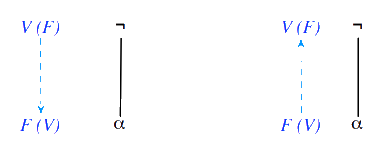
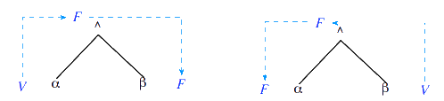

# Algoritmos de SAT

[[toc]]

Os algoritmos de SAT (do inglês _satisfiability_) têm como propósito determinar se uma _fbf_ é satisfazível e, em caso afirmativo, devolver uma interpretação que a satisfaça - um modelo dessa _fbf_. Os algoritmos de SAT são mais eficientes que OBDDs, visto que estes últimos dão-nos **todos** os modelos da _fbf_, o que pode ser bastante ineficiente (e neste caso não precisamos de todos os modelos). De recordar, ainda, que o facto de saber se uma _fbf_ é satisfazível ou não é uma das questões fundamentais na Lógica, isto é, saber se uma _fbf_ é consequência semântica de um conjunto de _fbfs_.

Vamos abordar 2 algoritmos de SAT:

- um primeiro, _baseado em propagação de marcas_, muito eficiente mas incompleto, podendo terminar sem resposta;

- um outro, _algoritmo DP_ (nomeado em honra de [Davis e Putman](https://dbpedia.org/page/Davis%E2%80%93Putnam_algorithm)), que apesar de menos eficiente é completo.

## Algoritmo baseado em propagação de marcas

A ideia por detrás deste algoritmo é, dada uma _fbf_, determinar as restrições que têm de ser satisfeitas pelas suas "sub-fórmulas" de modo a que a _fbf_ seja verdadeira. Aqui, o conceito de subfórmula é, de um modo abstrato, como o de símbolo de proposição - "que valor é que cada um destes símbolos de proposição tem de ter para a _fbf_ ser verdadeira". Por exemplo, para a _fbf_ $P \wedge Q$ ser satisfazivel, tanto P como Q, as subfórmulas de $P \wedge Q$, têm de ter valor lógico verdadeiro (ou seja a interpretação pretendida tem de ser tal que $I(P) = V$ e $I(Q) = V$).

Ora, a noção de **marca** vem precisamente desta noção: sempre que descobrimos que, para a _fbf_ fazer sentido, uma dada subfórmula tem de ter um valor lógico concreto, _marcamos_ essa subfórmula com esse valor lógico.

::: tip CHEGAR AOS DAG'S

Aqui, trabalhamos com grafos **dirigidos e acíclicos**, vulgo DAGs, grafos estes que vão corresponder às _fbfs_ cuja satisfazibilidade vamos procurar provar.
Chegamos a este grafo através de:

- transformar a _fbf_ original numa _fbf_ que só contém **conjunções e negações**, recorrendo a:

  - $P \vee Q \leftrightarrow \neg(\neg P \wedge \neg Q)$

  - $P \to Q \leftrightarrow \neg(P \wedge \neg Q)$

  - $\neg \neg P \leftrightarrow P$ (não obrigatório, contudo sempre realizada no decorrer destes algoritmos)

  Por exemplo, simplificar $\neg \neg (P \wedge \neg \neg (\neg P \vee Q))$ resultaria sucessivamente em $P \wedge (\neg P \vee Q)$, via eliminação da dupla negação, e $P \wedge \neg (P \wedge \neg Q)$, via a primeira equivalência referida acima.~

- já com a _fbf_ tranformada nesta versão mais simplificada, podemos construir o nosso DAG:

  - uma _fbf_ atómica, ou seja um símbolo de proposição, é uma árvore que é constituída apenas pela raiz, cujo rótulo é esse mesmo símbolo de proposição;

  - a negação, $\neg P$, é uma árvore cuja raiz é um nó de rótulo $\neg$, do qual sai um caminho/arco que leva à raiz de uma árvore, raiz essa rotulada com $P$.

  - a conjunção, $P \wedge Q$, é uma árvore de rótulo $\wedge$ da qual saem dois caminhos/arcos, um para cada árvore cuja raiz é o respetivo símbolo de proposição.

:::

Ora, este processo é sucessivamente aplicado até termos a árvore da _fbf_, cujas folhas são precisamente os símbolos de proposição que ocorrem na _fbf_. Para obter o DAG basta, agora, juntar as folhas com rótulos repetidos. Para ser ainda mais eficientes, podemos ainda partilhar nós repetidos (mas no livro não o fazem, nem nas aulas).

Bem, para isto não ser só uma parede infindável de texto, vamos introduzir uma imagem-exemplo, com a _fbf_ $(P \wedge \neg (P \wedge \neg Q))$:

À esquerda temos a primeira fase do processo, onde temos a raiz "principal" com rótulo $\wedge$, com arcos para P e para o "lado" de $\neg (P \wedge \neg Q)$. Ora, neste último, temos que a árvore tem raiz com rótulo $\neg$, que terá caminho para $P \wedge \neg Q$. Aqui voltamos a pegar no operador, $\wedge$, fazendo dele a raiz e criando um caminho para $P$ e para $\neg Q$. Resta ainda terminar o caminho de $\neg Q$, criando uma árvore com raiz de rótulo $\neg$ com arco para $Q$. Temos, portanto, a árvore terminada.

Por fim, juntamos as folhas com rótulos repetidos - neste caso, folhas com rótulo $P$, tendo como resultado final o DAG à direita.

### Propagação de marcas pelo grafo

Chegámos agora à próxima fase do algoritmo, a propagação de marcas (V ou F) pelo grafo. O primeiro passo é **sempre** marcar a raiz com V. As seguintes marcas são dadas por um conjunto de regras:

- Tendo um nó de rótulo $\neg$ marcado, o algoritmo propaga a marca "contrária" para os seus arcos; podemos ainda analisar o processo ao contrário - se temos um nó com rótulo marcado com arco "para cima" que leva a uma raiz com rótulo $\neg$, então, a raiz copm $\neg$ tem a marca oposta.

- Tendo um nó de raiz $\wedge$ marcada com V, a marca V é também propagada pelos respetivos arcos; podemos também fazer o processo inverso - se dois nós com marca V tiverem arcos para o mesmo nó com rótulo $\wedge$, esse nó tem marca V. Por outro lado, basta um dos nós ter F para a conjunção ser falsa. Além disso, se um dos nós tiver marca V mas a raiz tiver marca F, podemos admitir que o outro nó tem marca F.

Se repararem, acima mencionei algumas vezes o "processo inverso/ascendente" - isto porque, caso apenas ocorra a propagação de marcas no sentido descendente, temos de verificar, começando nas folhas, se a propagação inversa também faz sentido (e é igual à descendente). Se for, encontrámos uma interpretação que satisfaz a _fbf_; caso contrário, a _fbf_ não é satisfazível.

::: warning

Work in progress

Faltam adicionar exemplos + algoritmo de testes de nós

:::
