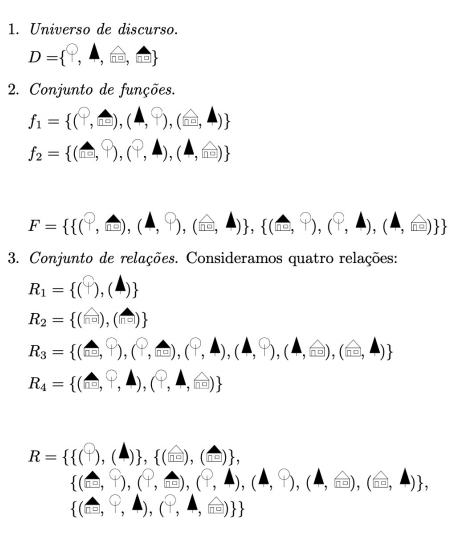
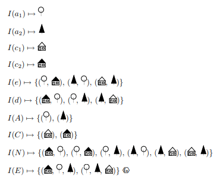

# Lógica de Primeira Ordem - Sistema Semântico/Correção e Completude

[[toc]]

(esta secção não é particularmente gira e os resumos não estão particularmente bons desta vez, peço desculpa)

::: warning

Abaixo está um e-mail do prof. Quintas com explicação geral de um dos exercícios desta matéria que pode sair em exame, secalhar para preparação é melhor verem por aqui porque sinceramente explica muito melhor que o resto abaixo

:::

::: details Explicação Ex. Exame

O exercício em questão é:


E a explicação dada pelo prof é:

```
Uma conceptualização é algo necessário quando queremos avaliar 
proposições em LPO em relação ao mundo real (ou qualquer outro
mundo imaginário, como o mundo de quadrados e losangos que
aparece no exercício). Uma conceptualização não é nada mais
do que uma tripla de conjuntos (D, F, R), em que:

- D é o universo de discurso, ou seja o conjunto de todas as
entidades sobre as quais vais construir afirmações (neste 
exercício vamos fazer afirmações sobre um losango e um quadrado);

- F é o conjunto de funções que podemos aplicar a estas entidades,
sendo uma função um mapeamento de uma ou mais entidades para uma
ou mais entidades (ou seja, uma função é algo que transforma entidades,
estilo se estiveres a falar de alunos de LP, uma função poderia ser
o que associa cada aluno à sua nota nas aulas práticas, neste
exercício não consideramos nenhuma função por isso é o conjunto vazio);

- R é o conjunto de relações que existem entre as entidades de D, 
normalmente definidas por conjuntos de grupos para os quais estas 
relações se verificam (no caso do exercício tens duas relações, 
uma que será sempre falsa, correspondente por isso ao conjunto vazio, 
e outra relação que será verdadeiro para o quadrado e por omissão
será falsa para o losango).

A partir desta conceptualização, constrói-se uma interpretação para
os elementos da LPO que estamos a usar aqui, em que o símbolo "a"
representa o nosso losango, o símbolo "b" representa o nosso quadrado,
"P" representa a relação que é sempre falsa e o símbolo "S" representa
a relação que é verdadeira para o quadrado e falsa para o losango
(por omissão, mais uma vez).

Agora, o teu trabalho é, a partir desta informação e do teu conhecimento
sobre as tabelas de verdade dos vários operadores da LPO determinar as 
interpretações das frases que são apresentadas. Usando a primeira como
exemplo, sabemos que a relação P é sempre falsa, logo P(a) será falso.
Sabemos também que a relação representada por S é verdadeira apenas para 
um quadrado. Como neste caso a representa o nosso losango, S(a) será falso.
Pela tabela de verdade da implificação (que por esta fase espero que saibas 
mais que de cor que só é falsa quando o antecedente é verdadeiro e o consequente
falso :P) podes então concluir que a interpretação desta fbf é verdadeira 
(bastava até notar que o antecedente é falso para tirar esta conclusão).

As restantes entradas na tabela terão um raciocínio semelhante, simplesmente
usando outras relações e operadores.

```

:::

O propósito do sistema semântico é especificar em que condições as _fbfs_ de uma linguagem são verdadeiras ou falsas. Para tal, é necessário interpretar cada um dos seus símbolos de proposição, de forma a poder atribuir um valor lógico a cada um e, posteriormente, dar um significado à _fbf_. Por fim, verificar se o significado a que chegamos está de acordo com a situação que pretendemos descrever - se sim, a _fbf_ é verdadeira, caso contrário é falsa.

Este processo, contudo, precisa de ser formalizado para o podermos utilizar num sistema lógico - não podemos fazer inferências exclusivamente a partir da língua natural nem de figuras. Temos de definir **formalmente** como determinar se uma _fbf_ é verdadeira ou falsa.

O primeiro passo passa por descrever um mundo ou situação através de uma **conceptualização**.

::: tip CONCEPTUALIZAÇÃO

Uma conceptualização é um triplo $(D, F, R)$, onde:

- $D$ é o conjunto de entidades que constituem o mundo sobre o qual vamos falar. Podem ser concretas (planetas, pessoas, ...), abstratas (conceitos como arte, beleza, ...) ou ficcionais (personagens, por ex.). **Só nos podemos referir a essas entidades** no nosso discurso - se quiséssemos falar de outras, teríamos de fazer uma conceptualização diferente;

- $F$ é o conjunto das funções que podemos aplicar a essas entidades; as funções podem ser parciais, não estando definidas para todas as entidades do universo de discurso;

- $R$ é o conjunto de relações/predicados que podemos aplicar a essas entidades.

O objetivo da conceptualização é **descrever formalmente o mundo**. Não existe uma única conceptualização para o mesmo mundo, escolhemo-la consoante os aspetos relevantes para a aplicação em causa.

:::

::: details Exemplo - Conceptualização

Tenhamos por base o mundo seguinte:


Se decidirmos que o universo do discurso terá as entidades "árvore de copa branca, árvore de copa preta, casa de telhado branco e casa de telhado preto", esse vai ser o nosso $D$. Não nos vamos poder referir a quaisquer outras entidades, mesmo que façam parte do mundo - aqui não nos poderíamos referir ao barco nem à montanha, por exemplo.

Um exemplo de função podia ser {(casa_telhado_preto, arvore_copa_branca), (arvore_copa_branca, arvore_copa_preta), ...}, o que quer que isto signifique. São, portanto, representadas por um conjunto de tuplos de entidades do universo de discurso.

Um exemplo de relação podia ser {(casa_telhado_preto), (casa_telhado_branco)}, o que quer que isso signifique.

Exemplo dado nos slides para o universo em questão:



:::

Podemos, então, passar ao conceito de **interpretação**

Uma interpretação é uma função, $I$, cujo domínio é a linguagem utilizada, com contradomínio $D \cup F \cup R$, cujo objetivo é definir, para cada _fbf_, o que é que significa dizer que "essa _fbf_ é verdadeira/satisfeita na conceptualização tratada". A ideia passa por afirmar que a _fbf_ é verdadeira numa conceptualização se o que afirma sobre os elementos de $D$ se verifica realmente. O problema vem com a introdução de variáveis livres. Numa intepretação:

- cada constante individual $f^{0}_{i}$ é associada com uma entidade do universo de discurso;

- cada letra de função $f^{n}_{i}$ é associada a uma função do conjunto de funções com aridade $n$. Sendo $t_{1}, \cdots, t_{n}$ um conjunto de termos, $f^{n}_{i}(t_{1}, \cdots, t_{n})$ corresponde à entidade $I(f_{i}^{n})(I(t_{1}), \cdots, I(t_{n}))$ da conceptualização.

- a cada letra de predicado $P_{i}^{n}$ é associada uma relação do conjunto de relações com aridade $n$.

::: details Exemplo - Interpretação

Exemplo aplicado ao universo descrito anteriormente:



:::

Podemos, agora, falar no conceito de **satisfação** aplicado a _fbfs_ sem variáveis livres. A interpretação, $I$, de uma conceptualização pode satisfazer uma _fbf_ $\alpha$ sem variáveis livres em vários casos diferentes:

- se $\alpha$ for atómica, da forma $P_i^n(t_1, \cdots, t_n)$, $I$ satisfaz $\alpha$ se o tuplo $(I(t_1), \cdots , I(t_n))$ for um elemento de $I(P_i^n)$.

- $I$ satisfaz $\neg \alpha$ caso não satisfaça $\alpha$; satisfaz $\alpha \wedge \beta$ se satisfizer ambas $\alpha$ e $\beta$; satisfaz $\alpha \vee \beta$ se satisfizer pelo menos uma de $\alpha$ ou $\beta$; satisfaz $\alpha \to \beta$ se não satisfizer $\alpha$ ou satisfizer $\beta$.

- satisfaz $\forall x[\alpha]$ caso, para todos os elementos do conjunto de entidades da conceptualização, $D$, a interpretação satisfizer $\alpha$.

- satisfaz $\exists x[\alpha]$ caso exista pelo menos um elemento de $D$ para o qual a interpretação satisfaça $\alpha$.

Exemplos:

Em relação ao último exemplo, o tuplo $I(a_1) = (arvore_branca)$ pertence à relação $I(A) = \{(arvore*branca), (arvore_preta)\}, pelo que a \_fbf* é satisfazível.

Ainda em relação ao último exemplo, se quisermos aferir a satisfazibilidade de $P(c_2, e(a_2))$, podemos dizer que o tuplo $(I(c_2), I(e(a_2)))$ é igual a $(casa\_preta, I(e(arvore\_preta)))$, que por sua vez é igual a $(casa\_preta, arvore\_branca)$, que pertence a $I(P)$, pelo que a _fbf_ é satisfazível.

Restam ainda referir algumas definições:

- uma _fbf_ é **verdadeira segundo uma interpretação** caso essa interpretação a satisfaça, e podemos escrever $\models_I \alpha$; caso contrário, dizemos que é **falsa** segundo essa interpretação.

- uma _fbf_ é **satisfazível** se existe uma interpretação que a satisfaz, **contraditória** se não houver nenhuma.

- uma _fbf_ é **tautológica** se todas as interpretações a satisfazem, **falsificável** se pelo menos não a satisfaz.

Um **modelo** é, aqui, uma interpretação que satisfaz todas as _fbfs_ de um conjunto.

Sendo $\Delta$ um conjunto de _fbfs_ fechadas e $\alpha$ uma _fbf_ fechada, $\alpha$ é **consequência semântica** de $\Delta$ ($\Delta \models \alpha$) caso todas as interpretações modelos de $\Delta$ também sejam modelos $\alpha$.

Pelo **teorema da refutação**, temos que, sendo $\Delta$ um conjunto de _fbfs_ fechadas e $\alpha$ uma _fbf_ fechada, $\alpha$ é consequência semântica de $\Delta$ apenas caso $\Delta \cup \{\neg \alpha\}$ não seja satisfazível.

Por fim, em relação à **correção e completude**, podemos reafirmar que a lógica de primeira ordem é correta e completa!

[Slides](https://drive.google.com/file/d/1u6jYJBKLZ4lIjBxyLQP1g0nSSThib2eu/view?usp=sharing)
