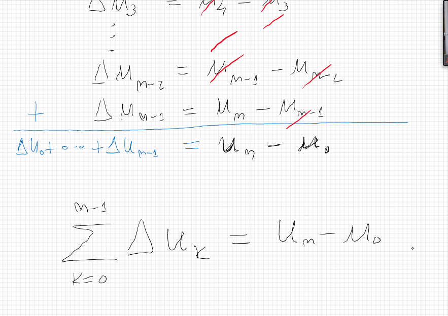
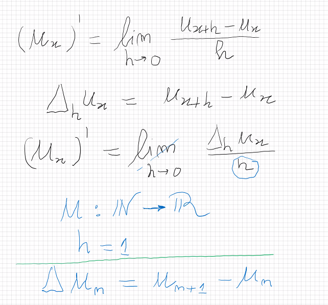

# Aula 1
[[toc]]

## **Derivada de uma sucessão**

Dada uma sucessão $u_{n}$, tem-se que 

($u_{n})' = \Delta u_{n} = u_{n+1}-u_{n}$

Neste caso, toma-se a definição usual de

derivada (razão incremental), mas define-se

$h = 1$ sempre.

A partir da imagem ao lado, é claro ver que a soma de todas as derivadas desde zero até $n-1$ é igual a $u_{n} - u_{0}$. Assim, tem-se

$$\sum_{k=0}^{n-1} \Delta u_{k} = u_{n} - u_{0}$$

É de notar que $u_{n} - u_{0} = [u_{n}]_{0}^{n} = u_{n}|_{0}^{n}$ (notação de integral).

Tal como em cálculo com funções, existe uma sucessão cuja "derivada" é igual a própria sucessão; É esta a sucessão $u_{n}$  com $u_{n} = 2^{n}$.

## Somas fechadas do tipo $a^{n}, a \neq 0$

Tome-se 

$$\sum_{k=0}^{n-1} 2^{k}$$

Sabe-se que $2^{k} = \Delta2^{k}$ logo, tem-se

$$\sum_{k=0}^{n-1} 2^{k} = \sum_{k=0}^{n-1} \Delta2^{k} = [2^{k}]_{0}^{n} = 2^{n} - 1$$

e, generalizando, tem-se:

$$\sum_{k=0}^{n-1} \alpha^{k} =\frac{1}{\alpha -1}(\alpha^{n}-1) $$

## Polinómios fatoriais

Note-se, primeiro, a definição de polinómio fatorial:

*Para cada $r \in \mathbb{N}$, a potência fatorial de uma sucessão u_{n} define-se como se segue:*

$$(u_{n})^{\underline{r}} = \begin{cases}\ 1 & se\ r = 0 \\\ u_{n}u_{n-1}\cdot \cdot \cdot u_{n-(r-1)} & se\ r \geq 1\end{cases}$$

Assim, como exemplo, tem-se

$$n^{\underline{3}} = n(n-1)(n-2)$$

$(2n+1)^{\underline{3}} = (2n+1)(2n-1)(2n-3)$

**Derivada do polinómio fatorial**

$$\Delta n^{\underline{r}} = (n+1)^{\underline{r}} - (n)^{\underline{r}} \Leftrightarrow$$

$$(n+1)(n)\cdot\cdot\cdot(n-(r-2)) - (n)\cdot\cdot\cdot(n-(r-2))(n-(r-1))\Leftrightarrow$$

$$[(n)\cdot\cdot\cdot(n-(r-2))](n+1-(n-r+1) \Leftrightarrow$$

$$n^{\underline{r-1}}(r)$$

**Exemplo: Somatório de k**

Quer se saber a soma fechada para $\sum_{k=0}^{n-1}k$.

Pega-se na função $k^{\underline{2}}$:

 $\Delta k^{\underline{2}} = (k+1)k - k(k-1) \Leftrightarrow$

 

 $\Delta k^{\underline{2}} = k(k+1-(k-1)) = 2k$

(ou pela forma direta dada antes para a derivada)

donde se tira que $k = \frac{1}{2}\Delta k^{\underline{2}}$

Logo, pode-se reescrever o somatório para algo com que já se sabe trabalhar:

$$\sum_{k=0}^{n-1}k =\frac{1}{2}\sum_{k=0}^{n-1}\Delta k^{\underline{2}} = \frac{1}{2}(n)(n-1)$$

Estudar:

**teorema 105 (pág 279)
secção 5.2 (pág 281) até ponde conseguirem (3-4 páginas)**