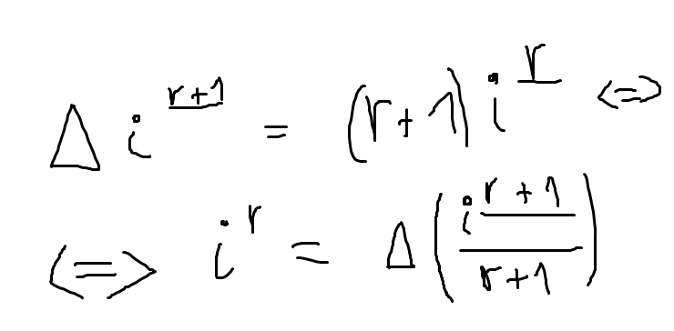
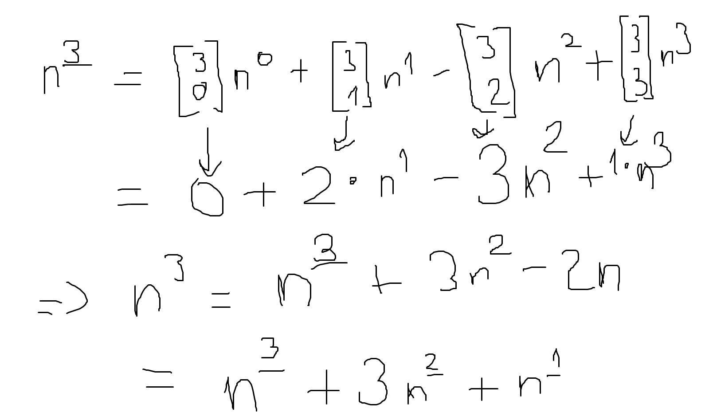
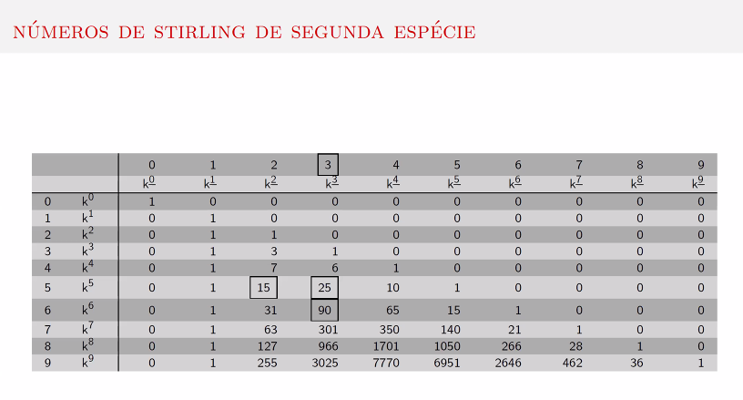
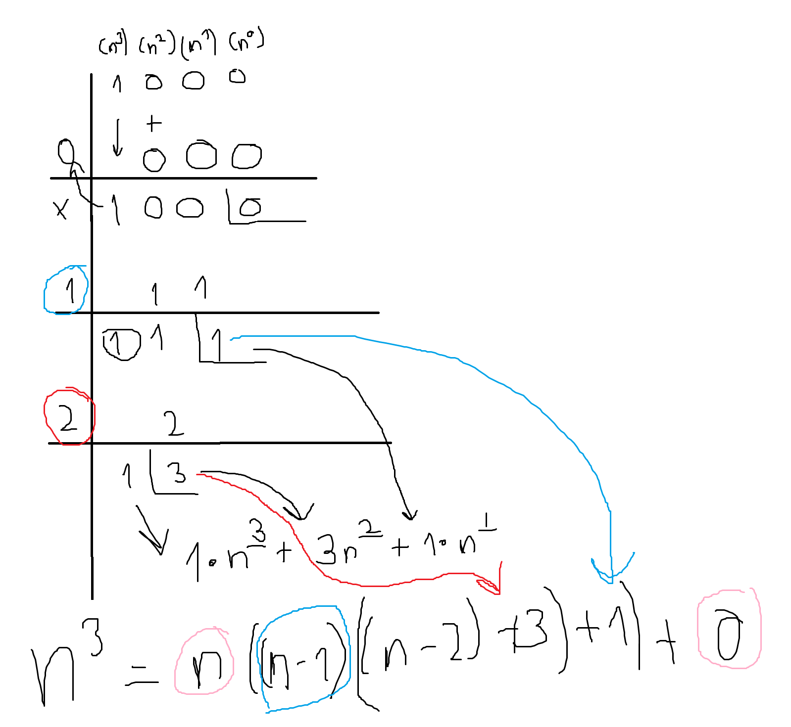

# Laboratório 1
[[toc]]
## Derivada do polinómio fatorial

Assim, é direto tirar o valor da soma fechada para $i^{\underline{r}}$

## **Números de Stirling (primeira espécie):**

Sabe-se que $n^{\underline{r}} = n(n-1)(n-2)\cdot\cdot\cdot(n-r+1)$. Tem-se então que:

$$n^{\underline{r}} = \sum_{k=0}^{n} \begin{bmatrix}
n \\
k 
\end{bmatrix}x^k$$

**Ou seja, os números de Stirling de primeira espécie dão-nos os coeficientes da expansão de um polinómio fatorial.**

De notar: o sinal dos números de Stirling **de primeira espécie** depende da paridade de $n+k$, ou seja, sendo $s(n,k)$ um número de Stirling, tem-se:

$$s(n,k) = (-1)^{n+k}\begin{bmatrix}n \\ k \end{bmatrix}$$

É possível relacionar os polinómios usuais com os fatoriais através da primeira espécie, como feito no exemplo seguinte

## **Números de Stirling (segunda espécie):**

Os números de Stirling da segunda espécie servem para relacionar polinómios (usuais) com os polinómios fatoriais. São sempre positivos. Por exemplo:

O que facilita imenso a avaliação da soma de $n^{3}$.

De uma forma mais geral:

$$\sum_{k=0}^{m}n^{p} = \sum_{k=0}^{m}\left( \sum_{k=0}^{m} \begin{Bmatrix}m\\k\end{Bmatrix}n^{\underline{k}}\right) $$

onde $\begin{Bmatrix}m\\k\end{Bmatrix}$ é o número de Stirling de segunda espécie. Abaixo está a tabela dos números de Stirling de segunda espécie:

O algoritmo para encontrar um número de Stirling da segunda espécie consiste em multiplicar o que se encontra diretamente em cima pelo número da coluna, e somar o valor que se encontra uma casa à esquerda e acima.

Os números de Stirling de segunda espécie podem ser calculados através do **método de Horner** (Ruffini). Para conhecermos a soma fechada de $n^{3}$, divide-se por $n, n-1, n-2$:

## Método de Horner

(a expressão com setas pretas é mais útil e equivalente à com setas vermelhas)

Agora, através da forma no topo da página, é fácil encontrar a expressão para a soma de qualquer polinomial.