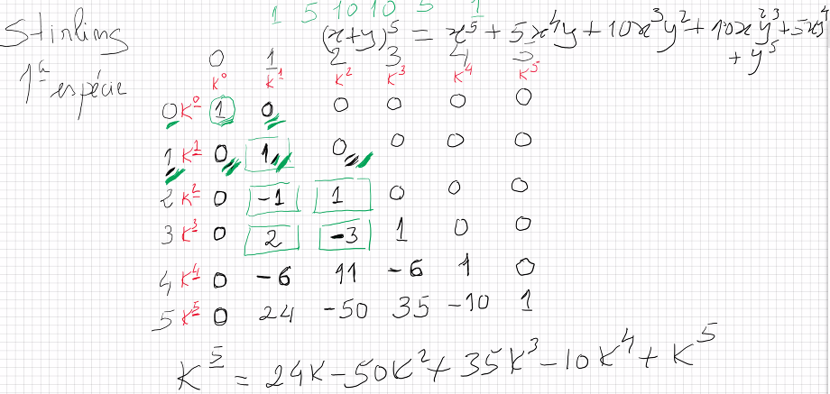
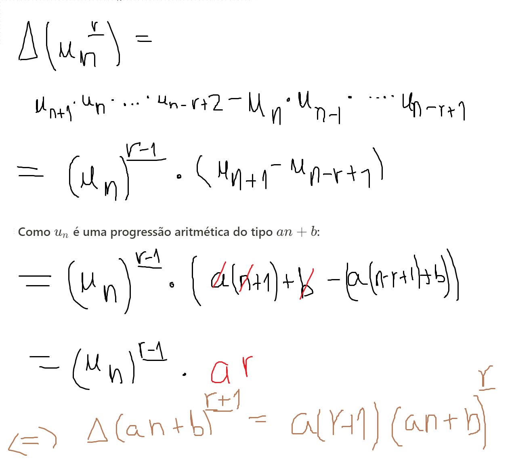
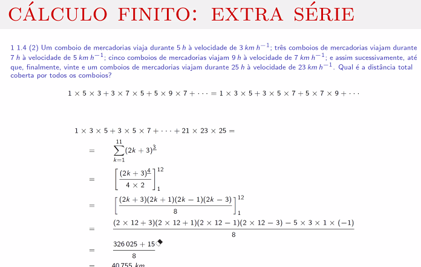
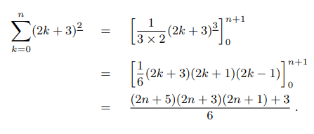
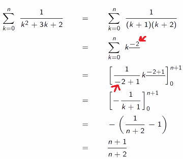

# Aula 2

[[toc]]

::: warning PÁGINA EM CONSTRUÇÃO
Esta página encontra-se em construção e será alterada num futuro próximo.
:::

- **Números de Stirling (primeira espécie) (recapitulação da aula passada):**

  Sabe-se que $n^{\underline{r}} = n(n-1)(n-2)\cdot\cdot\cdot(n-r+1)$. Tem-se então que:

  $$
  n^{\underline{r}} = \sum_{k=0}^{n} \begin{bmatrix}
  n \\
  k
  \end{bmatrix}x^k
  $$

  **Ou seja, os números de Stirling de primeira espécie dão-nos os coeficientes da expansão de um polinómio fatorial.**

  De notar: o sinal dos números de Stirling **de primeira espécie** depende da paridade de $n+k$, ou seja, sendo $s(n,k)$ um número de Stirling, tem-se:

  $$s(n,k) = (-1)^{n+k}\begin{bmatrix}n \\ k \end{bmatrix}$$

Tal como nos números de Stirling de segunda espécie, existe um método para obter os de primeira espécie. Dado dois números de Stirling da primeira espécie e o número da linha em que se encontram; Se queremos posição $(x,y)$ (24 neste caso), basta fazermos $(x-1,y-1) - [(x,y-1) \cdot (x-2, y-1)]$

## Derivada de uma sucessão aritmética na forma de polinómio fatorial

Exemplos:

Através desta fórmula é possível achar a soma fechada para expressões do tipo:

$$\sum_{k=0}^{n}(2k+3)^{\underline{2}}$$

Mais rapidamente, pois, dada a fórmula pode se tirar que:

$$(an+b)^{\underline{r}} = \Delta\frac{1}{a(r+1)}(an+b)^{\underline{r-1}}$$

## Exemplos com sucessões aritméticas

## Polinomial fatorial com valor negativo

Define-se um polinomial fatorial com valor negativo (_n elevado a menos r fatorial)_ como:

$$u_{n}^{\underline{-r}} = \frac{1}{u_{n+1} \cdot \cdot \cdot u_{n+r}}$$

para facilitar, escreve-se o último primeiro porque coincide com o expoente fatorial e depois conta-se o número de fatores.

Assim:

$$u_{n}^{\underline{-2}} = \frac{1}{(n+1)(n+2)}$$

$$\frac{1}{(n+2)(n+3)(n+4)} = (n+1)^{\underline{-3}}$$

$$\frac{1}{(2n+1)(2n+3)(2n+5)} = \frac{1}{(2(n+1)-1)(2(n+2)-1)(2(n+3)-1)} = (2n-1)^{\underline{-3}}$$

A fórmula anterior para polinómios elevados a fatoriais positivos pode se prolongar, funcionando da mesma maneira para os de expoente negativo, ou seja:

$$\sum_{k=0}^{n-1}k^{\underline{r}} = \left[\frac{k^{\underline{r+1}}}{r+1}\right]_{0}^{n}\quad,\quad r \in \mathbb{Z}\backslash \{-1\}$$

$$\sum_{k=0}^{n-1}u_{k}^{\underline{r}} = \left[\frac{u_{k}^{\underline{r+1}}}{a(r+1)}\right]_{0}^{n}\quad,\quad r \in \mathbb{Z}\backslash \{-1\}$$

## Exemplo com fatoriais negativos:

ler 304 secc 5.5 fracoes racionais - até desafio ao leitor (3 pags)
