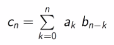

# Funções Geradoras

## Definição

Tome-se o número de maneiras que se pode fazer $x$ euros com moedas de 1 euro:

$$1z^0+1z^1+1z^2+1z^3+\dots1z^x$$

Onde o coeficiente de $z^x$ representa o número de formas possíveis de distribuir as moedas.

Assim, o número de maneiras que se pode fazer $x$ euros com moedas de 2 euros é:

$$1z^0+0z^1+1z^2+0z^3+\dots+0z^{2x-1}+1z^{2x}$$

Abaixo está como averiguar o número de formas possíveis de obter 8 euros com moedas de 1 euro e de dois.

ou, de modo geral:

## Generalização e exemplos
Em geral, uma sucessão $u_n$é gerada por:

$$u_n \longrightarrow v(z) = \sum_{k=0}^{+\infty}u_kz^k$$

seja $u_n = 1,1,1,1,1,1,0,0...$:

$$v(z) = 1+z+z^2+z^3+z^4+z^5 \\
\text{ ou} \\
v(z) = \frac{1-z^6}{1-z} = \frac{z^6-1}{z-1}$$

ou então $u_n = 1,3,3,1,0,0...:$

$$v(x)=1+3z+3z^2+z^3 = (1+z)^3$$

ou então $u_n = 1\quad\forall_{n \in \N}$:

$$v(z)=1+z+z^2+z^3+z^4+\dots\\
z(v(z))=\quad z+z^2+z^3+z^4+.......\\v(z)-z(v(z))=1 \Leftrightarrow\\
\\
v(z) = \frac 1 {1-z}$$

Com estes exemplos, já podemos conhecer a função geradora de $u_n=n+1$
:

$$v(z) =1z^0+2z^1+3z^2+4z^3+...\\
z(v(z))=z+2z^2+3z^3+4z^4+...\\
\\
(1-z)v(z)= 1+z+z^2+z^3+z^4+...=\frac 1 {1-z} \Leftrightarrow \\
v(z) = \frac 1 {(1-z)^2}$$

Repare-se que a partir desta fórmula pode-se também chegar a geradora de $u_n=n$:

$$u_n=n+1 \implies v(z) _{n+1}=\sum_{k=0}^{\infty}(k+1)z^k = \sum_{k=0}^{+\infty}kz^k+\sum_{k=0}^{+\infty}z^k$$

onde o primeiro somatório da última igualdade representa a geradora da sucessão $u_n=n$. Assim, viria:

$$v(z)_{n} = \frac{z}{(1-z)^2}$$

Agora, para $u_n=3^n$:

$$v(z)=\sum_{k=0}^{+\infty}3^kz^k\\
= \sum_{k=0}^{+\infty}(3z)^k = \left(\frac 1 {1-w}\right)_{w=3z} = \frac 1 {1-3z}$$

Ou, de um modo geral:

$$u_n=a^n\implies v(z)_{u_n}=\frac 1 {1-az}$$

Já agora, a função geradora para as moedas de dois euros seria:

$$D(z) = \sum_{k=0}^{+\infty}(z^2)^k = \frac 1 {1-z^2}$$

Voltando agora ao exemplo inicial, vamos ver quantas formas há de obter $x$ euros a partir de moedas de 1 e 2 euros:

$$G(z) = v(z)D(z) = \frac 1 {(1-z)(1-z^2)} = \frac 1 {(1-z)^2(1-(-z))}$$

Agora, tem-se:

$$\frac 1 {(1-z)^2(1-(-z))} = \frac{\frac 1 4}{1-z}+\frac{\frac 1 2}{(1-z)^2}+\frac{\frac 1 4}{1-(-z)}$$

agora, relacionando com as fórmulas já vistas:

$$\frac 1 {(1-z)^2(1-(-z))}= \frac 1 4\times 1+\frac 1 4(n+1)+\frac 1 4\times(-1)^n \\~\\
\frac {2n+3+(-1)^n}{4}$$

Exemplo, há $\frac{2(6)+3+(-1)^6}{4} = 4$ formas possíveis de formar $6$ euros a partir de moedas de 1 e 2 euros.