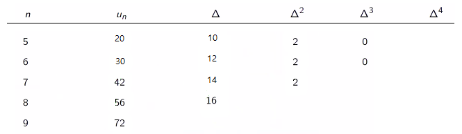
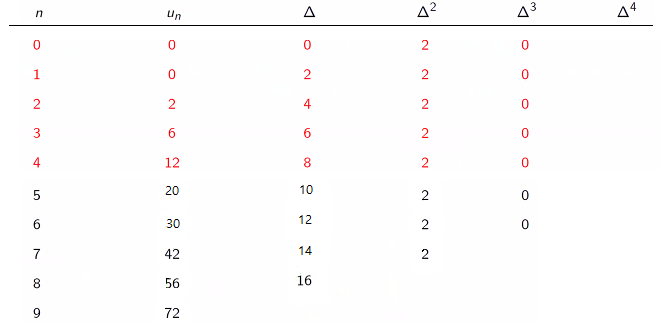
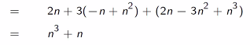

# Teorema de Newton

## Teorema de Newton

Seja $p_n$ um polinómio geral:

$$p_n=p_0+b_1n+b_2n^2+b_3n^3+\dots+b_rn^r,\qquad b_r\neq 0$$

Repare-se que se quiséssemos, por exemplo, a segunda derivada de $p_n$:

$$\Delta^2p_n=\Delta\Delta p_n=\Delta(p_{n+1}-p_n)=p_{n+2}-2p_{n+1}+p_n$$

Agora, toma-se a expansão de $p_n$ e deriva-se termo a termo:

$$p_n=p_0+a_1n^{\underline{1}}+a_2n^{\underline{2}}+a_3n^{\underline{3}}+a_4n^{\underline{4}}+\dots+a_rn^{\underline{r}} \\
\Delta p_n=a_1+2\times a_2n^{\underline{1}}+3\times a_3n^{\underline{2}}+4 \times a_4n^{\underline{3}}+\dots+r \times a_rn^{\underline{r-1}}\\

\Delta^2 p_n=a_1+2\times a_2+3\times 2\times a_3n^{\underline{1}}+4 \times 3\times a_4n^{\underline{2}}+\dots+r\times (r-1) \times a_rn^{\underline{r-2}}\\
\vdots\\
\Delta^rp_n=r!a_r$$

Note-se que:

$$\Delta p_0=(\Delta p_n)_{n=0}$$

Tem-se então:

$$\Delta p_0=1!\times a_1 \\
\Delta^2p_0=2!\times a_2 \\
\Delta^3p_0=3!\times a_3 \\
\dots\\
\Delta^rp_0=r!\times a_r \Leftrightarrow a_r=\frac 1 {r!}\Delta^r p_0$$

Donde agora se pode obter como expressão geral para um polinómio, o **teorema de newton:**

$$p_n=p_0+\Delta p_0n^{\underline 1}+ \frac 1 {2!}\Delta^2p_0n^{\underline 2} + \frac 1 {3!}\Delta^3p_0n^{\underline 3} + \dots \frac 1 {r!}\Delta^rp_0n^{\underline r}$$

Agora, pode-se resolver problemas como os seguintes:

)

## Resolução de exemplos

### 1)

Começa-se por dispor os dados conhecidos por linhas

A seguir, expande-se a tabela para incluir as linhas anteriores através de contas simples visto que, por exemplo, $\Delta^2=\Delta^1_{n+1}-\Delta^1_{n}$. Assume-se também que a segunda derivada permanecerá constante, e que, por consequência, a terceira será nula. obtendo-se o seguinte:

Agora, com a fórmula já vista para $p_0$, retirando os valores da linha $n=0$, vem:

$$p_n=0+0+\frac{2}{2!}n^{\underline{2}} = n(n-1)$$

### 2)

Como tabela, tem-se:

Agora, **recorrendo aos números de Stirling de primeira espécie**:

O exercício 3 seria resolvido de uma maneira análoga a estes últimos dois, com solução $n(n+1)$.

Abaixo segue outro exemplo importante, de um exercício tipo para testes feito pelo professor José.

