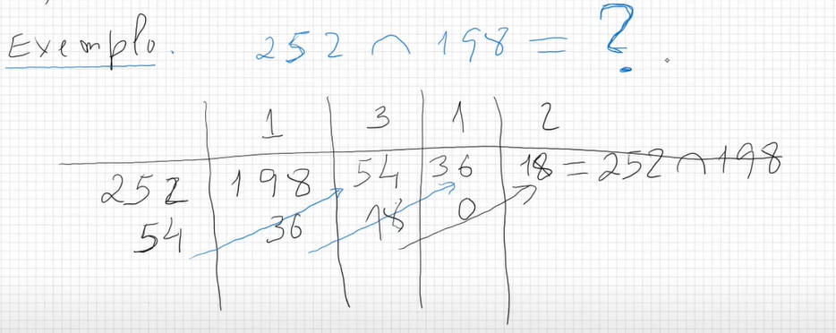
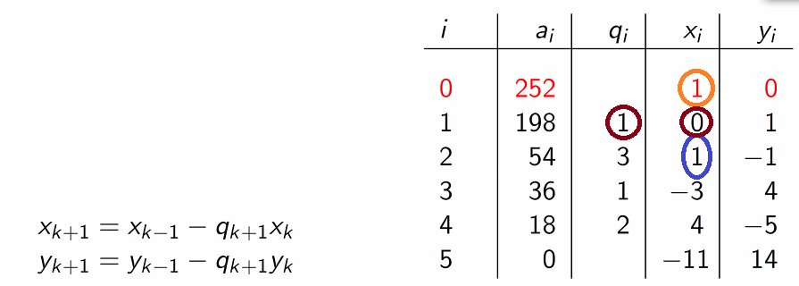

# MDC e Eq. Diofantinas

## Máximo divisor comum

**Definição:** dados dois números $a$ e $b$ inteiros, diz-se que o número $d \in \N_1$ é máximo divisor comum de $a$ e $b$, e escreve-se $a \frown b = d$, se:

a) $d | a$ ($d$ divide $a$) e $d|b$;

b) Para todo o $d' \in \N_1$ tal que $d'|a$ e $d'|b$ tem-se que $d'|d$.

Tem-se a seguinte propriedade:

$$a \frown b = (-a) \frown b =a \frown (-b) = (-a)\frown(-b)$$

### Teorema da unicidade:

Se existir o máximo divisor de $a$ e de $b$, então este é único.

::: details Prova

$d$ é M.D.C. de $a$ e $b$. Vem então:

a) $d|a$ e $d|b$;

b) $\forall_{d'' \in \N_1}((d''|a$ e $d''|b) \implies d''|d$

Suponha-se a existência de $d'$ e que este também é M.D.C. de $a$ e $b$. Então:

c) $d'|a$ e $d'|b$;

d) $\forall_{d'' \in \N_1}((d''|a$ e $d''|b) \implies d''|d'$

A partir das proposições a) e d) retira-se que $d|d'$. A partir das proposições c) e b) retira-se que $d'|d$. Assim, pela _antissimetria da divisão_, vem que $d=d'$.

:::

### Teorema da base da recorrência:

Se o inteiro $a$ divide o inteiro $b$, então $a \frown b = a$.

_Por exemplo, $12|24 \implies 12 \frown 24 = 12$._

::: details Prova

Como se tem que $a|a$ e $a|b$, tem-se pela proposição vista no início que $a \frown b = a$.

:::

### Teorema do resto da divisão:

Se $r_1$ é o resto da divisão de $a$ por $b$, então $a\frown b$ existe e coincide com $b \frown r_1$.

_Por exemplo, $\frac{46}{6} = 7 + \frac{2}{3} \implies 46 \frown 6 = 46 \frown 2$._

::: details Prova

Tem-se $a = bq_1 + r_1$ onde $q_1$ é o quociente entre $a$ e $b$ e $r_1$ o resto da sua divisão inteira.

1. Repare-se que se $d|a$ e $d|b$, então $d|r_1$:

$$a = bq_1+r_1 \Leftrightarrow dk=dk'q_1+r_1 \Leftrightarrow r_1=d(k-k'q_1)$$

2. Por um raciocínio análogo, se $d|b$ e $d|r_1$, então $d|a$.

A partir destas duas proposições, vem:

$$
1\implies \text{divisores(}a,b)\subseteq \text{divisores(}b,r_1);
\\
2\implies
\text{divisores(}b, r_1)\subseteq \text{divisores(}a, b);
$$

E a proposição inicial está provada.

:::

### Algoritmo de Euclides

Se $a$ e $b$ são inteiros não simultaneamente nulos, então existe $a \frown b$.

::: details Prova

Tome-se $b = r_0$.

Vem:

$$
a = r_0q_1+r_1 \qquad r_1 < r_0 \\
r_0=r_1q_2+r_2 \qquad r_2 < r_1 \\

r_1=r_2q_3+r_3 \qquad r_3 < r_2 \\

r_2=r_3q_4+r_4 \qquad r_4 < r_3 \\
\vdots\\
r_n=r_{n-1}q_n+r_n \qquad r_n < r_{n-1} \\
$$

Onde $r_n<r_{n-1}<r_{n-2}<...<r_0=b$. Dada esta inequação:

$$r_n=r_{n-1}q_n+0\quad\text{e}\quad r_n \frown r_{n-1}=r_n$$

pois $r_n$ é divisível por $r_{n-1}$.

:::

Primeiro passo é ver quantas vezes 198 cabe em 252 — 1 vez. Segundo passo é calcular o resto dessa divisão — 54. Depois, repete-se o procedimento mas desta vez com 198 e 54, e assim sucessivamente, até obtermos um resto zero. Neste caso, 18 seria o M.D.C. entre 252 e 198.

### Como escrever o máximo divisor comum em fatores de 252 e 198?

Ao invés de desenharmos a tabela na horizontal, é mais prático desenhá-la na vertical pois permite-nos obter ao mesmo tempo os coeficientes de Bézout — ou seja, os valores que satisfazem a seguinte equação:

$$a_i=252x+198y$$

Como a construir? Imaginemos que queremos o coeficiente circulado a azul. Para obtermos este coeficiente, basta pegar no que vem duas linhas acima, ou seja o laranja, e subtrai-se ao produto entre o quociente na linha de cima — $q_i$ — e o valor de $x_i/y_i$ também na linha acima. Neste caso, tem-se $1 -(1\cdot 0)=1$. Como resultado, após descobrir que 18 é o M.D.C entre 252 e 198, vem:

$$18 = 4\cdot252+(-5)\cdot198$$

### Teorema 4

Para todo $a,b \in \Z$ não simultaneamente nulos, para todo $m \in \N_1$, tem-se:

$$
(m \times a) \frown (m \times b) = m \times (a \frown b)
$$

### Números primos entre si

Dois números $a,b \in \Z$ dizem-se `primos entre si`, se e só se $a \frown b = 1$. Esta relação pode ser representada por:

$$
a \bot b
$$

#### Teorema 5

Se $a \frown b = d$, então $\frac a d$ e $\frac b d$ são primos entre si.

::: details Demonstração

Com $d = a \frown b$, $a = k_ad$ e $b = k_bd$

$$
k_ad \frown  k_bd = d\\
$$

Pelo [Teorema 4](#teorema-4),

$$
\cancel{d} \times  (k_a \frown k_b) = \cancel{d}\\
k_a \frown k_b = 1\\
\frac a d \frown \frac b d =1\\
$$

QED
:::

---

## Equações Diofantinas Lineares

> "Todo o programa de computador pode ser escrito com equações diofantinas."
>
> \- <cite>Prof. José Félix</cite>

### Teorema 6

Este Teorema é muito útil para as provas seguintes, não só sobre `Eq. Diofantinas`, mas também para quando falarmos de `Congruências`.

Se $p \in \N_1$ divide $a \times b$ ($a,b \in \Z$), e $p$ é primo com $b$, então $p$ divide $a$ ($p|a$).

::: details Demonstração

$$p \frown b = 1$$

Pelo [Teorema 4](#teorema-4),

$$
pa \frown ab = a\\
p|(pa) \wedge p|(ab) \implies p|a
$$

QED

:::

### Resolução de Eq. Diofantinas

#### Teorema 7

Uma `equação diofantina` dada por:

$$
ax + by = c
$$

Tem solução, se e só se $d|c$, onde $d = a \frown b$.

::: details Demonstração

1. Condição Necessária

Assumindo que $ax+by=c$ tem solução.  
Como $d = a \frown b$, $a$ e $b$ podem ser escritos na forma:

$$
a = k_ad \quad b=k_bd, \qquad k_a,k_b \in \Z
$$

Substituindo na equação $ax + by = c$,

$$
k_adx + k_bdy = c\\
d(k_ax + k_by) = c
$$

Se a equação original tem solução, podemos concluir que $d|c$

2. Condição suficiente

Por outro lado, se $d|c$, então existe $k$, tal que $c = kd$.  
Sabe-se que existem $x_0,y_0 \in \Z$, tais que $ax_0+by_0=d$, uma vez que $d= a\frown b$  
Deste modo,

$$
kax_0 + kby_0 = kd = c
$$

Podemos então concluir que $kx_0$ e $ky_0$ são soluções da equação $ax+by=c$.

QED

:::

---

#### Teorema 8

Se $(x_0,y_0)$ é uma solução particular de uma equação diofantina $ax + by = c$, então, o conjunto das soluções é dado por:

$$
\left\{ \begin{aligned}
  x = x_0 + \frac b d t\\
  y = y_0 - \frac a d t
\end{aligned} \right.
$$

::: details Demonstração

Queremos encontrar um par $(x,y)$ tal que $ax+by=c$, e sabemos que $ax_0+by_0=c$.  
Se esse par existir, $ax+by=ax_0+by_0$.  
Seja $d = a \frown b$:

$$
ax+by=ax_0+by_0\\
a(x-x_0)=b(y_0-y)\\
\frac a d (x-x_0)=\frac b d (y_0-y)
$$

Como $\frac a d \nmid \frac b d$ e $\frac b d \nmid \frac a d$, uma vez que são primos entre si, tal como vimos no [Teorema 5](#teorema-5). Para existir solução, é preciso que $\frac b d | (x-x_0)$, pelo [Teorema 6](#teorema-6). Se isto se verificar, então existe um $t \in \Z$, tal que:

$$
x-x_0 = \frac b d t
$$

logo,

$$
x = x_0 + \frac b d t
$$

substituindo pelo que tínhamos,

$$
\frac a d \cdot \frac b d t=\frac b d (y_0-y) \\
y = y_0 - \frac a d t
$$

QED

:::

::: details Exemplo

Seja $d$ e $m$ o dia e mês, respetivamente, de uma dada data e $c = 31d + 12m$.  
Se soubermos $c$ conseguimos chegar a $m$ e $d$, resolvendo a `equação diofantina`.

No entanto, neste exemplo precisamos primeiro da data para chegar a $c$. Depois iremos verificar se conseguíamos chegar à data escolhida, somente a partir de $c$.

Com $d=29$ e $m=2$ (29 de fevereiro),

$$
c = 31(29) + 12(2) = 923
$$

Vamos agora tentar chegar a $d$ e $m$, apenas a partir de $c$.

1. Algoritmo de Euclides (extendido)

$$
\begin{array}{c|c|c|c|}
i & a_i & q_i & d_i & m_i\\
\hline
0 & 31 &  & 1 & 0\\
1 & 12 & 2 & 0 & 1\\
2 & 7 & 1 & 1 & -2\\
3 & 5 & 1 & -1 & 3\\
4 & 2 & 2 & 2 & -5\\
5 & 1 & 2 & -5 & 13\\
6 & 0
\end{array}\\
31(-5) + 12(13) = 1\\
31((-5)\cdot 923) + 12(13\cdot 923) = 1\cdot 923\\
31(-4615) + 12(11999) = 923
$$

2. Calcular a solução desejada.

Sendo $(m,d)$ o mês e dia,

$$
\left\{\begin{aligned}
  d = -4615 + \frac{12}{1} t\\
  m = 11999 - \frac{31}{1} t
\end{aligned} \right.\\
 1\leq d\leq 31\quad \wedge \quad1 \leq m\leq 12\\~\\
1 \leq -4615 + 12t\leq 31\\
4616 \leq 12t\leq 4646\\
\frac{1154}3 (\approx 384.67) \leq t\leq \frac{2323}{6} (\approx 387.2)\\
\text{Como } t \in \Z,\quad t =385 \vee t=386 \vee t=387
$$

Agora verificamos para que valor de $t$ é que $1 \leq m \leq 12$

- $t =385$

$$
m = 11999 - 31(385) = 64
$$

- $t = 386$

$$
m = 11999 - 31(386) = 33 \quad
$$

- $t=387$

$$
m = 11999-31(387) = 2 \quad \checkmark
$$

Por fim,

$$
\left\{\begin{aligned}
  d = -4615 + 12(387) \\
  m = 11999 - 31(387)
\end{aligned} \right.\\
\left\{\begin{aligned}
  d = 29\\
  m = 2
\end{aligned} \right.\\

$$

A data obtida foi `29 de fevereiro`, tal como esperado.

:::
