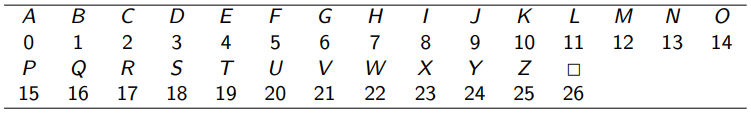

# RSA

## Teoremas

### Teorema 1 - Pequeno Teorema de Fermat

Para todo o $a \in \N$ e para todo o $p$ primo,

$$a^p\equiv_pa$$

### Teorema 2

Para todo o $a \in \N$ e para todo o $p$ primo, se $a \frown p = 1$

$$a^{p-1}\equiv_p 1$$

::: details Demonstração

Pelo [Teorema 1](#teorema-1---pequeno-teorema-de-fermat)

$$a^p\equiv_pa \quad \Leftrightarrow \quad a(a^{p-1})\equiv_pa$$

Como $a\frown p$, $a$ tem inverso módulo $p$.  
Seja $ã$ esse inverso,

$$
ã\times a\times a^{p-1} \equiv_p ã \times a\\
a^{p-1}\equiv_p 1
$$

QED

:::

### Teorema 3

Para todos os primos $p$ e $q$ distintos, para todo o $e \in \N$, tal que $e \frown (p-1)(q-1) = 1$, então  
Para todo o $M \in \N$, tal que $0 \leq M < pq = N$.

$$
M^{ed} \equiv_N M\\
d \rightarrow \text{inverso de }e\text{ módulo }(p-1)(q-1)
$$

::: details Demontração

Sejam $M$, $N$, $p$, $q$, $d$ e $e$ tais que respeitam as condições do Teorema que se está a Demonstrar,

Primeiro, estuda-se a relação entre $p$ e $M$.

1. Caso 1 $\rightarrow M = \dot{p}\quad$ ($M$ é múltiplo de $p$)

$$
M = kp, \quad k \in Z\\
M \equiv_p 0\\
M^{ed}\equiv_p 0\\
M^{ed} \equiv_p M ,\quad\text{ porque } M \equiv_p 0
$$

2. Caso 2 $\rightarrow M \frown p =1\quad$ ($M$ **não** é múltiplo de $p$)

Pelo [Teorema 2](#teorema-2),

$$M^{p-1}\equiv_p 1$$

$$
(M^{p-1})^{k(q-1)}\equiv_p (1)^{k(q-1)}, \quad  \forall k \in \Z\\
M^{k(p-1)(q-1)}\equiv_p 1\\
M^{ed}\times M^{k(p-1)(q-1)}\equiv_p M^{ed}\\
M^{ed+k(p-1)(q-1)}\equiv_p M^{ed}
$$

Como $e$ e $d$ são inversos módulo $(p-1)(q-1)$, ou seja, $ed \equiv_{(p-1)(q-1)}1$  
Existe um $\lambda \in \Z$ :

$$ed + \lambda(p-1)(q-1) = 1$$

Então, como a expressão acima é válida para um $k \in \Z$ qualquer, também será válida para $k=\lambda$.  
Nesse caso:

$$
M^{ed+\lambda(p-1)(q-1)}\equiv_p M^{ed}\\
M \equiv_p M^{ed}
$$

---

Acabamos de provar que,

$$M^{ed} \equiv_p M$$

Logo, também podemos concluir

$$M^{ed} \equiv_q M$$

Uma vez que a relação entre $M$ e $q$ é equivalente à relação entre $M$ e $p$.

Como o sistema:

$$
\left\{ \begin{aligned}
  x \equiv_p \quad M\\
  x \equiv_q \quad M
\end{aligned} \right.
$$

Pelo **Teorema Chinês dos Restos** tem solução única módulo $N=pq$, visto que $p$ e $q$ são dois primos diferentes

E acabamos de provar que:

$$
\left\{ \begin{aligned}
  M^{ed} \equiv_p \quad M\\
  M^{ed} \equiv_q \quad M
\end{aligned} \right.
$$

Chegamos à conclusão:

$$M^{ed}\equiv_N M$$

:::details Explicação da última conclusão

Do Sistema acima, tem-se:

$$
\left\{ \begin{aligned}
  M^{ed} -pk_1 = M\\
  M^{ed} -qk_2 = M
\end{aligned} \right.\\
pk_1 = qk_2
$$

Como $p$ e $q$ são primos diferentes,

$$k_1=qt \quad e \quad k_2=pt, \qquad t \in \Z$$

Ou seja,

$$
M^{ed} - (pq)t = M\\
M^{ed} - Nt = M\\
M^{ed} \equiv_N M
$$

:::

## RSA - Metodologia

### Passo 1 - Criação das Chaves

O **Recetor** da mensagem a ser encriptada cria uma `Chave Pública`, que enviará ao **Emissor**, e uma `Chave Privada` que só o próprio terá acesso.

A `Chave Pública` servirá para encriptar a mensagem e a `Chave Privada` para a desencriptar.

1. Escolhe-se e partilha-se uma codificação numérica para o tipo de mensagem a receber.  
   A seguinte imagem mostra um exemplo para mensagens de texto em caractéres ASCII.  
   

2. Escolhem-se 2 primos $p$ e $q$ diferentes
3. Escolhe-se $e$, tal que $e \frown (p-1)(q-1)=1$
4. Determina-se $d$, o inverso de $e$ módulo $(p-1)(q-1)$
5. Comunica-se a `Chave Pública` $(N,e)$ e guarda-se a `Chave Privada` $(N,d)$, onde $N = pq$.

### Passo 2 - Encriptação

Com a codificação numérica escolhida pelo **Recetor**:

1. Escolhe-se um número inteiro $B$ menor ou igual ao número de dígitos do número $N$.
2. Divide-se a mensagem numérica a enviar em blocos de $B$ dígitos: $M_1,\dots,M_k$
3. Verifica-se se $N\frown M_i=1, \quad i =1,\dots,k$
4. Transforma-se cada bloco $M_i$ num bloco $R_i$, onde $R_i \equiv_N (M_i)^e, \quad i=i,\dots,k$  
   Os $R_1,\dots,R_k$ são a mensagem encriptada
5. Envia-se a mensagem $R1,\dots, R_k$

### Passo 3 - Desencriptação

1. Determinar $M_i, \quad i=1,\dots,k$.

   $$M_i \equiv_N (R_i)^d$$

2. Converter a mensagem numérica para a mensagem final, através da codificação usada.

## Exemplo

Vamos codificar (e descodificar) a mensagem:

$$\text{MD}$$

Com os 2 primos já escolhidos: $43$ e $59$  
O expoente $(e): \quad 11$  
O tamanho dos blocos: $4$  
E a codificação:

1. `Chave Pública` e `Privada`

$$N = 43\times59 = 2537$$

Como já se sabe $e$, conclui-se que a `Chave Pública` é:

$$(2537,11)$$

Falta determinar o inverso de $e$, módulo $(43-1)(59-1) = 2436 \quad (d)$  
Queremos resolver a `Eq. Diofantina`:

$$
1= (e\times d)+(2436 \times k)\\
\begin{array}{c|c|c|c|}
i & a_i & q_i & d_i & m_i\\
\hline
0 & 2436 &  & 1 & 0\\
1 & 11 & 221 & 0 & 1\\
2 & 5 & 2 & 1 & -221\\
3 & 1 & 5 & -2 & 443\\
4 & 0
\end{array}\\
1 = (11 \times 433)+(2436\times (-2))\\
d = 433
$$

O que significa que a `Chave Privada` é:

$$(2537,433)$$

2. Encriptar a mensagem com a chave $(2537,11)$

A mensagem $\text{MD}$, com a codificação escolhida e usando blocos de $4$ dígitos, traduz-se:

$$1203$$

::: details Verificar N primo com 1203

**UPDATE:** Segundo a professora Joana Ventura, podemos passar este passo à frente, a não ser que seja pedido no enunciado.

Continuando, neste passo calcula-se o $mdc$ de $N$ e dos Blocos, verificando se dá sempre $1$.  
Neste exemplo só temos $1$ bloco.

$$
\begin{array}{c|c|c}
i & a_i & q_i \\
\hline
0 & 2537 &  \\
1 & 1203 & 2 \\
2 & 131 & 9 \\
3 & 24 & 5 \\
4 & 11 & 2 \\
5 & 2 & 5 \\
6 & 1 & 2 \\
7 & 0
\end{array}\\~\\
\text{mdc é 1} \quad \checkmark
$$

:::

Agora calcula-se $R \equiv_N (M)^e$, onde $N=2537$ e $M=1203$.  
Como $11 = 8+2+1, \quad R \equiv_{2537} (1203)^{8+2+1}$

$$
\begin{array}{|}
1203^2 & \equiv_{2537} & 1447209\\
& \equiv_{2537} & 1119\\
1203^4 & \equiv_{2537} & 1119^2\\
& \equiv_{2537} & 1252161\\
& \equiv_{2537} & 1420\\
1203^8 & \equiv_{2537} & 1420^2\\
& \equiv_{2537} & 2016400\\
& \equiv_{2537} & 2022\\
1203^{8+2+1}& \equiv_{2537} & 2022\times1119\times1203\\
& \equiv_{2537} & 2721929454\\
& \equiv_{2537} & 2450\\
\end{array}\\
R = 2450
$$

1. Desencriptação com a chave $(2537,433)$

Enontrar o $M$, tal que

$$M \equiv_{2537} (2450)^{433}$$

Como $433 = 256 + 128 +32+16+8+2+1$

$$
\begin{array}{|}
2450^2 & \equiv_{2537} & 6002500\\
&\equiv_{2537} & 2495\\
2450^4 & \equiv_{2537} & 2495^2\\
& \equiv_{2537} & 6225025\\
& \equiv_{2537} & 1764\\
2450^8 & \equiv_{2537} & 1764^2\\
& \equiv_{2537} & 3111696\\
& \equiv_{2537} & 1334\\
2450^{16} & \equiv_{2537} & 1334^2\\
& \equiv_{2537} & 1779556\\
& \equiv_{2537} & 1119\\
2450^{32} & \equiv_{2537} & 1119^2\\
& \equiv_{2537} & 1252161\\
& \equiv_{2537} & 1420\\
2450^{64} & \equiv_{2537} & 1420^2\\
& \equiv_{2537} & 2016400\\
& \equiv_{2537} & 2022\\
2450^{128} & \equiv_{2537} & 2022^2\\
& \equiv_{2537} & 4088484\\
& \equiv_{2537} & 1377\\
2450^{256} & \equiv_{2537} & 1377^2\\
& \equiv_{2537} & 1896129\\
& \equiv_{2537} & 990\\
\end{array}\\~\\
\begin{array}{|}
2450^{433} &\equiv_{2537}& 2450^{256} \times 2450^{128} \times 2450^{32} \times 2450^{16} \times 2450^{8} \times 2450^{2} \times 2450^{1}\\

&\equiv_{2537}& (990 \times 1377) \times (1420 \times 1119) \times (1334 \times 2495) \times 2450\\
&\equiv_{2537}& (861\times 818) \times (2323\times2450)\\
&\equiv_{2537}& (1549\times 859)\\
2450^{433} &\equiv_{2537}& 1203
\end{array}\\

M = 1203
$$

:::tip NOTA
No último passo, foi feito o produto dos números 2 a 2 e o resultados foi logo passado a módulo $2537$
:::
