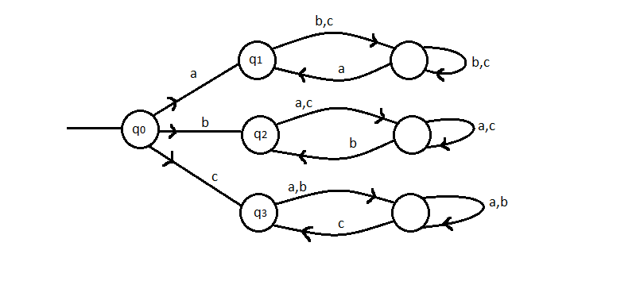
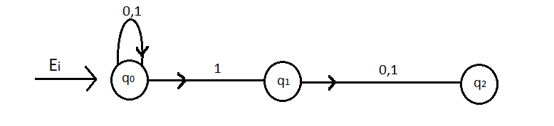
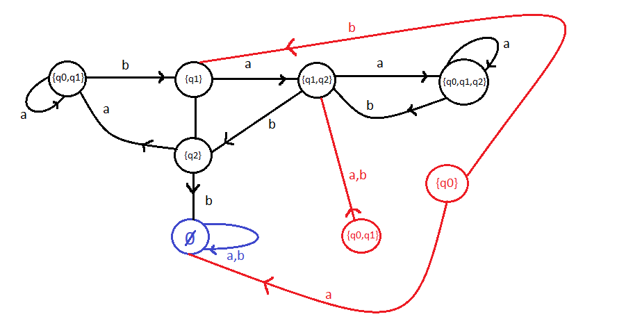

# Autómatos

::: details Pequeno Exemplo

Representação gráfica de um autómato que, numa palavra de $0$'s e $1$'s finita, verifica se o número de $0$'s é par e $1$'s é ímpar.

Onde $p$ é par, $i$ ímpar e primeiro referimo-nos aos $0$'s e depois aos $1$'s.  
"Ei" aponta para o estado inicial quando começa.

:::

## Autómato Finito Determinístico (AFD)

Um autómato finito determinístico é um quíntuplo $D = (Q,\Sigma,\delta,q_0,F)$ onde:

- $Q$ é um conjunto finito não vazio
- $q_0$ é o estado inicial do autómato $(q_0 \in Q)$
- $\Sigma$ é um alfabeto (conj. finito de símbolos)
- $F$ estados de aceitação/finais $(F \subseteq Q)$
- $\delta$ função que, com o estado atual e com $\sigma \in \Sigma$ que recebe, transita para um novo estado $(\delta: Q \times \Sigma \rightarrow Q )$

::: details Exemplo 1

Pegando no exemplo do início onde queríamos verificar se, numa palavra de $0$'s e $1$'s, o número de $0$'s é par e $1$'s é ímpar.

$$
D = (Q,\Sigma,\delta,q_0,F)\\
Q = \{pp,pi,ip,ii\}\\
\Sigma = \{0,1\}\\
\begin{array}{c|c|c}
\delta & 0 & 1  \\
\hline
pp & ip & pi\\
\hline
pi & ii & pp \\
\hline
ip & pp  & ii \\
\hline
ii & pi & ip
\end{array}\\
q_0 = pp\\
F = \{pi\} \\
$$

Relembrar que queríamos ver se a palavra tinha um número par de $0$'s e ímpar de $1$'s, por isso é que $F = \{pi\}$.

:::

::: details Exemplo 2

Queremos verificar se uma palavra consituída por elementos de $\Sigma=\{x,y,z\}$ acaba em $yz$

$$
D = (Q,\Sigma,\delta,q_0,F)\\
Q = \{<Ei>,<y>,<yz>\}\\
\Sigma = \{x,y,z\}\\
\begin{array}{c|c|c|c}
\delta & x & y & z \\
\hline
<Ei> & <Ei> & <y> & <Ei> \\
\hline
<y> & <Ei> & <y> & <yz>\\
\hline
<yz> & <Ei>  & <y> & <Ei>
\end{array}\\
q_0 = <Ei> \\
F = \{<yz>\} \\
$$

::: details Exemplo 3

Queremos um AFD que receba palavras formadas por $\Sigma=\{a,b,c\}$ e que verifique se começa e acaba na mesma letra.  
Neste exemplo, mostra-se apenas a representação gráfica.

$F = \{q_1,q_2,q_3\}$

:::

::: tip IMPORTANTE

Podemos definir ainda $\delta^*$, como sendo a função que recebe um estado e uma palavra. Pode ser definida recursivamente como:

$$
\delta^*(q,wa) = \delta(\delta^*(q,w),a)\\
\forall q \in Q,\quad \forall a \in \Sigma,\quad \forall w \in \Sigma^* \\
\Sigma^* \rightarrow \text{conjunto das palavras formadas com } \Sigma
$$

:::

### Aceitação de um AFD

Diz-se que um [AFD](#aceitacao-de-um-afd) $D = (Q,\Sigma,\delta,q_0,F)$ **aceita** a palavra $w \in \Sigma^*$ se $\delta^*(q_0,w) \in F$ (O estado a que chegamos no final pertence aos estados de aceitação)

### Linguagem reconhecida

A Linguagem (ou conjunto) reconhecido (ou decidido) pelo [AFD](#aceitacao-de-um-afd) $D = (Q,\Sigma,\delta,q_0,F)$ é o conjunto $L(D) = \{w \in \Sigma^* : \delta^*(q_0,w) \in F\}$ (conjunto de palavras que o AFD aceita).

### Linguagem Regular

Uma Linguagem diz-se Regular se existir um AFD que a reconheça.

### Teorema 1

O **complementar** de uma Linguagem Regular (LR), a **interseção** de duas LR e a **união** de duas LR também são `Linguagens Regulares`.

::: details Exemplo - Complementação

O seguinte autómato serve para encontrar palavras formadas por $x,y,z$ que acabem em $yz$, onde $F=\{<yz>\}$.

A única diferença entre este e o seu complementar (palavras que não terminam em $yz$) é o $F$, que passa a $F=\{<Ei>,<y>\}$
:::

## Autómato Completo

Até agora, os exemplos vistos foram todos de `Autómatos Completos`, ou seja, para cada estado temos indicação para mudar de estado para todo o "input" recebido.  
Há casos onde isto não acontece, e aí estamos perante um `Autómato Não Completo` (ANC).

::: details Exemplo Importante - ANC

Queremos um autómato que recebe uma palavra de $0$'s e $1$'s e verifica se a palavra é consituída primeiro por um número par de $0$'s e depois por um número par de $1$'s. Por exemplo, $00111$ é aceite, mas $01011$ não é.

Seja $q_0$ o estado inicial e $F=\{q_1\}$

Repare-se que não está especificado o que acontece se estivermos em $q_1$ e recebermos um $0$, tal como em $q_3$, e em $q_2$ se receber $1$.

Não é sem querer que isso acontece apenas nesses casos, de facto nessas situações a palavra seria logo "não aceite".  
Nos `ANC`, omitimos um estado onde vai parar tudo o que não está especificado, o `Estado de rejeição`.

::: tip NOTA

Para encontrar o complementar do autómato descrito acima, teríamos de incluir o estado omitido, porque é necessário nessa situação.

:::

## Autómato Finito Não Determinístico (AFND)

Um `AFND` é um quíntuplo $N=(Q,\Sigma,\delta,q_0,F)$, onde:

- $Q$ é um conjunto finito não vazio
- $q_0$ é o estado inicial do autómato $(q_0 \in Q)$
- $\Sigma$ é um alfabeto (conj. finito de símbolos)
- $F$ estados de aceitação/finais $(F \subseteq Q)$
- $\delta$ função que, com o estado atual e com $\sigma \in \Sigma_{\epsilon} (\Sigma_{\epsilon} = \Sigma \cup \{\epsilon\})$ que recebe, pode transitar para um conjunto de estados $(\delta: Q \times \Sigma_{\epsilon} \rightarrow P(Q)$, onde $P(Q)$ é o conjunto dos subconjuntos de $Q )$

::: tip NOTAS

- Um `AFND` é feito sabendo que tem de haver pelo menos um caminho para as palavras aceitáveis e nenhum para as que não são.

- Um `AFND` **não** classifica uma dada palavra como aceite ou não aceite.  
  Caso a palavra seja aceite pelo `AFND` é aceite, **mas** se não for, considera-se que pode (ou não) ser.

- Pode ter mudanças de estado $\epsilon$, podem acontecer ou não. (Existe [Exemplo](#passar-de-afnd-para-afd) mais à frente )

:::

::: details Exemplo 1

AFND para calcular se uma palavra constituída por $0$'s e $1$'s tem um $1$ na penúltima posição.

Este autómato não é [completo](#automato-completo)

$$
N = (Q,\Sigma,\delta,q_0,F)\\
Q = \{q_0,q_1,q_2\}\\
\Sigma = \{0,1\}\\
\begin{array}{c|c|c|c}
\delta & 0 & 1 & \epsilon \\
\hline
q_0 & \{q_0\} & \{q_0,q_1\} & \emptyset \\
\hline
q_1 & \{q_2\} & \{q_2\} & \emptyset\\
\hline
q_2 & \emptyset  & \emptyset & \emptyset
\end{array}\\
q_0 = q_0 \\
F = \{q_2\} \\
$$

:::

### Passar de AFND para AFD

::: details Exemplo

Temos o seguinte `AFND`

Repare-se que temos uma "passagem $\epsilon$", ou seja, pode acontecer do nada. Deste modo, o estado inicial tanto pode ser $q_0$ ou $q_1$.

Como fazemos para encontrar o `AFD`?

1. Cria-se um estado que albergue todos os estados iniciais (neste caso $q_0$ e $q_1$)
2. Depois, dependendo do input que podemos receber (neste caso $a$ ou $b$) "apontamos" para um novo estado. Se não existir cria-se.  
   **Atenção:** o novo estado, tal como no estado inicial, pode ser um "conjunto de estados"
3. Se temos $n$ estados no `AFND` teremos $2^n$ no `AFD` (os vários conjuntos possíveis formados pelos estados do `AFND`), contudo pode haver estados inúteis (a {red}(**vermelho**) abaixo). São estados a que nunca chegamos se partirmos do início. Podem ser omitidos na representação final

**Atenção:** Não esquecer do `estado de rejeição` se for necessário (abaixo está a {blue}(**azul**))

Segue-se a representação final, com um pequeno exemplo de uma parte da execução abaixo

1. Começamos nos estado que engloba os estados iniciais $q_0$ e $q_1$
2. Quando estamos em $q_0$ ou $q_1$ e recebemos $b$, vamos sempre para $q_1$. Se recebermos $a$, tanto podemos ir para $q_0$ ou para $q_1$, por isso continuamos no mesmo
3. Quando estamos em $q_1$ e recebemos $a$, tanto podemos ir para $q_2$, ou permanecer em $q_1$. Cria-se o estado $\{q_1,q_2\}$  
   $\dotsb$

Repare-se que os estandos inúteis ({red}(**vermelho**)), nunca são atingidos desde o Ei.

::: tip Aviso

Se acharam este exemplo confuso, assistam à explicação do professor no seguinte [link](https://www.youtube.com/watch?v=inKY5BCqS2c&list=PL1L11sDP8FKHvZYbgh7FdItSfBxsHyU0z&index=51).  
Começa em `1:06:20` e termina em `1:18:30`

:::
